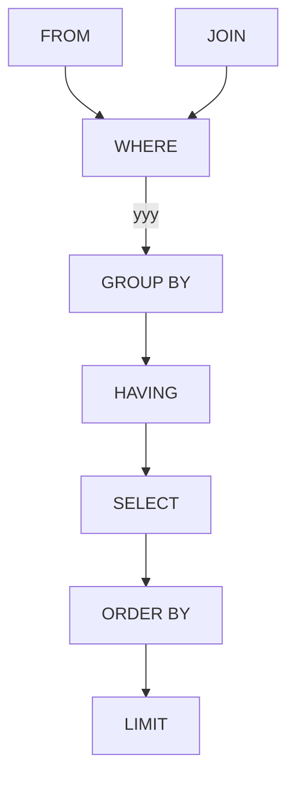

## 数据库
```sql
--创建
create database <数据库名>;
--删除
drop database <数据库名>;
```
## 数据表
```sql
--创建
create table (<字段名1> <类型1> ;,<字段名2> <类型2>,......<,primary key (字段名m,字段名n,...)>;);
--插入
insert into 表名 (<字段名m>,<字段名n>,......) values (<列m的值>,<列n的值>,......);
--查询
select * from student;
--重命名
alter table <表名A> rename to <表名B>;
--删除
drop table <表名>;
```
## 字段
```sql
--添加
alter table <表名> add column <字段名> <类型>;
删除
alter table <表名> drop column <字段名>;
重命名
alter table <表名> rename column <字段名A> to <字段名B>;
设置缺省值
alter table <表名> alter column <字段名> set default <新的默认值>;
去除缺省值
alter table <表名> alter column <字段名> drop default;
```
## 行列
```sql
--修改某行某列
update <表名> set <目标字段名>=<目标值> where <该行特征>;
--删除行
delete from <表名> where <该行特征>;
delete from <表名>; // 删空整个表
```

---
## 查询
*   select
*   where `>` `<` `>=` `<=` `\=` `!=`
*   and, or
*   in, not in
*   between val1 and val2, \[val1, val2\]
*   null, not null
*   all, any ==无法单独使用，必须配合关系运算符==
*   distinct
**查询的执行顺序**
```
select sum(<field>) from <table_name> where bool order by group by 
```
from(确定数据来源) ->where(确定有效数据) ->group by(确定分组的依据) ->having(确定组数据是否返回) ->order by(对组数据进行排序)
### 关联查询
* 多表`select <field> from <table_name>,<table_name> where`
* 多表同字段查询`select <table_name>.<field>, <table_name>.<field> as tf from <table_name>,<table_name> where`
* 交叉连接(Cross Join),它会将两个表中的每一行进行无条件的组合，生成所有可能的行对,最终形成的结果叫做**笛卡尔积**
### 连接查询
#### 内联(多个表字段合并)
```sql
select * from <table_name> inner join <table_name> where <table_name>.<field><condition><table_name>.<field>;

-- 效果一样，效率不如内联
select * from <table_name>,<table_name> where <table_name>.<field>=<table_name>.<field>;
```
##### 自然连接
基于两个表中所有名称相同的列自动匹配的连接操作，属于内连接的一种特殊形式
#### 外联
*   左外联，显示左表所有行，右表符合条件的加入结果，不符合用null表示
```
  select * from T1 left outer join T2 on T1.userid=T2.userid
```
*   右外联，显示右表所有行，左表符合条件的加入结果，不符合用null表示
```
  select * from T1 right outer join T2 on T1.userid=T2.userid
```
*   全外连接，显示左右表所有记录
```
  select * from T1 full outer join T2 on T1.userid=T2.userid
```

### 基本查询
```sql
-- 选择表中的所有列
SELECT * FROM table_name;

-- 选择表中的特定列
SELECT column1, column2 FROM table_name;

-- 使用 WHERE 子句进行条件过滤
SELECT column1, column2 FROM table_name WHERE condition;
```
### 插入数据
```sql
-- 插入单行数据
INSERT INTO table_name (column1, column2) VALUES (value1, value2);

-- 插入多行数据
INSERT INTO table_name (column1, column2) VALUES (value1, value2), (value3, value4);
```
### 更新数据
```sql
-- 更新单行数据
UPDATE table_name SET column1 = value1, column2 = value2 WHERE condition;

-- 更新多行数据
UPDATE table_name SET column1 = value1 WHERE condition;
```
### 删除数据
```sql
-- 删除单行数据
DELETE FROM table_name WHERE condition;

-- 删除所有数据
DELETE FROM table_name;
```
### 创建表
```sql
-- 创建一个新表
CREATE TABLE table_name (
    column1 datatype constraints,
    column2 datatype constraints,
    ...
);

-- 示例
CREATE TABLE employees (
    id INT PRIMARY KEY,
    name VARCHAR(100) NOT NULL,
    age INT,
    department VARCHAR(50)
);
```
### 修改表
```sql
-- 添加新列
ALTER TABLE table_name ADD column_name datatype;

-- 修改现有列的数据类型
ALTER TABLE table_name MODIFY column_name new_datatype;

-- 删除列
ALTER TABLE table_name DROP COLUMN column_name;
```
### 删除表
```sql
-- 删除一个表
DROP TABLE table_name;
```
### 约束
```sql
-- 主键约束
CREATE TABLE table_name (
    column1 datatype PRIMARY KEY,
    ...
);

-- 外键约束
CREATE TABLE table_name (
    column1 datatype,
    column2 datatype,
    FOREIGN KEY (column2) REFERENCES other_table(column_name)
);

-- 唯一约束
CREATE TABLE table_name (
    column1 datatype UNIQUE,
    ...
);

-- 非空约束
CREATE TABLE table_name (
    column1 datatype NOT NULL,
    ...
);

-- 检查约束
CREATE TABLE table_name (
    column1 datatype,
    CHECK (condition)
);
```
### 聚合函数
```sql
-- 计算总数
SELECT COUNT(column_name) FROM table_name;

-- 计算总和
SELECT SUM(column_name) FROM table_name;

-- 计算平均值
SELECT AVG(column_name) FROM table_name;

-- 计算最大值
SELECT MAX(column_name) FROM table_name;

-- 计算最小值
SELECT MIN(column_name) FROM table_name;
```
### 分组与排序
```sql
-- 按某列分组
SELECT column_name, COUNT(*) FROM table_name GROUP BY column_name;

-- 按某列排序
SELECT column_name FROM table_name ORDER BY column_name ASC;
SELECT column_name FROM table_name ORDER BY column_name DESC;
```
### 联合查询
```sql
-- 内连接
SELECT a.column1, b.column2
FROM table1 a
INNER JOIN table2 b ON a.common_column = b.common_column;

-- 左连接
SELECT a.column1, b.column2
FROM table1 a
LEFT JOIN table2 b ON a.common_column = b.common_column;

-- 右连接
SELECT a.column1, b.column2
FROM table1 a
RIGHT JOIN table2 b ON a.common_column = b.common_column;

-- 全连接
SELECT a.column1, b.column2
FROM table1 a
FULL OUTER JOIN table2 b ON a.common_column = b.common_column;
```
### 子查询
```sql
-- 子查询示例
SELECT column1 FROM table_name WHERE column2 = (SELECT column2 FROM other_table WHERE condition);
```
### 创建索引
```sql
-- 创建单列索引
CREATE INDEX index_name ON table_name (column_name);

-- 创建多列索引
CREATE INDEX index_name ON table_name (column1, column2);
```

这些是 SQL 中一些常见的语法和示例。根据具体的数据库管理系统（如 MySQL、PostgreSQL、SQLite、SQL Server 等），语法可能略有不同。

在 SQL 中，**连接**（Join）和**约束**（Constraint）是两个重要的概念，用于数据查询和数据完整性维护。
### 连接（Join）
连接用于从多个表中检索相关联的数据。连接的类型主要包括内连接、外连接（左连接、右连接、全连接）、交叉连接和自连接。以下是每种连接的解释和示例：
#### 内连接（Inner Join）
内连接返回两个表中满足连接条件的记录。
```sql
SELECT a.column1, b.column2
FROM table1 a
INNER JOIN table2 b ON a.common_column = b.common_column;
```
#### 左连接（Left Join）
左连接返回左表中的所有记录，以及右表中满足连接条件的记录。如果右表中没有匹配的记录，结果中包含左表的记录，并且右表的列值为 NULL。
```sql
SELECT a.column1, b.column2
FROM table1 a
LEFT JOIN table2 b ON a.common_column = b.common_column;
```
#### 右连接（Right Join）
右连接返回右表中的所有记录，以及左表中满足连接条件的记录。如果左表中没有匹配的记录，结果中包含右表的记录，并且左表的列值为 NULL。
```sql
SELECT a.column1, b.column2
FROM table1 a
RIGHT JOIN table2 b ON a.common_column = b.common_column;
```
#### 全连接（Full Outer Join）
全连接返回两个表中的所有记录。对于没有匹配的记录，结果中包含 NULL 值。
```sql
SELECT a.column1, b.column2
FROM table1 a
FULL OUTER JOIN table2 b ON a.common_column = b.common_column;
```
#### 交叉连接（Cross Join）
交叉连接返回两个表的笛卡尔积，即表1中的每一行都与表2中的每一行配对。
```sql
SELECT a.column1, b.column2
FROM table1 a
CROSS JOIN table2 b;
```
#### 自连接（Self Join）
自连接是将一个表与其自身连接。
```sql
SELECT a.column1, b.column2
FROM table_name a
INNER JOIN table_name b ON a.common_column = b.common_column;
```
### 约束（Constraint）
约束用于定义数据库表中数据的规则，以确保数据的完整性和一致性。常见的约束类型包括：
#### 主键约束（Primary Key）
主键约束确保表中的每一行都有一个唯一的标识符，并且不能为空。
```sql
CREATE TABLE employees (
    id INT PRIMARY KEY,
    name VARCHAR(100)
);
```
#### 外键约束（Foreign Key）
外键约束用于确保一个表中的值与另一表中的值保持一致性，用于建立两个表之间的关系。
```sql
CREATE TABLE orders (
    order_id INT,
    customer_id INT,
    FOREIGN KEY (customer_id) REFERENCES customers(customer_id)
);
```
#### 唯一约束（Unique）
唯一约束确保表中的所有值是唯一的，防止重复值。
```sql
CREATE TABLE employees (
    id INT UNIQUE,
    email VARCHAR(100) UNIQUE
);
```
#### 非空约束（Not Null）
非空约束确保列中的值不能为空。
```sql
CREATE TABLE employees (
    id INT,
    name VARCHAR(100) NOT NULL
);
```
#### 检查约束（Check）
检查约束用于确保列中的值符合指定的条件。
```sql
CREATE TABLE employees (
    id INT,
    age INT,
    CHECK (age >= 18)
);
```
### 连接和约束的区别
*   **连接（Join）** 用于在查询时从多个表中检索数据，是一种查询操作。
*   **约束（Constraint）** 用于定义表结构中的规则，以确保数据的完整性和一致性，是一种数据定义操作。
这两者在数据库管理中都非常重要，连接用于数据查询和分析，而约束用于数据的定义和维护。
## 排序
*   order by
*   asc, desc
```sql
select <field> from <table_name> where <condition> order by <field>;
select <field> from <table_name> where <condition> order by <field> asc|desc;
select <field> from <table_name> where <condition> order by <field> asc\desc, <field> asc|desc;
```
## 聚合函数
把 select 语句的查询结果汇聚成一个结果，这样的函数叫聚合函数
formula：
*   max, min
*   avg, sum
*   count
```
select <formula>(<field>)<alias_field> from <table_name>;
select <formula>(<field>) from <table_name> where <field><condition><value>;
```
## 分组
_ group by ==GROUP BY 语句用于结合合计函数，根据一个或多个列对结果集进行分组== ==例如:每个分组某字段的合计==
```
select <field>,sum(field) from <table_name> group by <field>;
```
*   having ==在 SQL 中增加 HAVING 子句原因是，WHERE 关键字无法与合计函数一起使用==
```
select <field> from <table_name> where <field><condition><value> group by <field> having <formula><condition><value>
```
## 修改
### 修改记录
```
update <table_name> set <field>=<value> where <field><condition><value>;
```
## 新建
```
create table <table_name> (
    <field_name> <type> not null,
    <field_name> <type> default <type>,
    <field_name> <type> primary key autoincrement,
    <field_name> <type> null
)；
```
## 删除
```
drop table <table_name>；
```
## 插入数据
```
insert into <table_name> (field1,...,fieldn) values (value1,...,valuen)；
insert into <table_name> values (value1,...,valuen), (...)...,(...)；
// 多个括号多条
```
## 删除数据
```
delete from <table_name> where <field_name> <condition>；
```
## 更新数据
```
update <table_name> set <field>=<value> where <field><condition><value>;
```
## 新增字段

```
alter table <table_name> add <field> <type> not null default current_timestamp;
```
## 删除字段
```
# sqlite 不支持drop
alter table <table_name> drop column <field>;
# sqlite 只能复制表过滤掉要删除字段再删掉原表
```
## AS
## LIMIT
LIMIT后的第一个参数是输出记录的初始位置，第二个参数偏移量(即条目数量)
```
select <field> from <table_name> limit <start>,<items>;
```
## OFFSET
与limit时类似，参数位置颠倒了一下
```
select <field> from <table_name> limit <items> offset <start>
```
SQL 执行顺序
