# DDD核心思想

## 什么是DDD

领域驱动设计（Domain-Driven Design，DDD）是一种软件设计方法论，主要用于处理复杂业务场景。DDD可以分解为三个部分理解：

* **领域（Domain）**：特定业务范围或问题域，如医疗、电商、保险等。确定领域就能明确核心的业务问题
* **设计（Design）**：指的是领域模型的设计，领域模型是系统的核心，他反应业务概念和业务规则
* **驱动（Driven）**：
  1. 业务问题域驱动领域建模的过程
  2. 领域模型驱动技术实现或代码开发的过程

确保领域模型的准确性关键，它保证了代码实现能够真实反应并解决业务的核心问题

## 核心理念

### 1. 分离思想
DDD体现了**分离思想**，它分离了**业务复杂性**和**技术复杂性**，让开发团队能够专注于业务逻辑而不被技术细节干扰。

### 2. 分治思想
DDD体现了**分治思想**，它通过**领域模型**、**界限上下文**或**子域**进行分治，将复杂的大系统拆分为可管理的小模块。

### 3. 统一语言
**统一语言**贯穿领域驱动设计从战略设计到战术设计到最后代码实现的全过程，对需求分析、知识提炼和最后代码实现，都是非常重要的。

### 4. 以业务为中心
**以业务领域为中心**，通过领域建模把业务知识转化为软件模型，让代码能够真实反映业务需求。

## DDD的价值

### 解决的问题
- **软件难以理解**：传统架构随着业务发展会发生腐化现象
- **难以演化**：MVC架构在前期开发时很省事，但随着业务增长，代码逻辑变得混乱
- **维护成本高**：架构设计就是要解决系统在反复维护和迭代时如何降低成本

### 带来的好处
1. **可持续迭代**：通过合理的工程设计，支持系统的长期演化
2. **降低维护成本**：清晰的分层和边界控制，减少系统腐化
3. **提高代码质量**：充血模型和面向对象设计，让代码更加内聚
4. **团队协作效率**：统一语言消除沟通障碍

## DDD vs 传统架构

### 传统MVC架构的局限
```java
// 贫血模型 - 只有数据，没有业务逻辑
public class Order {
    private Long id;
    private Long userId;
    private BigDecimal amount;
    // 没有任何行为，所有逻辑都在OrderService
}
```

### DDD的充血模型
```java
// 充血模型 - 数据与业务逻辑结合
public class Order {
    private Long id;
    private Long userId;
    private BigDecimal amount;

    // 领域行为
    public void pay(Payment payment) {
        // 支付逻辑
    }

    public void cancel() {
        // 取消逻辑
    }
}
```

## 总结

**一句话总结：DDD是一种围绕业务核心概念进行建模和设计的方法，通过分层架构和统一语言，使代码能真实反映业务并可持续迭代。**

DDD的核心价值在于：
- 用**统一语言**建模业务
- 用**界限上下文**控制复杂性
- 用**分层架构**保持清晰职责
- 用**充血模型+聚合根**内聚业务逻辑
- 最终实现一个**可演化、可维护的复杂业务系统**

# DDD战略设计

## 概述

DDD战略设计关注的是**宏观层面**的系统架构，主要解决如何在复杂的业务领域中划清边界、确定各部分的职责，并建立团队协作的基础。战略设计是DDD的第一步，为后续的战术设计提供指导。

## 一、子域划分

根据业务价值和特点，将复杂的业务领域划分为不同的子域：

### 1. 核心域（Core Domain）
**定义**：公司的核心竞争力子域，是业务中最有价值的部分

**特点**：
- 必须自己掌握和实现
- 包含独特的业务逻辑和竞争优势
- 值得投入最多资源进行优化和创新

**思考问题**：
- 为什么值得自己开发？
- 为什么不买一个现成的解决方案？
- 为什么不外包给其他公司？

**示例**：
- 电商公司：商品推荐算法、库存管理系统
- 金融公司：风控模型、交易核心系统
- 社交平台：用户关系网络、内容推荐引擎

### 2. 支撑域（Supporting Domain）
**定义**：不是核心竞争力，又没有现成方案的子域

**特点**：
- 不包含通用功能，但又必须开发
- 对业务有支撑作用，但不是核心竞争优势
- 需要投入适当资源，但要避免过度设计

**示例**：
- 电商公司：订单管理系统、客户服务系统
- 金融公司：报表生成系统、客户管理系统

### 3. 通用域（Generic Domain）
**定义**：没有太多个性化需求，同时被多个子域使用的通用功能子域

**特点**：
- 成熟度高，有现成的解决方案
- 可以购买、外包或使用开源方案
- 标准化程度高，差异化需求少

**示例**：
- 认证和权限系统
- 日志记录和监控
- 文件存储服务
- 消息通知服务

## 二、界限上下文（Bounded Context）

### 定义
界限上下文是连接问题空间和解决方案空间的桥梁，它：
- 在问题空间分析问题时，作为**语言的边界和模型的边界**
- 在解决方案空间中，确定**应用的边界和技术的边界**

### 作用和价值
1. **避免术语混淆**：同一个概念在不同上下文中有不同含义
2. **确定微服务拆分边界**：界限上下文是微服务设计和拆分的主要依据
3. **建立清晰的协作边界**：每个团队负责自己的界限上下文

### 经典案例：电商领域的商品

在电商的不同业务阶段，商品有不同的术语和含义：

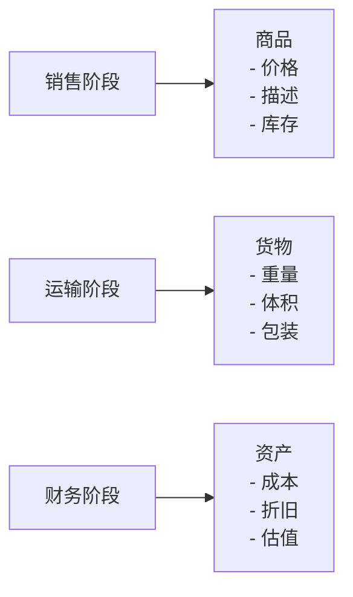

同一个东西，由于业务领域不同，赋予了这些术语不同涵义和职责边界，这个边界就成为未来微服务设计的边界。

### 界限上下文的映射关系
当多个界限上下文需要协作时，它们之间存在以下映射关系：

1. **共享内核（Shared Kernel）**：两个上下文共享部分模型
2. **客户/供应商（Customer/Supplier）**：上游上下文为下游上下文提供服务
3. **顺从者（Conformist）**：下游上下文完全采用上游上下文的模型
4. **防腐层（Anticorruption Layer）**：下游上下文建立适配层，隔离外部模型
5. **分开方式（Separate Ways）**：两个上下文完全独立，没有集成
6. **开放主机服务（Open Host Service）**：通过API和协议暴露服务

## 三、统一语言（Ubiquitous Language）

### 定义
事件风暴过程中，通过团队交流达成共识的，能够简单、清晰、准确描述业务涵义和规则的语言。限界上下文中的通用语言提供了设计领域模型的概念术语。

### 核心特点
1. **共享性**：领域专家和开发团队使用相同的术语
2. **无歧义性**：在同一界限上下文内，术语有唯一明确的含义
3. **业务导向**：语言来源于业务，而非技术实现

### 语言组成
- **名词**：领域对象等命名（实体对象）
- **形容词**：描述概念（如"有效的"、"过期的"）
- **动词**：可完成的操作（领域事件或命令）

### 建立统一语言的步骤

1. **与领域专家深入讨论**
   - 组织业务需求讨论会
   - 邀请产品经理、业务专家参与
   - 记录业务专家使用的术语

2. **事件风暴工作坊**
   - 识别领域事件
   - 发现命令和决策点
   - 明确参与者角色

3. **创建词汇表**
   - 记录术语定义
   - 明确术语使用范围
   - 建立同义词映射

4. **持续迭代完善**
   - 在开发过程中不断验证
   - 根据新发现调整语言
   - 确保文档和代码保持一致

### 示例：用户注册的统一语言

| 术语 | 业务含义 | 技术实现 |
|------|----------|----------|
| 用户注册 | 新用户创建账户的过程 | UserRegistration |
| 验证码 | 用于验证用户身份的临时码 | VerificationCode |
| 账户激活 | 用户首次登录完成激活 | AccountActivation |
| 个人资料 | 用户的基本信息 | UserProfile |

## 四、战略设计的价值

### 1. 指导架构决策
- 确定微服务拆分边界
- 明确技术选型原则
- 建立集成策略

### 2. 促进团队协作
- 建立清晰的团队职责边界
- 统一沟通语言
- 减少跨团队协调成本

### 3. 控制复杂性
- 将大型系统拆分为可管理的小模块
- 建立清晰的依赖关系
- 降低认知负载

## 五、战略设计实践建议

### 1. 从业务价值出发
- 优先识别核心域
- 合理分配开发资源
- 避免在通用域上过度投入

### 2. 渐进式演进
- 先识别关键界限上下文
- 随着业务发展逐步细化
- 保持模型的可扩展性

### 3. 持续重构
- 定期审视子域划分
- 调整界限上下文边界
- 完善统一语言

### 4. 工具支持
- 使用领域建模工具
- 维护词汇表文档
- 建立知识管理系统

通过战略设计，我们可以建立清晰的系统边界，为后续的战术设计和具体实现奠定坚实基础。

# DDD核心概念详解

## 概述

DDD的核心概念构成了领域建模的基础，理解这些概念对于成功实施DDD至关重要。这些概念包括实体、值对象、聚合、聚合根等，它们共同构成了领域模型的构建块。

## 一、实体（Entity）

### 定义
实体是指在业务中具有**唯一标识**的对象，实体的主要特征是**持续的身份**。即使属性发生变化，只要标识不变，它仍然是同一个实体。

### 核心特征
1. **唯一标识**：每个实体都有唯一的ID或标识符
2. **身份持续性**：标识在实体的整个生命周期中保持不变
3. **可变性**：实体的属性可以改变，但身份不变
4. **业务行为**：实体包含业务逻辑和行为

### 代码示例

```java
public class User {
    private Long id;        // 唯一标识
    private String name;
    private int age;
    private String email;

    // 业务行为
    public void updateProfile(String name, int age) {
        this.name = name;
        this.age = age;
    }

    public void changeEmail(String email) {
        // 验证邮箱格式的业务规则
        if (!isValidEmail(email)) {
            throw new IllegalArgumentException("Invalid email format");
        }
        this.email = email;
    }

    // 基于ID判断相等性，而不是属性
    @Override
    public boolean equals(Object obj) {
        if (this == obj) return true;
        if (obj == null || getClass() != obj.getClass()) return false;
        User user = (User) obj;
        return Objects.equals(id, user.id);
    }
}
```

### 实体的形态
- **业务形态**：业务现实中的对象，如用户、订单
- **代码形态**：包含属性和业务方法的类
- **运行形态**：内存中的对象实例
- **数据库形态**：持久化存储的数据记录

## 二、值对象（Value Object）

### 定义
值对象**没有唯一标识**，它是通过**属性值来判断相等性**的。值对象关注属性而非身份，属性是可替换的，不可变的！

### 核心特征
1. **无唯一标识**：通过属性值判断相等性
2. **不可变性**：创建后不能修改，只能整体替换
3. **可替换性**：属性相同的值对象可以相互替换
4. **业务概念整体**：将多个相关属性组合成一个概念整体

### 代码示例

```java
// 地址值对象 - 不需要id，创建后不能更改
public class Address {
    private final String province; // final修饰
    private final String city;     // final修饰
    private final String street;   // final修饰
    private final String zipCode;   // final修饰

    // 构造后不可修改
    public Address(String province, String city, String street, String zipCode) {
        this.province = Objects.requireNonNull(province);
        this.city = Objects.requireNonNull(city);
        this.street = Objects.requireNonNull(street);
        this.zipCode = Objects.requireNonNull(zipCode);
    }

    // 只有getter方法，没有setter方法
    public String getProvince() { return province; }
    public String getCity() { return city; }
    public String getStreet() { return street; }
    public String getZipCode() { return zipCode; }

    // 基于属性值判断相等性
    @Override
    public boolean equals(Object obj) {
        if (this == obj) return true;
        if (obj == null || getClass() != obj.getClass()) return false;
        Address address = (Address) obj;
        return Objects.equals(province, address.province) &&
               Objects.equals(city, address.city) &&
               Objects.equals(street, address.street) &&
               Objects.equals(zipCode, address.zipCode);
    }

    @Override
    public int hashCode() {
        return Objects.hash(province, city, street, zipCode);
    }
}
```

### 为什么值对象要不可变？

1. **避免副作用**：不可变对象不会被意外修改，减少系统复杂度
2. **线程安全**：不可变对象天然线程安全，无需同步
3. **简化理解**：状态固定，更容易理解和维护
4. **缓存友好**：不可变对象可以被安全地缓存和共享

### 实体 vs 值对象对比

| 特征 | 实体 | 值对象 |
|------|------|--------|
| 标识 | 有唯一标识 | 无标识 |
| 相等性判断 | 基于标识 | 基于属性值 |
| 可变性 | 属性可变 | 不可变 |
| 替换性 | 不可替换 | 可整体替换 |
| 关注点 | 关注"是谁" | 关注"是什么" |

## 三、聚合（Aggregate）

### 定义
聚合就是将紧密相关的实体和值对象组织在一起，形成一个有边界的业务模块。聚合是一个**数据修改的原子单元**，确保聚合内数据的一致性。

### 聚合的核心组成

**聚合 = 聚合根 + 其他实体/值对象**

### 聚合根（Aggregate Root）
聚合根是聚合的**唯一入口**和**唯一标识**，只有通过聚合根才能访问或修改聚合内容的其他对象。

### 聚合的设计原则

1. **单一职责**：一个聚合对应一个核心业务概念
2. **一致性边界**：聚合内部保持业务规则的一致性
3. **外部不感知**：聚合外部不需要知道内部结构
4. **最小化关联**：聚合间通过ID引用，而非对象引用

### 代码示例

```java
// 订单聚合 - 聚合根
public class Order {
    private Long orderId;           // 聚合根的唯一标识
    private Long userId;
    private OrderStatus status;
    private Money totalAmount;
    private List<OrderItem> items;  // 子实体
    private Address address;        // 值对象
    private LocalDateTime createTime;

    // 聚合内部行为 - 封装内部对象的访问
    public void addItem(Product product, int quantity) {
        OrderItem item = new OrderItem(product, quantity);
        this.items.add(item);
        recalculateTotal();
    }

    public void removeItem(Long productId) {
        this.items.removeIf(item -> item.getProductId().equals(productId));
        recalculateTotal();
    }

    public void changeAddress(Address newAddress) {
        this.address = Objects.requireNonNull(newAddress);
    }

    // 聚合的业务规则保护
    public void confirm() {
        if (items.isEmpty()) {
            throw new BusinessException("订单不能为空");
        }
        if (status != OrderStatus.PENDING) {
            throw new BusinessException("只有待支付状态的订单才能确认");
        }
        this.status = OrderStatus.CONFIRMED;
    }

    public void pay() {
        if (status != OrderStatus.CONFIRMED) {
            throw new BusinessException("只有已确认的订单才能支付");
        }
        this.status = OrderStatus.PAID;
    }

    // 私有方法 - 内部业务逻辑
    private void recalculateTotal() {
        this.totalAmount = items.stream()
            .map(OrderItem::getSubtotal)
            .reduce(Money.ZERO, Money::add);
    }

    // 不暴露内部集合的直接引用
    public List<OrderItem> getItems() {
        return Collections.unmodifiableList(items);
    }
}

// 订单项 - 实体，只能通过Order访问
public class OrderItem {
    private Long productId;
    private String productName;
    private Money unitPrice;
    private int quantity;

    OrderItem(Product product, int quantity) {
        this.productId = product.getId();
        this.productName = product.getName();
        this.unitPrice = product.getPrice();
        this.quantity = quantity;
    }

    public Money getSubtotal() {
        return unitPrice.multiply(quantity);
    }

    // 只有getter方法，没有setter方法
    // 修改必须通过Order聚合根
}
```

### 聚合的使用规范

1. **访问控制**：只能通过聚合根访问聚合内部对象
2. **事务边界**：一个事务只能修改一个聚合
3. **跨聚合引用**：通过聚合根ID引用，而不是对象引用
4. **一致性保证**：聚合根负责维护内部一致性

### 聚合的持久化

```java
// 聚合的仓储操作
public interface OrderRepository {
    Order findById(Long id);           // 通过聚合根ID查询整个聚合
    void save(Order order);            // 保存整个聚合
    void delete(Long id);              // 删除整个聚合

    // 查询方法返回聚合根，而不是内部实体
    List<Order> findByUserId(Long userId);
}
```

## 四、领域服务（Domain Service）

### 定义
领域服务是DDD领域层的组成部分，用于封装**不属于单个实体或值对象的领域逻辑**，这些逻辑涉及多个领域对象的协作或无状态的操作。

### 何时使用领域服务

1. **跨实体协作**：涉及多个实体或值对象的复杂业务逻辑
2. **无状态操作**：执行业务计算或规则验证
3. **领域规则封装**：实现领域内的通用算法或策略

### 代码示例

```java
// 银行转账领域服务
@Service
public class TransferDomainService {
    private final AccountRepository accountRepository;

    public TransferDomainService(AccountRepository accountRepository) {
        this.accountRepository = accountRepository;
    }

    // 跨实体的领域逻辑
    @Transactional
    public void transfer(Long fromAccountId, Long toAccountId, Money amount) {
        // 1. 账户存在性校验
        Account fromAccount = accountRepository.findById(fromAccountId)
            .orElseThrow(() -> new AccountNotFoundException(fromAccountId));
        Account toAccount = accountRepository.findById(toAccountId)
            .orElseThrow(() -> new AccountNotFoundException(toAccountId));

        // 2. 业务规则校验
        if (fromAccount.getBalance().lessThan(amount)) {
            throw new InsufficientBalanceException("账户余额不足");
        }

        // 3. 执行转账
        fromAccount.debit(amount);    // 账户扣款
        toAccount.credit(amount);      // 账户入账

        // 4. 保存聚合
        accountRepository.save(fromAccount);
        accountRepository.save(toAccount);
    }

    // 计算利息的纯业务逻辑
    public Money calculateInterest(Account account, LocalDate startDate, LocalDate endDate) {
        // 复杂的利息计算逻辑
        Money principal = account.getBalance();
        double rate = getInterestRate(account.getAccountType());
        int days = Days.between(startDate, endDate);

        return principal.multiply(rate).multiply(days / 365.0);
    }

    // 验证转账限额的领域规则
    public boolean validateTransferLimit(Account account, Money amount) {
        Money dailyLimit = account.getDailyTransferLimit();
        Money todayTransferred = calculateTodayTransferredAmount(account.getId());

        return todayTransferred.add(amount).lessThanOrEqual(dailyLimit);
    }
}
```

### 领域服务 vs 应用服务

| 特征 | 领域服务 | 应用服务 |
|------|----------|----------|
| 位置 | 领域层 | 应用层 |
| 职责 | 业务逻辑 | 流程编排 |
| 状态 | 无状态 | 可能管理事务状态 |
| 依赖 | 只依赖领域层 | 依赖领域层和基础设施层 |
| 返回值 | 领域对象、值对象 | DTO、ID、状态 |

## 五、总结

DDD的核心概念通过清晰的职责分离和边界控制，帮助我们构建出更加内聚和可维护的领域模型：

1. **实体**：有身份标识的对象，关注"是谁"
2. **值对象**：无标识的属性组合，关注"是什么"，不可变
3. **聚合**：数据修改的原子单元，维护内部一致性
4. **聚合根**：聚合的入口和标识，控制内部对象访问
5. **领域服务**：跨对象的业务逻辑封装

通过合理运用这些概念，我们可以：
- 建立清晰的业务边界
- 保证数据一致性
- 提高代码的内聚性
- 降低系统的复杂度

# 领域模型设计

## 概述

领域模型是DDD的核心，它是对业务领域核心概念的建模，承载业务规则和业务逻辑的核心对象。优秀的领域模型应该能够**反映现实世界的业务场景和规则**。

## 一、充血模型 vs 贫血模型

### 贫血模型（Anemic Domain Model）

贫血模型是传统开发中常见的**反模式**，**实体仅有数据（属性）和简单的Getter/Setter，业务逻辑完全剥离到服务层**，导致实体"贫血"。

#### 特点
1. **数据与行为分离**：实体仅作为数据载体，逻辑集中在服务层
2. **服务层臃肿**：大量业务逻辑堆积在服务层，形成"上帝类"
3. **封装性弱**：外部可直接修改实体属性，破坏领域规则

#### 代码示例

```java
// 贫血模型的Order实体
public class Order {
    private Long id;
    private Long userId;
    private List<OrderItem> items;
    private Money discount;
    private OrderStatus status;

    // 仅包含Getter/Setter
    public Long getId() { return id; }
    public void setId(Long id) { this.id = id; }

    public Long getUserId() { return userId; }
    public void setUserId(Long userId) { this.userId = userId; }

    public List<OrderItem> getItems() { return items; }
    public void setItems(List<OrderItem> items) { this.items = items; }

    public Money getDiscount() { return discount; }
    public void setDiscount(Money discount) { this.discount = discount; }

    public OrderStatus getStatus() { return status; }
    public void setStatus(OrderStatus status) { this.status = status; }
}

// 业务逻辑在服务层 - 导致服务层臃肿
@Service
public class OrderService {
    private final OrderRepository orderRepository;

    // 计算订单总价
    public Money calculateTotal(Order order) {
        Money total = order.getItems().stream()
            .map(item -> item.getPrice().multiply(item.getQuantity()))
            .reduce(Money.ZERO, Money::add);
        return total.subtract(order.getDiscount());
    }

    // 应用折扣
    public void applyDiscount(Order order, Money discount) {
        // 重复计算逻辑，且未校验折扣规则
        Money total = calculateTotal(order);
        if (discount.greaterThan(total)) {
            throw new BusinessException("折扣不能超过订单总价");
        }
        order.setDiscount(discount);
    }

    // 确认订单
    public void confirmOrder(Order order) {
        if (order.getItems().isEmpty()) {
            throw new BusinessException("订单不能为空");
        }
        if (order.getStatus() != OrderStatus.PENDING) {
            throw new BusinessException("只有待处理订单才能确认");
        }
        order.setStatus(OrderStatus.CONFIRMED);
    }
}
```

#### 贫血模型的劣势
- 违背OO设计原则，代码难以维护
- 逻辑分散，修改一处需要多处调整
- 领域语义模糊，方法命名偏离业务
- 封装性弱，容易破坏业务规则

### 充血模型（Rich Domain Model）

充血模型是DDD推荐的设计模式，**实体不仅包含数据（属性），还封装完整的业务逻辑（方法）**，体现"数据与行为合一"的面向对象思想。

#### 特点
1. **业务逻辑内聚**：实体方法实现领域规则
2. **封装性强**：外部通过接口调用实体方法，保护内部状态
3. **领域语义清晰**：方法命名基于业务术语

#### 代码示例

```java
// 充血模型的Order实体
public class Order {
    private Long id;
    private Long userId;
    private List<OrderItem> items;
    private Money discount;
    private OrderStatus status;
    private LocalDateTime createTime;

    // 充血模型：总价计算逻辑在实体内部
    public Money getTotalPrice() {
        Money total = items.stream()
            .map(OrderItem::getSubtotal)
            .reduce(Money.ZERO, Money::add);
        return total.subtract(discount);
    }

    // 充血模型：业务规则校验和状态变更在实体内部
    public void applyDiscount(Money discount) {
        Objects.requireNonNull(discount, "折扣不能为空");

        // 业务规则校验
        if (discount.lessThan(Money.ZERO)) {
            throw new DomainException("折扣不能为负数");
        }
        if (discount.greaterThan(getTotalPrice())) {
            throw new DomainException("折扣不能超过订单总价");
        }

        this.discount = discount;
    }

    // 充血模型：业务逻辑封装在实体内
    public void addItem(Product product, int quantity) {
        Objects.requireNonNull(product, "商品不能为空");
        if (quantity <= 0) {
            throw new DomainException("商品数量必须大于0");
        }

        OrderItem item = new OrderItem(product, quantity);
        this.items.add(item);
    }

    // 充血模型：状态变更逻辑
    public void confirm() {
        if (items.isEmpty()) {
            throw new DomainException("订单不能为空");
        }
        if (status != OrderStatus.PENDING) {
            throw new DomainException("只有待处理订单才能确认");
        }

        this.status = OrderStatus.CONFIRMED;
    }

    public void pay() {
        if (status != OrderStatus.CONFIRMED) {
            throw new DomainException("只有已确认订单才能支付");
        }

        this.status = OrderStatus.PAID;
    }

    public void cancel(String reason) {
        if (status == OrderStatus.CANCELLED) {
            throw new DomainException("订单已取消");
        }
        if (status == OrderStatus.COMPLETED) {
            throw new DomainException("已完成订单不能取消");
        }

        this.status = OrderStatus.CANCELLED;
        // 记录取消原因等业务逻辑
    }

    // 提供查询方法，不暴露内部集合的直接引用
    public List<OrderItem> getItems() {
        return Collections.unmodifiableList(items);
    }

    public boolean isEmpty() {
        return items.isEmpty();
    }

    public boolean canConfirm() {
        return status == OrderStatus.PENDING && !isEmpty();
    }
}

// 简化的服务层 - 只负责协调和事务管理
@Service
public class OrderApplicationService {
    private final OrderRepository orderRepository;
    private final ProductService productService;

    @Transactional
    public OrderId createOrder(CreateOrderCommand command) {
        Order order = new Order(command.getUserId());

        // 通过实体的方法添加商品项
        for (OrderItemCommand itemCommand : command.getItems()) {
            Product product = productService.getById(itemCommand.getProductId());
            order.addItem(product, itemCommand.getQuantity());
        }

        // 应用折扣
        if (command.getDiscount() != null) {
            order.applyDiscount(command.getDiscount());
        }

        // 确认订单
        order.confirm();

        // 保存聚合
        orderRepository.save(order);

        return order.getId();
    }
}
```

### 充血模型 vs 贫血模型对比

| 特征 | 充血模型 | 贫血模型 |
|------|----------|----------|
| **业务逻辑位置** | 实体内部 | 服务层 |
| **封装性** | 强，保护内部状态 | 弱，暴露内部属性 |
| **代码内聚性** | 高，逻辑集中 | 低，逻辑分散 |
| **领域语义** | 清晰，基于业务术语 | 模糊，技术导向 |
| **测试复杂度** | 单元测试简单 | 集成测试复杂 |
| **维护成本** | 低，修改集中 | 高，涉及多处 |

## 二、领域模型的构建方法

### 1. 名词分析法

从用例和业务描述中识别名词作为候选的领域对象：

```java
// 用例描述：
// "管理员创建了北京和上海两个校区"
// "管理员创建了Linux、Python、Go 3个课程"
// "管理员创建了北京校区的Python 16期班级"
// "管理员创建了学员小晴，并将其分配在Python 16期班级"

// 识别出的名词：
// 管理员、校区、课程、班级、学员
```

### 2. 动词分析法

从业务操作中识别实体应该包含的方法：

```java
// 业务操作：
// "学员提交作业" -> Student.submitHomework()
// "讲师批改作业" -> Teacher.gradeHomework()
// "学员报名课程" -> Student.enrollCourse()
// "班级分配讲师" -> Class.assignTeacher()
```

### 3. 领域关系建模

识别对象之间的关系：

```java
public class Campus {
    private String name;
    private List<SchoolClass> classes;
    private List<Course> offeredCourses;
}

public class SchoolClass {
    private String className;
    private Campus campus;
    private Course course;
    private Teacher teacher;
    private List<Student> students;
}

public class Course {
    private String courseName;
    private Duration duration;
    private Money price;
}

public class Student {
    private String name;
    private List<SchoolClass> enrolledClasses;
    private List<Homework> submittedHomeworks;
}

public class Teacher {
    private String name;
    private List<SchoolClass> assignedClasses;
}
```

## 三、领域模型的设计原则

### 1. 单一职责原则
每个实体应该只负责一个明确的业务概念

```java
// 好的设计 - 职责分离
public class Order {           // 负责订单业务逻辑
    // 订单相关逻辑
}

public class Payment {          // 负责支付业务逻辑
    // 支付相关逻辑
}

// 避免 - 职责混乱
public class Order {
    // 订单逻辑
    public void calculateTotal() { ... }

    // 支付逻辑 - 不应该在这里
    public void processPayment(PaymentMethod method) { ... }

    // 物流逻辑 - 不应该在这里
    public void arrangeShipping(Address address) { ... }
}
```

### 2. 高内聚低耦合
- **高内聚**：相关的业务逻辑应该放在同一个实体内
- **低耦合**：实体之间的依赖关系应该尽量少

### 3. 封装变化
将可能变化的业务逻辑封装在实体内部

```java
public class Order {
    private OrderPricingStrategy pricingStrategy;

    // 定价策略可以变化，但接口保持稳定
    public Money calculatePrice() {
        return pricingStrategy.calculatePrice(this);
    }
}
```

### 4. 基于业务而不是技术
模型设计应该基于业务概念，而不是技术实现

```java
// 好的设计 - 基于业务
public class Student {
    public void enrollCourse(Course course) { ... }
    public void submitHomework(Homework homework) { ... }
}

// 避免 - 基于技术
public class Student {
    public void saveToDatabase() { ... }      // 技术关注点
    public void serializeToJson() { ... }     // 技术关注点
}
```

## 四、领域模型的演进

### 1. 从简单到复杂
初期从简单的属性和方法开始，随着业务理解深入逐步丰富

```java
// 初期版本
public class Order {
    private Long id;
    private Money amount;
}

// 演进版本
public class Order {
    private Long id;
    private List<OrderItem> items;
    private Address address;
    private OrderStatus status;

    public Money calculateTotal() { ... }
    public void applyDiscount(Money discount) { ... }
    public void confirm() { ... }
}
```

### 2. 持续重构
随着业务发展不断重构模型，保持模型的准确性

### 3. 验证和测试
通过单元测试验证领域模型的正确性

```java
@Test
void should_calculate_order_total_correctly() {
    // Given
    Order order = new Order();
    order.addItem(new Product("Book", new Money("10.00")), 2);
    order.addItem(new Product("Pen", new Money("2.00")), 3);

    // When
    Money total = order.calculateTotal();

    // Then
    assertEquals(new Money("26.00"), total);
}

@Test
void should_throw_exception_when_discount_exceeds_total() {
    // Given
    Order order = new Order();
    order.addItem(new Product("Book", new Money("10.00")), 1);

    // When & Then
    assertThrows(DomainException.class, () ->
        order.applyDiscount(new Money("15.00")));
}
```

## 五、总结

优秀的领域模型设计需要：

1. **使用充血模型**：让实体承担业务逻辑，避免贫血反模式
2. **基于业务建模**：模型反映真实业务概念，而非技术实现
3. **保持封装性**：保护内部状态，通过方法提供业务功能
4. **单一职责**：每个实体专注于明确的业务概念
5. **持续演进**：随着业务理解深入不断优化模型
6. **充分测试**：通过测试验证模型的正确性

通过这些原则和实践，我们可以构建出**清晰、可维护、业务导向**的领域模型，为整个系统的成功实施奠定坚实基础。

# DDD分层架构

## 概述

DDD的落地通常采用**分层架构**，通过清晰的职责分离来控制系统的复杂性。每一层都有明确的职责，并且依赖关系是单向的，从上层依赖下层。

## 一、DDD分层架构概览

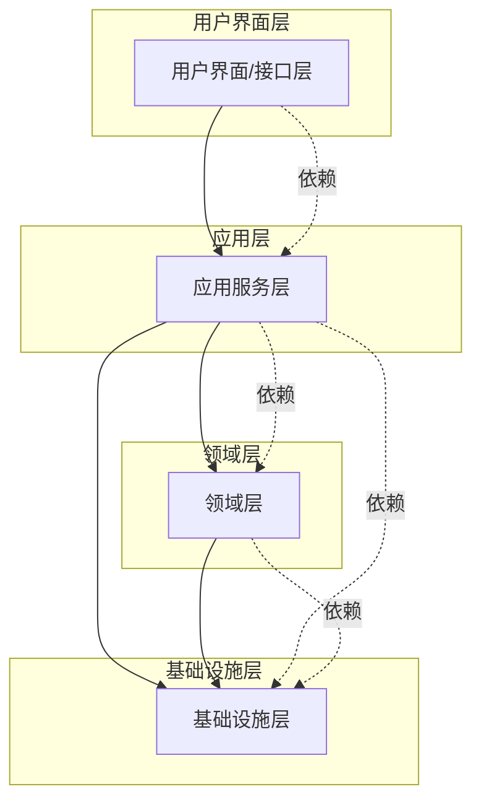

### 各层职责概述

| 层次 | 职责 | 核心组件 |
|------|------|----------|
| **用户界面层** | 接收外部输入，展示结果 | Controller、MQ Listener、定时任务 |
| **应用层** | 编排业务流程，管理事务 | Application Service、DTO、领域编排 |
| **领域层** | 封装核心业务逻辑 | 实体、值对象、聚合、领域服务 |
| **基础设施层** | 提供技术支撑 | Repository实现、适配器、配置 |

## 二、用户界面层（Interface Layer）

### 定义
也称为**触发器层**，作为外部系统入口：HTTP接口、MQ消息、定时任务、WebSocket等。

### 职责
1. **接收输入**：接收HTTP请求、消息、定时触发等
2. **参数校验**：基本的格式校验和权限检查
3. **调用应用服务**：**不写任何业务逻辑**，只做调用和结果转换
4. **返回结果**：格式化返回给调用方

### 代码示例

#### HTTP控制器
```java
@RestController
@RequestMapping("/user")
public class UserController {
    private final UserApplicationService userApplicationService;

    public UserController(UserApplicationService userApplicationService) {
        this.userApplicationService = userApplicationService;
    }

    @PostMapping("/register")
    public ResultVO<UserIdResponse> register(@RequestBody @Valid RegisterRequest req) {
        // 参数校验（可通过注解/AOP处理）
        UserId userId = userApplicationService.register(req);
        return ResultVO.success(new UserIdResponse(userId.getValue()));
    }

    @GetMapping("/{userId}")
    public ResultVO<UserResponse> getUser(@PathVariable Long userId) {
        UserDetailDTO user = userApplicationService.getUser(userId);
        return ResultVO.success(UserResponse.from(user));
    }

    @PostMapping("/reset-password")
    public ResultVO<Void> resetPassword(@RequestBody @Valid ResetPasswordRequest req) {
        userApplicationService.resetPassword(req.getUserId(), req.getNewPassword());
        return ResultVO.success();
    }
}
```

#### MQ监听器
```java
@Component
public class UserEventListener {
    private final UserApplicationService userApplicationService;

    @KafkaListener(topics = "user.registered")
    public void onUserRegistered(String message) {
        try {
            UserRegisteredEvent event = JsonUtils.fromJson(message, UserRegisteredEvent.class);
            userApplicationService.processUserRegistered(event.getUserId());
        } catch (Exception e) {
            log.error("处理用户注册事件失败: {}", message, e);
            // 可考虑重试或死信队列
        }
    }

    @KafkaListener(topics = "user.password.reset")
    public void onPasswordReset(String message) {
        PasswordResetEvent event = JsonUtils.fromJson(message, PasswordResetEvent.class);
        userApplicationService.sendPasswordResetNotification(event.getUserId());
    }
}
```

#### 定时任务
```java
@Component
public class UserMaintenanceScheduler {
    private final UserApplicationService userApplicationService;

    @Scheduled(cron = "0 0 2 * * ?") // 每天凌晨2点
    public void cleanupExpiredAccounts() {
        userApplicationService.cleanupExpiredAccounts();
    }

    @Scheduled(cron = "0 30 23 * * ?") // 每天23:30
    public void sendActivityReminders() {
        userApplicationService.sendActivityReminders();
    }
}
```

### 职责
1. **接收输入**：接收HTTP请求、消息、定时触发等
2. **参数校验**：基本的格式校验和权限检查
3. **调用应用服务**：**不写任何业务逻辑**，只做调用和结果转换
4. **返回结果**：格式化返回给调用方

### 设计原则
1. **薄层设计**：控制器逻辑应该尽量简单
2. **不包含业务逻辑**：所有业务逻辑都在应用层和领域层
3. **异常处理**：统一的异常处理机制
4. **DTO转换**：外部请求DTO与内部数据模型转换

## 三、应用层（Application Layer）

### 定义
应用层是**外部接口与领域层的桥梁**，负责协调领域层操作，处理非业务逻辑（如事务、权限、日志）。

### 职责
1. **流程编排**：接收外部请求，调用领域服务或仓储完成业务流程
2. **事务管理**：管理事务边界（开启/提交/回滚）
3. **数据转换**：将外部输入（DTO）转换为领域对象，或将领域对象转换为返回数据（VO）
4. **权限检查**：业务权限校验
5. **外部交互**：调用基础设施层（如发送邮件、操作缓存）

### 代码示例

#### 基础应用服务
```java
@Service
@Transactional
public class UserApplicationService {
    private final UserRepository userRepository;
    private final UserDomainService userDomainService;
    private final NotificationAdapter notificationAdapter;
    private final UserMapper userMapper;

    // 用户注册
    public UserId register(RegisterRequest request) {
        // 1. 数据转换
        User user = userMapper.toUser(request);

        // 2. 业务规则校验（调用领域服务）
        userDomainService.validateUserUniqueness(user.getEmail(), user.getPhone());

        // 3. 领域逻辑（调用实体方法）
        user.register();

        // 4. 保存聚合（调用仓储）
        User savedUser = userRepository.save(user);

        // 5. 发送通知（调用适配器）
        notificationAdapter.sendWelcomeEmail(savedUser.getEmail());

        return savedUser.getId();
    }

    // 获取用户详情
    @Transactional(readOnly = true)
    public UserDetailDTO getUser(Long userId) {
        User user = userRepository.findById(userId)
            .orElseThrow(() -> new UserNotFoundException(userId));

        return userMapper.toUserDetailDTO(user);
    }

    // 重置密码
    public void resetPassword(Long userId, String newPassword) {
        User user = userRepository.findById(userId)
            .orElseThrow(() -> new UserNotFoundException(userId));

        // 业务逻辑委托给实体
        user.resetPassword(newPassword);

        userRepository.save(user);

        // 发送通知
        notificationAdapter.sendPasswordResetNotification(user.getEmail());
    }

    // 清理过期账户
    @Scheduled
    public void cleanupExpiredAccounts() {
        List<User> expiredUsers = userRepository.findExpiredUsers();

        for (User user : expiredUsers) {
            user.deactivate();
            userRepository.save(user);
        }

        log.info("清理了 {} 个过期账户", expiredUsers.size());
    }
}
```

#### 复杂编排服务
```java
@Service
public class OrderApplicationService {
    private final OrderRepository orderRepository;
    private final UserRepository userRepository;
    private final ProductRepository productRepository;
    private final PaymentAdapter paymentAdapter;
    private final InventoryAdapter inventoryAdapter;
    private final NotificationAdapter notificationAdapter;

    // 复杂的订单处理流程
    @Transactional
    public OrderId createOrder(CreateOrderCommand command) {
        // 1. 验证用户
        User user = userRepository.findById(command.getUserId())
            .orElseThrow(() -> new UserNotFoundException(command.getUserId()));

        // 2. 验证商品和库存
        List<OrderItem> items = new ArrayList<>();
        for (OrderItemCommand itemCmd : command.getItems()) {
            Product product = productRepository.findById(itemCmd.getProductId())
                .orElseThrow(() -> new ProductNotFoundException(itemCmd.getProductId()));

            // 检查库存
            if (!inventoryAdapter.checkStock(product.getId(), itemCmd.getQuantity())) {
                throw new InsufficientStockException(product.getName());
            }

            OrderItem item = new OrderItem(product, itemCmd.getQuantity());
            items.add(item);
        }

        // 3. 创建订单聚合
        Order order = new Order(user.getId(), items);

        // 4. 应用优惠券（如果有的话）
        if (command.getCouponId() != null) {
            // 调用营销服务
            CouponDTO coupon = couponService.getCoupon(command.getCouponId());
            order.applyCoupon(coupon);
        }

        // 5. 计算价格（聚合内部逻辑）
        Money totalAmount = order.calculateTotal();

        // 6. 预扣库存
        inventoryAdapter.reserveStock(order.getOrderItems());

        // 7. 保存订单
        Order savedOrder = orderRepository.save(order);

        // 8. 发送订单创建通知
        notificationAdapter.sendOrderCreatedNotification(user.getEmail(), savedOrder);

        return savedOrder.getId();
    }

    // 支付处理
    @Transactional
    public PaymentResult processPayment(OrderId orderId, PaymentRequest paymentRequest) {
        Order order = orderRepository.findById(orderId)
            .orElseThrow(() -> new OrderNotFoundException(orderId));

        // 调用支付适配器
        PaymentResult paymentResult = paymentAdapter.processPayment(
            paymentRequest.getPaymentMethod(),
            order.getTotalAmount(),
            order.getId()
        );

        if (paymentResult.isSuccess()) {
            // 更新订单状态
            order.markAsPaid();
            orderRepository.save(order);

            // 确认库存
            inventoryAdapter.confirmStock(order.getOrderItems());

            // 发送支付成功通知
            notificationAdapter.sendPaymentSuccessNotification(order);
        } else {
            // 释放库存
            inventoryAdapter.releaseStock(order.getOrderItems());

            // 更新订单状态为支付失败
            order.markAsPaymentFailed(paymentResult.getErrorMessage());
            orderRepository.save(order);
        }

        return paymentResult;
    }
}
```

### 应用层的设计原则

1. **薄层设计**：应用服务不应该包含核心业务逻辑
2. **事务管理**：明确的事务边界管理
3. **编排职责**：专注于流程编排，不关注具体业务实现
4. **DTO转换**：处理外部和内部数据模型转换
5. **异常处理**：统一的异常处理和错误码

## 四、领域层（Domain Layer）

### 定义
领域层是DDD的**核心**，包含所有业务逻辑、业务规则和业务概念。这一层**不应该依赖任何基础设施**。

### 职责
1. **封装核心业务逻辑**：实体、值对象、聚合的业务方法
2. **实现业务规则**：通过领域服务和实体方法实现
3. **定义业务接口**：仓储接口、适配器接口
4. **领域事件**：定义和处理领域事件

### 代码结构示例

```java
// 用户聚合根
@Entity
public class User {
    private UserId id;
    private String email;
    private String phone;
    private String name;
    private UserStatus status;
    private LocalDateTime createTime;
    private LocalDateTime lastLoginTime;

    // 私有构造器，通过工厂方法创建
    private User(UserId id, String email, String phone, String name) {
        this.id = Objects.requireNonNull(id);
        this.email = Objects.requireNonNull(email);
        this.phone = Objects.requireNonNull(phone);
        this.name = Objects.requireNonNull(name);
        this.status = UserStatus.PENDING;
        this.createTime = LocalDateTime.now();

        validateEmail(email);
        validatePhone(phone);
    }

    // 工厂方法
    public static User create(String email, String phone, String name) {
        return new User(UserId.generate(), email, phone, name);
    }

    // 业务方法：注册激活
    public void activate() {
        if (status != UserStatus.PENDING) {
            throw new DomainException("只有待激活状态的用户才能激活");
        }
        this.status = UserStatus.ACTIVE;
    }

    // 业务方法：重置密码
    public void resetPassword(String newPassword) {
        if (!isActive()) {
            throw new DomainException("只有活跃用户才能重置密码");
        }
        validatePassword(newPassword);
        // 这里应该有密码加密逻辑，但委托给值对象
        this.password = new EncryptedPassword(newPassword);
    }

    // 业务方法：登录
    public void login(String password) {
        if (!isActive()) {
            throw new DomainException("用户状态不活跃，无法登录");
        }

        if (!this.password.matches(password)) {
            throw new AuthenticationException("密码错误");
        }

        this.lastLoginTime = LocalDateTime.now();
    }

    // 业务方法：修改个人信息
    public void updateProfile(String name, String phone) {
        if (!isActive()) {
            throw new DomainException("只有活跃用户才能修改个人信息");
        }

        if (StringUtils.isNotBlank(name)) {
            this.name = name;
        }

        if (StringUtils.isNotBlank(phone)) {
            validatePhone(phone);
            this.phone = phone;
        }
    }

    // 业务方法：停用用户
    public void deactivate() {
        if (status == UserStatus.DEACTIVATED) {
            throw new DomainException("用户已停用");
        }
        this.status = UserStatus.DEACTIVATED;
    }

    // 查询方法
    public boolean isActive() {
        return status == UserStatus.ACTIVE;
    }

    public boolean isExpired() {
        return Duration.between(lastLoginTime, LocalDateTime.now()).toDays() > 365;
    }

    // 私有校验方法
    private void validateEmail(String email) {
        if (!EmailValidator.isValid(email)) {
            throw new DomainException("邮箱格式不正确");
        }
    }

    private void validatePhone(String phone) {
        if (!PhoneValidator.isValid(phone)) {
            throw new DomainException("手机号格式不正确");
        }
    }

    private void validatePassword(String password) {
        if (password == null || password.length() < 6) {
            throw new DomainException("密码长度不能少于6位");
        }
    }

    // Getter方法
    public UserId getId() { return id; }
    public String getEmail() { return email; }
    public String getPhone() { return phone; }
    public String getName() { return name; }
    public UserStatus getStatus() { return status; }
    public LocalDateTime getCreateTime() { return createTime; }
    public LocalDateTime getLastLoginTime() { return lastLoginTime; }
}
```

### 仓储接口定义
```java
// 领域层定义仓储接口
public interface UserRepository {
    User findById(UserId id);
    User save(User user);
    void delete(UserId id);
    List<User> findByStatus(UserStatus status);
    List<User> findExpiredUsers();
    boolean existsByEmail(String email);
    boolean existsByPhone(String phone);
}
```

### 领域服务
```java
// 领域服务 - 处理跨实体的业务逻辑
@DomainService
public class UserDomainService {
    private final UserRepository userRepository;

    public UserDomainService(UserRepository userRepository) {
        this.userRepository = userRepository;
    }

    // 验证用户唯一性
    public void validateUserUniqueness(String email, String phone) {
        if (userRepository.existsByEmail(email)) {
            throw new DomainException("邮箱已被注册");
        }

        if (userRepository.existsByPhone(phone)) {
            throw new DomainException("手机号已被注册");
        }
    }

    // 计算用户等级
    public UserLevel calculateUserLevel(User user) {
        // 复杂的用户等级计算逻辑
        int loginDays = calculateLoginDays(user);
        int orderCount = orderRepository.countByUserId(user.getId());
        Money totalSpent = orderRepository.totalSpentByUserId(user.getId());

        if (loginDays > 365 && totalSpent.greaterThan(new Money("10000.00"))) {
            return UserLevel.VIP;
        } else if (loginDays > 90 && totalSpent.greaterThan(new Money("1000.00"))) {
            return UserLevel.PREMIUM;
        } else {
            return UserLevel.NORMAL;
        }
    }

    private int calculateLoginDays(User user) {
        // 计算登录天数逻辑
        // ...
    }
}
```

## 五、基础设施层（Infrastructure Layer）

### 定义
基础设施层负责**技术实现细节**，为领域层和应用层提供支撑。这一层**可以被上层依赖**，但**不应该依赖上层**。

### 职责
1. **实现仓储接口**：数据库访问、缓存实现
2. **适配器实现**：外部系统调用、第三方API集成
3. **配置管理**：数据库配置、消息队列配置等
4. **技术支撑**：工具类、基础组件

### 代码示例

#### 仓储实现
```java
// 基础设施层实现仓储接口
@Repository
public class UserRepositoryImpl implements UserRepository {
    private final UserJpaRepository userJpaRepository;
    private final CacheManager cacheManager;
    private final UserMapper userMapper;

    public UserRepositoryImpl(UserJpaRepository userJpaRepository,
                             CacheManager cacheManager,
                             UserMapper userMapper) {
        this.userJpaRepository = userJpaRepository;
        this.cacheManager = cacheManager;
        this.userMapper = userMapper;
    }

    @Override
    public User findById(UserId id) {
        // 1. 先查缓存
        User user = cacheManager.get("user:" + id.getValue());
        if (user != null) {
            return user;
        }

        // 2. 查数据库
        UserPO userPO = userJpaRepository.findById(id.getValue())
            .orElse(null);

        if (userPO == null) {
            return null;
        }

        // 3. 转换为领域对象
        user = userMapper.toDomain(userPO);

        // 4. 放入缓存
        cacheManager.put("user:" + id.getValue(), user, Duration.ofHours(1));

        return user;
    }

    @Override
    @Transactional
    public User save(User user) {
        UserPO userPO = userMapper.toPO(user);

        UserPO savedPO = userJpaRepository.save(userPO);

        User savedUser = userMapper.toDomain(savedPO);

        // 更新缓存
        cacheManager.put("user:" + savedUser.getId().getValue(), savedUser, Duration.ofHours(1));

        return savedUser;
    }

    @Override
    public void delete(UserId id) {
        userJpaRepository.deleteById(id.getValue());
        cacheManager.remove("user:" + id.getValue());
    }

    @Override
    public List<User> findByStatus(UserStatus status) {
        List<UserPO> userPOs = userJpaRepository.findByStatus(status.name());
        return userPOs.stream()
            .map(userMapper::toDomain)
            .collect(Collectors.toList());
    }

    @Override
    public List<User> findExpiredUsers() {
        LocalDateTime oneYearAgo = LocalDateTime.now().minusYears(1);
        List<UserPO> userPOs = userJpaRepository.findExpiredUsers(oneYearAgo);
        return userPOs.stream()
            .map(userMapper::toDomain)
            .collect(Collectors.toList());
    }

    @Override
    public boolean existsByEmail(String email) {
        return userJpaRepository.existsByEmail(email);
    }

    @Override
    public boolean existsByPhone(String phone) {
        return userJpaRepository.existsByPhone(phone);
    }
}
```

#### 适配器实现
```java
// 短信发送适配器
@Component
public class AliyunSmsSender implements SmsSender {
    private final AliyunSmsClient aliyunSmsClient;

    public AliyunSmsSender(AliyunSmsClient aliyunSmsClient) {
        this.aliyunSmsClient = aliyunSmsClient;
    }

    @Override
    public void sendVerificationCode(String phone, String code) {
        try {
            SendSmsRequest request = SendSmsRequest.builder()
                .phoneNumbers(phone)
                .signName("系统通知")
                .templateCode("SMS_123456789")
                .templateParam(String.format("{"code":"%s"}", code))
                .build();

            SendSmsResponse response = aliyunSmsClient.sendSms(request);

            if (!"OK".equals(response.getCode())) {
                throw new SmsException("短信发送失败: " + response.getMessage());
            }

            log.info("验证码短信发送成功: {}", phone);
        } catch (Exception e) {
            log.error("验证码短信发送失败: {}", phone, e);
            throw new SmsException("短信发送异常", e);
        }
    }

    @Override
    public void sendNotification(String phone, String templateCode, Map<String, Object> params) {
        // 实现通知短信发送逻辑
    }

    @Override
    public SmsSendResult batchSend(List<String> phones, String message) {
        // 实现批量短信发送逻辑
        return null;
    }
}

// 邮件发送适配器
@Component
public class EmailSmtpSender implements EmailSender {
    private final JavaMailSender mailSender;
    private final TemplateEngine templateEngine;

    public EmailSmtpSender(JavaMailSender mailSender, TemplateEngine templateEngine) {
        this.mailSender = mailSender;
        this.templateEngine = templateEngine;
    }

    @Override
    public void sendWelcomeEmail(String email, String userName) {
        Context context = new Context();
        context.setVariable("userName", userName);
        context.setVariable("email", email);

        String content = templateEngine.process("welcome-email", context);

        SimpleMailMessage message = new SimpleMailMessage();
        message.setTo(email);
        message.setSubject("欢迎注册");
        message.setText(content);

        mailSender.send(message);

        log.info("欢迎邮件发送成功: {}", email);
    }

    @Override
    public void sendPasswordResetEmail(String email, String resetToken) {
        Context context = new Context();
        context.setVariable("resetToken", resetToken);
        context.setVariable("email", email);

        String content = templateEngine.process("password-reset", context);

        MimeMessage message = mailSender.createMimeMessage();
        try {
            MimeMessageHelper helper = new MimeMessageHelper(message, true);
            helper.setTo(email);
            helper.setSubject("密码重置");
            helper.setText(content, true);

            mailSender.send(message);

            log.info("密码重置邮件发送成功: {}", email);
        } catch (MessagingException e) {
            throw new EmailException("邮件发送失败", e);
        }
    }
}
```

## 六、分层架构的优势

### 1. 职责清晰
每层都有明确的职责，便于理解和维护

### 2. 依赖方向单一
上层依赖下层，避免循环依赖

### 3. 可测试性强
每一层都可以独立进行单元测试

### 4. 可替换性
基础设施层可以替换技术实现而不影响业务逻辑

### 5. 团队协作
不同团队可以专注于不同的层

## 七、分层架构的最佳实践

### 1. 严格控制依赖
- 领域层不能依赖任何其他层
- 应用层不能被其他层依赖
- 基础设施层不能依赖业务层

### 2. 保持层次精简
避免过度分层，保持架构的简洁性

### 3. 明确接口边界
层与层之间通过清晰的接口进行交互

### 4. 异常处理
在合适的层次处理异常，避免异常穿透

### 5. 事务管理
在应用层管理事务边界，确保数据一致性

通过这样的分层架构，我们可以构建出**职责清晰、易于维护、可测试**的复杂业务系统。

# DDD支撑模式

## 概述

DDD提供了一系列支撑模式来帮助实现领域模型和架构设计。这些模式包括仓储（Repository）、工厂（Factory）、适配器（Adapter）、领域事件（Domain Event）等，它们在DDD实践中扮演着重要角色。

## 一、仓储（Repository）模式

### 定义
仓储是**领域模型和持久化技术之间的桥梁**，是"面向领域"的数据访问对象。仓储让我们在领域中只关心业务的实现，然后通过暴露的接口去查询和保存领域对象。

### 核心特点
1. **面向领域**：接口设计基于业务视角，而非技术实现
2. **隐藏技术细节**：不暴露底层数据库、缓存等实现
3. **聚合边界**：以聚合根为单位进行操作
4. **身份映射**：确保同一聚合根的多次查询返回同一个对象实例

### 仓储接口定义

```java
// 领域层定义仓储接口
public interface OrderRepository {
    // 基础CRUD操作 - 返回聚合根
    Order findById(OrderId id);
    List<Order> findByUserId(Long userId);
    Order save(Order order);
    void delete(OrderId id);

    // 业务查询方法 - 基于业务规则
    List<Order> findPendingOrders(Long userId);
    List<Order> findPaidOrdersInDateRange(LocalDate startDate, LocalDate endDate);
    List<Order> findOverdueUnpaidOrders();

    // 聚合级别的操作
    boolean existsByUserIdAndStatus(Long userId, OrderStatus status);
    int countByUserIdAndStatus(Long userId, OrderStatus status);
    Money totalAmountByUserId(Long userId);
}
```

### 仓储实现示例

```java
// 基础设施层实现仓储
@Repository
public class OrderRepositoryImpl implements OrderRepository {
    private final OrderJpaRepository orderJpaRepository;
    private final OrderItemJpaRepository orderItemJpaRepository;
    private final CacheManager cacheManager;
    private final RedisTemplate<String, Object> redisTemplate;
    private final SearchService searchService;

    // 复杂的查询实现 - 支持多数据源
    @Override
    public Order findById(OrderId id) {
        // 1. 先查缓存
        Order cachedOrder = cacheManager.get("order:" + id.getValue());
        if (cachedOrder != null) {
            return cachedOrder;
        }

        // 2. 查数据库
        OrderPO orderPO = orderJpaRepository.findById(id.getValue())
            .orElse(null);

        if (orderPO == null) {
            return null;
        }

        // 3. 查询订单项
        List<OrderItemPO> itemPOs = orderItemJpaRepository.findByOrderId(id.getValue());

        // 4. 转换为领域对象
        Order order = OrderMapper.toDomain(orderPO, itemPOs);

        // 5. 放入缓存
        cacheManager.put("order:" + id.getValue(), order, Duration.ofHours(1));

        return order;
    }

    @Override
    @Transactional
    public Order save(Order order) {
        // 1. 转换为PO对象
        OrderPO orderPO = OrderMapper.toPO(order);
        List<OrderItemPO> itemPOs = OrderMapper.toItemPOs(order.getItems());

        // 2. 保存订单主体
        OrderPO savedOrderPO = orderJpaRepository.save(orderPO);

        // 3. 删除旧的订单项（如果更新）
        orderItemJpaRepository.deleteByOrderId(savedOrderPO.getId());

        // 4. 保存订单项
        for (OrderItemPO itemPO : itemPOs) {
            itemPO.setOrderId(savedOrderPO.getId());
        }
        orderItemJpaRepository.saveAll(itemPOs);

        // 5. 更新缓存
        Order savedOrder = OrderMapper.toDomain(savedOrderPO, itemPOs);
        cacheManager.put("order:" + savedOrder.getId().getValue(), savedOrder, Duration.ofHours(1));

        // 6. 更新搜索引擎索引
        searchService.indexOrder(savedOrder);

        // 7. 发送领域事件
        DomainEventPublisher.publish(new OrderSavedEvent(savedOrder.getId()));

        return savedOrder;
    }

    @Override
    public List<Order> findByUserId(Long userId) {
        // 先查缓存
        String cacheKey = "user_orders:" + userId;
        List<Order> cachedOrders = cacheManager.get(cacheKey);
        if (cachedOrders != null) {
            return cachedOrders;
        }

        // 查数据库
        List<OrderPO> orderPOs = orderJpaRepository.findByUserIdOrderByCreateTimeDesc(userId);

        List<Order> orders = new ArrayList<>();
        for (OrderPO orderPO : orderPOs) {
            List<OrderItemPO> itemPOs = orderItemJpaRepository.findByOrderId(orderPO.getId());
            Order order = OrderMapper.toDomain(orderPO, itemPOs);
            orders.add(order);
        }

        // 放入缓存
        cacheManager.put(cacheKey, orders, Duration.ofMinutes(30));

        return orders;
    }

    @Override
    public List<Order> findPendingOrders(Long userId) {
        return orderJpaRepository.findByUserIdAndStatus(userId, OrderStatus.PENDING.name())
            .stream()
            .map(orderPO -> {
                List<OrderItemPO> itemPOs = orderItemJpaRepository.findByOrderId(orderPO.getId());
                return OrderMapper.toDomain(orderPO, itemPOs);
            })
            .collect(Collectors.toList());
    }

    // 基于Elasticsearch的复杂搜索
    @Override
    public List<Order> findPaidOrdersInDateRange(LocalDate startDate, LocalDate endDate) {
        SearchRequest searchRequest = SearchRequest.builder()
            .index("orders")
            .query(QueryBuilders.rangeQuery("paymentTime")
                .gte(startDate.toString())
                .lte(endDate.toString()))
            .filter(QueryBuilders.termQuery("status", "PAID"))
            .build();

        SearchResult searchResult = searchService.search(searchRequest);

        return searchResult.getHits().stream()
            .map(hit -> {
                String orderId = hit.getSource().get("id").toString();
                return findById(OrderId.of(orderId));
            })
            .filter(Objects::nonNull)
            .collect(Collectors.toList());
    }

    @Override
    public List<Order> findOverdueUnpaidOrders() {
        // 查找超过24小时未支付的订单
        LocalDateTime oneDayAgo = LocalDateTime.now().minusDays(1);
        return orderJpaRepository.findOverdueUnpaidOrders(oneDayAgo)
            .stream()
            .map(orderPO -> {
                List<OrderItemPO> itemPOs = orderItemJpaRepository.findByOrderId(orderPO.getId());
                return OrderMapper.toDomain(orderPO, itemPOs);
            })
            .collect(Collectors.toList());
    }

    @Override
    public void delete(OrderId id) {
        // 删除数据库记录
        orderJpaRepository.deleteById(id.getValue());
        orderItemJpaRepository.deleteByOrderId(id.getValue());

        // 清除缓存
        cacheManager.remove("order:" + id.getValue());

        // 从搜索引擎中删除
        searchService.deleteOrder(id.getValue());
    }

    // 统计查询
    @Override
    public int countByUserIdAndStatus(Long userId, OrderStatus status) {
        return orderJpaRepository.countByUserIdAndStatus(userId, status.name());
    }

    @Override
    @Transactional(readOnly = true)
    public Money totalAmountByUserId(Long userId) {
        return orderJpaRepository.sumAmountByUserId(userId);
    }
}
```

### 仓储的最佳实践

1. **聚合根为单位**：仓储操作以聚合根为最小单位
2. **接口分离**：领域层定义接口，基础设施层实现
3. **缓存策略**：合理使用缓存提高性能
4. **事务边界**：明确的事务边界管理
5. **异常处理**：统一的数据访问异常处理

## 二、工厂（Factory）模式

### 定义
工厂模式用于**封装复杂对象的创建逻辑**，特别是聚合根或复杂实体的创建。工厂确保创建的对象符合业务规则和不变量约束。

### 使用场景
1. **复杂创建逻辑**：需要多步骤才能创建完整对象
2. **业务规则校验**：创建时需要验证业务规则
3. **参数组合**：多种创建参数的变体
4. **内部复杂性**：不希望暴露对象的内部结构

### 工厂实现示例

```java
// 领域服务作为工厂
@Service
public class OrderDomainService {
    private final ProductRepository productRepository;
    private final CouponRepository couponRepository;
    private final UserRepository userRepository;

    // 创建订单的工厂方法
    public Order createOrder(CreateOrderCommand command) {
        // 1. 验证用户
        User user = userRepository.findById(command.getUserId())
            .orElseThrow(() -> new UserNotFoundException(command.getUserId()));

        // 2. 验证商品
        List<OrderItem> items = new ArrayList<>();
        Money totalAmount = Money.ZERO;

        for (OrderItemCommand itemCmd : command.getItems()) {
            Product product = productRepository.findById(itemCmd.getProductId())
                .orElseThrow(() -> new ProductNotFoundException(itemCmd.getProductId()));

            // 验证商品状态和库存
            if (!product.isAvailable()) {
                throw new ProductNotAvailableException(product.getName());
            }

            if (!product.hasSufficientStock(itemCmd.getQuantity())) {
                throw new InsufficientStockException(product.getName(), itemCmd.getQuantity());
            }

            OrderItem item = new OrderItem(product, itemCmd.getQuantity());
            items.add(item);
            totalAmount = totalAmount.add(item.getSubtotal());
        }

        // 3. 应用优惠券（如果有）
        Money discount = Money.ZERO;
        if (command.getCouponId() != null) {
            Coupon coupon = couponRepository.findById(command.getCouponId())
                .orElseThrow(() -> new CouponNotFoundException(command.getCouponId()));

            if (!coupon.isApplicable(user, totalAmount)) {
                throw new CouponNotApplicableException(command.getCouponId());
            }

            discount = coupon.calculateDiscount(totalAmount);
        }

        // 4. 创建订单聚合根
        Order order = Order.create(user.getId(), items, discount);

        // 5. 应用业务规则
        if (order.getTotalAmount().greaterThan(user.getMaxOrderAmount())) {
            throw new OrderAmountExceededException(order.getTotalAmount(), user.getMaxOrderAmount());
        }

        return order;
    }

    // 从购物车创建订单
    public Order createOrderFromCart(ShoppingCart cart) {
        User user = cart.getUser();

        List<OrderItem> items = cart.getItems().stream()
            .map(cartItem -> {
                Product product = cartItem.getProduct();
                return new OrderItem(product, cartItem.getQuantity());
            })
            .collect(Collectors.toList());

        return Order.create(user.getId(), items, cart.getAppliedDiscount());
    }

    // 创建快速订单（一键下单）
    public Order createQuickOrder(Long userId, Long productId, int quantity) {
        User user = userRepository.findById(userId)
            .orElseThrow(() -> new UserNotFoundException(userId));

        Product product = productRepository.findById(productId)
            .orElseThrow(() -> new ProductNotFoundException(productId));

        if (!product.isAvailable()) {
            throw new ProductNotAvailableException(product.getName());
        }

        OrderItem item = new OrderItem(product, quantity);
        List<OrderItem> items = Collections.singletonList(item);

        return Order.create(userId, items, Money.ZERO);
    }
}

// 值对象工厂
public class AddressFactory {
    public static Address createFromDTO(AddressDTO dto) {
        return new Address(
            dto.getProvince(),
            dto.getCity(),
            dto.getDistrict(),
            dto.getStreet(),
            dto.getZipCode()
        );
    }

    public static Address createFromString(String addressString) {
        // 解析地址字符串的逻辑
        String[] parts = addressString.split("\|");
        if (parts.length < 5) {
            throw new InvalidAddressFormatException(addressString);
        }

        return new Address(parts[0], parts[1], parts[2], parts[3], parts[4]);
    }

    public static Address fromShippingInfo(ShippingInfo shippingInfo) {
        return new Address(
            shippingInfo.getProvince(),
            shippingInfo.getCity(),
            shippingInfo.getDistrict(),
            shippingInfo.getDetailAddress(),
            shippingInfo.getPostalCode()
        );
    }
}
```

### 工厂模式的优势

1. **封装复杂性**：隐藏复杂的创建逻辑
2. **保证一致性**：确保创建的对象符合业务规则
3. **减少重复**：避免重复的创建代码
4. **提高可测试性**：可以独立测试工厂逻辑

## 三、适配器（Adapter）模式

### 定义
适配器是**外部系统的桥梁**，适配器也是像领域暴露接口，而具体的实现是基础设施层实现的。所有和"外部世界"打交道的场景，都可以做成"领域接口 + 适配器实现"模式。

### 核心特点
1. **接口分离**：领域层定义接口，基础设施层实现
2. **技术解耦**：领域层不依赖具体的技术实现
3. **可替换性**：可以轻松替换外部系统实现
4. **异常转换**：将技术异常转换为业务异常

### 适配器实现示例

```java
// 领域层定义支付接口
public interface PaymentAdapter {
    PaymentResult processPayment(PaymentRequest request);
    RefundResult processRefund(RefundRequest request);
    PaymentStatus queryPaymentStatus(String transactionId);
}

// 阿里云支付适配器实现
@Component
public class AliyunPaymentAdapter implements PaymentAdapter {
    private final AlipayClient alipayClient;
    private final PaymentMapper paymentMapper;

    public AliyunPaymentAdapter(AlipayClient alipayClient, PaymentMapper paymentMapper) {
        this.alipayClient = alipayClient;
        this.paymentMapper = paymentMapper;
    }

    @Override
    @Retryable(value = {Exception.class}, maxAttempts = 3, backoff = @Backoff(delay = 1000))
    public PaymentResult processPayment(PaymentRequest request) {
        try {
            // 转换为阿里云支付请求
            AlipayTradeCreateRequest alipayRequest = paymentMapper.toAlipayRequest(request);

            // 调用阿里云支付接口
            AlipayTradeCreateResponse response = alipayClient.execute(alipayRequest);

            // 处理响应
            if (response.isSuccess()) {
                return PaymentResult.success(response.getTradeNo(), response.getQrCode());
            } else {
                return PaymentResult.failure(response.getSubMsg(), response.getSubCode());
            }

        } catch (AlipayApiException e) {
            log.error("阿里云支付失败", e);
            throw new PaymentException("支付处理失败: " + e.getMessage(), e);
        }
    }

    @Override
    public RefundResult processRefund(RefundRequest request) {
        try {
            AlipayTradeRefundRequest alipayRequest = paymentMapper.toAlipayRefundRequest(request);
            AlipayTradeRefundResponse response = alipayClient.execute(alipayRequest);

            if (response.isSuccess()) {
                return RefundResult.success(response.getTradeNo(), response.getRefundFee());
            } else {
                return RefundResult.failure(response.getSubMsg(), response.getSubCode());
            }

        } catch (AlipayApiException e) {
            log.error("阿里云退款失败", e);
            throw new PaymentException("退款处理失败: " + e.getMessage(), e);
        }
    }

    @Override
    public PaymentStatus queryPaymentStatus(String transactionId) {
        try {
            AlipayTradeQueryRequest request = new AlipayTradeQueryRequest();
            request.setBizContent(String.format("{"out_trade_no":"%s"}", transactionId));

            AlipayTradeQueryResponse response = alipayClient.execute(request);

            if (response.isSuccess()) {
                return paymentMapper.toPaymentStatus(response.getTradeStatus());
            } else {
                throw new PaymentException("查询支付状态失败: " + response.getSubMsg());
            }

        } catch (AlipayApiException e) {
            log.error("查询支付状态失败", e);
            throw new PaymentException("查询支付状态异常", e);
        }
    }
}

// 微信支付适配器实现
@Component
public class WechatPaymentAdapter implements PaymentAdapter {
    private final WechatPayClient wechatPayClient;
    private final PaymentMapper paymentMapper;

    public WechatPaymentAdapter(WechatPayClient wechatPayClient, PaymentMapper paymentMapper) {
        this.wechatPayClient = wechatPayClient;
        this.paymentMapper = paymentMapper;
    }

    @Override
    public PaymentResult processPayment(PaymentRequest request) {
        try {
            // 转换为微信支付请求
            WechatPayCreateOrderRequest wechatRequest = paymentMapper.toWechatRequest(request);

            // 调用微信支付接口
            WechatPayCreateOrderResponse response = wechatPayClient.createOrder(wechatRequest);

            // 处理响应
            if (response.isSuccess()) {
                return PaymentResult.success(response.getPrepayId(), response.getCodeUrl());
            } else {
                return PaymentResult.failure(response.getErrorMessage(), response.getErrorCode());
            }

        } catch (WechatPayException e) {
            log.error("微信支付失败", e);
            throw new PaymentException("支付处理失败: " + e.getMessage(), e);
        }
    }

    // 实现其他接口方法...
}

// 短信发送适配器
public interface SmsSender {
    void sendVerificationCode(String phone, String code);
    void sendNotification(String phone, String templateCode, Map<String, Object> params);
    SmsSendResult batchSend(List<String> phones, String message);
}

@Component
public class TencentSmsSender implements SmsSender {
    private final TencentSmsClient tencentSmsClient;

    public TencentSmsSender(TencentSmsClient tencentSmsClient) {
        this.tencentSmsClient = tencentSmsClient;
    }

    @Override
    public void sendVerificationCode(String phone, String code) {
        try {
            SendSmsRequest request = SendSmsRequest.builder()
                .phoneNumberSet(Collections.singletonList(phone))
                .templateId("123456")
                .templateParamSet(Arrays.asList(code, "5"))
                .build();

            SendSmsResponse response = tencentSmsClient.sendSms(request);

            if (!response.getSendStatusSet().get(0).getCode().equals("Ok")) {
                throw new SmsException("短信发送失败: " + response.getSendStatusSet().get(0).getMessage());
            }

            log.info("验证码短信发送成功: {}", phone);

        } catch (TencentCloudSdkException e) {
            log.error("腾讯云短信发送失败", e);
            throw new SmsException("短信发送异常", e);
        }
    }

    @Override
    public void sendNotification(String phone, String templateCode, Map<String, Object> params) {
        // 实现通知短信发送逻辑
    }

    @Override
    public SmsSendResult batchSend(List<String> phones, String message) {
        // 实现批量短信发送逻辑
        return null;
    }
}
```

### 适配器的优势

1. **技术解耦**：领域层不依赖具体的技术实现
2. **可替换性**：可以轻松替换不同的外部系统
3. **异常处理**：统一的技术异常转换
4. **可测试性**：可以轻松模拟外部系统

## 四、领域事件（Domain Event）

### 定义
领域事件是在领域中发生的重要业务事件，它可以用于**解耦聚合之间的协作**，支持最终一致性，以及实现事件溯源等模式。

### 事件的生命周期

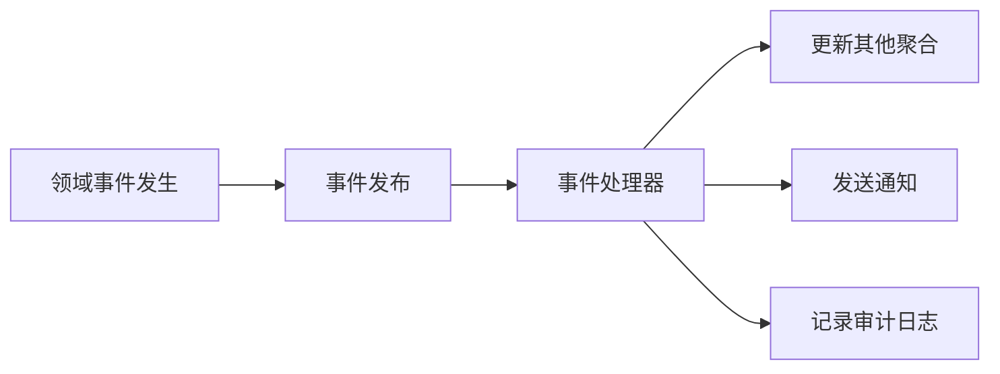

### 领域事件实现示例

```java
// 基础领域事件接口
public interface DomainEvent {
    String getEventId();
    LocalDateTime getOccurredOn();
    String getEventType();
    Object getAggregateId();
    Map<String, Object> getEventData();
}

// 具体领域事件
public class OrderPaidEvent implements DomainEvent {
    private final String eventId;
    private final LocalDateTime occurredOn;
    private final OrderId orderId;
    private final Money paidAmount;
    private final String paymentMethod;
    private final LocalDateTime paymentTime;

    public OrderPaidEvent(OrderId orderId, Money paidAmount, String paymentMethod) {
        this.eventId = UUID.randomUUID().toString();
        this.occurredOn = LocalDateTime.now();
        this.orderId = orderId;
        this.paidAmount = paidAmount;
        this.paymentMethod = paymentMethod;
        this.paymentTime = LocalDateTime.now();
    }

    @Override
    public String getEventId() { return eventId; }

    @Override
    public LocalDateTime getOccurredOn() { return occurredOn; }

    @Override
    public String getEventType() { return "OrderPaid"; }

    @Override
    public OrderId getAggregateId() { return orderId; }

    @Override
    public Map<String, Object> getEventData() {
        Map<String, Object> data = new HashMap<>();
        data.put("orderId", orderId.getValue());
        data.put("paidAmount", paidAmount.getValue());
        data.put("paymentMethod", paymentMethod);
        data.put("paymentTime", paymentTime);
        return data;
    }

    // Getter方法
    public OrderId getOrderId() { return orderId; }
    public Money getPaidAmount() { return paidAmount; }
    public String getPaymentMethod() { return paymentMethod; }
    public LocalDateTime getPaymentTime() { return paymentTime; }
}

// 事件发布器
@Component
public class DomainEventPublisher {
    private final ApplicationEventPublisher eventPublisher;
    private final EventStore eventStore;

    public DomainEventPublisher(ApplicationEventPublisher eventPublisher, EventStore eventStore) {
        this.eventPublisher = eventPublisher;
        this.eventStore = eventStore;
    }

    public void publish(DomainEvent event) {
        // 1. 存储事件
        eventStore.saveEvent(event);

        // 2. 发布Spring事件
        eventPublisher.publishEvent(event);

        // 3. 发送到消息队列（如果需要）
        sendToMessageQueue(event);
    }

    public void publishAll(List<DomainEvent> events) {
        for (DomainEvent event : events) {
            publish(event);
        }
    }

    private void sendToMessageQueue(DomainEvent event) {
        // 将事件发送到消息队列，供其他微服务消费
    }
}

// 在聚合根中记录事件
public class Order {
    private OrderId id;
    private List<OrderItem> items;
    private OrderStatus status;
    private List<DomainEvent> domainEvents = new ArrayList<>();

    public void pay(String paymentMethod, Money paidAmount) {
        if (status != OrderStatus.CONFIRMED) {
            throw new DomainException("只有已确认的订单才能支付");
        }

        if (!paidAmount.equals(getTotalAmount())) {
            throw new DomainException("支付金额与订单金额不符");
        }

        this.status = OrderStatus.PAID;

        // 记录领域事件
        domainEvents.add(new OrderPaidEvent(id, paidAmount, paymentMethod));
    }

    public void confirm() {
        if (status != OrderStatus.PENDING) {
            throw new DomainException("只有待处理的订单才能确认");
        }

        this.status = OrderStatus.CONFIRMED;

        // 记录领域事件
        domainEvents.add(new OrderConfirmedEvent(id, getTotalAmount(), getItems()));
    }

    public void cancel(String reason) {
        if (status == OrderStatus.COMPLETED || status == OrderStatus.CANCELLED) {
            throw new DomainException("已完成或已取消的订单不能再次取消");
        }

        this.status = OrderStatus.CANCELLED;

        // 记录领域事件
        domainEvents.add(new OrderCancelledEvent(id, reason, getTotalAmount()));
    }

    // 获取并清除事件
    public List<DomainEvent> getDomainEvents() {
        List<DomainEvent> events = new ArrayList<>(domainEvents);
        domainEvents.clear();
        return events;
    }
}

// 事件处理器
@Component
public class OrderEventHandler {
    private final InventoryService inventoryService;
    private final NotificationService notificationService;
    private final OrderRepository orderRepository;
    private final UserRepository userRepository;

    @EventListener
    @Async
    public void handleOrderPaid(OrderPaidEvent event) {
        // 1. 确认库存
        inventoryService.confirmStock(event.getOrderId());

        // 2. 发送支付成功通知
        Order order = orderRepository.findById(event.getOrderId());
        User user = userRepository.findById(order.getUserId());

        notificationService.sendPaymentSuccessNotification(
            user.getEmail(),
            event.getOrderId(),
            event.getPaidAmount()
        );

        // 3. 更新用户统计信息
        userRepository.updateOrderStatistics(user.getId(), event.getPaidAmount());

        log.info("处理订单支付事件完成: {}", event.getOrderId());
    }

    @EventListener
    @Async
    public void handleOrderConfirmed(OrderConfirmedEvent event) {
        // 预扣库存
        inventoryService.reserveStock(event.getOrderId(), event.getItems());

        log.info("处理订单确认事件完成: {}", event.getOrderId());
    }

    @EventListener
    @Async
    public void handleOrderCancelled(OrderCancelledEvent event) {
        // 释放库存
        inventoryService.releaseStock(event.getOrderId());

        // 发送取消通知
        Order order = orderRepository.findById(event.getOrderId());
        User user = userRepository.findById(order.getUserId());

        notificationService.sendOrderCancelledNotification(
            user.getEmail(),
            event.getOrderId(),
            event.getReason()
        );

        log.info("处理订单取消事件完成: {}", event.getOrderId());
    }
}
```

### 领域事件的优势

1. **松耦合**：聚合之间通过事件解耦
2. **可扩展性**：可以轻松添加新的事件处理器
3. **最终一致性**：支持分布式系统的一致性
4. **可审计性**：事件记录了系统的状态变化

## 五、策略（Strategy）模式

### 定义
策略模式用于**封装算法或业务规则**，使得它们可以在运行时相互替换。在DDD中，策略模式常用于实现可变的业务规则。

### 策略实现示例

```java
// 定价策略接口
public interface PricingStrategy {
    Money calculatePrice(Order order);
    String getStrategyName();
    boolean isApplicable(Order order);
}

// 会员定价策略
@Component
public class MemberPricingStrategy implements PricingStrategy {
    private final UserRepository userRepository;

    public MemberPricingStrategy(UserRepository userRepository) {
        this.userRepository = userRepository;
    }

    @Override
    public Money calculatePrice(Order order) {
        User user = userRepository.findById(order.getUserId()).orElse(null);
        if (user == null) {
            return order.getTotalAmount();
        }

        Money discount = Money.ZERO;
        double discountRate = getDiscountRate(user.getMemberLevel());

        if (discountRate > 0) {
            discount = order.getTotalAmount().multiply(discountRate);
        }

        return order.getTotalAmount().subtract(discount);
    }

    @Override
    public String getStrategyName() {
        return "会员折扣";
    }

    @Override
    public boolean isApplicable(Order order) {
        User user = userRepository.findById(order.getUserId()).orElse(null);
        return user != null && user.getMemberLevel() != MemberLevel.NORMAL;
    }

    private double getDiscountRate(MemberLevel level) {
        switch (level) {
            case VIP: return 0.1; // 10%折扣
            case PREMIUM: return 0.15; // 15%折扣
            case DIAMOND: return 0.2; // 20%折扣
            default: return 0;
        }
    }
}

// 促销定价策略
@Component
public class PromotionPricingStrategy implements PricingStrategy {
    private final PromotionRepository promotionRepository;

    public PromotionPricingStrategy(PromotionRepository promotionRepository) {
        this.promotionRepository = promotionRepository;
    }

    @Override
    public Money calculatePrice(Order order) {
        List<Promotion> applicablePromotions = promotionRepository
            .findApplicablePromotions(order.getItems(), order.getUserId());

        Money totalDiscount = Money.ZERO;
        for (Promotion promotion : applicablePromotions) {
            Money discount = promotion.calculateDiscount(order);
            totalDiscount = totalDiscount.add(discount);
        }

        return order.getTotalAmount().subtract(totalDiscount);
    }

    @Override
    public String getStrategyName() {
        return "促销活动";
    }

    @Override
    public boolean isApplicable(Order order) {
        return !promotionRepository.findApplicablePromotions(
            order.getItems(),
            order.getUserId()
        ).isEmpty();
    }
}

// 定价策略选择器
@Service
public class PricingStrategySelector {
    private final List<PricingStrategy> strategies;

    public PricingStrategySelector(List<PricingStrategy> strategies) {
        this.strategies = strategies;
    }

    public Money calculateFinalPrice(Order order) {
        Money finalPrice = order.getTotalAmount();

        for (PricingStrategy strategy : strategies) {
            if (strategy.isApplicable(order)) {
                Money strategyPrice = strategy.calculatePrice(order);
                finalPrice = strategyPrice.lessThan(finalPrice) ? strategyPrice : finalPrice;

                log.info("应用定价策略: {}, 价格: {}",
                    strategy.getStrategyName(), strategyPrice);
            }
        }

        return finalPrice;
    }

    public List<String> getApplicableStrategies(Order order) {
        return strategies.stream()
            .filter(strategy -> strategy.isApplicable(order))
            .map(PricingStrategy::getStrategyName)
            .collect(Collectors.toList());
    }
}
```

## 六、支撑模式的最佳实践

### 1. 接口设计原则

- **面向领域**：接口设计基于业务概念，而非技术实现
- **职责单一**：每个接口只负责一个明确的职责
- **稳定性**：接口应该保持稳定，避免频繁变更

### 2. 实现原则

- **技术解耦**：实现细节不应该泄露到领域层
- **异常处理**：统一的技术异常转换
- **性能优化**：合理使用缓存、批量操作等优化手段

### 3. 测试策略

- **接口测试**：测试接口的正确性
- **实现测试**：测试具体实现的正确性
- **集成测试**：测试与其他系统的集成

### 4. 演进策略

- **版本管理**：接口变更时的版本管理策略
- **兼容性**：保持向后兼容性
- **迁移策略**：平滑的迁移和升级

通过合理使用这些支撑模式，我们可以构建出**结构清晰、易于维护、可扩展**的DDD架构系统。

# DDD服务类型详解

## 概述

在DDD中，服务类型的理解至关重要。不同类型的服务有不同的职责和定位，正确的使用能够构建出清晰、可维护的系统架构。本文详细对比分析领域服务、应用服务等核心概念。

## 一、领域服务（Domain Service）

### 定义
领域服务是DDD领域层的组成部分，用于封装**不属于单个实体或值对象的领域逻辑**，这些逻辑涉及多个领域对象的协作或无状态的操作。

### 职责
1. **跨领域对象协作**：处理需要多个实体/值对象共同完成的复杂逻辑（如转账、订单结算）
2. **无状态操作**：不持有业务状态，仅协调领域对象完成任务
3. **领域规则封装**：实现领域内的通用规则或算法（如折扣计算、库存分配策略）

### 特点
- 位于领域层，与业务规则紧密相关，不依赖外部资源（如数据库、HTTP）
- 接口设计基于领域概念（如 `TransferService.transfer()`），返回领域对象或值对象
- 避免将逻辑泄露到实体中，保持实体职责单一

### 代码示例

```java
// 银行转账领域服务
@DomainService
public class TransferDomainService {
    private final AccountRepository accountRepository;
    private final ExchangeRateService exchangeRateService;

    public TransferDomainService(AccountRepository accountRepository,
                                ExchangeRateService exchangeRateService) {
        this.accountRepository = accountRepository;
        this.exchangeRateService = exchangeRateService;
    }

    // 跨实体的领域逻辑
    @Transactional
    public void transfer(Long fromAccountId, Long toAccountId, Money amount, String currency) {
        // 1. 账户存在性校验
        Account fromAccount = accountRepository.findById(fromAccountId)
            .orElseThrow(() -> new AccountNotFoundException(fromAccountId));
        Account toAccount = accountRepository.findById(toAccountId)
            .orElseThrow(() -> new AccountNotFoundException(toAccountId));

        // 2. 业务规则校验
        if (fromAccount.getBalance().lessThan(amount)) {
            throw new InsufficientBalanceException("账户余额不足");
        }

        // 3. 货币转换（如果需要）
        Money transferAmount = amount;
        if (!fromAccount.getCurrency().equals(toAccount.getCurrency())) {
            Money convertedAmount = exchangeRateService.convert(
                amount, fromAccount.getCurrency(), toAccount.getCurrency()
            );
            transferAmount = convertedAmount;
        }

        // 4. 执行转账业务逻辑
        fromAccount.debit(transferAmount, toAccountId, "转账到账户" + toAccountId);
        toAccount.credit(transferAmount, fromAccountId, "从账户" + fromAccountId + "转入");

        // 5. 记录转账记录
        TransferRecord record = new TransferRecord(
            fromAccountId, toAccountId, amount, transferAmount,
            fromAccount.getCurrency(), toAccount.getCurrency()
        );

        // 6. 保存聚合
        accountRepository.save(fromAccount);
        accountRepository.save(toAccount);
        transferRecordRepository.save(record);
    }

    // 计算利息的纯业务逻辑
    public Money calculateInterest(Account account, LocalDate startDate, LocalDate endDate) {
        // 复杂的利息计算逻辑
        Money principal = account.getBalance();
        double rate = getInterestRate(account.getAccountType(), account.getCustomerLevel());
        int days = (int) ChronoUnit.DAYS.between(startDate, endDate);

        // 复利计算
        Money interest = principal;
        for (int i = 0; i < days; i++) {
            interest = interest.multiply(rate / 365.0 / 100.0);
        }

        return interest;
    }

    // 验证转账限额的领域规则
    public boolean validateTransferLimit(Account account, Money amount) {
        Money dailyLimit = account.getDailyTransferLimit();
        Money todayTransferred = calculateTodayTransferredAmount(account.getId());

        return todayTransferred.add(amount).lessThanOrEqual(dailyLimit);
    }

    // 跨境转账校验
    public TransferValidationResult validateInternationalTransfer(Account fromAccount, Account toAccount, Money amount) {
        // 1. 跨境转账限制
        if (isInternationalTransfer(fromAccount, toAccount)) {
            Money internationalLimit = fromAccount.getInternationalTransferLimit();
            if (amount.greaterThan(internationalLimit)) {
                return TransferValidationResult.failure(" 跨境转账金额超过限额: " + internationalLimit);
            }

            // 2. 反洗钱校验
            if (isSuspiciousAmount(amount)) {
                return TransferValidationResult.failure("转账金额触发反洗钱规则，需要人工审核");
            }
        }

        // 3. 实时汇率校验
        if (!fromAccount.getCurrency().equals(toAccount.getCurrency())) {
            ExchangeRate rate = exchangeRateService.getCurrentRate(
                fromAccount.getCurrency(), toAccount.getCurrency()
            );
            if (rate == null || rate.isExpired()) {
                return TransferValidationResult.failure("当前汇率不可用，请稍后重试");
            }
        }

        return TransferValidationResult.success();
    }

    // 私有方法
    private double getInterestRate(AccountType accountType, CustomerLevel customerLevel) {
        // 根据账户类型和客户等级计算利率
        // 复杂的业务逻辑
    }

    private Money calculateTodayTransferredAmount(Long accountId) {
        return transferRecordRepository.sumAmountByAccountIdAndDate(
            accountId, LocalDate.now()
        );
    }

    private boolean isInternationalTransfer(Account fromAccount, Account toAccount) {
        return !fromAccount.getCountry().equals(toAccount.getCountry());
    }

    private boolean isSuspiciousAmount(Money amount) {
        return amount.greaterThan(new Money("100000.00"));
    }
}

// 另一个领域服务示例：定价服务
@DomainService
public class PricingDomainService {
    private final DiscountRuleRepository discountRuleRepository;
    private final PricingStrategyRepository pricingStrategyRepository;

    // 订单定价领域服务
    public PricingResult calculateOrderPrice(Order order) {
        Money basePrice = order.getBasePrice();
        Money totalDiscount = Money.ZERO;
        List<DiscountApplied> appliedDiscounts = new ArrayList<>();

        // 1. 应用会员折扣
        MemberDiscount memberDiscount = calculateMemberDiscount(order.getUserId(), basePrice);
        if (memberDiscount.isApplicable()) {
            totalDiscount = totalDiscount.add(memberDiscount.getAmount());
            appliedDiscounts.add(new DiscountApplied("会员折扣", memberDiscount.getAmount()));
        }

        // 2. 应用促销折扣
        PromotionDiscount promotionDiscount = calculatePromotionDiscount(order);
        if (promotionDiscount.isApplicable()) {
            totalDiscount = totalDiscount.add(promotionDiscount.getAmount());
            appliedDiscounts.add(new DiscountApplied("促销折扣", promotionDiscount.getAmount()));
        }

        // 3. 应用批量折扣
        BulkDiscount bulkDiscount = calculateBulkDiscount(order);
        if (bulkDiscount.isApplicable()) {
            totalDiscount = totalDiscount.add(bulkDiscount.getAmount());
            appliedDiscounts.add(new DiscountApplied("批量折扣", bulkDiscount.getAmount()));
        }

        // 4. 应用优惠券
        if (order.getCouponId() != null) {
            CouponDiscount couponDiscount = calculateCouponDiscount(order.getCouponId(), basePrice);
            if (couponDiscount.isApplicable()) {
                totalDiscount = totalDiscount.add(couponDiscount.getAmount());
                appliedDiscounts.add(new DiscountApplied("优惠券", couponDiscount.getAmount()));
            }
        }

        // 5. 计算最终价格
        Money finalPrice = basePrice.subtract(totalDiscount);

        // 6. 应用业务规则
        if (finalPrice.lessThan(Money.ZERO)) {
            throw new DomainException("订单价格不能为负数");
        }

        if (totalDiscount.greaterThan(basePrice.multiply(0.8))) {
            throw new DomainException("折扣金额不能超过订单价格的80%");
        }

        return new PricingResult(basePrice, totalDiscount, finalPrice, appliedDiscounts);
    }

    private MemberDiscount calculateMemberDiscount(Long userId, Money basePrice) {
        // 会员折扣逻辑
    }

    private PromotionDiscount calculatePromotionDiscount(Order order) {
        // 促销折扣逻辑
    }

    private BulkDiscount calculateBulkDiscount(Order order) {
        // 批量折扣逻辑
    }

    private CouponDiscount calculateCouponDiscount(String couponId, Money basePrice) {
        // 优惠券折扣逻辑
    }
}
```

### 领域服务 vs 应用服务对比

### 详细对比表

| 特征 | 领域服务 | 应用服务 |
|------|----------|----------|
| **所在层次** | 领域层 | 应用层 |
| **核心职责** | 封装跨对象的业务逻辑 | 协调业务流程、管理事务 |
| **业务逻辑** | 包含核心业务规则 | 不包含业务逻辑，仅编排 |
| **状态管理** | 无状态，不保存业务数据 | 可能管理事务状态、临时数据 |
| **依赖关系** | 只依赖领域层 | 依赖领域层和基础设施层 |
| **接口设计** | 基于领域概念，返回领域对象 | 基于用例场景，返回DTO/ID |
| **事务管理** | 不管理事务 | 管理事务边界 |
| **外部调用** | 不调用外部系统 | 调用适配器、消息队列等 |
| **异常处理** | 抛出领域异常 | 转换为业务异常、系统异常 |
| **测试策略** | 业务逻辑单元测试 | 集成测试、流程测试 |
| **并发处理** | 通常不考虑并发 | 可能需要处理并发问题 |
| **缓存使用** | 不使用缓存 | 可能使用缓存优化 |
| **日志记录** | 很少记录日志 | 记录操作日志、审计日志 |
| **权限校验** | 不处理权限 | 处理业务权限、数据权限 |
| **数据验证** | 业务规则校验 | 输入格式校验、基础校验 |

### 典型使用场景对比

#### 领域服务适用场景
```java
// 场景1：跨聚合的业务逻辑
public class TransferDomainService {
    public void transfer(Account fromAccount, Account toAccount, Money amount) {
        // 涉及多个Account聚合的复杂业务逻辑
    }
}

// 场景2：复杂算法
public class PricingDomainService {
    public Money calculatePrice(Order order, List<Discount> discounts) {
        // 复杂的定价算法和折扣计算
    }
}

// 场景3：领域规则校验
public class ValidationDomainService {
    public boolean validateOrderRules(Order order) {
        // 复杂的订单业务规则校验
    }
}
```

#### 应用服务适用场景
```java
// 场景1：完整业务流程编排
public class OrderApplicationService {
    @Transactional
    public OrderId createOrder(CreateOrderCommand command) {
        // 1. 验证用户
        // 2. 调用领域服务创建订单
        // 3. 调用外部系统（库存、支付）
        // 4. 发送通知
        // 5. 返回结果
    }
}

// 场景2：事务管理
public class TransferApplicationService {
    @Transactional
    public void transfer(TransferCommand command) {
        // 管理整个转账流程的事务边界
    }
}

// 场景3：外部系统协调
public class PaymentApplicationService {
    public PaymentResult processPayment(PaymentCommand command) {
        // 协调支付网关、订单系统、通知系统
    }
}
```

## 四、服务设计的最佳实践

### 1. 领域服务设计原则

#### 单一职责原则
```java
// 好的设计 - 职责单一
public class TransferDomainService {
    public void transfer(Account from, Account to, Money amount) { ... }
}

public class InterestCalculationService {
    public Money calculateInterest(Account account, Period period) { ... }
}

// 避免 - 职责混乱
public class AccountService {
    public void transfer(Account from, Account to, Money amount) { ... }
    public Money calculateInterest(Account account, Period period) { ... }
    public void sendStatement(Account account) { ... } // 应该在应用层
}
```

#### 无状态设计
```java
// 好的设计 - 无状态
@DomainService
public class PricingDomainService {
    public Money calculatePrice(Order order) {
        // 基于输入参数计算，不保存状态
    }
}

// 避免 - 有状态
@DomainService
public class BadPricingService {
    private Order currentOrder; // 不应该保存状态
    private Money runningTotal;

    public void startOrder(Order order) {
        this.currentOrder = order;
        this.runningTotal = Money.ZERO;
    }
}
```

### 2. 应用服务设计原则

#### 薄层设计
```java
// 好的设计 - 薄层，只做编排
@Service
public class OrderApplicationService {
    public OrderId createOrder(CreateOrderCommand command) {
        // 1. 数据转换
        Order order = orderMapper.toOrder(command);

        // 2. 调用领域服务
        orderDomainService.validateOrder(order);

        // 3. 调用仓储
        Order savedOrder = orderRepository.save(order);

        // 4. 调用外部系统
        notificationAdapter.sendOrderCreated(savedOrder);

        return savedOrder.getId();
    }
}

// 避免 - 包含业务逻辑
@Service
public class BadOrderApplicationService {
    public OrderId createOrder(CreateOrderCommand command) {
        // 不应该在这里包含业务逻辑
        if (command.getDiscountAmount().greaterThan(command.getTotalAmount().multiply(0.5))) {
            throw new BusinessException("折扣不能超过50%");
        }

        // 其他业务逻辑...
    }
}
```

#### 明确的事务边界
```java
// 好的设计 - 明确的事务边界
@Service
public class TransferApplicationService {
    @Transactional
    public void transfer(TransferCommand command) {
        // 整个转账流程在一个事务中
        transferDomainService.transfer(command.getFromAccount(), command.getToAccount(), command.getAmount());
    }
}

// 避免 - 事务边界不明确
@Service
public class BadTransferService {
    public void transfer(TransferCommand command) {
        // 在多个方法中分别管理事务，容易出问题
        transferRepository.saveTransferRecord(...);
        accountRepository.updateAccount(...);
    }
}
```

### 3. 服务协作模式

#### 命令查询职责分离（CQRS）
```java
// 命令服务 - 负责写操作
@Service
public class OrderCommandService {
    @Transactional
    public OrderId createOrder(CreateOrderCommand command) {
        // 创建订单逻辑
    }

    @Transactional
    public void updateOrder(UpdateOrderCommand command) {
        // 更新订单逻辑
    }
}

// 查询服务 - 负责读操作
@Service
public class OrderQueryService {
    @Transactional(readOnly = true)
    public OrderDetail getOrderDetail(Long orderId) {
        // 查询订单详情
    }

    @Transactional(readOnly = true)
    public List<OrderSummary> getUserOrders(Long userId) {
        // 查询用户订单列表
    }
}
```

#### 异步处理模式
```java
@Service
public class OrderApplicationService {
    // 同步处理关键操作
    @Transactional
    public OrderId createOrder(CreateOrderCommand command) {
        Order order = orderDomainService.createOrder(command);
        Order savedOrder = orderRepository.save(order);

        // 异步处理非关键操作
        asyncOrderProcessor.processAfterOrderCreated(savedOrder);

        return savedOrder.getId();
    }
}

@Service
public class AsyncOrderProcessor {
    @Async
    public void processAfterOrderCreated(Order order) {
        // 异步发送通知、更新统计等
        notificationService.sendOrderNotification(order);
        statisticsService.updateOrderStatistics(order);
    }
}
```

## 五、总结

### 服务设计的核心原则

1. **职责明确**：领域服务负责业务逻辑，应用服务负责流程编排
2. **层次清晰**：严格遵循分层架构，避免层次混乱
3. **依赖单向**：上层依赖下层，避免循环依赖
4. **接口稳定**：服务接口应该保持稳定，避免频繁变更
5. **测试友好**：设计时应考虑可测试性

### 实践建议

1. **先业务后技术**：先理解业务需求，再设计服务结构
2. **小步快跑**：从简单的服务开始，逐步完善
3. **持续重构**：随着业务理解深入，不断优化服务设计
4. **团队协作**：确保团队对服务职责有一致的理解
5. **文档规范**：建立清晰的接口文档和使用规范

通过正确理解和应用领域服务、应用服务等概念，我们可以构建出**职责清晰、易于维护、可扩展**的DDD架构系统。

# DDD设计过程和方法

## 概述

DDD的设计过程是一个**从业务需求到技术实现的完整流程**，通过系统性的方法和工具，帮助团队构建出反映业务真实需求的软件系统。本文介绍DDD的核心设计过程、方法和工具。

## 一、DDD设计流程概览

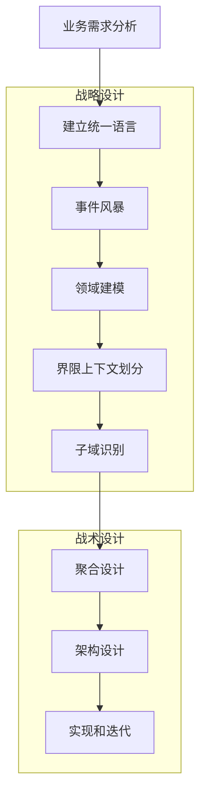

## 二、设计过程详解

### 第一阶段：业务理解和需求分析

#### 1. 业务价值分析
明确项目的业务目标和价值，帮助识别核心域：

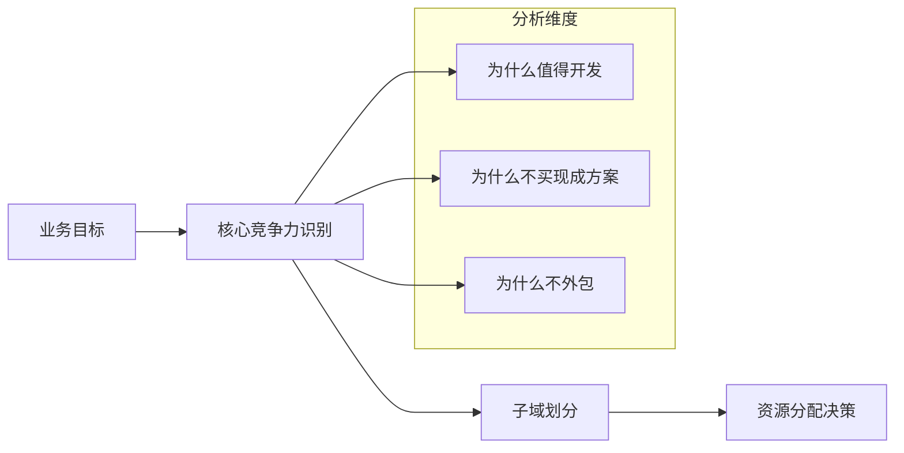

#### 实施方法
- **业务访谈**：与业务专家、产品经理深入交流
- **价值地图**：绘制功能价值地图，识别高价值功能
- **竞品分析**：了解市场现有方案和差异化需求
- **ROI分析**：评估各功能的投入产出比

#### 输出物
- 业务价值分析报告
- 功能优先级矩阵
- 初步的功能列表

### 第二阶段：建立统一语言

#### 1. 术语收集
从业务描述、需求文档、用户故事中收集关键术语：

| 业务描述 | 提取的术语 | 术语类型 |
|----------|------------|----------|
| "用户可以注册账户，使用邮箱接收验证码" | 用户、注册、账户、邮箱、验证码 | 实体、行为、值对象 |
| "订单包含多个商品，可以应用优惠券" | 订单、商品、优惠券 | 实体、值对象 |
| "讲师创建课程，学员报名参加学习" | 讲师、课程、学员、报名、学习 | 实体、行为 |

#### 2. 术语定义和标准化
建立团队的术语字典：

```
用户（User）：在系统中注册的自然人或组织
- 属性：用户ID、姓名、邮箱、手机号、注册时间
- 行为：注册、登录、修改资料、注销

订单（Order）：用户购买商品或服务的交易记录
- 属性：订单ID、用户ID、订单状态、创建时间、总金额
- 行为：创建、确认、支付、取消、完成

商品（Product）：可供销售的物品或服务
- 属性：商品ID、名称、价格、库存数量、描述
- 行为：上架、下架、修改价格、更新库存
```

#### 3. 术语关系建模
绘制术语关系图，理解概念之间的关联：

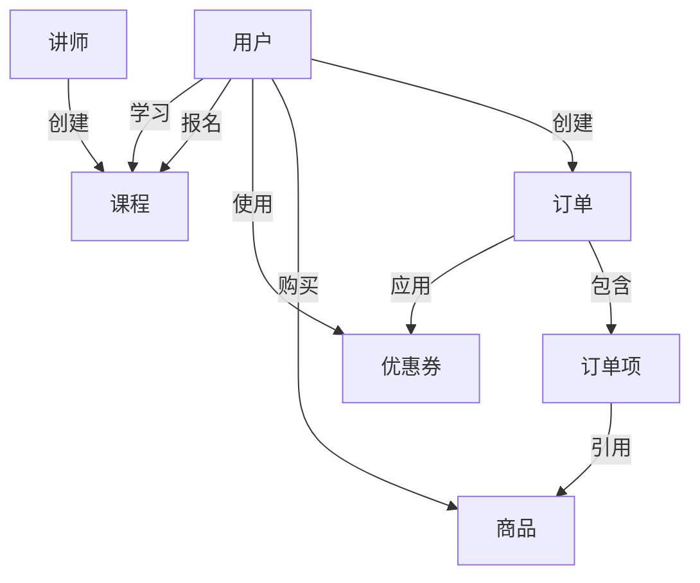

### 第三阶段：事件风暴（Event Storming）

事件风暴是DDD领域建模的核心方法，通过集体讨论和协作，快速识别领域事件、命令、聚合等。

#### 1. 准备工作
- **参与者**：领域专家、开发人员、产品经理、UX设计师
- **环境**：大空间、白板或墙壁、不同颜色的便利贴
- **工具**：便利贴（不同颜色代表不同元素）、马克笔、相机

#### 2. 事件风暴流程

**步骤1：识别领域事件（橙色便利贴）**
```
用户注册成功
邮箱验证码发送
订单创建成功
商品库存不足
订单支付完成
优惠券使用成功
课程报名成功
```

**步骤2：识别命令（蓝色便利贴）**
```java
[用户注册] -> 用户注册成功
[发送验证码] -> 邮箱验证码发送
[创建订单] -> 订单创建成功
[检查库存] -> 商品库存不足
[处理支付] -> 订单支付完成
[使用优惠券] -> 优惠券使用成功
[报名课程] -> 课程报名成功
```

**步骤3：识别聚合（黄色便利贴）**
```
用户聚合：用户注册成功
订单聚合：订单创建成功、订单支付完成
商品聚合：商品库存不足
优惠券聚合：优惠券使用成功
课程聚合：课程报名成功
```

**步骤4：识别外部系统（粉色便利贴）**
```
邮件服务：发送验证码邮件
支付网关：处理支付
短信服务：发送短信通知
库存系统：查询和更新库存
```

**步骤5：识别策略（绿色便利贴）**
```
库存分配策略：如何分配库存给订单
优惠券使用策略：优惠券的叠加使用规则
定价策略：商品定价的计算逻辑
```

#### 3. 事件风暴成果整理

**领域事件时间线**
```
用户注册 -> 邮箱验证 -> 创建订单 -> 检查库存 -> 应用折扣 -> 处理支付 -> 订单完成 -> 发送通知
```

**聚合关系图**
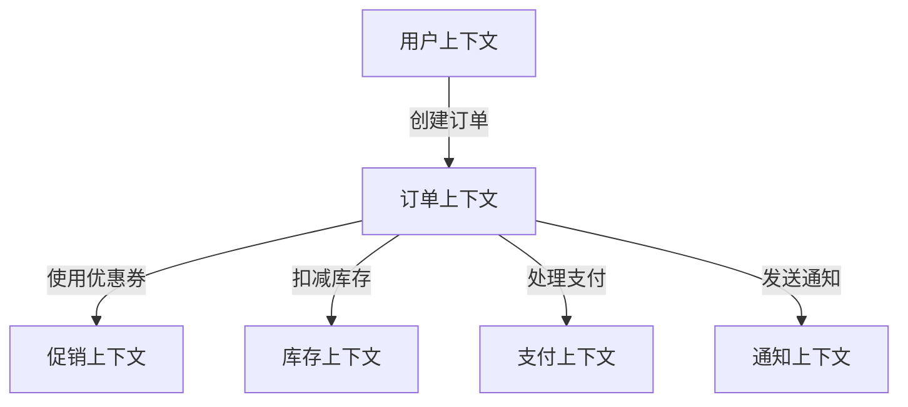

### 第四阶段：领域建模

#### 1. 实体识别
从事件风暴的结果中识别实体：

**用户实体**
```java
public class User {
    private UserId id;
    private String name;
    private String email;
    private String phone;
    private UserStatus status;
    private LocalDateTime createTime;
    private LocalDateTime lastLoginTime;
}
```

**订单实体**
```java
public class Order {
    private OrderId id;
    private UserId userId;
    private List<OrderItem> items;
    private Money totalAmount;
    private OrderStatus status;
    private String couponId;
    private LocalDateTime createTime;
}
```

**商品实体**
```java
public class Product {
    private ProductId id;
    private String name;
    private String description;
    private Money price;
    private int stock;
    private ProductStatus status;
}
```

#### 2. 值对象识别
识别哪些概念应该是值对象：

**地址值对象**
```java
public class Address {
    private final String province;
    private final String city;
    private final String district;
    private final String street;
    private final String zipCode;
}
```

**金额值对象**
```java
public class Money {
    private final BigDecimal amount;
    private final String currency;

    public Money add(Money other) { ... }
    public Money subtract(Money other) { ... }
    public Money multiply(double multiplier) { ... }
}
```

**邮箱值对象**
```java
public class Email {
    private final String value;

    private Email(String value) {
        if (!isValidEmail(value)) {
            throw new IllegalArgumentException("邮箱格式不正确");
        }
        this.value = value;
    }

    public static Email of(String value) {
        return new Email(value);
    }
}
```

#### 3. 聚合设计
识别聚合根和聚合边界：

**订单聚合**
```java
public class Order {  // 聚合根
    private OrderId id;
    private UserId userId;
    private List<OrderItem> items;   // 子实体
    private Address shippingAddress;   // 值对象
    private Money totalAmount;
    private OrderStatus status;

    // 聚合行为
    public void addItem(Product product, int quantity) {
        OrderItem item = new OrderItem(product, quantity);
        this.items.add(item);
        recalculateTotal();
    }

    public void applyCoupon(Coupon coupon) {
        // 业务规则验证
        if (!coupon.isApplicable(this)) {
            throw new DomainException("优惠券不适用");
        }

        this.couponId = coupon.getId();
        recalculateTotal();
    }

    public void confirm() {
        if (items.isEmpty()) {
            throw new DomainException("订单不能为空");
        }
        if (status != OrderStatus.PENDING) {
            throw new DomainException("只有待处理订单才能确认");
        }

        this.status = OrderStatus.CONFIRMED;
    }

    // 私有方法
    private void recalculateTotal() {
        this.totalAmount = items.stream()
            .map(OrderItem::getSubtotal)
            .reduce(Money.ZERO, Money::add);

        if (couponId != null) {
            // 应用折扣逻辑
        }
    }
}
```

**用户聚合**
```java
public class User {  // 聚合根
    private UserId id;
    private String name;
    private Email email;
    private Phone phone;
    private UserStatus status;
    private List<Address> addresses;  // 值对象列表

    public void addAddress(Address address) {
        if (addresses.size() >= 5) {
            throw new DomainException("地址数量不能超过5个");
        }
        this.addresses.add(address);
    }

    public void updateEmail(Email newEmail) {
        if (!newEmail.isDifferentFrom(this.email)) {
            return; // 相同邮箱不需要更新
        }

        // 发送验证邮件的逻辑在应用层
        this.email = newEmail;
        this.status = UserStatus.EMAIL_PENDING_VERIFICATION;
    }
}
```

#### 4. 领域服务识别
识别需要跨聚合协作的业务逻辑：

**定价服务**
```java
@DomainService
public class PricingDomainService {
    public Money calculateOrderPrice(Order order, List<Discount> discounts) {
        // 复杂的定价逻辑，涉及多个聚合
    }
}
```

**库存服务**
```java
@DomainService
public class InventoryDomainService {
    public boolean checkStockAvailability(List<OrderItem> items) {
        // 检查多个商品的库存
    }
}
```

### 第五阶段：界限上下文划分

#### 1. 上下文映射分析
分析事件风暴中识别的聚合，划分界限上下文：

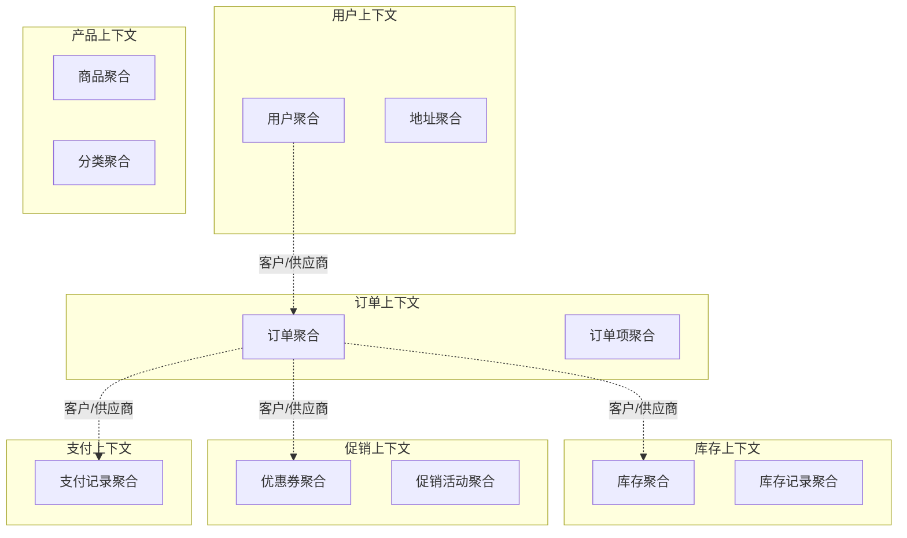

#### 2. 上下文关系定义

**共享内核（Shared Kernel）**
- 用户上下文和订单上下文共享用户的基本信息
- 产品上下文和订单上下文共享商品的基本信息

**客户/供应商（Customer/Supplier）**
- 订单上下文是客户，库存上下文是供应商
- 订单上下文是客户，促销上下文是供应商

**防腐层（Anticorruption Layer）**
- 订单上下文需要调用外部支付网关
- 用户上下文需要调用外部邮件服务

#### 3. 上下文边界定义

**用户上下文（User Context）**
```
职责：用户管理、认证授权
聚合：User、UserProfile
服务：UserDomainService、AuthService
限界：用户的注册、登录、信息管理
```

**订单上下文（Order Context）**
```
职责：订单管理、订单流程
聚合：Order、OrderItem
服务：OrderDomainService、PricingService
限界：从创建到完成的整个订单生命周期
```

**产品上下文（Product Context）**
```
职责：商品管理、分类管理
聚合：Product、Category、ProductAttribute
服务：ProductDomainService
限界：商品的信息管理和发布
```

### 第六阶段：架构设计

#### 1. 微服务拆分
根据界限上下文进行微服务拆分：

```
用户服务（user-service）
├── 用户注册、登录
├── 个人信息管理
├── 权限管理
└── 用户统计分析

订单服务（order-service）
├── 订单创建、管理
├── 订单状态流转
├── 订单查询
└── 订单统计分析

产品服务（product-service）
├── 商品信息管理
├── 分类管理
├── 价格管理
└── 商品搜索

库存服务（inventory-service）
├── 库存查询
├── 库存扣减
├── 库存补充
└── 库存预警

促销服务（promotion-service）
├── 优惠券管理
├── 促销活动管理
├── 折扣计算
└── 营销统计分析
```

#### 2. 服务间通信设计

**同步调用**
```java
// 订单服务调用库存服务检查库存
@FeignClient("inventory-service")
public interface InventoryService {
    @GetMapping("/api/inventory/check")
    boolean checkStock(@RequestParam List<Long> productIds);
}
```

**异步消息**
```java
// 订单创建成功后发送事件
@EventListener
@Async
public void handleOrderCreated(OrderCreatedEvent event) {
    // 发送消息给库存服务
    kafkaTemplate.send("inventory.reserve", event);
    // 发送消息给促销服务
    kafkaTemplate.send("promotion.apply", event);
}
```

#### 3. 数据一致性策略

**SAGA模式**
```java
@Service
public class OrderSagaOrchestrator {
    public void processOrder(Order order) {
        try {
            // 1. 预扣库存
            inventoryService.reserveStock(order);

            // 2. 应用优惠券
            promotionService.applyCoupon(order);

            // 3. 处理支付
            paymentService.processPayment(order);

            // 4. 确认订单
            order.confirm();

        } catch (Exception e) {
            // 补偿操作
            rollbackSaga(order);
        }
    }

    private void rollbackSaga(Order order) {
        // 1. 释放库存
        inventoryService.releaseStock(order);
        // 2. 恢复优惠券
        promotionService.restoreCoupon(order);
        // 3. 取消支付
        paymentService.cancelPayment(order);
    }
}
```

## 三、设计方法和工具

### 1. 四色建模法

#### 颜色定义
- **粉色**：参与者和角色（Actor/Role）
- **黄色**：偶发事件或时间点（Moment-Interval）
- **绿色**：描述性信息（Description）
- **蓝色**：类似PPT的链接（Party, Place, Thing）

#### 建模步骤

**步骤1：识别粉色的参与者和角色**
```
用户（User）、讲师（Teacher）、学员（Student）、管理员（Admin）
```

**步骤2：识别黄色的时刻-时段**
```
注册（Register）、登录（Login）、创建订单（CreateOrder）、支付（Payment）
上课（AttendClass）、提交作业（SubmitHomework）、批改作业（GradeHomework）
```

**步骤3：识别绿色的描述性信息**
```
用户资料（UserProfile）、商品信息（ProductInfo）、课程内容（CourseContent）
订单详情（OrderDetail）、作业要求（HomeworkRequirement）
```

**步骤4：识别蓝色的参与地点事物**
```java
邮箱（Email）、手机（Phone）、地址（Address）、班级（Class）、教室（Classroom）
```

### 2. 用例分析

#### 用例图绘制
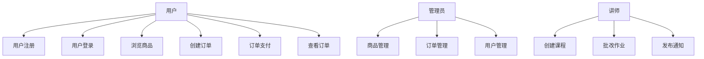

#### 用例详细描述
```
用例：创建订单
参与者：用户
前置条件：用户已登录，购物车中有商品
后置条件：订单创建成功，库存预扣
主流程：
1. 用户进入购物车页面
2. 系统显示购物车中的商品信息
3. 用户选择商品并确认
4. 系统检查商品库存
5. 用户输入收货地址
6. 用户选择优惠券（可选）
7. 系统计算订单总价
8. 用户确认订单信息
9. 系统创建订单
10. 系统预扣库存
11. 系统返回订单创建结果
```

### 3. 领域建模工具

#### 类图工具
推荐使用PlantUML、Draw.io、StarUML等工具绘制领域模型类图

#### 词汇表管理
使用Confluence、Notion等工具维护团队统一的术语词典

#### 建模方法对比

| 方法 | 优点 | 缺点 | 适用场景 |
|------|------|------|----------|
| 事件风暴 | 协作性强、快速发现核心概念 | 需要多方参与、依赖引导者 | 新项目、复杂业务 |
| 四色建模 | 系统性强、覆盖全面 | 学习成本高、容易过度设计 | 中大型项目 |
| 用例分析 | 需求导向、易于理解 | 容易遗漏隐式需求 | 需求明确的场景 |

## 四、持续演进和迭代

### 1. 建模迭代

#### 初始模型 -> 演进模型

**初始模型**
```java
// 简单的订单模型
public class Order {
    private Long id;
    private String items;
    private Money amount;
    private String status;
}
```

**演进模型**
```java
// 丰富的订单模型
public class Order {
    private OrderId id;
    private UserId userId;
    private List<OrderItem> items;
    private Address shippingAddress;
    private Address billingAddress;
    private Money totalAmount;
    private Money discountAmount;
    private OrderStatus status;
    private List<OrderEvent> events;
    private LocalDateTime createTime;
    private LocalDateTime updateTime;
}
```

### 2. 模型验证和调整

#### 验证方法
1. **业务场景验证**：用实际业务场景测试模型的完整性
2. **一致性检查**：确保模型与统一语言的一致性
3. **性能评估**：评估模型对系统性能的影响
4. **可测试性评估**：验证模型是否易于单元测试

#### 调整策略
- **聚合拆分**：当一个聚合变得过于复杂时，考虑拆分
- **值对象提取**：将常用的属性组合提取为值对象
- **服务重构**：随着业务变化，重构领域服务的职责

### 3. 团队协作

#### 角色分工
- **领域专家**：提供业务知识，验证模型正确性
- **架构师**：负责整体架构设计和技术决策
- **开发工程师**：实现模型，反馈技术难点
- **产品经理**：协调需求，确保模型满足业务需求

#### 协作流程
1. **建模会议**：定期举行领域建模讨论会
2. **代码评审**：确保实现与模型一致
3. **文档维护**：保持模型文档和代码的同步
4. **知识分享**：定期分享DDD经验和最佳实践

## 五、设计检查清单

### 战略设计检查
- [ ] 是否明确了业务价值和核心域？
- [ ] 是否建立了完整的统一语言？
- [ ] 事件风暴是否识别了所有关键概念？
- [ ] 界限上下文划分是否合理？
- [ ] 上下文映射关系是否清晰？

### 战术设计检查
- [ ] 聚合设计是否遵循单一聚合原则？
- [ ] 实体和值对象的职责是否明确？
- [ ] 领域服务是否避免了业务逻辑泄露？
- [ ] 模型是否与统一语言保持一致？
- [ ] 模型是否易于理解和维护？

### 实现检查
- [ ] 代码结构是否符合分层架构？
- [ ] 聚合边界是否得到维护？
- [ ] 事务边界是否合理？
- [ ] 测试覆盖率是否充足？
- [ ] 性能是否满足要求？

通过系统性的设计过程和方法，我们可以构建出**反映业务真实需求、易于维护和演进**的DDD系统。

# DDD实践案例

## 概述

通过完整的案例来展示DDD的实际应用，从业务需求分析到代码实现的完整过程。本文以"在线教育平台"为例，展示DDD的实践过程和项目结构。

## 一、案例背景：在线教育平台

### 业务概述
在线教育平台是一个综合性学习平台，支持多种学习模式：
- **课程管理**：讲师创建和管理课程
- **学员管理**：学员注册、报名、学习
- **班级管理**：开班、学员分配、进度跟踪
- **作业系统**：作业布置、提交、批改
- **成绩管理**：成绩统计、成绩分析
- **支付系统**：课程购买、优惠券、支付

### 核心价值
- 为讲师提供教学内容管理工具
- 为学员提供个性化学习体验
- 为平台提供运营和盈利能力

## 二、战略设计过程

### 1. 子域划分

#### 核心域（Core Domain）
**课程学习域**：平台的差异化竞争力
- 课程内容和结构设计
- 学习路径规划
- 智能推荐算法
- 学习效果评估

#### 支撑域（Supporting Domain）
**班级管理域**：必要的支撑功能
- 班级开班和管理
- 学员分配和进度跟踪
- 学习计划制定

**作业成绩域**：教学质量管理
- 作业管理和批改
- 成绩统计和分析
- 学习质量监控

#### 通用域（Generic Domain）
**用户管理域**：通用功能，可购买方案
- 用户注册和认证
- 权限管理
- 用户资料管理

**支付财务域**：标准财务功能
- 支付处理
- 财务对账
- 优惠券管理

### 2. 界限上下文划分

#### 上下文映射图

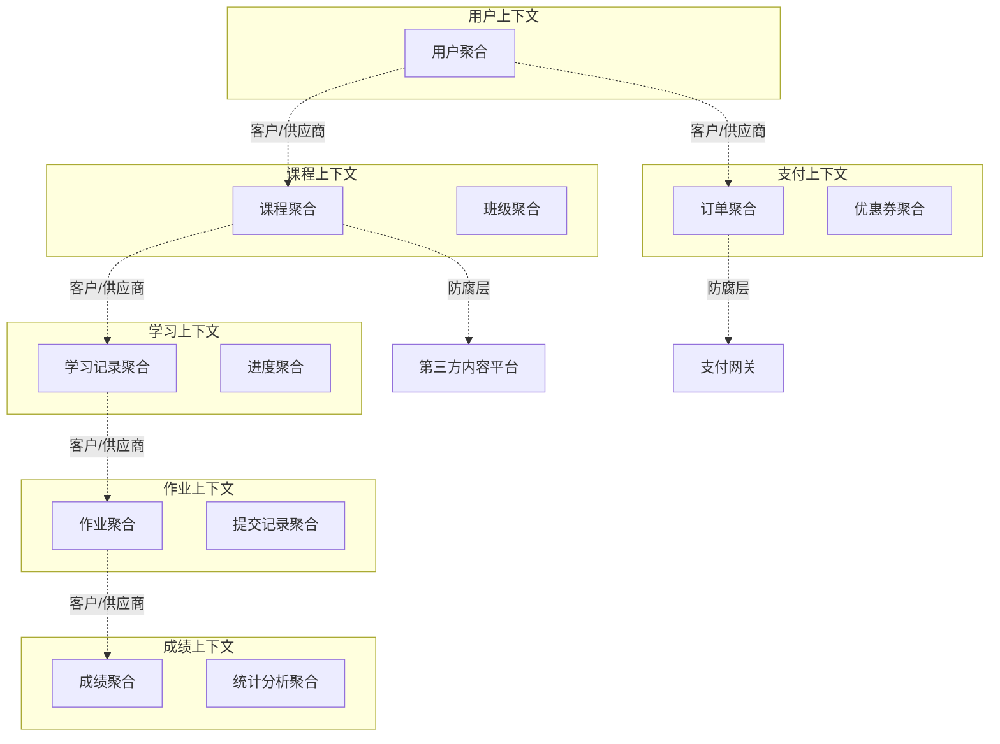

### 3. 统一语言建立

#### 术语词典
```
课程（Course）：教学内容的完整单元，包含多个章节和学习材料
- 包含：课程标题、描述、价格、时长、难度等级
- 行为：发布、下架、修改内容、定价

班级（Class）：课程的具体实现形式，有固定的开班时间
- 包含：班级编号、开班时间、结束时间、讲师、学员列表
- 行为：开班、分配学员、记录考勤、结束班级

学员（Student）：平台的学习者角色
- 包含：学员ID、学习进度、成绩记录、学习偏好
- 行为：报名、学习、提交作业、查看成绩

讲师（Teacher）：平台的授课者角色
- 包含：讲师ID、专业领域、教学经验、评价
- 行为：创建课程、批改作业、发布通知

学习进度（Progress）：学员在班级中的学习状态
- 包含：当前章节、完成度、学习时长、最后活跃时间
- 行为：更新进度、记录学习时长、计算完成度

作业（Homework）：讲师布置的学习任务
- 包含：作业标题、内容、截止时间、评分标准
- 行为：发布、批改、统计分析
```

## 三、战术设计：领域模型

### 1. 课程上下文模型

#### 课程聚合根
```java
@Entity
public class Course {
    private CourseId id;
    private String title;
    private String description;
    private Money price;
    private Duration duration;
    private DifficultyLevel difficulty;
    private CourseStatus status;
    private List<Chapter> chapters;
    private TeacherId teacherId;
    private String categoryId;
    private List<CourseTag> tags;
    private LocalDateTime createTime;
    private LocalDateTime updateTime;

    // 私有构造器
    private Course(CourseId id, String title, String description, TeacherId teacherId) {
        this.id = Objects.requireNonNull(id);
        this.title = Objects.requireNonNull(title);
        this.description = Objects.requireNonNull(description);
        this.teacherId = Objects.requireNonNull(teacherId);
        this.status = CourseStatus.DRAFT;
        this.chapters = new ArrayList<>();
        this.tags = new ArrayList<>();
        this.createTime = LocalDateTime.now();
        this.validateTitle(title);
        this.validateDescription(description);
    }

    // 工厂方法
    public static Course create(String title, String description, TeacherId teacherId) {
        return new Course(CourseId.generate(), title, description, teacherId);
    }

    // 添加章节
    public void addChapter(String chapterTitle, String content, int sortOrder) {
        if (status != CourseStatus.DRAFT) {
            throw new DomainException("只有草稿状态才能添加章节");
        }

        if (chapters.stream().anyMatch(c -> c.getSortOrder() == sortOrder)) {
            throw new DomainException("章节排序号已存在: " + sortOrder);
        }

        Chapter chapter = new Chapter(chapterTitle, content, sortOrder);
        chapters.add(chapter);
        this.updateTime = LocalDateTime.now();
    }

    // 删除章节
    public void removeChapter(ChapterId chapterId) {
        if (status != CourseStatus.DRAFT) {
            throw new DomainException("只有草稿状态才能删除章节");
        }

        chapters.removeIf(chapter -> chapter.getId().equals(chapterId));
        this.updateTime = LocalDateTime.now();
    }

    // 更新章节
    public void updateChapter(ChapterId chapterId, String title, String content) {
        if (status != CourseStatus.DRAFT) {
            throw new DomainException("只有草稿状态才能更新章节");
        }

        chapters.stream()
            .filter(chapter -> chapter.getId().equals(chapterId))
            .findFirst()
            .ifPresent(chapter -> {
                chapter.updateContent(title, content);
                this.updateTime = LocalDateTime.now();
            });
    }

    // 发布课程
    public void publish() {
        if (status != CourseStatus.DRAFT) {
            throw new DomainException("只有草稿状态才能发布");
        }

        if (chapters.isEmpty()) {
            throw new DomainException("发布课程必须包含至少一个章节");
        }

        if (price == null || price.lessThanOrEqual(Money.ZERO)) {
            throw new DomainException("发布课程必须设置有效价格");
        }

        this.status = CourseStatus.PUBLISHED;
        this.updateTime = LocalDateTime.now();

        // 记录领域事件
        DomainEventPublisher.publish(new CoursePublishedEvent(id, title, teacherId));
    }

    // 设置价格
    public void setPrice(Money price) {
        if (price == null || price.lessThan(Money.ZERO)) {
            throw new DomainException("课程价格不能为负数");
        }

        if (status == CourseStatus.PUBLISHED && !this.price.equals(price)) {
            // 已发布的课程调价需要特殊处理
            DomainEventPublisher.publish(new CoursePriceChangedEvent(id, this.price, price));
        }

        this.price = price;
        this.updateTime = LocalDateTime.now();
    }

    // 下架课程
    public void unpublish() {
        if (status != CourseStatus.PUBLISHED) {
            throw new DomainException("只有已发布的课程才能下架");
        }

        this.status = CourseStatus.UNPUBLISHED;
        this.updateTime = LocalDateTime.now();

        DomainEventPublisher.publish(new CourseUnpublishedEvent(id, title, teacherId));
    }

    // 计算课程时长
    public Duration calculateDuration() {
        return chapters.stream()
            .map(Chapter::getEstimatedDuration)
            .reduce(Duration.ZERO, Duration::plus);
    }

    // 验证课程内容完整性
    public boolean isComplete() {
        return !chapters.isEmpty() &&
               title != null && !title.trim().isEmpty() &&
               description != null && !description.trim().isEmpty() &&
               price != null && price.greaterThan(Money.ZERO);
    }

    // 私有校验方法
    private void validateTitle(String title) {
        if (title == null || title.trim().isEmpty()) {
            throw new DomainException("课程标题不能为空");
        }
        if (title.length() > 100) {
            throw new DomainException("课程标题不能超过100个字符");
        }
    }

    private void validateDescription(String description) {
        if (description == null || description.trim().isEmpty()) {
            throw new DomainException("课程描述不能为空");
        }
        if (description.length() > 5000) {
            throw new DomainException("课程描述不能超过5000个字符");
        }
    }

    // Getter方法
    public CourseId getId() { return id; }
    public String getTitle() { return title; }
    public String getDescription() { return description; }
    public Money getPrice() { return price; }
    public CourseStatus getStatus() { return status; }
    public List<Chapter> getChapters() { return Collections.unmodifiableList(chapters); }
    public TeacherId getTeacherId() { return teacherId; }
}
```

#### 章节实体
```java
public class Chapter {
    private ChapterId id;
    private String title;
    private String content;
    private Duration estimatedDuration;
    private int sortOrder;
    private List<LearningResource> resources;

    Chapter(String title, String content, int sortOrder) {
        this.id = ChapterId.generate();
        this.title = Objects.requireNonNull(title);
        this.content = Objects.requireNonNull(content);
        this.sortOrder = sortOrder;
        this.resources = new ArrayList<>();
        this.estimatedDuration = estimateDuration(content);
        validateChapter(title, content);
    }

    void updateContent(String title, String content) {
        this.title = Objects.requireNonNull(title);
        this.content = Objects.requireNonNull(content);
        this.estimatedDuration = estimateDuration(content);
        validateChapter(title, content);
    }

    void addResource(String resourceUrl, ResourceType type) {
        LearningResource resource = new LearningResource(resourceUrl, type);
        this.resources.add(resource);
    }

    private Duration estimateDuration(String content) {
        // 简单估算：假设每1000字需要15分钟
        int wordCount = content.split("\\s+").length;
        return Duration.ofMinutes((long) Math.ceil(wordCount * 15.0 / 1000));
    }

    private void validateChapter(String title, String content) {
        if (title.trim().isEmpty()) {
            throw new DomainException("章节标题不能为空");
        }
        if (content.trim().isEmpty()) {
            throw new DomainException("章节内容不能为空");
        }
    }

    // Getter方法
    public ChapterId getId() { return id; }
    public String getTitle() { return title; }
    public String getContent() { return content; }
    public Duration getEstimatedDuration() { return estimatedDuration; }
    public int getSortOrder() { return sortOrder; }
    public List<LearningResource> getResources() { return Collections.unmodifiableList(resources); }
}
```

### 2. 班级上下文模型

#### 班级聚合根
```java
@Entity
public class SchoolClass {
    private ClassId id;
    private String classCode;
    private CourseId courseId;
    private TeacherId teacherId;
    private ClassStatus status;
    private LocalDateTime startTime;
    private LocalDateTime endTime;
    private int maxStudents;
    private List<StudentEnrollment> enrollments;
    private ClassSchedule schedule;
    private LocalDateTime createTime;
    private LocalDateTime updateTime;

    // 私有构造器
    private SchoolClass(ClassId id, String classCode, CourseId courseId, TeacherId teacherId,
                        LocalDateTime startTime, LocalDateTime endTime, int maxStudents) {
        this.id = Objects.requireNonNull(id);
        this.classCode = Objects.requireNonNull(classCode);
        this.courseId = Objects.requireNonNull(courseId);
        this.teacherId = Objects.requireNonNull(teacherId);
        this.startTime = Objects.requireNonNull(startTime);
        this.endTime = Objects.requireNonNull(endTime);
        this.maxStudents = maxStudents;
        this.status = ClassStatus.PLANNING;
        this.enrollments = new ArrayList<>();
        this.createTime = LocalDateTime.now();
        validateClassParameters(classCode, startTime, endTime, maxStudents);
    }

    // 工厂方法
    public static SchoolClass create(String classCode, CourseId courseId, TeacherId teacherId,
                                     LocalDateTime startTime, LocalDateTime endTime, int maxStudents) {
        return new SchoolClass(
            ClassId.generate(), classCode, courseId, teacherId, startTime, endTime, maxStudents
        );
    }

    // 学员报名
    public void enrollStudent(StudentId studentId, EnrollmentType enrollmentType) {
        if (status != ClassStatus.OPEN_FOR_ENROLLMENT) {
            throw new DomainException("班级当前不接受报名: " + status);
        }

        if (enrollments.size() >= maxStudents) {
            throw new DomainException("班级人数已满");
        }

        if (enrollments.stream().anyMatch(e -> e.getStudentId().equals(studentId))) {
            throw new DomainException("学员已在此班级中: " + studentId);
        }

        StudentEnrollment enrollment = new StudentEnrollment(studentId, enrollmentType, LocalDateTime.now());
        enrollments.add(enrollment);

        // 如果报名人数达到最大值，更新状态
        if (enrollments.size() == maxStudents) {
            this.status = ClassStatus.FULL;
        }

        // 记录事件
        DomainEventPublisher.publish(new StudentEnrolledEvent(id, studentId, classCode));

        this.updateTime = LocalDateTime.now();
    }

    // 取消学员报名
    public void cancelEnrollment(StudentId studentId, String reason) {
        if (status == ClassStatus.COMPLETED || status == ClassStatus.CANCELLED) {
            throw new DomainException("已结束或已取消的班级不能取消报名");
        }

        boolean removed = enrollments.removeIf(enrollment -> enrollment.getStudentId().equals(studentId));
        if (!removed) {
            throw new DomainException("学员不在此班级中: " + studentId);
        }

        // 如果班级已满，重新开放报名
        if (status == ClassStatus.FULL) {
            this.status = ClassStatus.OPEN_FOR_ENROLLMENT;
        }

        // 记录事件
        DomainEventPublisher.publish(new EnrollmentCancelledEvent(id, studentId, reason));

        this.updateTime = LocalDateTime.now();
    }

    // 开始班级
    public void startClass() {
        if (status != ClassStatus.OPEN_FOR_ENROLLMENT && status != ClassStatus.FULL) {
            throw new DomainException("只有开放报名或已满的班级才能开始");
        }

        if (LocalDateTime.now().isBefore(startTime)) {
            throw new DomainException("班级还未到开始时间");
        }

        if (enrollments.isEmpty()) {
            throw new DomainException("没有学员报名的班级不能开始");
        }

        this.status = ClassStatus.IN_PROGRESS;

        // 初始化所有学员的学习进度
        for (StudentEnrollment enrollment : enrollments) {
            DomainEventPublisher.publish(new ClassStartedEvent(
                id, courseId, enrollment.getStudentId(), startTime
            ));
        }

        this.updateTime = LocalDateTime.now();
    }

    // 结束班级
    public void endClass() {
        if (status != ClassStatus.IN_PROGRESS) {
            throw new DomainException("只有进行中的班级才能结束");
        }

        if (LocalDateTime.now().isBefore(endTime)) {
            throw new DomainException("班级还未到结束时间");
        }

        this.status = ClassStatus.COMPLETED;

        // 发布班级结束事件
        DomainEventPublisher.publish(new ClassCompletedEvent(
            id, courseId, teacherId, enrollments.size(), LocalDateTime.now()
        ));

        this.updateTime = LocalDateTime.now();
    }

    // 取消班级
    public void cancelClass(String reason) {
        if (status == ClassStatus.COMPLETED || status == ClassStatus.CANCELLED) {
            throw new DomainException("已结束或已取消的班级不能再次取消");
        }

        this.status = ClassStatus.CANCELLED;

        // 通知所有学员班级取消
        for (StudentEnrollment enrollment : enrollments) {
            DomainEventPublisher.publish(new ClassCancelledEvent(
                id, courseId, enrollment.getStudentId(), reason
            ));
        }

        this.updateTime = LocalDateTime.now();
    }

    // 更新班级时间
    public void updateSchedule(LocalDateTime newStartTime, LocalDateTime newEndTime) {
        if (status == ClassStatus.IN_PROGRESS || status == ClassStatus.COMPLETED) {
            throw new DomainException("进行中或已完成的班级不能更新时间安排");
        }

        validateScheduleChange(newStartTime, newEndTime);

        this.startTime = newStartTime;
        this.endTime = newEndTime;

        // 记录时间变更事件
        DomainEventPublisher.publish(new ScheduleUpdatedEvent(
            id, startTime, newStartTime, endTime, newEndTime
        ));

        this.updateTime = LocalDateTime.now();
    }

    // 获取班级统计信息
    public ClassStatistics getStatistics() {
        int enrolledCount = enrollments.size();
        int activeCount = (int) enrollments.stream()
            .filter(e -> e.isActive())
            .count();

        return ClassStatistics.builder()
            .classId(id)
            .classCode(classCode)
            .enrolledCount(enrolledCount)
            .activeCount(activeCount)
            .availableSpots(maxStudents - enrolledCount)
            .status(status)
            .startTime(startTime)
            .endTime(endTime)
            .build();
    }

    // 检查学员是否在班级中
    public boolean hasStudent(StudentId studentId) {
        return enrollments.stream()
            .anyMatch(enrollment -> enrollment.getStudentId().equals(studentId));
    }

    // 获取活跃学员数量
    public int getActiveStudentCount() {
        return (int) enrollments.stream()
            .filter(StudentEnrollment::isActive)
            .count();
    }

    // 检查班级是否可以接受报名
    public boolean canEnroll() {
        return status == ClassStatus.OPEN_FOR_ENROLLMENT && enrollments.size() < maxStudents;
    }

    // 私有校验方法
    private void validateClassParameters(String classCode, LocalDateTime startTime,
                                       LocalDateTime endTime, int maxStudents) {
        if (classCode == null || classCode.trim().isEmpty()) {
            throw new DomainException("班级编码不能为空");
        }
        if (!classCode.matches("^[A-Z0-9]{6,12}$")) {
            throw new DomainException("班级编码格式不正确");
        }
        if (startTime.isAfter(endTime)) {
            throw new DomainException("开始时间不能晚于结束时间");
        }
        if (maxStudents <= 0 || maxStudents > 200) {
            throw new DomainException("班级人数限制必须在1-200之间");
        }
    }

    private void validateScheduleChange(LocalDateTime newStartTime, LocalDateTime newEndTime) {
        if (newStartTime.isAfter(newEndTime)) {
            throw new DomainException("新的开始时间不能晚于结束时间");
        }
        if (LocalDateTime.now().isAfter(newStartTime)) {
            throw new DomainException("不能将开始时间设置为过去的时间");
        }
    }

    // Getter方法
    public ClassId getId() { return id; }
    public String getClassCode() { return classCode; }
    public CourseId getCourseId() { return courseId; }
    public TeacherId getTeacherId() { return teacherId; }
    public ClassStatus getStatus() { return status; }
    public LocalDateTime getStartTime() { return startTime; }
    public LocalDateTime getEndTime() { return endTime; }
    public int getMaxStudents() { return maxStudents; }
    public List<StudentEnrollment> getEnrollments() { return Collections.unmodifiableList(enrollments); }
    public LocalDateTime getCreateTime() { return createTime; }
}
```

### 3. 学习上下文模型

#### 学习进度聚合根
```java
@Entity
public class LearningProgress {
    private ProgressId id;
    private StudentId studentId;
    private ClassId classId;
    private CourseId courseId;
    private List<ChapterProgress> chapterProgresses;
    private Duration totalLearningTime;
    private LocalDate lastActiveDate;
    private ProgressStatus status;
    private Money amountPaid;
    private LocalDateTime createTime;
    private LocalDateTime updateTime;

    // 私有构造器
    private LearningProgress(ProgressId id, StudentId studentId, ClassId classId, CourseId courseId) {
        this.id = Objects.requireNonNull(id);
        this.studentId = Objects.requireNonNull(studentId);
        this.classId = Objects.requireNonNull(classId);
        this.courseId = Objects.requireNonNull(courseId);
        this.chapterProgresses = new ArrayList<>();
        this.totalLearningTime = Duration.ZERO;
        this.lastActiveDate = LocalDate.now();
        this.status = ProgressStatus.NOT_STARTED;
        this.amountPaid = Money.ZERO;
        this.createTime = LocalDateTime.now();
    }

    // 工厂方法 - 学员开始学习时创建
    public static LearningProgress start(StudentId studentId, ClassId classId, CourseId courseId) {
        LearningProgress progress = new LearningProgress(
            ProgressId.generate(), studentId, classId, courseId
        );

        progress.status = ProgressStatus.IN_PROGRESS;
        DomainEventPublisher.publish(new LearningStartedEvent(progress.id, studentId, classId));

        return progress;
    }

    // 开始学习章节
    public void startChapter(ChapterId chapterId) {
        ChapterProgress chapterProgress = findOrCreateChapterProgress(chapterId);

        if (chapterProgress.getStatus() != ChapterProgressStatus.NOT_STARTED) {
            return; // 已经开始或完成
        }

        chapterProgress.start();
        updateOverallProgress();
        updateLastActiveDate();

        DomainEventPublisher.publish(new ChapterStartedEvent(
            id, studentId, classId, chapterId
        ));

        this.updateTime = LocalDateTime.now();
    }

    // 完成章节学习
    public void completeChapter(ChapterId chapterId, Duration learningTime) {
        ChapterProgress chapterProgress = findChapterProgress(chapterId)
            .orElseThrow(() -> new DomainException("章节进度不存在: " + chapterId));

        if (chapterProgress.getStatus() == ChapterProgressStatus.COMPLETED) {
            return; // 已经完成
        }

        chapterProgress.complete(learningTime);
        this.totalLearningTime = this.totalLearningTime.add(learningTime);
        updateOverallProgress();
        updateLastActiveDate();

        DomainEventPublisher.publish(new ChapterCompletedEvent(
            id, studentId, classId, chapterId, learningTime
        ));

        // 检查是否完成整个课程
        if (isAllChaptersCompleted()) {
            completeCourse();
        }

        this.updateTime = LocalDateTime.now();
    }

    // 记录学习时间
    public void recordLearningTime(ChapterId chapterId, Duration learningTime) {
        ChapterProgress chapterProgress = findChapterProgress(chapterId)
            .orElseThrow(() -> new DomainException("章节进度不存在: " + chapterId));

        chapterProgress.addLearningTime(learningTime);
        this.totalLearningTime = this.totalLearningTime.add(learningTime);
        updateLastActiveDate();

        this.updateTime = LocalDateTime.now();
    }

    // 完成整个课程学习
    private void completeCourse() {
        this.status = ProgressStatus.COMPLETED;

        DomainEventPublisher.publish(new CourseCompletedEvent(
            id, studentId, classId, courseId, totalLearningTime, LocalDateTime.now()
        ));
    }

    // 暂停学习
    public void pause() {
        if (status == ProgressStatus.COMPLETED) {
            throw new DomainException("已完成的学习进度不能暂停");
        }

        this.status = ProgressStatus.PAUSED;

        DomainEventPublisher.publish(new LearningPausedEvent(
            id, studentId, classId
        ));

        this.updateTime = LocalDateTime.now();
    }

    // 恢复学习
    public void resume() {
        if (status != ProgressStatus.PAUSED) {
            throw new DomainException("只有暂停的学习进度才能恢复");
        }

        this.status = ProgressStatus.IN_PROGRESS;
        updateLastActiveDate();

        DomainEventPublisher.publish(new LearningResumedEvent(
            id, studentId, classId
        ));

        this.updateTime = LocalDateTime.now();
    }

    // 更新支付状态
    public void markAsPaid(Money amount) {
        if (amount == null || amount.lessThanOrEqual(Money.ZERO)) {
            throw new DomainException("支付金额必须大于零");
        }

        this.amountPaid = this.amountPaid.add(amount);

        DomainEventPublisher.publish(new PaymentRecordedEvent(
            id, studentId, classId, amount, this.amountPaid
        ));

        this.updateTime = LocalDateTime.now();
    }

    // 获取完成度百分比
    public double getCompletionPercentage() {
        if (chapterProgresses.isEmpty()) {
            return 0.0;
        }

        long completedChapters = chapterProgresses.stream()
            .filter(cp -> cp.getStatus() == ChapterProgressStatus.COMPLETED)
            .count();

        return (double) completedChapters / chapterProgresses.size() * 100;
    }

    // 获取学习统计
    public LearningStatistics getStatistics() {
        int totalChapters = chapterProgresses.size();
        long completedChapters = chapterProgresses.stream()
            .filter(cp -> cp.getStatus() == ChapterProgressStatus.COMPLETED)
            .count();
        long inProgressChapters = chapterProgresses.stream()
            .filter(cp -> cp.getStatus() == ChapterProgressStatus.IN_PROGRESS)
            .count();

        return LearningStatistics.builder()
            .progressId(id)
            .studentId(studentId)
            .classId(classId)
            .courseId(courseId)
            .status(status)
            .completionPercentage(getCompletionPercentage())
            .totalChapters(totalChapters)
            .completedChapters((int) completedChapters)
            .inProgressChapters((int) inProgressChapters)
            .totalLearningTime(totalLearningTime)
            .lastActiveDate(lastActiveDate)
            .isPaid(amountPaid.greaterThan(Money.ZERO))
            .build();
    }

    // 检查是否所有章节都已完成
    private boolean isAllChaptersCompleted() {
        return chapterProgresses.stream()
            .allMatch(cp -> cp.getStatus() == ChapterProgressStatus.COMPLETED);
    }

    // 查找或创建章节进度
    private ChapterProgress findOrCreateChapterProgress(ChapterId chapterId) {
        return chapterProgresses.stream()
            .filter(cp -> cp.getChapterId().equals(chapterId))
            .findFirst()
            .orElseGet(() -> {
                ChapterProgress newProgress = new ChapterProgress(chapterId);
                chapterProgresses.add(newProgress);
                return newProgress;
            });
    }

    // 查找章节进度
    private Optional<ChapterProgress> findChapterProgress(ChapterId chapterId) {
        return chapterProgresses.stream()
            .filter(cp -> cp.getChapterId().equals(chapterId))
            .findFirst();
    }

    // 更新整体进度状态
    private void updateOverallProgress() {
        long completedCount = chapterProgresses.stream()
            .filter(cp -> cp.getStatus() == ChapterProgressStatus.COMPLETED)
            .count();

        if (completedCount == 0) {
            this.status = ProgressStatus.IN_PROGRESS;
        } else if (completedCount == chapterProgresses.size()) {
            completeCourse();
        } else {
            this.status = ProgressStatus.IN_PROGRESS;
        }
    }

    // 更新最后活跃日期
    private void updateLastActiveDate() {
        this.lastActiveDate = LocalDate.now();
    }

    // Getter方法
    public ProgressId getId() { return id; }
    public StudentId getStudentId() { return studentId; }
    public ClassId getClassId() { return classId; }
    public ProgressStatus getStatus() { return status; }
    public Duration getTotalLearningTime() { return totalLearningTime; }
    public LocalDate getLastActiveDate() { return lastActiveDate; }
    public Money getAmountPaid() { return amountPaid; }
    public List<ChapterProgress> getChapterProgresses() {
        return Collections.unmodifiableList(chapterProgresses);
    }
}
```

## 四、项目结构设计

### 完整的DDD项目结构

```
online-education-platform/
├── README.md
├── docker-compose.yml
├── pom.xml
│
├── user-service/                      # 用户微服务
│   ├── src/
│   │   └── main/
│   │       ├── java/
│   │       │   └── com/education/user/
│   │       │       ├── UserApplication.java
│   │       │       ├── domain/                  # 领域层
│   │       │       │   ├── user/
│   │       │       │   │   ├── User.java         # 实体/聚合根
│   │       │       │   │   ├── UserId.java       # 值对象
│   │       │       │   │   ├── UserProfile.java  # 值对象
│   │       │       │   │   ├── Email.java       # 值对象
│   │       │       │   │   ├── UserRepository.java    # 仓储接口
│   │       │       │   │   └── UserDomainService.java # 领域服务
│   │       │       │   └── shared/              # 共享内核
│   │       │       │       ├── valueobject/
│   │       │       │       │   ├── Money.java
│   │       │       │       │   └── PhoneNumber.java
│   │       │       │       └── event/
│   │       │       │           └── DomainEvent.java
│   │       │       ├── application/             # 应用层
│   │       │       │   ├── UserApplicationService.java
│   │       │       │   ├── command/
│   │       │       │   │   ├── RegisterUserCommand.java
│   │       │       │   │   └── UpdateUserCommand.java
│   │       │       │   ├── query/
│   │       │       │   │   ├── GetUserDetailQuery.java
│   │       │       │   │   └── UserDetailDTO.java
│   │       │       │   └── service/
│   │       │       │       └── UserQueryService.java
│   │       │       ├── infrastructure/           # 基础设施层
│   │       │       │   ├── repository/
│   │       │       │   │   └── UserRepositoryImpl.java
│   │       │       │   ├── adapter/
│   │       │       │   │   ├── EmailAdapter.java
│   │       │       │   │   └── SmsAdapter.java
│   │       │       │   └── config/
│   │       │       │       ├── DatabaseConfig.java
│   │       │       │       └── RedisConfig.java
│   │       │       └── interfaces/              # 接口层
│   │       │           ├── UserController.java
│   │       │           ├── UserEventListener.java
│   │       │           └── dto/
│   │       │               ├── RegisterRequest.java
│   │       │               └── UserResponse.java
│   │       └── resources/
│   │           ├── application.yml
│   │           └── db/migration/
│   │               └── V1__Create_user_tables.sql
│   └── Dockerfile
│
├── course-service/                    # 课程微服务
│   ├── src/
│   │   └── main/
│   │       ├── java/
│   │       │   └── com/education/course/
│   │       │       ├── CourseApplication.java
│   │       │       ├── domain/
│   │       │       │   ├── course/
│   │       │       │   │   ├── Course.java
│   │       │       │   │   ├── Chapter.java
│   │       │       │   │   ├── LearningResource.java
│   │       │       │   │   ├── CourseRepository.java
│   │       │       │   │   └── CourseDomainService.java
│   │       │       │   └── teacher/
│   │       │       │       ├── Teacher.java
│   │       │       │       ├── TeacherRepository.java
│   │       │       │       └── TeacherDomainService.java
│   │       │       ├── application/
│   │       │       │   ├── CourseApplicationService.java
│   │       │       │   ├── TeacherApplicationService.java
│   │       │       │   └── command/
│   │       │       │       ├── CreateCourseCommand.java
│   │       │       │       ├── PublishCourseCommand.java
│   │       │       │       └── AddChapterCommand.java
│   │       │       ├── infrastructure/
│   │       │       │   ├── repository/
│   │       │       │   │   ├── CourseRepositoryImpl.java
│   │       │       │   │   └── TeacherRepositoryImpl.java
│   │       │       │   ├── adapter/
│   │       │       │   │   ├── FileStorageAdapter.java
│   │       │       │   │   └── ContentReviewAdapter.java
│   │       │       │   └── search/
│   │       │       │       └── CourseSearchService.java
│   │       │       └── interfaces/
│   │       │           ├── CourseController.java
│   │       │           ├── TeacherController.java
│   │       │           └── dto/
│   │       │               ├── CourseDTO.java
│   │       │               ├── ChapterDTO.java
│   │       │               └── TeacherDTO.java
│   │       └── resources/
│   │           ├── application.yml
│   │           └── db/migration/
│   │               └── V1__Create_course_tables.sql
│   └── Dockerfile
│
├── class-service/                     # 班级微服务
│   ├── src/
│   │   └── main/
│   │       ├── java/
│   │       │   └── com/education/class/
│   │       │       ├── ClassApplication.java
│   │       │       ├── domain/
│   │       │       │   ├── schoolclass/
│   │       │       │   │   ├── SchoolClass.java
│   │       │       │   │   ├── StudentEnrollment.java
│   │       │       │   │   ├── ClassSchedule.java
│   │       │       │   │   ├── ClassRepository.java
│   │       │       │   │   └── ClassDomainService.java
│   │       │       │   └── enrollment/
│   │       │       │       ├── Enrollment.java
│   │       │       │       └── EnrollmentPolicy.java
│   │       │       ├── application/
│   │       │       │   ├── ClassApplicationService.java
│   │       │       │   ├── EnrollmentApplicationService.java
│   │       │       │   └── command/
│   │       │       │       ├── CreateClassCommand.java
│   │       │       │       ├── EnrollStudentCommand.java
│   │       │       │       └── StartClassCommand.java
│   │       │       ├── infrastructure/
│   │       │       │   ├── repository/
│   │       │       │   │   └── ClassRepositoryImpl.java
│   │       │       │   └── adapter/
│   │       │       │   │   ├── NotificationAdapter.java
│   │       │       │   │   └── CalendarIntegrationAdapter.java
│   │       │       └── interfaces/
│   │       │           ├── ClassController.java
│   │       │           ├── EnrollmentController.java
│   │       │           └── dto/
│   │       │               ├── ClassDTO.java
│   │       │               └── EnrollmentDTO.java
│   │       └── resources/
│   │           ├── application.yml
│   │           └── db/migration/
│   │               └── V1__Create_class_tables.sql
│   └── Dockerfile
│
├── learning-service/                  # 学习微服务
│   ├── src/
│   │   └── main/
│   │       ├── java/
│   │       │   └── com/education/learning/
│   │       │       ├── LearningApplication.java
│   │       │       ├── domain/
│   │       │       │   ├── progress/
│   │       │       │   │   ├── LearningProgress.java
│   │       │       │   │   ├── ChapterProgress.java
│   │       │       │   │   ├── LearningStatistics.java
│   │       │       │   │   ├── ProgressRepository.java
│   │       │       │   │   └── ProgressDomainService.java
│   │       │       │   └── study/
│   │       │       │       ├── StudyRecord.java
│   │       │       │       └── StudySession.java
│   │       │       ├── application/
│   │       │       │   ├── ProgressApplicationService.java
│   │       │       │   ├── command/
│   │       │       │   │   ├── StartChapterCommand.java
│   │       │       │   │   ├── CompleteChapterCommand.java
│   │       │       │   │   └── RecordStudyTimeCommand.java
│   │       │       │   └── query/
│   │       │       │       ├── GetProgressQuery.java
│   │       │       │       └── ProgressDTO.java
│   │       │       ├── infrastructure/
│   │       │       │   ├── repository/
│   │       │       │   │   └── ProgressRepositoryImpl.java
│   │       │       │   ├── adapter/
│   │       │       │   │   ├── AnalyticsAdapter.java
│   │       │       │   │   └── RecommendationAdapter.java
│   │       │       │   └── cache/
│   │       │       │       └── ProgressCacheService.java
│   │       │       └── interfaces/
│   │       │           ├── ProgressController.java
│   │       │           └── StudyController.java
│   │       └── resources/
│   │           ├── application.yml
│   │           └── db/migration/
│   │               └── V1__Create_learning_tables.sql
│   └── Dockerfile
│
├── homework-service/                   # 作业微服务
│   └── ... (类似结构)
│
├── payment-service/                    # 支付微服务
│   └── ... (类似结构)
│
├── api-gateway/                        # API网关
│   ├── src/
│   │   └── main/
│   │       ├── java/
│   │       │   └── com/education/gateway/
│   │       │       ├── GatewayApplication.java
│   │       │       ├── config/
│   │       │       │   ├── GatewayConfig.java
│   │       │       │   ├── SecurityConfig.java
│   │       │       │   └── CorsConfig.java
│   │       │       ├── filter/
│   │       │       │   ├── AuthenticationFilter.java
│   │       │       │   ├── RateLimitingFilter.java
│   │       │       │   └── LoggingFilter.java
│   │       │       └── exception/
│   │       │           └── GlobalExceptionHandler.java
│   │       └── resources/
│   │           └── application.yml
│   └── Dockerfile
│
├── shared-kernel/                      # 共享内核
│   ├── src/
│   │   └── main/
│   │       ├── java/
│   │       │   └── com/education/shared/
│   │       │       ├── domain/
│   │       │       │   ├── valueobject/
│   │       │       │   │   ├── Money.java
│   │       │       │   │   ├── Email.java
│   │       │       │   │   ├── PhoneNumber.java
│   │       │       │   │   └── Address.java
│   │       │       │   ├── event/
│   │       │       │   │   ├── DomainEvent.java
│   │       │       │   │   ├── DomainEventPublisher.java
│   │       │       │   │   └── DomainEventHandler.java
│   │       │       │   └── exception/
│   │       │       │       ├── DomainException.java
│   │       │       │       └── BusinessException.java
│   │       │       ├── application/
│   │       │       │   ├── command/
│   │       │       │   │   └── Command.java
│   │       │       │   ├── query/
│   │       │       │   │   └── Query.java
│   │       │       │   └── dto/
│   │       │       │       └── BaseDTO.java
│   │       │       ├── infrastructure/
│   │       │       │   ├── messaging/
│   │       │       │   │   ├── KafkaConfig.java
│   │       │       │   │   ├── DomainEventKafkaPublisher.java
│   │       │       │   │   └── MessageTopics.java
│   │       │       │   ├── security/
│   │       │       │   │   ├── JwtTokenProvider.java
│   │       │       │   │   └── PasswordEncoder.java
│   │       │       │   └── validation/
│   │       │       │       └── ValidationUtils.java
│   │       │       └── resources/
│   │       └── pom.xml
│
└── deployment/                         # 部署配置
    ├── kubernetes/
    │   ├── namespace.yaml
    │   ├── configmap.yaml
    │   ├── secret.yaml
    │   ├── user-service-deployment.yaml
    │   ├── course-service-deployment.yaml
    │   ├── class-service-deployment.yaml
    │   ├── learning-service-deployment.yaml
    │   ├── api-gateway-deployment.yaml
    │   └── ingress.yaml
    ├── docker-compose/
    │   └── docker-compose.yml
    └── helm/
        └── online-education/
            ├── Chart.yaml
            ├── values.yaml
            └── templates/
```

## 五、配置和部署

### 1. Docker配置

#### api-gateway Dockerfile
```dockerfile
FROM openjdk:17-jdk-slim

WORKDIR /app

COPY target/api-gateway-*.jar app.jar

EXPOSE 8080

ENTRYPOINT ["java", "-jar", "app.jar"]
```

#### docker-compose.yml
```yaml
version: '3.8'

services:
  api-gateway:
    build: ./api-gateway
    ports:
      - "8080:8080"
    environment:
      - SPRING_PROFILES_ACTIVE=docker
      - EUREKA_CLIENT_SERVICE_URL_DEFAULTZONE=http://eureka-server:8761/eureka
    depends_on:
      - eureka-server
      - user-service
      - course-service
      - class-service
      - learning-service

  user-service:
    build: ./user-service
    environment:
      - SPRING_PROFILES_ACTIVE=docker
      - SPRING_DATASOURCE_URL=jdbc:mysql://mysql:3306/education_user
      - SPRING_REDIS_HOST=redis
    depends_on:
      - mysql
      - redis

  course-service:
    build: ./course-service
    environment:
      - SPRING_PROFILES_ACTIVE=docker
      - SPRING_DATASOURCE_URL=jdbc:mysql://mysql:3306/education_course
      - ELASTICSEARCH_HOST=elasticsearch
    depends_on:
      - mysql
      - elasticsearch

  class-service:
    build: ./class-service
    environment:
      - SPRING_PROFILES_ACTIVE=docker
      - SPRING_DATASOURCE_URL=jdbc:mysql://mysql:3306/education_class
    depends_on:
      - mysql

  learning-service:
    build: ./learning-service
    environment:
      - SPRING_PROFILES_ACTIVE=docker
      - SPRING_DATASOURCE_URL=jdbc:mysql://mysql:3306/education_learning
      - SPRING_REDIS_HOST=redis
    depends_on:
      - mysql
      - redis

  mysql:
    image: mysql:8.0
    environment:
      MYSQL_ROOT_PASSWORD: root123
      MYSQL_DATABASE: education
    ports:
      - "3306:3306"
    volumes:
      - mysql_data:/var/lib/mysql

  redis:
    image: redis:7-alpine
    ports:
      - "6379:6379"

  elasticsearch:
    image: elasticsearch:8.5.0
    environment:
      - discovery.type=single-node
      - xpack.security.enabled=false
    ports:
      - "9200:9200"
    volumes:
      - es_data:/usr/share/elasticsearch/data

  kafka:
    image: confluentinc/cp-kafka:latest
    environment:
      KAFKA_ZOOKEEPER_CONNECT: zookeeper:2181
      KAFKA_ADVERTISED_LISTENERS: PLAINTEXT://kafka:9092
      KAFKA_OFFSETS_TOPIC_REPLICATION_FACTOR: 1
    depends_on:
      - zookeeper
    ports:
      - "9092:9092"

  zookeeper:
    image: confluentinc/cp-zookeeper:latest
    environment:
      ZOOKEEPER_CLIENT_PORT: 2181
      ZOOKEEPER_TICK_TIME: 2000

volumes:
  mysql_data:
  es_data:
```

### 2. Kubernetes配置

#### user-service-deployment.yaml
```yaml
apiVersion: apps/v1
kind: Deployment
metadata:
  name: user-service
  namespace: education
spec:
  replicas: 3
  selector:
    matchLabels:
      app: user-service
  template:
    metadata:
      labels:
        app: user-service
    spec:
      containers:
      - name: user-service
        image: education/user-service:latest
        ports:
        - containerPort: 8081
        env:
        - name: SPRING_PROFILES_ACTIVE
          value: "k8s"
        - name: SPRING_DATASOURCE_URL
          valueFrom:
            configMapKeyRef:
              name: app-config
              key: database.url
        - name: SPRING_DATASOURCE_USERNAME
          valueFrom:
            secretKeyRef:
              name: db-secret
              key: username
        - name: SPRING_DATASOURCE_PASSWORD
          valueFrom:
            secretKeyRef:
              name: db-secret
              key: password
        resources:
          requests:
            memory: "256Mi"
            cpu: "250m"
          limits:
            memory: "512Mi"
            cpu: "500m"
        livenessProbe:
          httpGet:
            path: /actuator/health
            port: 8081
          initialDelaySeconds: 60
          periodSeconds: 10
        readinessProbe:
          httpGet:
            path: /actuator/health
            port: 8081
          initialDelaySeconds: 30
          periodSeconds: 5

---
apiVersion: v1
kind: Service
metadata:
  name: user-service
  namespace: education
spec:
  selector:
    app: user-service
  ports:
  - port: 8081
    targetPort: 8081
  type: ClusterIP
```

## 六、总结

这个在线教育平台的案例展示了：

1. **完整的DDD实践流程**：从业务分析到代码实现
2. **清晰的领域模型设计**：包含实体、值对象、聚合根
3. **合理的微服务拆分**：基于界限上下文的拆分策略
4. **完整的项目结构**：标准的DDD分层架构
5. **现代化的部署方案**：Docker + Kubernetes

通过这个案例，开发者可以：
- 理解DDD在实际项目中的应用
- 学习如何进行领域建模
- 掌握微服务的拆分和设计
- 了解现代化的部署和运维实践

这个案例为DDD的实践提供了一个完整的参考模板。

# DDD实践建议

## 概述

DDD的实践不仅仅是技术问题，更是一个**组织和流程问题**。本文提供DDD实施的全面建议，包括技术实践、团队协作、项目管理等多个维度。

## 一、技术实践建议

### 1. 从战略到战术的实施路径

#### 渐进式实施策略

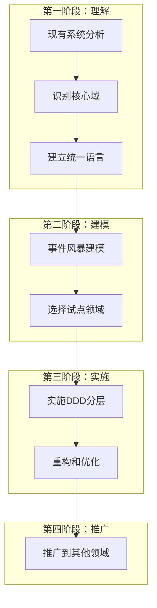

#### 实施步骤详解

**步骤1：现有系统分析**
```java
// 分析现有代码，识别贫血模型
public class BadOrderService {
    public OrderDTO createOrder(CreateOrderDTO dto) {
        // 1. 参数校验
        if (dto.getUserId() == null) {
            throw new IllegalArgumentException("用户ID不能为空");
        }

        // 2. 查询数据
        User user = userRepository.findById(dto.getUserId());
        List<Product> products = productRepository.findByIds(dto.getProductIds());

        // 3. 业务逻辑（全部在服务中）
        OrderDTO orderDTO = new OrderDTO();
        orderDTO.setUserId(dto.getUserId());

        BigDecimal totalAmount = BigDecimal.ZERO;
        for (Product product : products) {
            totalAmount = totalAmount.add(product.getPrice());
            // ... 更多业务逻辑
        }

        orderDTO.setTotalAmount(totalAmount);

        // 4. 保存数据
        Order order = convertToEntity(orderDTO);
        orderRepository.save(order);

        return convertToDTO(order);
    }
}
```

**步骤2：识别重构机会**
```java
// 重构后的充血模型
public class Order {
    private OrderId id;
    private UserId userId;
    private List<OrderItem> items;
    private Money totalAmount;
    private OrderStatus status;

    // 工厂方法
    public static Order create(UserId userId, List<OrderItem> items) {
        if (userId == null) {
            throw new DomainException("用户ID不能为空");
        }
        if (items == null || items.isEmpty()) {
            throw new DomainException("订单项不能为空");
        }

        Order order = new Order();
        order.id = OrderId.generate();
        order.userId = userId;
        order.items = new ArrayList<>(items);
        order.calculateTotalAmount();
        order.status = OrderStatus.PENDING;

        return order;
    }

    // 业务方法
    public void addItem(Product product, int quantity) {
        if (product == null) {
            throw new DomainException("商品不能为空");
        }
        if (quantity <= 0) {
            throw new DomainException("商品数量必须大于0");
        }

        OrderItem item = new OrderItem(product, quantity);
        this.items.add(item);
        calculateTotalAmount();
    }

    public void applyDiscount(Money discount) {
        if (discount == null || discount.lessThanOrEqual(Money.ZERO)) {
            throw new DomainException("折扣金额必须大于0");
        }
        if (discount.greaterThan(totalAmount)) {
            throw new DomainException("折扣金额不能超过订单总价");
        }

        this.totalAmount = this.totalAmount.subtract(discount);
    }

    private void calculateTotalAmount() {
        this.totalAmount = items.stream()
            .map(OrderItem::getSubtotal)
            .reduce(Money.ZERO, Money::add);
    }

    // Getter方法
    public OrderId getId() { return id; }
    public Money getTotalAmount() { return totalAmount; }
    public OrderStatus getStatus() { return status; }
    public List<OrderItem> getItems() { return Collections.unmodifiableList(items); }
}
```

### 2. 聚合设计最佳实践

#### 聚合设计原则

**单一聚合原则**
```java
// 好的设计 - 单一聚合
public class Order {
    private OrderId id;
    private List<OrderItem> items;
    private Money totalAmount;

    // 订单相关的业务逻辑
    public void addItem(Product product, int quantity) { ... }
    public void calculateTotal() { ... }
    public void confirm() { ... }
    public void cancel() { ... }
}

public class Payment {
    private PaymentId id;
    private OrderId orderId;
    private Money amount;

    // 支付相关的业务逻辑
    public void process() { ... }
    public void refund() { ... }
}

// 避免 - 混合聚合
public class BadOrderAndPayment {
    private OrderId id;
    private List<OrderItem> items;      // 订单相关
    private Money totalAmount;          // 订单相关

    private String paymentMethod;        // 支付相关
    private PaymentStatus paymentStatus; // 支付相关

    // 订单和支付逻辑混合在一起，违反单一职责
}
```

**聚合大小控制**
```java
// 好的设计 - 小聚合
public class User {
    private UserId id;
    private String name;
    private Email email;
    private List<Address> addresses; // 合理的聚合大小

    // 聚合边界内的方法
    public void addAddress(Address address) { ... }
    public void removeAddress(AddressId id) { ... }
}

// 避免 - 大聚合
public class BadUser {
    private UserId id;
    private String name;
    private Email email;
    private List<Address> addresses;        // 合理
    private List<Order> orders;             // 太大，应该独立聚合
    private List<PaymentHistory> payments;  // 太大，应该独立聚合
    private List<LoginHistory> logins;       // 太大，应该独立聚合
    private List<Preferences> preferences;  // 合理

    // 聚合边界过大，性能和维护困难
}
```

#### 聚合间通信

**通过ID引用**
```java
// 好的设计 - 聚合间通过ID引用
public class Order {
    private OrderId id;
    private UserId userId;  // 通过ID引用用户
    private List<OrderItem> items;

    public void process() {
        // 需要用户信息时通过ID查询
        User user = userRepository.findById(userId);
        if (!user.isActive()) {
            throw new DomainException("用户不活跃");
        }
    }
}

// 避免 - 直接对象引用
public class BadOrder {
    private OrderId id;
    private User user;  // 直接引用用户对象，违反聚合边界
    private List<OrderItem> items;

    public void process() {
        if (!user.isActive()) {  // 依赖另一个聚合的内部状态
            throw new DomainException("用户不活跃");
        }
    }
}
```

### 3. 仓储设计实践

#### 仓储接口设计

**面向领域的接口**
```java
// 好的设计 - 面向领域的仓储接口
public interface OrderRepository {
    // 基于业务概念的查询方法
    Order findById(OrderId id);
    List<Order> findByUserIdAndStatus(UserId userId, OrderStatus status);
    List<Order> findPendingOrders();
    List<Order> findOverdueUnpaidOrders();

    // 业务统计方法
    Money totalAmountByUserId(UserId userId);
    int countByStatus(OrderStatus status);

    // 聚合级别的操作
    Order save(Order order);
    void delete(OrderId id);

    // 业务查询
    boolean existsByUserIdAndCreateTimeBetween(UserId userId, LocalDateTime start, LocalDateTime end);
}

// 避免 - 技术导向的接口
public interface BadOrderRepository {
    // 技术细节泄露
    List<Order> findByCreate_timeGreaterThan(LocalDateTime time);
    List<Order> findByUser_idAndStatusIn(Long userId, List<Integer> statuses);
    void insert(Order order);  // 使用SQL术语
}
```

#### 仓储实现最佳实践

**多数据源支持**
```java
@Repository
public class OrderRepositoryImpl implements OrderRepository {
    private final OrderJpaRepository orderJpaRepository;
    private final OrderItemJpaRepository orderItemJpaRepository;
    private final CacheManager cacheManager;
    private final RedisTemplate<String, Object> redisTemplate;
    private final SearchService searchService;

    // 复杂的查询实现 - 支持多种数据源
    @Override
    public List<Order> findOverdueUnpaidOrders() {
        // 1. 先从缓存查询
        String cacheKey = "overdue_unpaid_orders";
        List<Order> cachedOrders = cacheManager.get(cacheKey);
        if (cachedOrders != null && !cachedOrders.isEmpty()) {
            return cachedOrders;
        }

        // 2. 从数据库查询
        LocalDateTime cutoffTime = LocalDateTime.now().minusHours(24);
        List<OrderPO> orderPOs = orderJpaRepository.findOverdueUnpaidOrders(cutoffTime);

        // 3. 转换为领域对象
        List<Order> orders = new ArrayList<>();
        for (OrderPO orderPO : orderPOs) {
            List<OrderItemPO> itemPOs = orderItemJpaRepository.findByOrderId(orderPO.getId());
            Order order = OrderMapper.toDomain(orderPO, itemPOs);
            orders.add(order);
        }

        // 4. 缓存结果
        cacheManager.put(cacheKey, orders, Duration.ofMinutes(30));

        // 5. 异步更新搜索引擎
        CompletableFuture.runAsync(() -> {
            searchService.updateOverdueOrdersIndex(orders);
        });

        return orders;
    }

    // 支持复杂查询的实现
    @Override
    public List<Order> findByUserIdAndStatus(UserId userId, OrderStatus status) {
        // 1. 尝试从Elasticsearch查询（高性能）
        try {
            List<Order> searchResults = searchService.searchOrdersByUserAndStatus(userId, status);
            if (searchResults != null && !searchResults.isEmpty()) {
                // 验证搜索结果的准确性
                List<OrderId> orderIds = searchResults.stream()
                    .map(Order::getId)
                    .collect(Collectors.toList());

                List<Order> dbResults = findByIds(orderIds);

                // 同步搜索结果和数据库结果
                return synchronizeWithDatabase(searchResults, dbResults);
            }
        } catch (SearchException e) {
            log.warn("搜索服务不可用，降级到数据库查询", e);
        }

        // 2. 降级到数据库查询
        List<OrderPO> orderPOs = orderJpaRepository.findByUserIdAndStatus(
            userId.getValue(), status.name()
        );

        return orderPOs.stream()
            .map(orderPO -> {
                List<OrderItemPO> itemPOs = orderItemJpaRepository.findByOrderId(orderPO.getId());
                return OrderMapper.toDomain(orderPO, itemPOs);
            })
            .collect(Collectors.toList());
    }

    // 批量操作支持
    @Override
    @Transactional
    public List<Order> saveAll(List<Order> orders) {
        if (orders.isEmpty()) {
            return Collections.emptyList();
        }

        // 1. 批量保存订单主体
        List<OrderPO> orderPOs = orders.stream()
            .map(OrderMapper::toPO)
            .collect(Collectors.toList());
        List<OrderPO> savedOrderPOs = orderJpaRepository.saveAll(orderPOs);

        // 2. 批量保存订单项
        List<OrderItemPO> allItemPOs = new ArrayList<>();
        for (int i = 0; i < orders.size(); i++) {
            Order order = orders.get(i);
            OrderPO savedOrderPO = savedOrderPOs.get(i);

            List<OrderItemPO> itemPOs = order.getItems().stream()
                .map(item -> OrderMapper.toItemPO(item, savedOrderPO.getId()))
                .collect(Collectors.toList());
            allItemPOs.addAll(itemPOs);
        }

        List<OrderItemPO> savedItemPOs = orderItemJpaRepository.saveAll(allItemPOs);

        // 3. 转换回领域对象
        Map<Long, List<OrderItemPO>> itemPOsByOrderId = savedItemPOs.stream()
            .collect(Collectors.groupingBy(OrderItemPO::getOrderId));

        return savedOrderPOs.stream()
            .map(orderPO -> {
                List<OrderItemPO> itemPOs = itemPOsByOrderId.getOrDefault(orderPO.getId(), Collections.emptyList());
                return OrderMapper.toDomain(orderPO, itemPOs);
            })
            .collect(Collectors.toList());
    }

    // 查询结果同步方法
    private List<Order> synchronizeWithDatabase(List<Order> searchResults, List<Order> dbResults) {
        // 实现搜索结果和数据库结果的同步逻辑
        // 确保数据一致性和性能的平衡
        // ... 具体实现
    }
}
```

### 3. 领域服务设计

#### 领域服务边界

**职责明确的领域服务**
```java
@DomainService
public class OrderDomainService {
    private final ProductRepository productRepository;
    private final UserRepository userRepository;
    private final DiscountDomainService discountDomainService;

    // 跨聚合的业务逻辑
    public Order createOrder(CreateOrderRequest request) {
        // 1. 验证用户
        User user = userRepository.findById(request.getUserId())
            .orElseThrow(() -> new UserNotFoundException(request.getUserId()));

        // 2. 验证商品和库存
        List<OrderItem> items = new ArrayList<>();
        for (CreateOrderItemRequest itemRequest : request.getItems()) {
            Product product = productRepository.findById(itemRequest.getProductId())
                .orElseThrow(() -> new ProductNotFoundException(itemRequest.getProductId()));

            if (!product.isAvailable()) {
                throw new ProductNotAvailableException(product.getName());
            }

            if (!product.hasSufficientStock(itemRequest.getQuantity())) {
                throw new InsufficientStockException(product.getName(), itemRequest.getQuantity());
            }

            items.add(new OrderItem(product, itemRequest.getQuantity()));
        }

        // 3. 创建订单聚合
        Order order = Order.create(user.getId(), items);

        // 4. 应用折扣（调用其他领域服务）
        if (request.getCouponCode() != null) {
            DiscountResult discountResult = discountDomainService.applyDiscount(
                request.getCouponCode(), order.getTotalAmount(), user.getId()
            );
            order.applyDiscount(discountResult.getDiscountAmount());
        }

        // 5. 验证业务规则
        validateOrderRules(order, user);

        return order;
    }

    // 纯业务逻辑计算
    public Money calculateShippingCost(Order order, Address shippingAddress) {
        // 复杂的运费计算逻辑
        Money baseShipping = Money.of("10.00");
        Weight totalWeight = calculateTotalWeight(order);
        Distance distance = calculateDistance(shippingAddress);

        // 基于重量和距离的运费计算
        Money weightFee = calculateWeightFee(totalWeight);
        Money distanceFee = calculateDistanceFee(distance);
        Money regionFee = calculateRegionFee(shippingAddress);

        return baseShipping.add(weightFee).add(distanceFee).add(regionFee);
    }

    // 业务规则验证
    public void validateOrderRules(Order order, User user) {
        // 最大订单金额限制
        if (order.getTotalAmount().greaterThan(user.getMaxOrderAmount())) {
            throw new OrderAmountExceededException(
                order.getTotalAmount(), user.getMaxOrderAmount()
            );
        }

        // 商品购买限制
        validateProductPurchaseLimits(order, user);

        // 时间限制（如促销时段）
        validateOrderTimeRestrictions(order);

        // 数量限制
        validateOrderQuantityLimits(order);
    }

    // 私有业务逻辑方法
    private Weight calculateTotalWeight(Order order) {
        // 基于重量的运费计算
        // ...
    }

    private Distance calculateDistance(Address address) {
        // 计算配送距离的复杂逻辑
        // 可能需要调用外部地图服务
        // ...
    }

    private Money calculateWeightFee(Weight weight) {
        // 基于重量的运费计算
        // ...
    }

    private Money calculateDistanceFee(Distance distance) {
        // 基于距离的运费计算
        // ...
    }

    private Money calculateRegionFee(Address address) {
        // 基于地区的运费计算
        // ...
    }

    private void validateProductPurchaseLimits(Order order, User user) {
        Map<ProductId, Integer> productQuantities = order.getItems().stream()
            .collect(Collectors.groupingBy(
                item -> item.getProduct().getId(),
                Collectors.summingInt(OrderItem::getQuantity)
            ));

        for (Map.Entry<ProductId, Integer> entry : productQuantities.entrySet()) {
            Product product = productRepository.findById(entry.getKey())
                .orElse(null);

            if (product != null && product.hasPurchaseLimit()) {
                if (entry.getValue() > product.getMaxPurchaseQuantity()) {
                    throw new PurchaseLimitExceededException(
                        product.getName(), product.getMaxPurchaseQuantity(), entry.getValue()
                    );
                }
            }
        }
    }

    private void validateOrderTimeRestrictions(Order order) {
        // 验证订单时间限制（如促销时段、营业时间等）
        // ...
    }

    private void validateOrderQuantityLimits(Order order) {
        int totalQuantity = order.getItems().stream()
            .mapToInt(OrderItem::getQuantity)
            .sum();

        if (totalQuantity > MAX_ORDER_QUANTITY) {
            throw new OrderQuantityExceededException(MAX_ORDER_QUANTITY, totalQuantity);
        }
    }

    private static final int MAX_ORDER_QUANTITY = 100;
}
```

### 4. 应用服务设计

#### 薄层应用服务

**好的应用服务设计**
```java
@Service
@Transactional
public class OrderApplicationService {
    private final OrderRepository orderRepository;
    private final OrderDomainService orderDomainService;
    private final PaymentAdapter paymentAdapter;
    private final NotificationAdapter notificationAdapter;
    private final InventoryAdapter inventoryAdapter;

    // 薄层设计 - 只负责流程编排
    public OrderCreationResult createOrder(CreateOrderCommand command) {
        try {
            // 1. 数据转换（非业务逻辑）
            CreateOrderRequest request = OrderMapper.toRequest(command);

            // 2. 调用领域服务进行业务逻辑处理
            Order order = orderDomainService.createOrder(request);

            // 3. 保存聚合（技术实现）
            Order savedOrder = orderRepository.save(order);

            // 4. 调用外部系统（基础设施）
            inventoryAdapter.reserveStock(savedOrder.getId(), savedOrder.getItems());

            // 5. 发送通知（基础设施）
            notificationAdapter.sendOrderCreatedNotification(savedOrder);

            // 6. 数据转换（技术关注）
            return OrderCreationResult.from(savedOrder);

        } catch (DomainException e) {
            log.error("订单创建失败，业务错误: {}", command.getUserId(), e);
            throw new BusinessException("订单创建失败: " + e.getMessage(), e);
        } catch (Exception e) {
            log.error("订单创建失败，系统错误: {}", command.getUserId(), e);
            throw new SystemException("系统繁忙，请稍后重试", e);
        }
    }

    // 复杂流程编排
    @Transactional
    public OrderPaymentResult processPayment(ProcessPaymentCommand command) {
        // 1. 获取订单聚合
        Order order = orderRepository.findById(command.getOrderId())
            .orElseThrow(() -> new OrderNotFoundException(command.getOrderId()));

        // 2. 预处理验证
        if (!order.canPay()) {
            throw new BusinessException("订单状态不允许支付");
        }

        // 3. 调用外部支付系统
        PaymentResult paymentResult;
        try {
            paymentResult = paymentAdapter.processPayment(
                command.getPaymentMethod(),
                order.getTotalAmount(),
                command.getPaymentInfo()
            );
        } catch (PaymentException e) {
            log.error("支付处理失败: {}", command.getOrderId(), e);
            throw new BusinessException("支付处理失败: " + e.getMessage(), e);
        }

        // 4. 根据支付结果处理订单
        if (paymentResult.isSuccess()) {
            // 调用领域对象方法更新状态
            order.markAsPaid(paymentResult.getTransactionId(), paymentResult.getPaymentTime());

            // 确认库存
            inventoryAdapter.confirmStock(order.getId(), order.getItems());

            // 发送支付成功通知
            notificationAdapter.sendPaymentSuccessNotification(order, paymentResult);

        } else {
            // 支付失败，释放库存
            inventoryAdapter.releaseStock(order.getId(), order.getItems());

            // 更新订单状态
            order.markAsPaymentFailed(paymentResult.getErrorMessage());

            // 发送支付失败通知
            notificationAdapter.sendPaymentFailedNotification(order, paymentResult);
        }

        // 5. 保存聚合
        Order updatedOrder = orderRepository.save(order);

        // 6. 发布领域事件
        if (paymentResult.isSuccess()) {
            domainEventPublisher.publish(new OrderPaidEvent(
                updatedOrder.getId(), updatedOrder.getTotalAmount(), paymentResult
            ));
        } else {
            domainEventPublisher.publish(new OrderPaymentFailedEvent(
                updatedOrder.getId(), paymentResult
            ));
        }

        // 7. 返回结果
        return OrderPaymentResult.from(updatedOrder, paymentResult);
    }

    // 批量操作处理
    @Transactional
    public BatchOperationResult batchUpdateOrderStatus(BatchUpdateStatusCommand command) {
        List<String> failedOrderIds = new ArrayList<>();
        int successCount = 0;
        List<DomainEvent> eventsToPublish = new ArrayList<>();

        for (String orderId : command.getOrderIds()) {
            try {
                // 获取订单
                Order order = orderRepository.findById(orderId)
                    .orElseThrow(() -> new OrderNotFoundException(orderId));

                // 调用领域对象方法
                order.updateStatus(command.getNewStatus(), command.getReason());

                // 保存
                orderRepository.save(order);
                successCount++;

                // 收集事件
                eventsToPublish.addAll(order.getDomainEvents());

            } catch (Exception e) {
                failedOrderIds.add(orderId + ": " + e.getMessage());
                log.error("批量更新订单状态失败: {}", orderId, e);
            }
        }

        // 发布所有收集的事件
        eventsToPublish.forEach(domainEventPublisher::publish);

        return BatchOperationResult.builder()
            .totalCount(command.getOrderIds().size())
            .successCount(successCount)
            .failureCount(failedOrderIds.size())
            .failedItems(failedOrderIds)
            .build();
    }

    // 异步处理支持
    @Async
    public CompletableFuture<Void> processOrderAsync(String orderId) {
        try {
            // 异步处理订单的后续操作
            Order order = orderRepository.findById(orderId)
                .orElseThrow(() -> new OrderNotFoundException(orderId));

            // 调用领域服务进行复杂处理
            orderDomainService.processOrderPostPayment(order);

            // 保存处理结果
            orderRepository.save(order);

            // 发送处理完成通知
            notificationAdapter.sendOrderProcessedNotification(order);

            return CompletableFuture.completedFuture(null);

        } catch (Exception e) {
            log.error("异步处理订单失败: {}", orderId, e);

            // 发送错误通知
            notificationAdapter.sendOrderProcessingErrorNotification(orderId, e.getMessage());

            throw new ProcessOrderException("异步处理订单失败", e);
        }
    }
}
```

## 二、团队协作建议

### 1. 组织结构建议

#### DDD团队角色

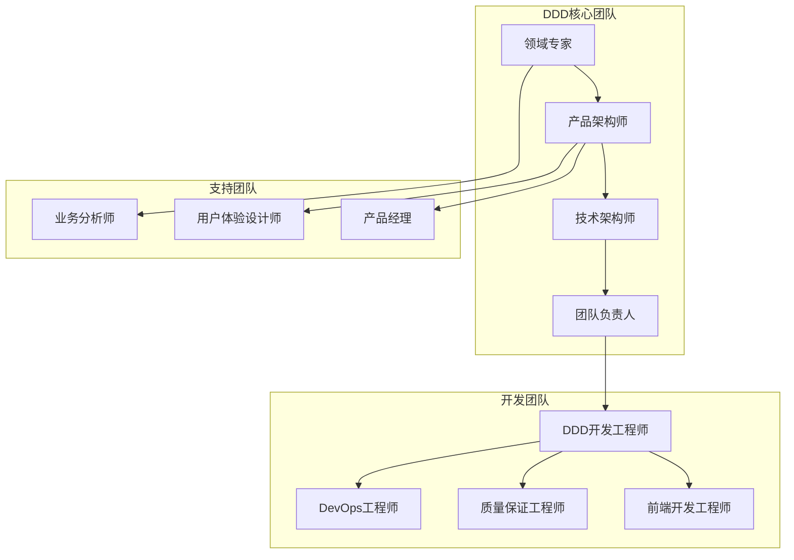

#### 角色职责定义

**领域专家（Domain Expert）**
- 提供业务知识和规则
- 参与事件风暴和建模讨论
- 验证领域模型的正确性
- 解答业务规则疑问

**产品架构师（Product Architect）**
- 负责整体产品架构设计
- 协调不同团队间的架构决策
- 确保架构与业务目标一致
- 监控架构演化方向

**技术架构师（Technical Architect）**
- 设计技术架构和基础设施
- 制定技术标准和规范
- 解决技术难题和瓶颈
- 确保系统性能和可扩展性

**DDD开发工程师**
- 实现领域模型和聚合设计
- 编写应用服务和基础设施代码
- 参与领域建模讨论
- 保证代码质量和测试覆盖率

### 2. 团队协作流程

#### 事件风暴工作坊

**准备工作**
- **参与人员**：领域专家、产品经理、架构师、开发工程师
- **时间安排**：2-4小时的专注时间
- **环境准备**：宽敞的空间、大白板、不同颜色的便利贴
- **材料准备**：马克笔、相机、投影仪

**实施步骤**

**第一阶段：领域故事讲解（30分钟）**
```
1. 领域专家讲解业务背景和核心业务流程
2. 产品经理介绍用户痛点和产品目标
3. 架构师介绍现有系统状况和技术约束
4. 开发工程师提出技术疑问和挑战
```

**第二阶段：识别领域事件（60分钟）**
```
1. 使用橙色便利贴记录所有领域事件
2. 按照时间线排序领域事件
3. 讨论事件的因果关系和时序关系
4. 验证事件的完整性和正确性
```

**第三阶段：识别聚合和实体（60分钟）**
```
1. 从事件中识别产生事件的聚合（黄色便利贴）
2. 识别聚合内的实体和值对象
3. 确定聚合根和聚合边界
4. 讨论聚合间的关系和依赖
```

**第四阶段：识别命令和查询（30分钟）**
```
1. 使用蓝色便利贴记录触发事件的命令
2. 识别查询操作和读模型需求
3. 讨论命令的参数和验证规则
4. 确定查询的性能要求
```

**第五阶段：识别外部系统和策略（30分钟）**
```java
1. 使用粉色便利贴记录外部系统依赖
2. 识别业务策略和算法（绿色便利贴）
3. 讨论系统的边界和集成方式
4. 分析系统的技术约束和限制
```

**成果整理**
- **拍照记录**：拍摄白板内容作为文档
- **绘制模型图**：整理成标准的UML图
- **编写术语表**：记录统一的领域术语
- **确定限界上下文**：划分系统的业务边界

#### 代码审查标准

**领域模型审查清单**

```java
// 审查要点1：聚合设计是否正确
public class AggregateReview {
    public boolean isValidAggregate(Class<?> aggregateClass) {
        // 检查是否有明确的聚合根
        // 检查聚合大小是否合理
        // 检查是否有明确的聚合边界
        // 检查聚合是否保证一致性
    }

    public boolean hasValidAggregateRoot(Class<?> aggregateClass) {
        // 聚合根是否有唯一标识
        // 聚合根是否控制聚合的访问
        // 聚合根是否包含业务逻辑
        // 聚合根是否维护聚合的不变量
    }

    public boolean hasProperAggregateSize(Class<?> aggregateClass) {
        // 聚合包含的实体和值对象数量是否合理
        // 聚合的业务复杂度是否适中
        // 聚合是否容易理解和维护
    }
}

// 审查要点2：实体和值对象设计是否合理
public class EntityValueObjectReview {
    public boolean isValidEntity(Class<?> entityClass) {
        // 实体是否有唯一标识
        // 实体是否有业务行为
        // 实体是否封装内部状态
        // 实体是否维护不变量
    }

    public boolean isValidValueObject(Class<?> valueObjectClass) {
        // 值对象是否不可变
        // 值对象是否基于属性值判断相等性
        // 值对象是否有意义的行为
        // 值对象是否可以整体替换
    }
}

// 审查要点3：领域服务设计是否符合规范
public class DomainServiceReview {
    public boolean isValidDomainService(Class<?> serviceClass) {
        // 领域服务是否处理跨聚合的业务逻辑
        // 领域服务是否无状态
        // 领域服务是否面向领域概念
        // 领域服务是否有明确的职责边界
    }
}

// 审查要点4：应用服务设计是否合理
public class ApplicationServiceReview {
    public boolean isValidApplicationService(Class<?> serviceClass) {
        // 应用服务是否只负责流程编排
        // 应用服务是否不包含业务逻辑
        // 应用服务是否管理事务边界
        // 应用服务是否处理数据转换
    }
}
```

**代码审查模板**

```markdown
# DDD代码审查清单

## 领域模型审查
- [ ] 聚合设计是否正确？
- [ ] 聚合根是否明确？
- [ ] 聚合边界是否合理？
- [ ] 聚合是否保证一致性？

## 实体和值对象审查
- [ ] 实体是否有唯一标识？
- [ ] 实体是否包含业务逻辑？
- [ ] 值对象是否不可变？
- [ ] 值对象判断相等性是否正确？

## 服务审查
- [ ] 领域服务职责是否明确？
- [ ] 应用服务是否只是流程编排？
- [ ] 服务间的依赖是否合理？
- [ ] 事务边界是否正确？

## 仓储审查
- [ ] 仓储接口是否面向领域？
- [ ] 仓储是否正确实现聚合的持久化？
- [ ] 查询方法是否基于业务概念？
- [ ] 性能优化是否合理？

## 架构审查
- [ ] 分层架构是否清晰？
- [ ] 依赖关系是否正确？
- [ ] 模块划分是否合理？
- [ ] 测试覆盖是否充分？
```

### 3. 知识管理建议

#### 文档管理策略

**分层文档体系**

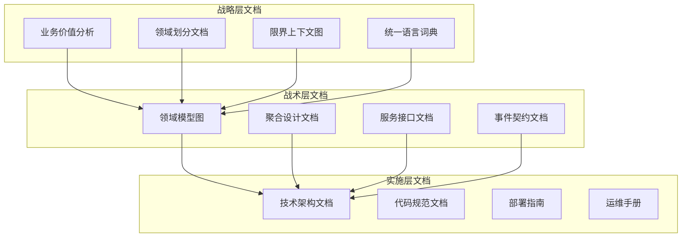

**文档模板示例**

**统一语言词典模板**

```markdown
# 统一语言词典

## 术语定义

### 订单（Order）
- **定义**：用户购买商品或服务的交易记录
- **属性**：订单ID、用户ID、商品列表、总价、状态
- **行为**：创建、确认、支付、取消、完成
- **业务规则**：
  - 订单创建后24小时内必须支付
  - 订单支付后不能修改商品信息
  - 订单完成后7天内可以申请退款

### 用户（User）
- **定义**：在系统中注册并使用服务的个人或组织
- **属性**：用户ID、姓名、邮箱、手机号、状态
- **行为**：注册、登录、修改资料、注销
- **业务规则**：
  - 用户注册需要邮箱验证
  - 用户登录失败5次后需要验证码
  - 用户注销后30天内可以恢复

### 商品（Product）
- **定义**：可供销售的商品或服务
- **属性**：商品ID、名称、价格、库存、分类
- **行为**：上架、下架、修改价格、更新库存
- **业务规则**：
  - 商品库存不能为负数
  - 商品价格修改需要审批
  - 商品下架后不能再销售

## 术语关系

```
用户 → 创建 → 订单 → 包含 → 商品
订单 → 应用 → 优惠券
商品 → 属于 → 分类
```

## 同义词对照

| 业务术语 | 技术术语 | 说明 |
|----------|----------|------|
| 顾客 | User | 指系统的最终用户 |
| 购买 | Purchase | 指用户购买商品的行为 |
| 购物车 | Cart | 指用户选择的商品列表 |
```

**聚合设计文档模板**

```markdown
# 订单聚合设计文档

## 聚合概述

**聚合根**：Order（订单）
**子实体**：OrderItem（订单项）
**值对象**：Money（金额）、Address（地址）

## 聚合边界

- **包含内容**：订单基本信息、订单项、配送信息、支付信息
- **不包含内容**：用户信息、商品信息、库存信息（通过ID引用）
- **一致性保证**：订单状态、订单项、总金额的强一致性

## 业务规则

### 订单创建规则
- 订单必须至少包含一个订单项
- 订单创建时状态为待处理（PENDING）
- 订单创建时需要预留商品库存

### 订单状态流转
```
PENDING → CONFIRMED → PAID → COMPLETED
    ↓           ↓
  CANCELLED   FAILED
```

### 业务不变量
- 订单总价 = 所有订单项小计之和 - 折扣金额
- 订单状态必须符合状态流转规则
- 已支付订单不能修改商品信息

## 聚合接口

### 公共方法
```java
public class Order {
    // 创建订单
    public static Order create(UserId userId, List<OrderItem> items);

    // 添加订单项
    public void addItem(Product product, int quantity);

    // 移除订单项
    public void removeItem(OrderItemId itemId);

    // 应用折扣
    public void applyDiscount(Money discount);

    // 确认订单
    public void confirm();

    // 支付订单
    public void pay(String paymentMethod, Money amount);

    // 取消订单
    public void cancel(String reason);

    // 完成订单
    public void complete();
}
```

### 查询方法
```java
public class Order {
    // 获取订单总价
    public Money getTotalAmount();

    // 获取订单状态
    public OrderStatus getStatus();

    // 检查是否可以支付
    public boolean canPay();

    // 检查是否可以取消
    public boolean canCancel();
}
```

## 仓储接口

```java
public interface OrderRepository {
    Order findById(OrderId id);
    Order save(Order order);
    List<Order> findByUserId(UserId userId);
    List<Order> findByStatus(OrderStatus status);
    void delete(OrderId id);
}
```

## 领域事件

- OrderCreatedEvent：订单创建事件
- OrderConfirmedEvent：订单确认事件
- OrderPaidEvent：订单支付事件
- OrderCancelledEvent：订单取消事件
- OrderCompletedEvent：订单完成事件
```

## 四、项目管理建议

### 1. 迭代规划

#### DDD实施的渐进式方法

**第一阶段：理解和建模（1-2周）**
- 业务价值分析和核心域识别
- 建立统一语言和术语词典
- 事件风暴和领域建模
- 界限上下文划分

**第二阶段：试点实施（3-4周）**
- 选择一个核心领域进行试点
- 实施完整的DDD分层架构
- 验证领域模型的正确性
- 收集团队反馈和经验

**第三阶段：推广应用（4-6周）**
- 将试点经验应用到其他领域
- 建立DDD标准和规范
- 培训团队成员
- 建立代码审查和知识分享机制

**第四阶段：优化完善（持续）**
- 持续重构和优化领域模型
- 完善基础设施和工具支持
- 建立DDD最佳实践库
- 定期回顾和改进实施策略

#### 迭代规划示例

```markdown
# DDD实施迭代规划

## Sprint 1（2周）：领域理解和建模

**目标**：
- 完成业务价值分析
- 建立统一语言
- 完成事件风暴
- 识别核心聚合

**产出物**：
- 业务价值分析报告
- 统一语言词典
- 领域模型图
- 界限上下文划分

**验收标准**：
- 团队对业务领域有统一理解
- 领域模型覆盖80%的核心业务流程
- 限界上下文划分得到专家认可

## Sprint 2（2周）：订单领域试点实施

**目标**：
- 实现订单聚合
- 实现订单应用服务
- 完成订单仓储实现
- 编写全面的单元测试

**产出物**：
- 订单聚合代码
- 订单应用服务代码
- 订单仓储实现
- 单元测试和集成测试

**验收标准**：
- 订单聚合通过所有业务规则验证
- 单元测试覆盖率达到90%
- 集成测试验证完整的业务流程

## Sprint 3（2周）：支付领域实施

**目标**：
- 实现支付聚合
- 集成外部支付系统
- 实现支付应用服务
- 完成支付-订单集成

**产出物**：
- 支付聚合代码
- 支付适配器实现
- 支付应用服务代码
- 集成测试用例

**验收标准**：
- 支付流程端到端测试通过
- 外部支付系统集成正常
- 支付状态同步及时准确

## Sprint 4（2周）：用户领域和API层

**目标**：
- 实现用户聚合
- 实现REST API接口
- 完成认证授权
- 集成前端应用

**产出物**：
- 用户聚合代码
- REST API控制器
- 认证授权实现
- 前端集成测试

**验收标准**：
- API接口设计符合REST规范
- 认证授权功能完整
- 前端集成测试通过
```

### 2. 质量保证策略

#### 测试策略

**测试金字塔**

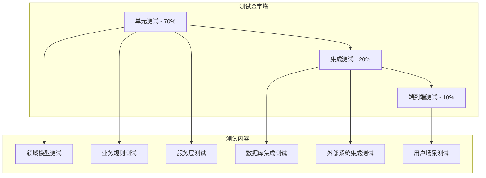

**单元测试最佳实践**

```java
// 领域模型测试示例
@ExtendWith(MockitoExtension.class)
class OrderTest {

    @Test
    @DisplayName("创建订单时应该正确计算总价")
    void shouldCalculateCorrectTotalWhenCreateOrder() {
        // Given
        Product product1 = Product.of("产品1", Money.of("100.00"));
        Product product2 = Product.of("产品2", Money.of("200.00"));

        List<OrderItem> items = Arrays.asList(
            new OrderItem(product1, 2),
            new OrderItem(product2, 1)
        );

        // When
        Order order = Order.create(UserId.of("user1"), items);

        // Then
        assertThat(order.getTotalAmount()).isEqualTo(Money.of("400.00"));
        assertThat(order.getStatus()).isEqualTo(OrderStatus.PENDING);
        assertThat(order.getItems()).hasSize(2);
    }

    @Test
    @DisplayName("应用折扣时应该验证业务规则")
    void shouldValidateBusinessRulesWhenApplyDiscount() {
        // Given
        Product product = Product.of("产品", Money.of("100.00"));
        OrderItem item = new OrderItem(product, 1);
        Order order = Order.create(UserId.of("user1"), Collections.singletonList(item));

        // When & Then - 折扣超过总价
        assertThatThrownBy(() -> order.applyDiscount(Money.of("150.00")))
            .isInstanceOf(DomainException.class)
            .hasMessage("折扣金额不能超过订单总价");

        // When & Then - 负数折扣
        assertThatThrownBy(() -> order.applyDiscount(Money.of("-10.00")))
            .isInstanceOf(DomainException.class)
            .hasMessage("折扣金额必须大于0");
    }

    @Test
    @DisplayName("订单状态流转应该符合业务规则")
    void shouldFollowBusinessRulesWhenChangeStatus() {
        // Given
        Product product = Product.of("产品", Money.of("100.00"));
        OrderItem item = new OrderItem(product, 1);
        Order order = Order.create(UserId.of("user1"), Collections.singletonList(item));

        // When - 确认订单
        order.confirm();

        // Then
        assertThat(order.getStatus()).isEqualTo(OrderStatus.CONFIRMED);

        // When - 支付订单
        order.pay("credit_card", Money.of("100.00"));

        // Then
        assertThat(order.getStatus()).isEqualTo(OrderStatus.PAID);

        // When - 完成订单
        order.complete();

        // Then
        assertThat(order.getStatus()).isEqualTo(OrderStatus.COMPLETED);
    }

    @Test
    @DisplayName("已支付订单不能取消应该抛出异常")
    void shouldThrowExceptionWhenCancelPaidOrder() {
        // Given
        Product product = Product.of("产品", Money.of("100.00"));
        OrderItem item = new OrderItem(product, 1);
        Order order = Order.create(UserId.of("user1"), Collections.singletonList(item));
        order.confirm();
        order.pay("credit_card", Money.of("100.00"));

        // When & Then
        assertThatThrownBy(() -> order.cancel("用户取消"))
            .isInstanceOf(DomainException.class)
            .hasMessage("已支付订单不能取消");
    }
}

// 领域服务测试示例
@ExtendWith(MockitoExtension.class)
class OrderDomainServiceTest {

    @Mock
    private ProductRepository productRepository;

    @Mock
    private UserRepository userRepository;

    @InjectMocks
    private OrderDomainService orderDomainService;

    @Test
    @DisplayName("创建订单时应该验证商品存在性")
    void shouldValidateProductExistenceWhenCreateOrder() {
        // Given
        CreateOrderRequest request = CreateOrderRequest.builder()
            .userId(UserId.of("user1"))
            .items(Arrays.asList(
                CreateOrderItemRequest.builder()
                    .productId(ProductId.of("product1"))
                    .quantity(2)
                    .build()
            ))
            .build();

        when(productRepository.findById(ProductId.of("product1")))
            .thenReturn(Optional.empty());

        // When & Then
        assertThatThrownBy(() -> orderDomainService.createOrder(request))
            .isInstanceOf(ProductNotFoundException.class)
            .hasMessage("商品不存在: product1");
    }

    @Test
    @DisplayName("创建订单时应该验证库存充足性")
    void shouldValidateStockAvailabilityWhenCreateOrder() {
        // Given
        Product product = Product.builder()
            .id(ProductId.of("product1"))
            .name("产品")
            .price(Money.of("100.00"))
            .stock(5)
            .build();

        CreateOrderRequest request = CreateOrderRequest.builder()
            .userId(UserId.of("user1"))
            .items(Arrays.asList(
                CreateOrderItemRequest.builder()
                    .productId(ProductId.of("product1"))
                    .quantity(10) // 超过库存
                    .build()
            ))
            .build();

        when(productRepository.findById(ProductId.of("product1")))
            .thenReturn(Optional.of(product));

        // When & Then
        assertThatThrownBy(() -> orderDomainService.createOrder(request))
            .isInstanceOf(InsufficientStockException.class)
            .hasMessage("商品库存不足: 产品, 需要: 10, 可用: 5");
    }
}
```

### 3. 风险管理建议

#### 常见风险及应对策略

**技术风险**

| 风险 | 概率 | 影响 | 应对策略 |
|------|------|------|----------|
| 团队缺乏DDD经验 | 高 | 高 | 培训指导、外部咨询、渐进式实施 |
| 领域模型设计不当 | 中 | 高 | 专家评审、原型验证、持续重构 |
| 性能问题 | 中 | 中 | 性能测试、架构优化、缓存策略 |
| 技术债务累积 | 高 | 中 | 代码审查、重构计划、技术债务管理 |

**业务风险**

| 风险 | 概率 | 影响 | 应对策略 |
|------|------|------|----------|
| 业务理解偏差 | 高 | 高 | 领域专家参与、持续验证、用户反馈 |
| 需求变更频繁 | 中 | 中 | 敏捷开发、架构弹性、变更管理 |
| 价值交付延迟 | 中 | 高 | 迭代规划、MVP策略、价值优先 |
| 用户接受度低 | 中 | 高 | 用户参与、原型测试、反馈收集 |

**组织风险**

| 风险 | 概率 | 影响 | 应对策略 |
|------|------|------|----------|
| 团队协作困难 | 中 | 高 | 沟通机制、角色明确、团队建设 |
| 资源不足 | 中 | 中 | 资源规划、优先级管理、外部支持 |
| 管理层支持不够 | 中 | 高 | 价值证明、成功案例、定期汇报 |
| 知识传承困难 | 高 | 中 | 文档化、培训计划、知识分享 |

#### 风险监控和预警

**关键指标监控**

```java
@Component
public class DDDImplementationMonitor {

    private final MetricsCollector metricsCollector;
    private final AlertingService alertingService;

    // 代码质量指标监控
    @Scheduled(fixedRate = 60000) // 每分钟检查一次
    public void monitorCodeQualityMetrics() {
        CodeQualityMetrics metrics = metricsCollector.getCodeQualityMetrics();

        // 测试覆盖率监控
        if (metrics.getTestCoverage() < 80.0) {
            alertingService.sendAlert(
                "测试覆盖率过低: " + metrics.getTestCoverage() + "%",
                AlertSeverity.WARNING
            );
        }

        // 代码复杂度监控
        if (metrics.getAverageComplexity() > 10.0) {
            alertingService.sendAlert(
                "代码平均复杂度过高: " + metrics.getAverageComplexity(),
                AlertSeverity.WARNING
            );
        }

        // 技术债务监控
        if (metrics.getTechnicalDebtRatio() > 0.2) {
            alertingService.sendAlert(
                "技术债务比例过高: " + metrics.getTechnicalDebtRatio(),
                AlertSeverity.HIGH
            );
        }
    }

    // 业务指标监控
    @Scheduled(fixedRate = 300000) // 每5分钟检查一次
    public void monitorBusinessMetrics() {
        BusinessMetrics metrics = metricsCollector.getBusinessMetrics();

        // 系统可用性监控
        if (metrics.getAvailability() < 99.5) {
            alertingService.sendAlert(
                "系统可用性过低: " + metrics.getAvailability() + "%",
                AlertSeverity.CRITICAL
            );
        }

        // 响应时间监控
        if (metrics.getAverageResponseTime() > 1000) { // 1秒
            alertingService.sendAlert(
                "平均响应时间过长: " + metrics.getAverageResponseTime() + "ms",
                AlertSeverity.WARNING
            );
        }

        // 错误率监控
        if (metrics.getErrorRate() > 0.01) { // 1%
            alertingService.sendAlert(
                "系统错误率过高: " + metrics.getErrorRate() + "%",
                AlertSeverity.HIGH
            );
        }
    }

    // DDD实施健康度监控
    @Scheduled(cron = "0 0 9 * * MON") // 每周一早上9点
    public void monitorDDDImplementationHealth() {
        DDDHealthMetrics metrics = metricsCollector.getDDDHealthMetrics();

        // 聚合大小监控
        if (metrics.getAverageAggregateSize() > 20) {
            alertingService.sendAlert(
                "平均聚合过大: " + metrics.getAverageAggregateSize(),
                AlertSeverity.WARNING
            );
        }

        // 聚合数量监控
        if (metrics.getAggregateCount() > 50) {
            alertingService.sendAlert(
                "聚合数量过多: " + metrics.getAggregateCount(),
                AlertSeverity.WARNING
            );
        }

        // 领域服务复杂度监控
        if (metrics.getAverageDomainServiceComplexity() > 15) {
            alertingService.sendAlert(
                "领域服务平均复杂度过高: " + metrics.getAverageDomainServiceComplexity(),
                AlertSeverity.WARNING
            );
        }

        // 生成健康报告
        generateHealthReport(metrics);
    }

    private void generateHealthReport(DDDHealthMetrics metrics) {
        HealthReport report = HealthReport.builder()
            .aggregateSizeMetrics(metrics.getAggregateSizeMetrics())
            .serviceComplexityMetrics(metrics.getServiceComplexityMetrics())
            .codeQualityMetrics(metrics.getCodeQualityMetrics())
            .recommendations(generateRecommendations(metrics))
            .generatedAt(LocalDateTime.now())
            .build();

        // 发送健康报告给团队
        alertingService.sendHealthReport(report);
    }

    private List<String> generateRecommendations(DDDHealthMetrics metrics) {
        List<String> recommendations = new ArrayList<>();

        if (metrics.getAverageAggregateSize() > 20) {
            recommendations.add("考虑拆分过大的聚合，将相关功能提取到新的聚合中");
        }

        if (metrics.getAverageDomainServiceComplexity() > 15) {
            recommendations.add("重构复杂的领域服务，将部分逻辑迁移到聚合根中");
        }

        if (metrics.getTestCoverage() < 80.0) {
            recommendations.add("增加单元测试覆盖率，特别是领域模型的测试");
        }

        return recommendations;
    }
}
```

## 四、总结

### 1. 技术层面
- **渐进式实施**：从简单到复杂，逐步建立DDD能力
- **质量保证**：全面的测试策略和代码审查
- **架构设计**：合理的聚合设计和分层架构
- **持续重构**：随着业务理解深入不断优化模型

### 2. 团队层面
- **知识共享**：建立统一的语言和模型理解
- **协作机制**：有效的事件风暴和建模讨论
- **技能培训**：提升团队的DDD实践能力
- **文化建设**：建立重视业务价值和技术质量的团队文化

### 3. 管理层面
- **价值导向**：确保DDD实施与业务目标一致
- **风险管控**：识别和应对实施过程中的风险
- **资源保障**：提供足够的培训、工具和时间支持
- **持续改进**：建立反馈机制和改进流程

通过这些实践建议，团队可以更有效地实施DDD，构建出**高质量、可维护、业务驱动**的软件系统。
