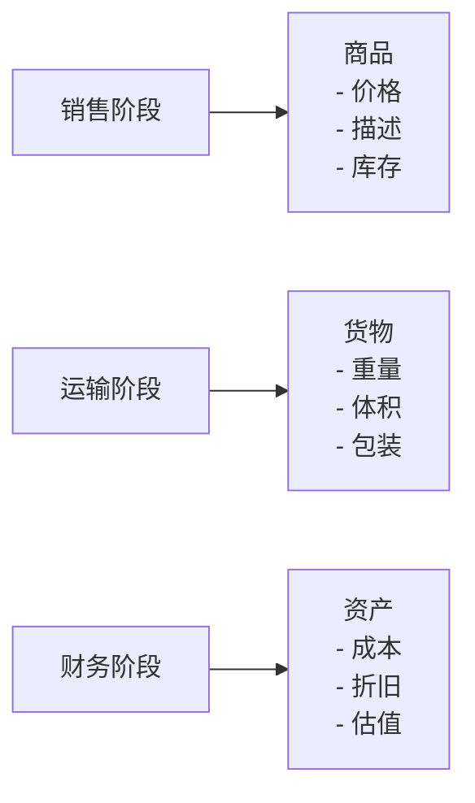

# DDD战略设计

## 概述

DDD战略设计关注的是**宏观层面**的系统架构，主要解决如何在复杂的业务领域中划清边界、确定各部分的职责，并建立团队协作的基础。战略设计是DDD的第一步，为后续的战术设计提供指导。

## 一、子域划分

根据业务价值和特点，将复杂的业务领域划分为不同的子域：

### 1. 核心域（Core Domain）
**定义**：公司的核心竞争力子域，是业务中最有价值的部分

**特点**：
- 必须自己掌握和实现
- 包含独特的业务逻辑和竞争优势
- 值得投入最多资源进行优化和创新

**思考问题**：
- 为什么值得自己开发？
- 为什么不买一个现成的解决方案？
- 为什么不外包给其他公司？

**示例**：
- 电商公司：商品推荐算法、库存管理系统
- 金融公司：风控模型、交易核心系统
- 社交平台：用户关系网络、内容推荐引擎

### 2. 支撑域（Supporting Domain）
**定义**：不是核心竞争力，又没有现成方案的子域

**特点**：
- 不包含通用功能，但又必须开发
- 对业务有支撑作用，但不是核心竞争优势
- 需要投入适当资源，但要避免过度设计

**示例**：
- 电商公司：订单管理系统、客户服务系统
- 金融公司：报表生成系统、客户管理系统

### 3. 通用域（Generic Domain）
**定义**：没有太多个性化需求，同时被多个子域使用的通用功能子域

**特点**：
- 成熟度高，有现成的解决方案
- 可以购买、外包或使用开源方案
- 标准化程度高，差异化需求少

**示例**：
- 认证和权限系统
- 日志记录和监控
- 文件存储服务
- 消息通知服务

## 二、界限上下文（Bounded Context）

### 定义
界限上下文是连接问题空间和解决方案空间的桥梁，它：
- 在问题空间分析问题时，作为**语言的边界和模型的边界**
- 在解决方案空间中，确定**应用的边界和技术的边界**

### 作用和价值
1. **避免术语混淆**：同一个概念在不同上下文中有不同含义
2. **确定微服务拆分边界**：界限上下文是微服务设计和拆分的主要依据
3. **建立清晰的协作边界**：每个团队负责自己的界限上下文

### 经典案例：电商领域的商品

在电商的不同业务阶段，商品有不同的术语和含义：

同一个东西，由于业务领域不同，赋予了这些术语不同涵义和职责边界，这个边界就成为未来微服务设计的边界。

### 界限上下文的映射关系
当多个界限上下文需要协作时，它们之间存在以下映射关系：

1. **共享内核（Shared Kernel）**：两个上下文共享部分模型
2. **客户/供应商（Customer/Supplier）**：上游上下文为下游上下文提供服务
3. **顺从者（Conformist）**：下游上下文完全采用上游上下文的模型
4. **防腐层（Anticorruption Layer）**：下游上下文建立适配层，隔离外部模型
5. **分开方式（Separate Ways）**：两个上下文完全独立，没有集成
6. **开放主机服务（Open Host Service）**：通过API和协议暴露服务

## 三、统一语言（Ubiquitous Language）

### 定义
事件风暴过程中，通过团队交流达成共识的，能够简单、清晰、准确描述业务涵义和规则的语言。限界上下文中的通用语言提供了设计领域模型的概念术语。

### 核心特点
1. **共享性**：领域专家和开发团队使用相同的术语
2. **无歧义性**：在同一界限上下文内，术语有唯一明确的含义
3. **业务导向**：语言来源于业务，而非技术实现

### 语言组成
- **名词**：领域对象等命名（实体对象）
- **形容词**：描述概念（如"有效的"、"过期的"）
- **动词**：可完成的操作（领域事件或命令）

### 建立统一语言的步骤

1. **与领域专家深入讨论**
   - 组织业务需求讨论会
   - 邀请产品经理、业务专家参与
   - 记录业务专家使用的术语

2. **事件风暴工作坊**
   - 识别领域事件
   - 发现命令和决策点
   - 明确参与者角色

3. **创建词汇表**
   - 记录术语定义
   - 明确术语使用范围
   - 建立同义词映射

4. **持续迭代完善**
   - 在开发过程中不断验证
   - 根据新发现调整语言
   - 确保文档和代码保持一致

### 示例：用户注册的统一语言

| 术语 | 业务含义 | 技术实现 |
|------|----------|----------|
| 用户注册 | 新用户创建账户的过程 | UserRegistration |
| 验证码 | 用于验证用户身份的临时码 | VerificationCode |
| 账户激活 | 用户首次登录完成激活 | AccountActivation |
| 个人资料 | 用户的基本信息 | UserProfile |

## 四、战略设计的价值

### 1. 指导架构决策
- 确定微服务拆分边界
- 明确技术选型原则
- 建立集成策略

### 2. 促进团队协作
- 建立清晰的团队职责边界
- 统一沟通语言
- 减少跨团队协调成本

### 3. 控制复杂性
- 将大型系统拆分为可管理的小模块
- 建立清晰的依赖关系
- 降低认知负载

## 五、战略设计实践建议

### 1. 从业务价值出发
- 优先识别核心域
- 合理分配开发资源
- 避免在通用域上过度投入

### 2. 渐进式演进
- 先识别关键界限上下文
- 随着业务发展逐步细化
- 保持模型的可扩展性

### 3. 持续重构
- 定期审视子域划分
- 调整界限上下文边界
- 完善统一语言

### 4. 工具支持
- 使用领域建模工具
- 维护词汇表文档
- 建立知识管理系统

通过战略设计，我们可以建立清晰的系统边界，为后续的战术设计和具体实现奠定坚实基础。