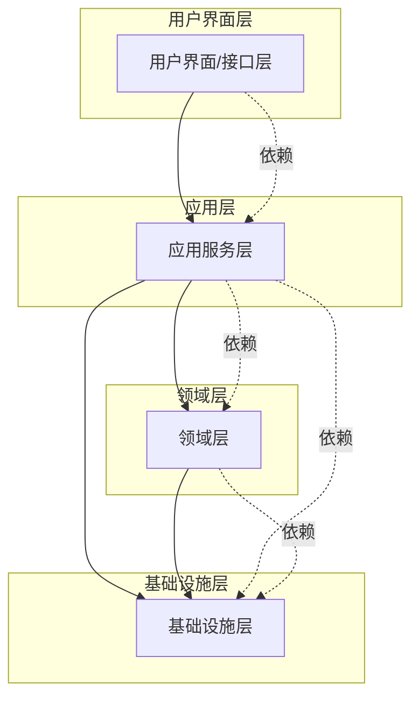

# DDD分层架构

## 概述

DDD的落地通常采用**分层架构**，通过清晰的职责分离来控制系统的复杂性。每一层都有明确的职责，并且依赖关系是单向的，从上层依赖下层。

## 一、DDD分层架构概览



### 各层职责概述

| 层次 | 职责 | 核心组件 |
|------|------|----------|
| **用户界面层** | 接收外部输入，展示结果 | Controller、MQ Listener、定时任务 |
| **应用层** | 编排业务流程，管理事务 | Application Service、DTO、领域编排 |
| **领域层** | 封装核心业务逻辑 | 实体、值对象、聚合、领域服务 |
| **基础设施层** | 提供技术支撑 | Repository实现、适配器、配置 |

## 二、用户界面层（Interface Layer）

### 定义
也称为**触发器层**，作为外部系统入口：HTTP接口、MQ消息、定时任务、WebSocket等。

### 职责
1. **接收输入**：接收HTTP请求、消息、定时触发等
2. **参数校验**：基本的格式校验和权限检查
3. **调用应用服务**：**不写任何业务逻辑**，只做调用和结果转换
4. **返回结果**：格式化返回给调用方

### 代码示例

#### HTTP控制器
```java
@RestController
@RequestMapping("/user")
public class UserController {
    private final UserApplicationService userApplicationService;

    public UserController(UserApplicationService userApplicationService) {
        this.userApplicationService = userApplicationService;
    }

    @PostMapping("/register")
    public ResultVO<UserIdResponse> register(@RequestBody @Valid RegisterRequest req) {
        // 参数校验（可通过注解/AOP处理）
        UserId userId = userApplicationService.register(req);
        return ResultVO.success(new UserIdResponse(userId.getValue()));
    }

    @GetMapping("/{userId}")
    public ResultVO<UserResponse> getUser(@PathVariable Long userId) {
        UserDetailDTO user = userApplicationService.getUser(userId);
        return ResultVO.success(UserResponse.from(user));
    }

    @PostMapping("/reset-password")
    public ResultVO<Void> resetPassword(@RequestBody @Valid ResetPasswordRequest req) {
        userApplicationService.resetPassword(req.getUserId(), req.getNewPassword());
        return ResultVO.success();
    }
}
```

#### MQ监听器
```java
@Component
public class UserEventListener {
    private final UserApplicationService userApplicationService;

    @KafkaListener(topics = "user.registered")
    public void onUserRegistered(String message) {
        try {
            UserRegisteredEvent event = JsonUtils.fromJson(message, UserRegisteredEvent.class);
            userApplicationService.processUserRegistered(event.getUserId());
        } catch (Exception e) {
            log.error("处理用户注册事件失败: {}", message, e);
            // 可考虑重试或死信队列
        }
    }

    @KafkaListener(topics = "user.password.reset")
    public void onPasswordReset(String message) {
        PasswordResetEvent event = JsonUtils.fromJson(message, PasswordResetEvent.class);
        userApplicationService.sendPasswordResetNotification(event.getUserId());
    }
}
```

#### 定时任务
```java
@Component
public class UserMaintenanceScheduler {
    private final UserApplicationService userApplicationService;

    @Scheduled(cron = "0 0 2 * * ?") // 每天凌晨2点
    public void cleanupExpiredAccounts() {
        userApplicationService.cleanupExpiredAccounts();
    }

    @Scheduled(cron = "0 30 23 * * ?") // 每天23:30
    public void sendActivityReminders() {
        userApplicationService.sendActivityReminders();
    }
}
```

### 设计原则
1. **薄层设计**：控制器逻辑应该尽量简单
2. **不包含业务逻辑**：所有业务逻辑都在应用层和领域层
3. **异常处理**：统一的异常处理机制
4. **DTO转换**：外部请求DTO与内部数据模型转换

## 三、应用层（Application Layer）

### 定义
应用层是**外部接口与领域层的桥梁**，负责协调领域层操作，处理非业务逻辑（如事务、权限、日志）。

### 职责
1. **流程编排**：接收外部请求，调用领域服务或仓储完成业务流程
2. **事务管理**：管理事务边界（开启/提交/回滚）
3. **数据转换**：将外部输入（DTO）转换为领域对象，或将领域对象转换为返回数据（VO）
4. **权限检查**：业务权限校验
5. **外部交互**：调用基础设施层（如发送邮件、操作缓存）

### 代码示例

#### 基础应用服务
```java
@Service
@Transactional
public class UserApplicationService {
    private final UserRepository userRepository;
    private final UserDomainService userDomainService;
    private final NotificationAdapter notificationAdapter;
    private final UserMapper userMapper;

    // 用户注册
    public UserId register(RegisterRequest request) {
        // 1. 数据转换
        User user = userMapper.toUser(request);

        // 2. 业务规则校验（调用领域服务）
        userDomainService.validateUserUniqueness(user.getEmail(), user.getPhone());

        // 3. 领域逻辑（调用实体方法）
        user.register();

        // 4. 保存聚合（调用仓储）
        User savedUser = userRepository.save(user);

        // 5. 发送通知（调用适配器）
        notificationAdapter.sendWelcomeEmail(savedUser.getEmail());

        return savedUser.getId();
    }

    // 获取用户详情
    @Transactional(readOnly = true)
    public UserDetailDTO getUser(Long userId) {
        User user = userRepository.findById(userId)
            .orElseThrow(() -> new UserNotFoundException(userId));

        return userMapper.toUserDetailDTO(user);
    }

    // 重置密码
    public void resetPassword(Long userId, String newPassword) {
        User user = userRepository.findById(userId)
            .orElseThrow(() -> new UserNotFoundException(userId));

        // 业务逻辑委托给实体
        user.resetPassword(newPassword);

        userRepository.save(user);

        // 发送通知
        notificationAdapter.sendPasswordResetNotification(user.getEmail());
    }

    // 清理过期账户
    @Scheduled
    public void cleanupExpiredAccounts() {
        List<User> expiredUsers = userRepository.findExpiredUsers();

        for (User user : expiredUsers) {
            user.deactivate();
            userRepository.save(user);
        }

        log.info("清理了 {} 个过期账户", expiredUsers.size());
    }
}
```

#### 复杂编排服务
```java
@Service
public class OrderApplicationService {
    private final OrderRepository orderRepository;
    private final UserRepository userRepository;
    private final ProductRepository productRepository;
    private final PaymentAdapter paymentAdapter;
    private final InventoryAdapter inventoryAdapter;
    private final NotificationAdapter notificationAdapter;

    // 复杂的订单处理流程
    @Transactional
    public OrderId createOrder(CreateOrderCommand command) {
        // 1. 验证用户
        User user = userRepository.findById(command.getUserId())
            .orElseThrow(() -> new UserNotFoundException(command.getUserId()));

        // 2. 验证商品和库存
        List<OrderItem> items = new ArrayList<>();
        for (OrderItemCommand itemCmd : command.getItems()) {
            Product product = productRepository.findById(itemCmd.getProductId())
                .orElseThrow(() -> new ProductNotFoundException(itemCmd.getProductId()));

            // 检查库存
            if (!inventoryAdapter.checkStock(product.getId(), itemCmd.getQuantity())) {
                throw new InsufficientStockException(product.getName());
            }

            OrderItem item = new OrderItem(product, itemCmd.getQuantity());
            items.add(item);
        }

        // 3. 创建订单聚合
        Order order = new Order(user.getId(), items);

        // 4. 应用优惠券（如果有的话）
        if (command.getCouponId() != null) {
            // 调用营销服务
            CouponDTO coupon = couponService.getCoupon(command.getCouponId());
            order.applyCoupon(coupon);
        }

        // 5. 计算价格（聚合内部逻辑）
        Money totalAmount = order.calculateTotal();

        // 6. 预扣库存
        inventoryAdapter.reserveStock(order.getOrderItems());

        // 7. 保存订单
        Order savedOrder = orderRepository.save(order);

        // 8. 发送订单创建通知
        notificationAdapter.sendOrderCreatedNotification(user.getEmail(), savedOrder);

        return savedOrder.getId();
    }

    // 支付处理
    @Transactional
    public PaymentResult processPayment(Long orderId, PaymentRequest paymentRequest) {
        Order order = orderRepository.findById(orderId)
            .orElseThrow(() -> new OrderNotFoundException(orderId));

        // 调用支付适配器
        PaymentResult paymentResult = paymentAdapter.processPayment(
            paymentRequest.getPaymentMethod(),
            order.getTotalAmount(),
            order.getId()
        );

        if (paymentResult.isSuccess()) {
            // 更新订单状态
            order.markAsPaid();
            orderRepository.save(order);

            // 确认库存
            inventoryAdapter.confirmStock(order.getOrderItems());

            // 发送支付成功通知
            notificationAdapter.sendPaymentSuccessNotification(order);
        } else {
            // 释放库存
            inventoryAdapter.releaseStock(order.getOrderItems());

            // 更新订单状态为支付失败
            order.markAsPaymentFailed(paymentResult.getErrorMessage());
            orderRepository.save(order);
        }

        return paymentResult;
    }
}
```

### 应用层的设计原则

1. **薄层设计**：应用服务不应该包含核心业务逻辑
2. **事务边界**：明确的事务边界管理
3. **编排职责**：专注于流程编排，不关注具体业务实现
4. **DTO转换**：处理外部和内部数据模型转换
5. **异常处理**：统一的异常处理和错误码

## 四、领域层（Domain Layer）

### 定义
领域层是DDD的**核心**，包含所有业务逻辑、业务规则和业务概念。这一层**不应该依赖任何基础设施**。

### 职责
1. **封装核心业务逻辑**：实体、值对象、聚合的业务方法
2. **实现业务规则**：通过领域服务和实体方法实现
3. **定义业务接口**：仓储接口、适配器接口
4. **领域事件**：定义和处理领域事件

### 代码结构示例

```java
// 用户聚合根
@Entity
public class User {
    private UserId id;
    private String email;
    private String phone;
    private String name;
    private UserStatus status;
    private LocalDateTime createTime;
    private LocalDateTime lastLoginTime;

    // 私有构造器，通过工厂方法创建
    private User(UserId id, String email, String phone, String name) {
        this.id = Objects.requireNonNull(id);
        this.email = Objects.requireNonNull(email);
        this.phone = Objects.requireNonNull(phone);
        this.name = Objects.requireNonNull(name);
        this.status = UserStatus.PENDING;
        this.createTime = LocalDateTime.now();

        validateEmail(email);
        validatePhone(phone);
    }

    // 工厂方法
    public static User create(String email, String phone, String name) {
        return new User(UserId.generate(), email, phone, name);
    }

    // 业务方法：注册激活
    public void activate() {
        if (status != UserStatus.PENDING) {
            throw new DomainException("只有待激活状态的用户才能激活");
        }
        this.status = UserStatus.ACTIVE;
    }

    // 业务方法：重置密码
    public void resetPassword(String newPassword) {
        if (!isActive()) {
            throw new DomainException("只有活跃用户才能重置密码");
        }
        validatePassword(newPassword);
        // 这里应该有密码加密逻辑，但委托给值对象
        this.password = new EncryptedPassword(newPassword);
    }

    // 业务方法：登录
    public void login(String password) {
        if (!isActive()) {
            throw new DomainException("用户状态不活跃，无法登录");
        }

        if (!this.password.matches(password)) {
            throw new AuthenticationException("密码错误");
        }

        this.lastLoginTime = LocalDateTime.now();
    }

    // 业务方法：修改个人信息
    public void updateProfile(String name, String phone) {
        if (!isActive()) {
            throw new DomainException("只有活跃用户才能修改个人信息");
        }

        if (StringUtils.isNotBlank(name)) {
            this.name = name;
        }

        if (StringUtils.isNotBlank(phone)) {
            validatePhone(phone);
            this.phone = phone;
        }
    }

    // 业务方法：停用用户
    public void deactivate() {
        if (status == UserStatus.DEACTIVATED) {
            throw new DomainException("用户已停用");
        }
        this.status = UserStatus.DEACTIVATED;
    }

    // 查询方法
    public boolean isActive() {
        return status == UserStatus.ACTIVE;
    }

    public boolean isExpired() {
        return Duration.between(lastLoginTime, LocalDateTime.now()).toDays() > 365;
    }

    // 私有校验方法
    private void validateEmail(String email) {
        if (!EmailValidator.isValid(email)) {
            throw new DomainException("邮箱格式不正确");
        }
    }

    private void validatePhone(String phone) {
        if (!PhoneValidator.isValid(phone)) {
            throw new DomainException("手机号格式不正确");
        }
    }

    private void validatePassword(String password) {
        if (password == null || password.length() < 6) {
            throw new DomainException("密码长度不能少于6位");
        }
    }

    // Getter方法
    public UserId getId() { return id; }
    public String getEmail() { return email; }
    public String getPhone() { return phone; }
    public String getName() { return name; }
    public UserStatus getStatus() { return status; }
    public LocalDateTime getCreateTime() { return createTime; }
    public LocalDateTime getLastLoginTime() { return lastLoginTime; }
}
```

### 仓储接口定义
```java
// 领域层定义仓储接口
public interface UserRepository {
    User findById(UserId id);
    User save(User user);
    void delete(UserId id);
    List<User> findByStatus(UserStatus status);
    List<User> findExpiredUsers();
    boolean existsByEmail(String email);
    boolean existsByPhone(String phone);
}
```

### 领域服务
```java
// 领域服务 - 处理跨实体的业务逻辑
@DomainService
public class UserDomainService {
    private final UserRepository userRepository;

    public UserDomainService(UserRepository userRepository) {
        this.userRepository = userRepository;
    }

    // 验证用户唯一性
    public void validateUserUniqueness(String email, String phone) {
        if (userRepository.existsByEmail(email)) {
            throw new DomainException("邮箱已被注册");
        }

        if (userRepository.existsByPhone(phone)) {
            throw new DomainException("手机号已被注册");
        }
    }

    // 计算用户等级
    public UserLevel calculateUserLevel(User user) {
        // 复杂的用户等级计算逻辑
        int loginDays = calculateLoginDays(user);
        int orderCount = orderRepository.countByUserId(user.getId());
        Money totalSpent = orderRepository.totalSpentByUserId(user.getId());

        if (loginDays > 365 && totalSpent.greaterThan(new Money("10000.00"))) {
            return UserLevel.VIP;
        } else if (loginDays > 90 && totalSpent.greaterThan(new Money("1000.00"))) {
            return UserLevel.PREMIUM;
        } else {
            return UserLevel.NORMAL;
        }
    }

    private int calculateLoginDays(User user) {
        // 计算登录天数逻辑
        // ...
    }
}
```

## 五、基础设施层（Infrastructure Layer）

### 定义
基础设施层负责**技术实现细节**，为领域层和应用层提供支撑。这一层**可以被上层依赖**，但**不应该依赖上层**。

### 职责
1. **实现仓储接口**：数据库访问、缓存实现
2. **适配器实现**：外部系统调用、第三方API集成
3. **配置管理**：数据库配置、消息队列配置等
4. **技术支撑**：工具类、基础组件

### 代码示例

#### 仓储实现
```java
// 基础设施层实现仓储接口
@Repository
public class UserRepositoryImpl implements UserRepository {
    private final UserJpaRepository userJpaRepository;
    private final CacheManager cacheManager;
    private final UserMapper userMapper;

    public UserRepositoryImpl(UserJpaRepository userJpaRepository,
                             CacheManager cacheManager,
                             UserMapper userMapper) {
        this.userJpaRepository = userJpaRepository;
        this.cacheManager = cacheManager;
        this.userMapper = userMapper;
    }

    @Override
    public User findById(UserId id) {
        // 1. 先查缓存
        User user = cacheManager.get("user:" + id.getValue());
        if (user != null) {
            return user;
        }

        // 2. 查数据库
        UserPO userPO = userJpaRepository.findById(id.getValue())
            .orElse(null);

        if (userPO == null) {
            return null;
        }

        // 3. 转换为领域对象
        user = userMapper.toDomain(userPO);

        // 4. 放入缓存
        cacheManager.put("user:" + id.getValue(), user, Duration.ofHours(1));

        return user;
    }

    @Override
    @Transactional
    public User save(User user) {
        UserPO userPO = userMapper.toPO(user);

        UserPO savedPO = userJpaRepository.save(userPO);

        User savedUser = userMapper.toDomain(savedPO);

        // 更新缓存
        cacheManager.put("user:" + savedUser.getId().getValue(), savedUser, Duration.ofHours(1));

        return savedUser;
    }

    @Override
    public void delete(UserId id) {
        userJpaRepository.deleteById(id.getValue());
        cacheManager.remove("user:" + id.getValue());
    }

    @Override
    public List<User> findByStatus(UserStatus status) {
        List<UserPO> userPOs = userJpaRepository.findByStatus(status.name());
        return userPOs.stream()
            .map(userMapper::toDomain)
            .collect(Collectors.toList());
    }

    @Override
    public List<User> findExpiredUsers() {
        LocalDateTime oneYearAgo = LocalDateTime.now().minusYears(1);
        List<UserPO> userPOs = userJpaRepository.findExpiredUsers(oneYearAgo);
        return userPOs.stream()
            .map(userMapper::toDomain)
            .collect(Collectors.toList());
    }

    @Override
    public boolean existsByEmail(String email) {
        return userJpaRepository.existsByEmail(email);
    }

    @Override
    public boolean existsByPhone(String phone) {
        return userJpaRepository.existsByPhone(phone);
    }
}
```

#### 适配器实现
```java
// 短信发送适配器
@Component
public class AliyunSmsSender implements SmsSender {
    private final AliyunSmsClient aliyunSmsClient;

    public AliyunSmsSender(AliyunSmsClient aliyunSmsClient) {
        this.aliyunSmsClient = aliyunSmsClient;
    }

    @Override
    public void sendVerificationCode(String phone, String code) {
        SendSmsRequest request = SendSmsRequest.builder()
            .phoneNumbers(phone)
            .signName("系统通知")
            .templateCode("SMS_123456789")
            .templateParam(String.format("{\"code\":\"%s\"}", code))
            .build();

        try {
            SendSmsResponse response = aliyunSmsClient.sendSms(request);

            if (!"OK".equals(response.getCode())) {
                throw new SmsException("短信发送失败: " + response.getMessage());
            }

            log.info("验证码短信发送成功: {}", phone);
        } catch (Exception e) {
            log.error("验证码短信发送失败: {}", phone, e);
            throw new SmsException("短信发送异常", e);
        }
    }

    @Override
    public void sendNotification(String phone, String message) {
        SendSmsRequest request = SendSmsRequest.builder()
            .phoneNumbers(phone)
            .signName("系统通知")
            .templateCode("SMS_987654321")
            .templateParam(String.format("{\"message\":\"%s\"}", message))
            .build();

        // 发送逻辑...
    }
}

// 邮件发送适配器
@Component
public class EmailSmtpSender implements EmailSender {
    private final JavaMailSender mailSender;
    private final TemplateEngine templateEngine;

    public EmailSmtpSender(JavaMailSender mailSender, TemplateEngine templateEngine) {
        this.mailSender = mailSender;
        this.templateEngine = templateEngine;
    }

    @Override
    public void sendWelcomeEmail(String email, String userName) {
        Context context = new Context();
        context.setVariable("userName", userName);
        context.setVariable("email", email);

        String content = templateEngine.process("welcome-email", context);

        SimpleMailMessage message = new SimpleMailMessage();
        message.setTo(email);
        message.setSubject("欢迎注册");
        message.setText(content);

        mailSender.send(message);

        log.info("欢迎邮件发送成功: {}", email);
    }

    @Override
    public void sendPasswordResetEmail(String email, String resetToken) {
        Context context = new Context();
        context.setVariable("resetToken", resetToken);
        context.setVariable("email", email);

        String content = templateEngine.process("password-reset", context);

        MimeMessage message = mailSender.createMimeMessage();
        try {
            MimeMessageHelper helper = new MimeMessageHelper(message, true);
            helper.setTo(email);
            helper.setSubject("密码重置");
            helper.setText(content, true);

            mailSender.send(message);

            log.info("密码重置邮件发送成功: {}", email);
        } catch (MessagingException e) {
            throw new EmailException("邮件发送失败", e);
        }
    }
}
```

## 六、分层架构的优势

### 1. 职责清晰
每层都有明确的职责，便于理解和维护

### 2. 依赖方向单一
上层依赖下层，避免循环依赖

### 3. 可测试性强
每一层都可以独立进行单元测试

### 4. 可替换性
基础设施层可以替换技术实现而不影响业务逻辑

### 5. 团队协作
不同团队可以专注于不同的层

## 七、分层架构的最佳实践

### 1. 严格控制依赖
- 领域层不能依赖任何其他层
- 应用层不能被其他层依赖
- 基础设施层不能依赖业务层

### 2. 保持层次精简
避免过度分层，保持架构的简洁性

### 3. 明确接口边界
层与层之间通过清晰的接口进行交互

### 4. 异常处理
在合适的层次处理异常，避免异常穿透

### 5. 事务管理
在应用层管理事务边界，确保数据一致性

通过这样的分层架构，我们可以构建出**职责清晰、易于维护、可测试**的复杂业务系统。