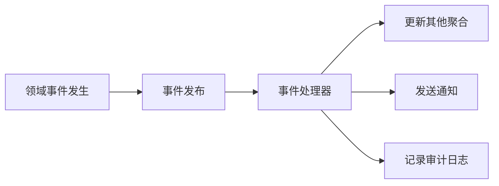

# DDD支撑模式

## 概述

DDD提供了一系列支撑模式来帮助实现领域模型和架构设计。这些模式包括仓储（Repository）、工厂（Factory）、适配器（Adapter）、领域事件（Domain Event）等，它们在DDD实践中扮演着重要角色。

## 一、仓储（Repository）模式

### 定义
仓储是**领域模型和持久化技术之间的桥梁**，是"面向领域"的数据访问对象。仓储让我们在领域中只关心业务的实现，然后通过暴露的接口去查询和保存领域对象。

### 核心特点
1. **面向领域**：接口设计基于业务视角，而非技术实现
2. **隐藏技术细节**：不暴露底层数据库、缓存等实现
3. **聚合边界**：以聚合根为单位进行操作
4. **身份映射**：确保同一聚合根的多次查询返回同一个对象实例

### 仓储接口定义

```java
// 领域层定义仓储接口
public interface OrderRepository {
    // 基础CRUD操作 - 返回聚合根
    Order findById(OrderId id);
    List<Order> findByUserId(Long userId);
    Order save(Order order);
    void delete(OrderId id);

    // 业务查询方法 - 基于业务规则
    List<Order> findPendingOrders(Long userId);
    List<Order> findPaidOrdersInDateRange(LocalDate startDate, LocalDate endDate);
    List<Order> findOverdueUnpaidOrders();

    // 聚合级别的操作
    boolean existsByUserIdAndStatus(Long userId, OrderStatus status);
    int countByUserIdAndStatus(Long userId, OrderStatus status);
    Money totalAmountByUserId(Long userId);
}
```

### 仓储实现示例

```java
// 基础设施层实现仓储
@Repository
public class OrderRepositoryImpl implements OrderRepository {
    private final OrderJpaRepository orderJpaRepository;
    private final OrderItemJpaRepository orderItemJpaRepository;
    private final CacheManager cacheManager;
    private final RedisTemplate<String, Object> redisTemplate;
    private final SearchService searchService;

    // 复杂的查询实现 - 支持多数据源
    @Override
    public Order findById(OrderId id) {
        // 1. 先查缓存
        Order cachedOrder = cacheManager.get("order:" + id.getValue());
        if (cachedOrder != null) {
            return cachedOrder;
        }

        // 2. 查数据库
        OrderPO orderPO = orderJpaRepository.findById(id.getValue())
            .orElse(null);

        if (orderPO == null) {
            return null;
        }

        // 3. 查询订单项
        List<OrderItemPO> itemPOs = orderItemJpaRepository.findByOrderId(id.getValue());

        // 4. 转换为领域对象
        Order order = OrderMapper.toDomain(orderPO, itemPOs);

        // 5. 放入缓存
        cacheManager.put("order:" + id.getValue(), order, Duration.ofHours(1));

        return order;
    }

    @Override
    @Transactional
    public Order save(Order order) {
        // 1. 转换为PO对象
        OrderPO orderPO = OrderMapper.toPO(order);
        List<OrderItemPO> itemPOs = OrderMapper.toItemPOs(order.getItems());

        // 2. 保存订单主体
        OrderPO savedOrderPO = orderJpaRepository.save(orderPO);

        // 3. 删除旧的订单项（如果更新）
        orderItemJpaRepository.deleteByOrderId(savedOrderPO.getId());

        // 4. 保存订单项
        for (OrderItemPO itemPO : itemPOs) {
            itemPO.setOrderId(savedOrderPO.getId());
        }
        orderItemJpaRepository.saveAll(itemPOs);

        // 5. 更新缓存
        Order savedOrder = OrderMapper.toDomain(savedOrderPO, itemPOs);
        cacheManager.put("order:" + savedOrder.getId().getValue(), savedOrder, Duration.ofHours(1));

        // 6. 更新搜索引擎索引
        searchService.indexOrder(savedOrder);

        // 7. 发送领域事件
        DomainEventPublisher.publish(new OrderSavedEvent(savedOrder.getId()));

        return savedOrder;
    }

    @Override
    public List<Order> findByUserId(Long userId) {
        // 先查缓存
        String cacheKey = "user_orders:" + userId;
        List<Order> cachedOrders = cacheManager.get(cacheKey);
        if (cachedOrders != null) {
            return cachedOrders;
        }

        // 查数据库
        List<OrderPO> orderPOs = orderJpaRepository.findByUserIdOrderByCreateTimeDesc(userId);

        List<Order> orders = new ArrayList<>();
        for (OrderPO orderPO : orderPOs) {
            List<OrderItemPO> itemPOs = orderItemJpaRepository.findByOrderId(orderPO.getId());
            Order order = OrderMapper.toDomain(orderPO, itemPOs);
            orders.add(order);
        }

        // 放入缓存
        cacheManager.put(cacheKey, orders, Duration.ofMinutes(30));

        return orders;
    }

    @Override
    public List<Order> findPendingOrders(Long userId) {
        return orderJpaRepository.findByUserIdAndStatus(userId, OrderStatus.PENDING.name())
            .stream()
            .map(orderPO -> {
                List<OrderItemPO> itemPOs = orderItemJpaRepository.findByOrderId(orderPO.getId());
                return OrderMapper.toDomain(orderPO, itemPOs);
            })
            .collect(Collectors.toList());
    }

    // 基于Elasticsearch的复杂搜索
    @Override
    public List<Order> findPaidOrdersInDateRange(LocalDate startDate, LocalDate endDate) {
        SearchRequest searchRequest = SearchRequest.builder()
            .index("orders")
            .query(QueryBuilders.rangeQuery("paymentTime")
                .gte(startDate.toString())
                .lte(endDate.toString()))
            .filter(QueryBuilders.termQuery("status", "PAID"))
            .build();

        SearchResult searchResult = searchService.search(searchRequest);

        return searchResult.getHits().stream()
            .map(hit -> {
                String orderId = hit.getSource().get("id").toString();
                return findById(OrderId.of(orderId));
            })
            .filter(Objects::nonNull)
            .collect(Collectors.toList());
    }

    @Override
    public List<Order> findOverdueUnpaidOrders() {
        // 查找超过24小时未支付的订单
        LocalDateTime oneDayAgo = LocalDateTime.now().minusDays(1);
        return orderJpaRepository.findOverdueUnpaidOrders(oneDayAgo)
            .stream()
            .map(orderPO -> {
                List<OrderItemPO> itemPOs = orderItemJpaRepository.findByOrderId(orderPO.getId());
                return OrderMapper.toDomain(orderPO, itemPOs);
            })
            .collect(Collectors.toList());
    }

    @Override
    public void delete(OrderId id) {
        // 删除数据库记录
        orderJpaRepository.deleteById(id.getValue());
        orderItemJpaRepository.deleteByOrderId(id.getValue());

        // 清除缓存
        cacheManager.remove("order:" + id.getValue());

        // 从搜索引擎中删除
        searchService.deleteOrder(id.getValue());
    }

    // 统计查询
    @Override
    public int countByUserIdAndStatus(Long userId, OrderStatus status) {
        return orderJpaRepository.countByUserIdAndStatus(userId, status.name());
    }

    @Override
    @Transactional(readOnly = true)
    public Money totalAmountByUserId(Long userId) {
        return orderJpaRepository.sumAmountByUserId(userId);
    }
}
```

### 仓储的最佳实践

1. **聚合根为单位**：仓储操作以聚合根为最小单位
2. **接口分离**：领域层定义接口，基础设施层实现
3. **缓存策略**：合理使用缓存提高性能
4. **事务边界**：明确的事务边界管理
5. **异常处理**：统一的数据访问异常处理

## 二、工厂（Factory）模式

### 定义
工厂模式用于**封装复杂对象的创建逻辑**，特别是聚合根或复杂实体的创建。工厂确保创建的对象符合业务规则和不变量约束。

### 使用场景
1. **复杂创建逻辑**：需要多步骤才能创建完整对象
2. **业务规则校验**：创建时需要验证业务规则
3. **参数组合**：多种创建参数的变体
4. **内部复杂性**：不希望暴露对象的内部结构

### 工厂实现示例

```java
// 领域服务作为工厂
@Service
public class OrderDomainService {
    private final ProductRepository productRepository;
    private final CouponRepository couponRepository;
    private final UserRepository userRepository;

    // 创建订单的工厂方法
    public Order createOrder(CreateOrderCommand command) {
        // 1. 验证用户
        User user = userRepository.findById(command.getUserId())
            .orElseThrow(() -> new UserNotFoundException(command.getUserId()));

        // 2. 验证商品
        List<OrderItem> items = new ArrayList<>();
        Money totalAmount = Money.ZERO;

        for (OrderItemCommand itemCmd : command.getItems()) {
            Product product = productRepository.findById(itemCmd.getProductId())
                .orElseThrow(() -> new ProductNotFoundException(itemCmd.getProductId()));

            // 验证商品状态和库存
            if (!product.isAvailable()) {
                throw new ProductNotAvailableException(product.getName());
            }

            if (!product.hasSufficientStock(itemCmd.getQuantity())) {
                throw new InsufficientStockException(product.getName(), itemCmd.getQuantity());
            }

            OrderItem item = new OrderItem(product, itemCmd.getQuantity());
            items.add(item);
            totalAmount = totalAmount.add(item.getSubtotal());
        }

        // 3. 应用优惠券（如果有）
        Money discount = Money.ZERO;
        if (command.getCouponId() != null) {
            Coupon coupon = couponRepository.findById(command.getCouponId())
                .orElseThrow(() -> new CouponNotFoundException(command.getCouponId()));

            if (!coupon.isApplicable(user, totalAmount)) {
                throw new CouponNotApplicableException(command.getCouponId());
            }

            discount = coupon.calculateDiscount(totalAmount);
        }

        // 4. 创建订单聚合根
        Order order = Order.create(user.getId(), items, discount);

        // 5. 应用业务规则
        if (order.getTotalAmount().greaterThan(user.getMaxOrderAmount())) {
            throw new OrderAmountExceededException(order.getTotalAmount(), user.getMaxOrderAmount());
        }

        return order;
    }

    // 从购物车创建订单
    public Order createOrderFromCart(ShoppingCart cart) {
        User user = cart.getUser();

        List<OrderItem> items = cart.getItems().stream()
            .map(cartItem -> {
                Product product = cartItem.getProduct();
                return new OrderItem(product, cartItem.getQuantity());
            })
            .collect(Collectors.toList());

        return Order.create(user.getId(), items, cart.getAppliedDiscount());
    }

    // 创建快速订单（一键下单）
    public Order createQuickOrder(Long userId, Long productId, int quantity) {
        User user = userRepository.findById(userId)
            .orElseThrow(() -> new UserNotFoundException(userId));

        Product product = productRepository.findById(productId)
            .orElseThrow(() -> new ProductNotFoundException(productId));

        if (!product.isAvailable()) {
            throw new ProductNotAvailableException(product.getName());
        }

        OrderItem item = new OrderItem(product, quantity);
        List<OrderItem> items = Collections.singletonList(item);

        return Order.create(userId, items, Money.ZERO);
    }
}

// 值对象工厂
public class AddressFactory {
    public static Address createFromDTO(AddressDTO dto) {
        return new Address(
            dto.getProvince(),
            dto.getCity(),
            dto.getDistrict(),
            dto.getStreet(),
            dto.getZipCode()
        );
    }

    public static Address createFromString(String addressString) {
        // 解析地址字符串的逻辑
        String[] parts = addressString.split("\\|");
        if (parts.length < 5) {
            throw new InvalidAddressFormatException(addressString);
        }

        return new Address(parts[0], parts[1], parts[2], parts[3], parts[4]);
    }

    public static Address fromShippingInfo(ShippingInfo shippingInfo) {
        return new Address(
            shippingInfo.getProvince(),
            shippingInfo.getCity(),
            shippingInfo.getDistrict(),
            shippingInfo.getDetailAddress(),
            shippingInfo.getPostalCode()
        );
    }
}
```

### 工厂模式的优势

1. **封装复杂性**：隐藏复杂的创建逻辑
2. **保证一致性**：确保创建的对象符合业务规则
3. **减少重复**：避免重复的创建代码
4. **提高可测试性**：可以独立测试工厂逻辑

## 三、适配器（Adapter）模式

### 定义
适配器是**外部系统的桥梁**，适配器也是像领域暴露接口，而具体的实现是基础设施层实现的。所有和"外部世界"打交道的场景，都可以做成"领域接口 + 适配器实现"模式。

### 核心特点
1. **接口分离**：领域层定义接口，基础设施层实现
2. **技术解耦**：领域层不依赖具体的技术实现
3. **可替换性**：可以轻松替换外部系统实现
4. **异常转换**：将技术异常转换为业务异常

### 适配器实现示例

```java
// 领域层定义支付接口
public interface PaymentAdapter {
    PaymentResult processPayment(PaymentRequest request);
    RefundResult processRefund(RefundRequest request);
    PaymentStatus queryPaymentStatus(String transactionId);
}

// 阿里云支付适配器实现
@Component
public class AliyunPaymentAdapter implements PaymentAdapter {
    private final AlipayClient alipayClient;
    private final PaymentMapper paymentMapper;

    public AliyunPaymentAdapter(AlipayClient alipayClient, PaymentMapper paymentMapper) {
        this.alipayClient = alipayClient;
        this.paymentMapper = paymentMapper;
    }

    @Override
    @Retryable(value = {Exception.class}, maxAttempts = 3, backoff = @Backoff(delay = 1000))
    public PaymentResult processPayment(PaymentRequest request) {
        try {
            // 转换为阿里云支付请求
            AlipayTradeCreateRequest alipayRequest = paymentMapper.toAlipayRequest(request);

            // 调用阿里云支付接口
            AlipayTradeCreateResponse response = alipayClient.execute(alipayRequest);

            // 处理响应
            if (response.isSuccess()) {
                return PaymentResult.success(response.getTradeNo(), response.getQrCode());
            } else {
                return PaymentResult.failure(response.getSubMsg(), response.getSubCode());
            }

        } catch (AlipayApiException e) {
            log.error("阿里云支付失败", e);
            throw new PaymentException("支付处理失败: " + e.getMessage(), e);
        }
    }

    @Override
    public RefundResult processRefund(RefundRequest request) {
        try {
            AlipayTradeRefundRequest alipayRequest = paymentMapper.toAlipayRefundRequest(request);
            AlipayTradeRefundResponse response = alipayClient.execute(alipayRequest);

            if (response.isSuccess()) {
                return RefundResult.success(response.getTradeNo(), response.getRefundFee());
            } else {
                return RefundResult.failure(response.getSubMsg(), response.getSubCode());
            }

        } catch (AlipayApiException e) {
            log.error("阿里云退款失败", e);
            throw new PaymentException("退款处理失败: " + e.getMessage(), e);
        }
    }

    @Override
    public PaymentStatus queryPaymentStatus(String transactionId) {
        try {
            AlipayTradeQueryRequest request = new AlipayTradeQueryRequest();
            request.setBizContent(String.format("{\"out_trade_no\":\"%s\"}", transactionId));

            AlipayTradeQueryResponse response = alipayClient.execute(request);

            if (response.isSuccess()) {
                return paymentMapper.toPaymentStatus(response.getTradeStatus());
            } else {
                throw new PaymentException("查询支付状态失败: " + response.getSubMsg());
            }

        } catch (AlipayApiException e) {
            log.error("查询支付状态失败", e);
            throw new PaymentException("查询支付状态异常", e);
        }
    }
}

// 微信支付适配器实现
@Component
public class WechatPaymentAdapter implements PaymentAdapter {
    private final WechatPayClient wechatPayClient;
    private final PaymentMapper paymentMapper;

    public WechatPaymentAdapter(WechatPayClient wechatPayClient, PaymentMapper paymentMapper) {
        this.wechatPayClient = wechatPayClient;
        this.paymentMapper = paymentMapper;
    }

    @Override
    public PaymentResult processPayment(PaymentRequest request) {
        try {
            // 转换为微信支付请求
            WechatPayCreateOrderRequest wechatRequest = paymentMapper.toWechatRequest(request);

            // 调用微信支付接口
            WechatPayCreateOrderResponse response = wechatPayClient.createOrder(wechatRequest);

            // 处理响应
            if (response.isSuccess()) {
                return PaymentResult.success(response.getPrepayId(), response.getCodeUrl());
            } else {
                return PaymentResult.failure(response.getErrorMessage(), response.getErrorCode());
            }

        } catch (WechatPayException e) {
            log.error("微信支付失败", e);
            throw new PaymentException("支付处理失败: " + e.getMessage(), e);
        }
    }

    // 实现其他接口方法...
}

// 短信发送适配器
public interface SmsSender {
    void sendVerificationCode(String phone, String code);
    void sendNotification(String phone, String templateCode, Map<String, Object> params);
    SmsSendResult batchSend(List<String> phones, String message);
}

@Component
public class TencentSmsSender implements SmsSender {
    private final TencentSmsClient tencentSmsClient;

    public TencentSmsSender(TencentSmsClient tencentSmsClient) {
        this.tencentSmsClient = tencentSmsClient;
    }

    @Override
    public void sendVerificationCode(String phone, String code) {
        try {
            SendSmsRequest request = SendSmsRequest.builder()
                .phoneNumberSet(Collections.singletonList(phone))
                .templateId("123456")
                .templateParamSet(Arrays.asList(code, "5"))
                .build();

            SendSmsResponse response = tencentSmsClient.sendSms(request);

            if (!response.getSendStatusSet().get(0).getCode().equals("Ok")) {
                throw new SmsException("短信发送失败: " + response.getSendStatusSet().get(0).getMessage());
            }

            log.info("验证码短信发送成功: {}", phone);

        } catch (TencentCloudSdkException e) {
            log.error("腾讯云短信发送失败", e);
            throw new SmsException("短信发送异常", e);
        }
    }

    @Override
    public void sendNotification(String phone, String templateCode, Map<String, Object> params) {
        // 实现通知短信发送逻辑
    }

    @Override
    public SmsSendResult batchSend(List<String> phones, String message) {
        // 实现批量短信发送逻辑
        return null;
    }
}
```

### 适配器的优势

1. **技术解耦**：领域层不依赖具体的技术实现
2. **可替换性**：可以轻松替换不同的外部系统
3. **异常处理**：统一的技术异常转换
4. **可测试性**：可以轻松模拟外部系统

## 四、领域事件（Domain Event）

### 定义
领域事件是在领域中发生的重要业务事件，它可以用于**解耦聚合之间的协作**，支持最终一致性，以及实现事件溯源等模式。

### 事件的生命周期



### 领域事件实现示例

```java
// 基础领域事件接口
public interface DomainEvent {
    String getEventId();
    LocalDateTime getOccurredOn();
    String getEventType();
    Object getAggregateId();
    Map<String, Object> getEventData();
}

// 具体领域事件
public class OrderPaidEvent implements DomainEvent {
    private final String eventId;
    private final LocalDateTime occurredOn;
    private final OrderId orderId;
    private final Money paidAmount;
    private final String paymentMethod;
    private final LocalDateTime paymentTime;

    public OrderPaidEvent(OrderId orderId, Money paidAmount, String paymentMethod) {
        this.eventId = UUID.randomUUID().toString();
        this.occurredOn = LocalDateTime.now();
        this.orderId = orderId;
        this.paidAmount = paidAmount;
        this.paymentMethod = paymentMethod;
        this.paymentTime = LocalDateTime.now();
    }

    @Override
    public String getEventId() {
        return eventId;
    }

    @Override
    public LocalDateTime getOccurredOn() {
        return occurredOn;
    }

    @Override
    public String getEventType() {
        return "OrderPaid";
    }

    @Override
    public OrderId getAggregateId() {
        return orderId;
    }

    @Override
    public Map<String, Object> getEventData() {
        Map<String, Object> data = new HashMap<>();
        data.put("orderId", orderId.getValue());
        data.put("paidAmount", paidAmount.getValue());
        data.put("paymentMethod", paymentMethod);
        data.put("paymentTime", paymentTime);
        return data;
    }

    // Getter方法
    public OrderId getOrderId() { return orderId; }
    public Money getPaidAmount() { return paidAmount; }
    public String getPaymentMethod() { return paymentMethod; }
    public LocalDateTime getPaymentTime() { return paymentTime; }
}

// 事件发布器
@Component
public class DomainEventPublisher {
    private final ApplicationEventPublisher eventPublisher;
    private final EventStore eventStore;

    public DomainEventPublisher(ApplicationEventPublisher eventPublisher, EventStore eventStore) {
        this.eventPublisher = eventPublisher;
        this.eventStore = eventStore;
    }

    public void publish(DomainEvent event) {
        // 1. 存储事件
        eventStore.saveEvent(event);

        // 2. 发布Spring事件
        eventPublisher.publishEvent(event);

        // 3. 发送到消息队列（如果需要）
        sendToMessageQueue(event);
    }

    public void publishAll(List<DomainEvent> events) {
        for (DomainEvent event : events) {
            publish(event);
        }
    }

    private void sendToMessageQueue(DomainEvent event) {
        // 将事件发送到消息队列，供其他微服务消费
    }
}

// 在聚合根中记录事件
public class Order {
    private OrderId id;
    private List<OrderItem> items;
    private OrderStatus status;
    private List<DomainEvent> domainEvents = new ArrayList<>();

    public void pay(String paymentMethod, Money paidAmount) {
        if (status != OrderStatus.CONFIRMED) {
            throw new DomainException("只有已确认的订单才能支付");
        }

        if (!paidAmount.equals(getTotalAmount())) {
            throw new DomainException("支付金额与订单金额不符");
        }

        this.status = OrderStatus.PAID;

        // 记录领域事件
        domainEvents.add(new OrderPaidEvent(id, paidAmount, paymentMethod));
    }

    public void confirm() {
        if (status != OrderStatus.PENDING) {
            throw new DomainException("只有待处理的订单才能确认");
        }

        this.status = OrderStatus.CONFIRMED;

        // 记录领域事件
        domainEvents.add(new OrderConfirmedEvent(id, getTotalAmount(), getItems()));
    }

    public void cancel(String reason) {
        if (status == OrderStatus.COMPLETED || status == OrderStatus.CANCELLED) {
            throw new DomainException("已完成或已取消的订单不能再次取消");
        }

        this.status = OrderStatus.CANCELLED;

        // 记录领域事件
        domainEvents.add(new OrderCancelledEvent(id, reason, getTotalAmount()));
    }

    // 获取并清除事件
    public List<DomainEvent> getDomainEvents() {
        List<DomainEvent> events = new ArrayList<>(domainEvents);
        domainEvents.clear();
        return events;
    }
}

// 事件处理器
@Component
public class OrderEventHandler {
    private final InventoryService inventoryService;
    private final NotificationService notificationService;
    private final OrderRepository orderRepository;
    private final UserRepository userRepository;

    @EventListener
    @Async
    public void handleOrderPaid(OrderPaidEvent event) {
        // 1. 确认库存
        inventoryService.confirmStock(event.getOrderId());

        // 2. 发送支付成功通知
        Order order = orderRepository.findById(event.getOrderId());
        User user = userRepository.findById(order.getUserId());

        notificationService.sendPaymentSuccessNotification(
            user.getEmail(),
            event.getOrderId(),
            event.getPaidAmount()
        );

        // 3. 更新用户统计信息
        userRepository.updateOrderStatistics(user.getId(), event.getPaidAmount());

        log.info("处理订单支付事件完成: {}", event.getOrderId());
    }

    @EventListener
    @Async
    public void handleOrderConfirmed(OrderConfirmedEvent event) {
        // 预扣库存
        inventoryService.reserveStock(event.getOrderId(), event.getItems());

        log.info("处理订单确认事件完成: {}", event.getOrderId());
    }

    @EventListener
    @Async
    public void handleOrderCancelled(OrderCancelledEvent event) {
        // 释放库存
        inventoryService.releaseStock(event.getOrderId());

        // 发送取消通知
        Order order = orderRepository.findById(event.getOrderId());
        User user = userRepository.findById(order.getUserId());

        notificationService.sendOrderCancelledNotification(
            user.getEmail(),
            event.getOrderId(),
            event.getReason()
        );

        log.info("处理订单取消事件完成: {}", event.getOrderId());
    }
}
```

### 领域事件的优势

1. **松耦合**：聚合之间通过事件解耦
2. **可扩展性**：可以轻松添加新的事件处理器
3. **最终一致性**：支持分布式系统的一致性
4. **可审计性**：事件记录了系统的状态变化

## 五、策略（Strategy）模式

### 定义
策略模式用于**封装算法或业务规则**，使得它们可以在运行时相互替换。在DDD中，策略模式常用于实现可变的业务规则。

### 策略实现示例

```java
// 定价策略接口
public interface PricingStrategy {
    Money calculatePrice(Order order);
    String getStrategyName();
    boolean isApplicable(Order order);
}

// 会员定价策略
@Component
public class MemberPricingStrategy implements PricingStrategy {
    private final UserRepository userRepository;

    public MemberPricingStrategy(UserRepository userRepository) {
        this.userRepository = userRepository;
    }

    @Override
    public Money calculatePrice(Order order) {
        User user = userRepository.findById(order.getUserId()).orElse(null);
        if (user == null) {
            return order.getTotalAmount();
        }

        Money discount = Money.ZERO;
        double discountRate = getDiscountRate(user.getMemberLevel());

        if (discountRate > 0) {
            discount = order.getTotalAmount().multiply(discountRate);
        }

        return order.getTotalAmount().subtract(discount);
    }

    @Override
    public String getStrategyName() {
        return "会员折扣";
    }

    @Override
    public boolean isApplicable(Order order) {
        User user = userRepository.findById(order.getUserId()).orElse(null);
        return user != null && user.getMemberLevel() != MemberLevel.NORMAL;
    }

    private double getDiscountRate(MemberLevel level) {
        switch (level) {
            case VIP: return 0.1; // 10%折扣
            case PREMIUM: return 0.15; // 15%折扣
            case DIAMOND: return 0.2; // 20%折扣
            default: return 0;
        }
    }
}

// 促销定价策略
@Component
public class PromotionPricingStrategy implements PricingStrategy {
    private final PromotionRepository promotionRepository;

    public PromotionPricingStrategy(PromotionRepository promotionRepository) {
        this.promotionRepository = promotionRepository;
    }

    @Override
    public Money calculatePrice(Order order) {
        List<Promotion> applicablePromotions = promotionRepository
            .findApplicablePromotions(order.getItems(), order.getUserId());

        Money totalDiscount = Money.ZERO;
        for (Promotion promotion : applicablePromotions) {
            Money discount = promotion.calculateDiscount(order);
            totalDiscount = totalDiscount.add(discount);
        }

        return order.getTotalAmount().subtract(totalDiscount);
    }

    @Override
    public String getStrategyName() {
        return "促销活动";
    }

    @Override
    public boolean isApplicable(Order order) {
        return !promotionRepository.findApplicablePromotions(
            order.getItems(),
            order.getUserId()
        ).isEmpty();
    }
}

// 定价策略选择器
@Service
public class PricingStrategySelector {
    private final List<PricingStrategy> strategies;

    public PricingStrategySelector(List<PricingStrategy> strategies) {
        this.strategies = strategies;
    }

    public Money calculateFinalPrice(Order order) {
        Money finalPrice = order.getTotalAmount();

        for (PricingStrategy strategy : strategies) {
            if (strategy.isApplicable(order)) {
                Money strategyPrice = strategy.calculatePrice(order);
                finalPrice = strategyPrice.lessThan(finalPrice) ? strategyPrice : finalPrice;

                log.info("应用定价策略: {}, 价格: {}",
                    strategy.getStrategyName(), strategyPrice);
            }
        }

        return finalPrice;
    }

    public List<String> getApplicableStrategies(Order order) {
        return strategies.stream()
            .filter(strategy -> strategy.isApplicable(order))
            .map(PricingStrategy::getStrategyName)
            .collect(Collectors.toList());
    }
}
```

## 六、支撑模式的最佳实践

### 1. 接口设计原则
- **面向领域**：接口设计基于业务概念，而非技术实现
- **职责单一**：每个接口只负责一个明确的职责
- **稳定性**：接口应该保持稳定，避免频繁变更

### 2. 实现原则
- **技术解耦**：实现细节不应该泄露到领域层
- **异常处理**：统一的技术异常转换
- **性能优化**：合理使用缓存、批量操作等优化手段

### 3. 测试策略
- **接口测试**：测试接口的正确性
- **实现测试**：测试具体实现的正确性
- **集成测试**：测试与其他系统的集成

### 4. 演进策略
- **版本管理**：接口变更时的版本管理策略
- **兼容性**：保持向后兼容性
- **迁移策略**：平滑的迁移和升级

通过合理使用这些支撑模式，我们可以构建出**结构清晰、易于维护、可扩展**的DDD架构系统。