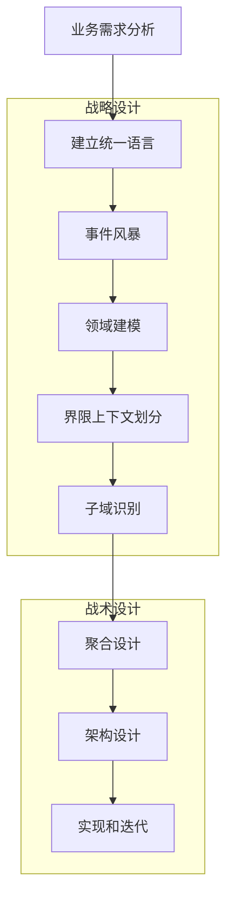
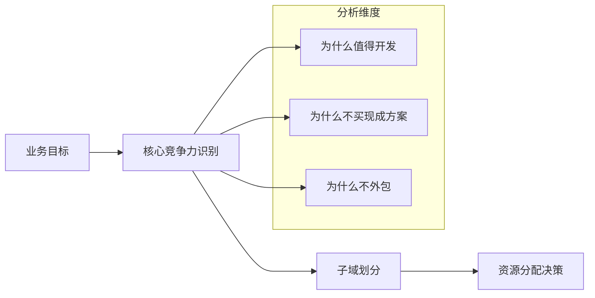
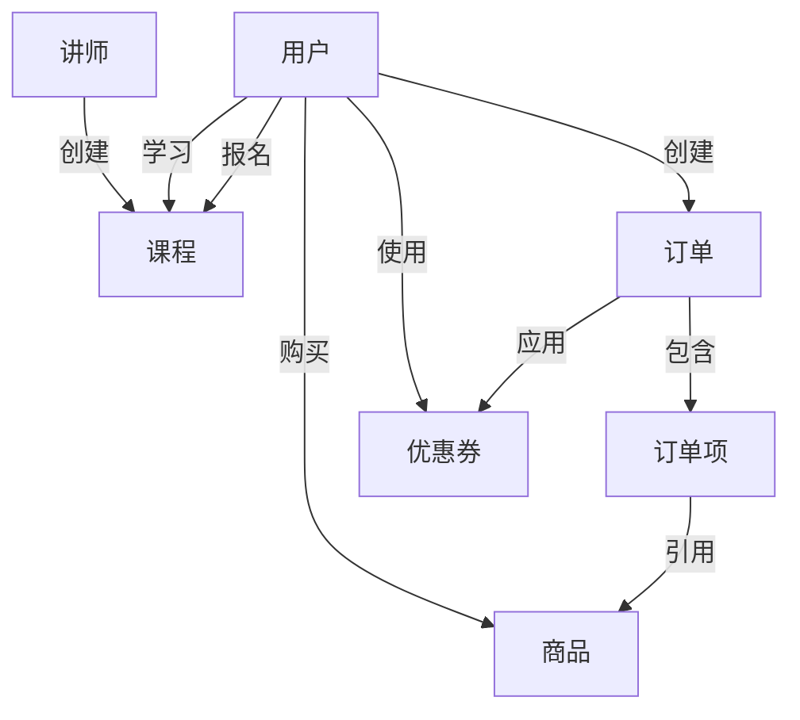
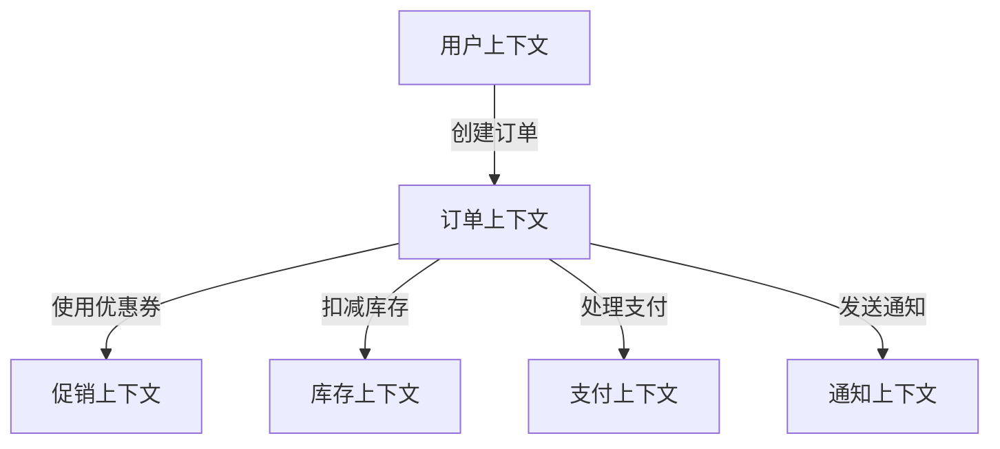
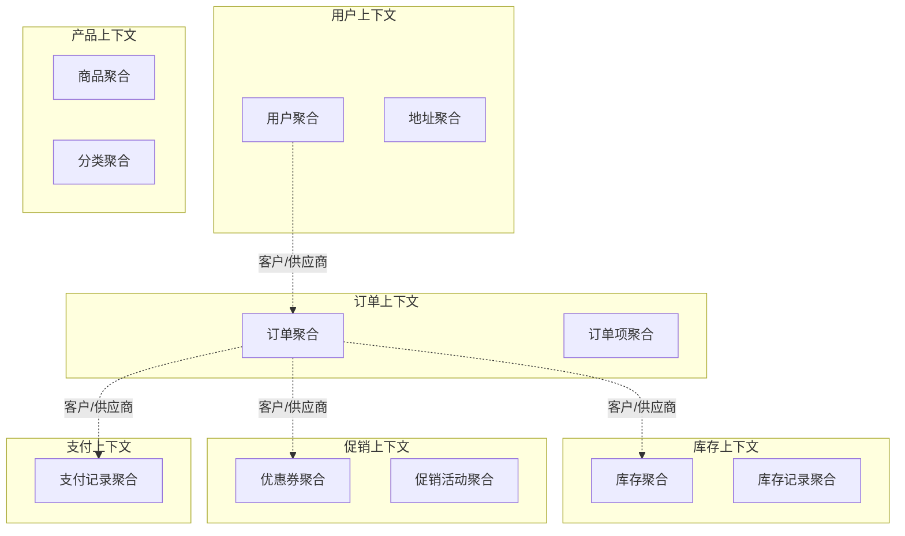
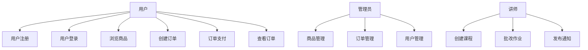

# DDD设计过程和方法

## 概述

DDD的设计过程是一个**从业务需求到技术实现的完整流程**，通过系统性的方法和工具，帮助团队构建出反映业务真实需求的软件系统。本文介绍DDD的核心设计过程、方法和工具。

## 一、DDD设计流程概览



## 二、设计过程详解

### 第一阶段：业务理解和需求分析

#### 1. 业务价值分析
明确项目的业务目标和价值，帮助识别核心域：



#### 实施方法
- **业务访谈**：与业务专家、产品经理深入交流
- **价值地图**：绘制功能价值地图，识别高价值功能
- **竞品分析**：了解市场现有方案和差异化需求
- **ROI分析**：评估各功能的投入产出比

#### 输出物
- 业务价值分析报告
- 功能优先级矩阵
- 初步的功能列表

### 第二阶段：建立统一语言

#### 1. 术语收集
从业务描述、需求文档、用户故事中收集关键术语：

| 业务描述 | 提取的术语 | 术语类型 |
|----------|------------|----------|
| "用户可以注册账户，使用邮箱接收验证码" | 用户、注册、账户、邮箱、验证码 | 实体、行为、值对象 |
| "订单包含多个商品，可以应用优惠券" | 订单、商品、优惠券 | 实体、值对象 |
| "讲师创建课程，学员报名参加学习" | 讲师、课程、学员、报名、学习 | 实体、行为 |

#### 2. 术语定义和标准化
建立团队的术语字典：

```
用户（User）：在系统中注册的自然人或组织
- 属性：用户ID、姓名、邮箱、手机号、注册时间
- 行为：注册、登录、修改资料、注销

订单（Order）：用户购买商品或服务的交易记录
- 属性：订单ID、用户ID、订单状态、创建时间、总金额
- 行为：创建、确认、支付、取消、完成

商品（Product）：可供销售的物品或服务
- 属性：商品ID、名称、价格、库存数量、描述
- 行为：上架、下架、修改价格、更新库存
```

#### 3. 术语关系建模
绘制术语关系图，理解概念之间的关联：



### 第三阶段：事件风暴（Event Storming）

事件风暴是DDD领域建模的核心方法，通过集体讨论和协作，快速识别领域事件、命令、聚合等。

#### 1. 准备工作
- **参与者**：领域专家、开发人员、产品经理、UX设计师
- **环境**：大空间、白板或墙壁、不同颜色的便利贴
- **工具**：便利贴（不同颜色代表不同元素）、马克笔、相机

#### 2. 事件风暴流程

**步骤1：识别领域事件（橙色便利贴）**
```
用户注册成功
邮箱验证码发送
订单创建成功
商品库存不足
订单支付完成
优惠券使用成功
课程报名成功
```

**步骤2：识别命令（蓝色便利贴）**
```
[用户注册] -> 用户注册成功
[发送验证码] -> 邮箱验证码发送
[创建订单] -> 订单创建成功
[检查库存] -> 商品库存不足
[处理支付] -> 订单支付完成
[使用优惠券] -> 优惠券使用成功
[报名课程] -> 课程报名成功
```

**步骤3：识别聚合（黄色便利贴）**
```
用户聚合：用户注册成功
订单聚合：订单创建成功、订单支付完成
商品聚合：商品库存不足
优惠券聚合：优惠券使用成功
课程聚合：课程报名成功
```

**步骤4：识别外部系统（粉色便利贴）**
```
邮件服务：发送验证码邮件
支付网关：处理支付
短信服务：发送短信通知
库存系统：查询和更新库存
```

**步骤5：识别策略（绿色便利贴）**
```
库存分配策略：如何分配库存给订单
优惠券使用策略：优惠券的叠加使用规则
定价策略：商品定价的计算逻辑
```

#### 3. 事件风暴成果整理

**领域事件时间线**
```
用户注册 -> 邮箱验证 -> 创建订单 -> 检查库存 -> 应用折扣 -> 处理支付 -> 订单完成 -> 发送通知
```

**聚合关系图**


### 第四阶段：领域建模

#### 1. 实体识别
从事件风暴的结果中识别实体：

**用户实体**
```java
public class User {
    private UserId id;
    private String name;
    private String email;
    private String phone;
    private UserStatus status;
    private LocalDateTime createTime;
    private LocalDateTime lastLoginTime;
}
```

**订单实体**
```java
public class Order {
    private OrderId id;
    private UserId userId;
    private List<OrderItem> items;
    private Money totalAmount;
    private OrderStatus status;
    private String couponId;
    private LocalDateTime createTime;
}
```

**商品实体**
```java
public class Product {
    private ProductId id;
    private String name;
    private String description;
    private Money price;
    private int stock;
    private ProductStatus status;
}
```

#### 2. 值对象识别
识别哪些概念应该是值对象：

**地址值对象**
```java
public class Address {
    private final String province;
    private final String city;
    private final String district;
    private final String street;
    private final String zipCode;
}
```

**金额值对象**
```java
public class Money {
    private final BigDecimal amount;
    private final String currency;

    public Money add(Money other) { ... }
    public Money subtract(Money other) { ... }
    public Money multiply(double multiplier) { ... }
}
```

**邮箱值对象**
```java
public class Email {
    private final String value;

    private Email(String value) {
        if (!isValidEmail(value)) {
            throw new IllegalArgumentException("邮箱格式不正确");
        }
        this.value = value;
    }

    public static Email of(String value) {
        return new Email(value);
    }
}
```

#### 3. 聚合设计
识别聚合根和聚合边界：

**订单聚合**
```java
public class Order {  // 聚合根
    private OrderId id;
    private UserId userId;
    private List<OrderItem> items;   // 子实体
    private Address shippingAddress;   // 值对象
    private Money totalAmount;
    private OrderStatus status;

    // 聚合行为
    public void addItem(Product product, int quantity) {
        OrderItem item = new OrderItem(product, quantity);
        this.items.add(item);
        recalculateTotal();
    }

    public void applyCoupon(Coupon coupon) {
        // 业务规则验证
        if (!coupon.isApplicable(this)) {
            throw new DomainException("优惠券不适用");
        }

        this.couponId = coupon.getId();
        recalculateTotal();
    }

    public void confirm() {
        if (items.isEmpty()) {
            throw new DomainException("订单不能为空");
        }
        if (status != OrderStatus.PENDING) {
            throw new DomainException("只有待处理订单才能确认");
        }

        this.status = OrderStatus.CONFIRMED;
    }

    // 私有方法
    private void recalculateTotal() {
        this.totalAmount = items.stream()
            .map(OrderItem::getSubtotal)
            .reduce(Money.ZERO, Money::add);

        if (couponId != null) {
            // 应用折扣逻辑
        }
    }
}
```

**用户聚合**
```java
public class User {  // 聚合根
    private UserId id;
    private String name;
    private Email email;
    private Phone phone;
    private UserStatus status;
    private List<Address> addresses;  // 值对象列表

    public void addAddress(Address address) {
        if (addresses.size() >= 5) {
            throw new DomainException("地址数量不能超过5个");
        }
        this.addresses.add(address);
    }

    public void updateEmail(Email newEmail) {
        if (!newEmail.isDifferentFrom(this.email)) {
            return; // 相同邮箱不需要更新
        }

        // 发送验证邮件的逻辑在应用层
        this.email = newEmail;
        this.status = UserStatus.EMAIL_PENDING_VERIFICATION;
    }
}
```

#### 4. 领域服务识别
识别需要跨聚合协作的业务逻辑：

**定价服务**
```java
@DomainService
public class PricingDomainService {
    public Money calculateOrderPrice(Order order, List<Discount> discounts) {
        // 复杂的定价逻辑，涉及多个聚合
    }
}
```

**库存服务**
```java
@DomainService
public class InventoryDomainService {
    public boolean checkStockAvailability(List<OrderItem> items) {
        // 检查多个商品的库存
    }
}
```

### 第五阶段：界限上下文划分

#### 1. 上下文映射分析
分析事件风暴中识别的聚合，划分界限上下文：



#### 2. 上下文关系定义

**共享内核（Shared Kernel）**
- 用户上下文和订单上下文共享用户的基本信息
- 产品上下文和订单上下文共享商品的基本信息

**客户/供应商（Customer/Supplier）**
- 订单上下文是客户，库存上下文是供应商
- 订单上下文是客户，促销上下文是供应商

**防腐层（Anticorruption Layer）**
- 订单上下文需要调用外部支付网关
- 用户上下文需要调用外部邮件服务

#### 3. 上下文边界定义

**用户上下文（User Context）**
```
职责：用户管理、认证授权
聚合：User、UserProfile
服务：UserDomainService、AuthService
限界：用户的注册、登录、信息管理
```

**订单上下文（Order Context）**
```
职责：订单管理、订单流程
聚合：Order、OrderItem
服务：OrderDomainService、PricingService
限界：从创建到完成的整个订单生命周期
```

**产品上下文（Product Context）**
```
职责：商品管理、分类管理
聚合：Product、Category、ProductAttribute
服务：ProductDomainService
限界：商品的信息管理和发布
```

### 第六阶段：架构设计

#### 1. 微服务拆分
根据界限上下文进行微服务拆分：

```
用户服务（user-service）
├── 用户注册、登录
├── 个人信息管理
├── 权限管理
└── 用户统计分析

订单服务（order-service）
├── 订单创建、管理
├── 订单状态流转
├── 订单查询
└── 订单统计分析

产品服务（product-service）
├── 商品信息管理
├── 分类管理
├── 价格管理
└── 商品搜索

库存服务（inventory-service）
├── 库存查询
├── 库存扣减
├── 库存补充
└── 库存预警

促销服务（promotion-service）
├── 优惠券管理
├── 促销活动管理
├── 折扣计算
└── 营销统计分析
```

#### 2. 服务间通信设计

**同步调用**
```java
// 订单服务调用库存服务检查库存
@FeignClient("inventory-service")
public interface InventoryService {
    @GetMapping("/api/inventory/check")
    boolean checkStock(@RequestParam List<Long> productIds);
}
```

**异步消息**
```java
// 订单创建成功后发送事件
@EventListener
@Async
public void handleOrderCreated(OrderCreatedEvent event) {
    // 发送消息给库存服务
    kafkaTemplate.send("inventory.reserve", event);
    // 发送消息给促销服务
    kafkaTemplate.send("promotion.apply", event);
}
```

#### 3. 数据一致性策略

**SAGA模式**
```java
@Service
public class OrderSagaOrchestrator {
    public void processOrder(Order order) {
        try {
            // 1. 预扣库存
            inventoryService.reserveStock(order);

            // 2. 应用优惠券
            promotionService.applyCoupon(order);

            // 3. 处理支付
            paymentService.processPayment(order);

            // 4. 确认订单
            order.confirm();

        } catch (Exception e) {
            // 补偿操作
            rollbackSaga(order);
        }
    }

    private void rollbackSaga(Order order) {
        // 1. 释放库存
        inventoryService.releaseStock(order);
        // 2. 恢复优惠券
        promotionService.restoreCoupon(order);
        // 3. 取消支付
        paymentService.cancelPayment(order);
    }
}
```

## 三、设计方法和工具

### 1. 四色建模法

#### 颜色定义
- **粉色**：参与者和角色（Actor/Role）
- **黄色**：偶发事件或时间点（Moment-Interval）
- **绿色**：描述性信息（Description）
- **蓝色**：类似PPT的链接（Party, Place, Thing）

#### 建模步骤

**步骤1：识别粉色的参与者和角色**
```
用户（User）、讲师（Teacher）、学员（Student）、管理员（Admin）
```

**步骤2：识别黄色的时刻-时段**
```
注册（Register）、登录（Login）、创建订单（CreateOrder）、支付（Payment）
上课（AttendClass）、提交作业（SubmitHomework）、批改作业（GradeHomework）
```

**步骤3：识别绿色的描述性信息**
```
用户资料（UserProfile）、商品信息（ProductInfo）、课程内容（CourseContent）
订单详情（OrderDetail）、作业要求（HomeworkRequirement）
```

**步骤4：识别蓝色的参与地点事物**
```
邮箱（Email）、手机（Phone）、地址（Address）、班级（Class）、教室（Classroom）
```

### 2. 用例分析

#### 用例图绘制


#### 用例详细描述
```
用例：创建订单
参与者：用户
前置条件：用户已登录，购物车中有商品
后置条件：订单创建成功，库存预扣
主流程：
1. 用户进入购物车页面
2. 系统显示购物车中的商品信息
3. 用户选择商品并确认
4. 系统检查商品库存
5. 用户输入收货地址
6. 用户选择优惠券（可选）
7. 系统计算订单总价
8. 用户确认订单信息
9. 系统创建订单
10. 系统预扣库存
11. 系统返回订单创建结果
```

### 3. 领域建模工具

#### 类图工具
推荐使用PlantUML、Draw.io、StarUML等工具绘制领域模型类图

#### 词汇表管理
使用Confluence、Notion等工具维护团队统一的术语词典

#### 建模方法对比

| 方法 | 优点 | 缺点 | 适用场景 |
|------|------|------|----------|
| 事件风暴 | 协作性强、快速发现核心概念 | 需要多方参与、依赖引导者 | 新项目、复杂业务 |
| 四色建模 | 系统性强、覆盖全面 | 学习成本高、容易过度设计 | 中大型项目 |
| 用例分析 | 需求导向、易于理解 | 容易遗漏隐式需求 | 需求明确的场景 |

## 四、持续演进和迭代

### 1. 建模迭代

#### 初始模型 -> 演进模型

**初始模型**
```java
// 简单的订单模型
public class Order {
    private Long id;
    private String items;
    private Money amount;
    private String status;
}
```

**演进模型**
```java
// 丰富的订单模型
public class Order {
    private OrderId id;
    private UserId userId;
    private List<OrderItem> items;
    private Address shippingAddress;
    private Address billingAddress;
    private Money totalAmount;
    private Money discountAmount;
    private OrderStatus status;
    private List<OrderEvent> events;
    private LocalDateTime createTime;
    private LocalDateTime updateTime;
}
```

### 2. 模型验证和调整

#### 验证方法
1. **业务场景验证**：用实际业务场景测试模型的完整性
2. **一致性检查**：确保模型与统一语言的一致性
3. **性能评估**：评估模型对系统性能的影响
4. **可测试性评估**：验证模型是否易于单元测试

#### 调整策略
- **聚合拆分**：当一个聚合变得过于复杂时，考虑拆分
- **值对象提取**：将常用的属性组合提取为值对象
- **服务重构**：随着业务变化，重构领域服务的职责

### 3. 团队协作

#### 角色分工
- **领域专家**：提供业务知识，验证模型正确性
- **架构师**：负责整体架构设计和技术决策
- **开发工程师**：实现模型，反馈技术难点
- **产品经理**：协调需求，确保模型满足业务需求

#### 协作流程
1. **建模会议**：定期举行领域建模讨论会
2. **代码评审**：确保实现与模型一致
3. **文档维护**：保持模型文档和代码的同步
4. **知识分享**：定期分享DDD经验和最佳实践

## 五、设计检查清单

### 战略设计检查
- [ ] 是否明确了业务价值和核心域？
- [ ] 是否建立了完整的统一语言？
- [ ] 事件风暴是否识别了所有关键概念？
- [ ] 界限上下文划分是否合理？
- [ ] 上下文映射关系是否清晰？

### 战术设计检查
- [ ] 聚合设计是否遵循单一聚合原则？
- [ ] 实体和值对象的职责是否明确？
- [ ] 领域服务是否避免了业务逻辑泄露？
- [ ] 模型是否与统一语言保持一致？
- [ ] 模型是否易于理解和维护？

### 实现检查
- [ ] 代码结构是否符合分层架构？
- [ ] 聚合边界是否得到维护？
- [ ] 事务边界是否合理？
- [ ] 测试覆盖率是否充足？
- [ ] 性能是否满足要求？

通过系统性的设计过程和方法，我们可以构建出**反映业务真实需求、易于维护和演进**的DDD系统。