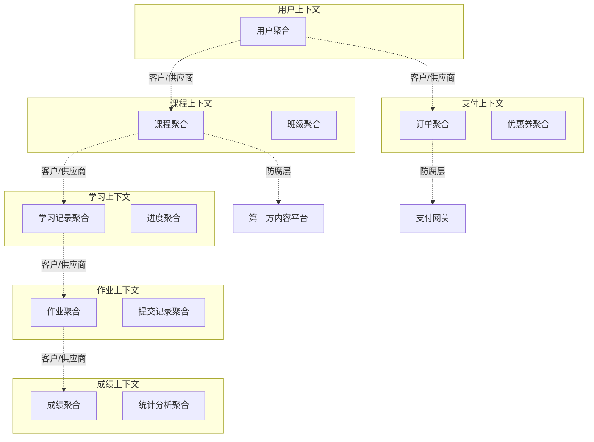

# DDD实践案例

## 概述

通过完整的案例来展示DDD的实际应用，从业务需求分析到代码实现的完整过程。本文以"在线教育平台"为例，展示DDD的实践过程和项目结构。

## 一、案例背景：在线教育平台

### 业务概述
在线教育平台是一个综合性学习平台，支持多种学习模式：
- **课程管理**：讲师创建和管理课程
- **学员管理**：学员注册、报名、学习
- **班级管理**：开班、学员分配、进度跟踪
- **作业系统**：作业布置、提交、批改
- **成绩管理**：成绩统计、成绩分析
- **支付系统**：课程购买、优惠券、支付

### 核心价值
- 为讲师提供教学内容管理工具
- 为学员提供个性化学习体验
- 为平台提供运营和盈利能力

## 二、战略设计过程

### 1. 子域划分

#### 核心域（Core Domain）
**课程学习域**：平台的差异化竞争力
- 课程内容和结构设计
- 学习路径规划
- 智能推荐算法
- 学习效果评估

#### 支撑域（Supporting Domain）
**班级管理域**：必要的支撑功能
- 班级开班和管理
- 学员分配和进度跟踪
- 学习计划制定

**作业成绩域**：教学质量管理
- 作业管理和批改
- 成绩统计和分析
- 学习质量监控

#### 通用域（Generic Domain）
**用户管理域**：通用功能，可购买方案
- 用户注册和认证
- 权限管理
- 用户资料管理

**支付财务域**：标准财务功能
- 支付处理
- 财务对账
- 优惠券管理

### 2. 界限上下文划分

#### 上下文映射图



### 3. 统一语言建立

#### 术语词典
```
课程（Course）：教学内容的完整单元，包含多个章节和学习材料
- 包含：课程标题、描述、价格、时长、难度等级
- 行为：发布、下架、修改内容、定价

班级（Class）：课程的具体实现形式，有固定的开班时间
- 包含：班级编号、开班时间、结束时间、讲师、学员列表
- 行为：开班、分配学员、记录考勤、结束班级

学员（Student）：平台的学习者角色
- 包含：学员ID、学习进度、成绩记录、学习偏好
- 行为：报名、学习、提交作业、查看成绩

讲师（Teacher）：平台的授课者角色
- 包含：讲师ID、专业领域、教学经验、评价
- 行为：创建课程、批改作业、发布通知

学习进度（Progress）：学员在班级中的学习状态
- 包含：当前章节、完成度、学习时长、最后活跃时间
- 行为：更新进度、记录学习时长、计算完成度

作业（Homework）：讲师布置的学习任务
- 包含：作业标题、内容、截止时间、评分标准
- 行为：发布、批改、统计分析
```

## 三、战术设计：领域模型

### 1. 课程上下文模型

#### 课程聚合根
```java
@Entity
public class Course {
    private CourseId id;
    private String title;
    private String description;
    private Money price;
    private Duration duration;
    private DifficultyLevel difficulty;
    private CourseStatus status;
    private List<Chapter> chapters;
    private TeacherId teacherId;
    private String categoryId;
    private List<CourseTag> tags;
    private LocalDateTime createTime;
    private LocalDateTime updateTime;

    // 私有构造器
    private Course(CourseId id, String title, String description, TeacherId teacherId) {
        this.id = Objects.requireNonNull(id);
        this.title = Objects.requireNonNull(title);
        this.description = Objects.requireNonNull(description);
        this.teacherId = Objects.requireNonNull(teacherId);
        this.status = CourseStatus.DRAFT;
        this.chapters = new ArrayList<>();
        this.tags = new ArrayList<>();
        this.createTime = LocalDateTime.now();
        this.validateTitle(title);
        this.validateDescription(description);
    }

    // 工厂方法
    public static Course create(String title, String description, TeacherId teacherId) {
        return new Course(CourseId.generate(), title, description, teacherId);
    }

    // 添加章节
    public void addChapter(String chapterTitle, String content, int sortOrder) {
        if (status != CourseStatus.DRAFT) {
            throw new DomainException("只有草稿状态才能添加章节");
        }

        if (chapters.stream().anyMatch(c -> c.getSortOrder() == sortOrder)) {
            throw new DomainException("章节排序号已存在: " + sortOrder);
        }

        Chapter chapter = new Chapter(chapterTitle, content, sortOrder);
        chapters.add(chapter);
        this.updateTime = LocalDateTime.now();
    }

    // 删除章节
    public void removeChapter(ChapterId chapterId) {
        if (status != CourseStatus.DRAFT) {
            throw new DomainException("只有草稿状态才能删除章节");
        }

        chapters.removeIf(chapter -> chapter.getId().equals(chapterId));
        this.updateTime = LocalDateTime.now();
    }

    // 更新章节
    public void updateChapter(ChapterId chapterId, String title, String content) {
        if (status != CourseStatus.DRAFT) {
            throw new DomainException("只有草稿状态才能更新章节");
        }

        chapters.stream()
            .filter(chapter -> chapter.getId().equals(chapterId))
            .findFirst()
            .ifPresent(chapter -> {
                chapter.updateContent(title, content);
                this.updateTime = LocalDateTime.now();
            });
    }

    // 发布课程
    public void publish() {
        if (status != CourseStatus.DRAFT) {
            throw new DomainException("只有草稿状态才能发布");
        }

        if (chapters.isEmpty()) {
            throw new DomainException("发布课程必须包含至少一个章节");
        }

        if (price == null || price.lessThanOrEqual(Money.ZERO)) {
            throw new DomainException("发布课程必须设置有效价格");
        }

        this.status = CourseStatus.PUBLISHED;
        this.updateTime = LocalDateTime.now();

        // 记录领域事件
        DomainEventPublisher.publish(new CoursePublishedEvent(id, title, teacherId));
    }

    // 设置价格
    public void setPrice(Money price) {
        if (price == null || price.lessThan(Money.ZERO)) {
            throw new DomainException("课程价格不能为负数");
        }

        if (status == CourseStatus.PUBLISHED && !this.price.equals(price)) {
            // 已发布的课程调价需要特殊处理
            DomainEventPublisher.publish(new CoursePriceChangedEvent(id, this.price, price));
        }

        this.price = price;
        this.updateTime = LocalDateTime.now();
    }

    // 下架课程
    public void unpublish() {
        if (status != CourseStatus.PUBLISHED) {
            throw new DomainException("只有已发布的课程才能下架");
        }

        this.status = CourseStatus.UNPUBLISHED;
        this.updateTime = LocalDateTime.now();

        DomainEventPublisher.publish(new CourseUnpublishedEvent(id, title, teacherId));
    }

    // 计算课程时长
    public Duration calculateDuration() {
        return chapters.stream()
            .map(Chapter::getEstimatedDuration)
            .reduce(Duration.ZERO, Duration::plus);
    }

    // 验证课程内容完整性
    public boolean isComplete() {
        return !chapters.isEmpty() &&
               title != null && !title.trim().isEmpty() &&
               description != null && !description.trim().isEmpty() &&
               price != null && price.greaterThan(Money.ZERO);
    }

    // 私有校验方法
    private void validateTitle(String title) {
        if (title == null || title.trim().isEmpty()) {
            throw new DomainException("课程标题不能为空");
        }
        if (title.length() > 100) {
            throw new DomainException("课程标题不能超过100个字符");
        }
    }

    private void validateDescription(String description) {
        if (description == null || description.trim().isEmpty()) {
            throw new DomainException("课程描述不能为空");
        }
        if (description.length() > 5000) {
            throw new DomainException("课程描述不能超过5000个字符");
        }
    }

    // Getter方法
    public CourseId getId() { return id; }
    public String getTitle() { return title; }
    public String getDescription() { return description; }
    public Money getPrice() { return price; }
    public CourseStatus getStatus() { return status; }
    public List<Chapter> getChapters() { return Collections.unmodifiableList(chapters); }
    public TeacherId getTeacherId() { return teacherId; }
}
```

#### 章节实体
```java
public class Chapter {
    private ChapterId id;
    private String title;
    private String content;
    private Duration estimatedDuration;
    private int sortOrder;
    private List<LearningResource> resources;

    Chapter(String title, String content, int sortOrder) {
        this.id = ChapterId.generate();
        this.title = Objects.requireNonNull(title);
        this.content = Objects.requireNonNull(content);
        this.sortOrder = sortOrder;
        this.resources = new ArrayList<>();
        this.estimatedDuration = estimateDuration(content);
        validateChapter(title, content);
    }

    void updateContent(String title, String content) {
        this.title = Objects.requireNonNull(title);
        this.content = Objects.requireNonNull(content);
        this.estimatedDuration = estimateDuration(content);
        validateChapter(title, content);
    }

    void addResource(String resourceUrl, ResourceType type) {
        LearningResource resource = new LearningResource(resourceUrl, type);
        this.resources.add(resource);
    }

    private Duration estimateDuration(String content) {
        // 简单估算：假设每1000字需要15分钟
        int wordCount = content.split("\\s+").length;
        return Duration.ofMinutes((long) Math.ceil(wordCount * 15.0 / 1000));
    }

    private void validateChapter(String title, String content) {
        if (title.trim().isEmpty()) {
            throw new DomainException("章节标题不能为空");
        }
        if (content.trim().isEmpty()) {
            throw new DomainException("章节内容不能为空");
        }
    }

    // Getter方法
    public ChapterId getId() { return id; }
    public String getTitle() { return title; }
    public String getContent() { return content; }
    public Duration getEstimatedDuration() { return estimatedDuration; }
    public int getSortOrder() { return sortOrder; }
    public List<LearningResource> getResources() { return Collections.unmodifiableList(resources); }
}
```

### 2. 班级上下文模型

#### 班级聚合根
```java
@Entity
public class SchoolClass {
    private ClassId id;
    private String classCode;
    private CourseId courseId;
    private TeacherId teacherId;
    private ClassStatus status;
    private LocalDateTime startTime;
    private LocalDateTime endTime;
    private int maxStudents;
    private List<StudentEnrollment> enrollments;
    private ClassSchedule schedule;
    private LocalDateTime createTime;
    private LocalDateTime updateTime;

    // 私有构造器
    private SchoolClass(ClassId id, String classCode, CourseId courseId, TeacherId teacherId,
                        LocalDateTime startTime, LocalDateTime endTime, int maxStudents) {
        this.id = Objects.requireNonNull(id);
        this.classCode = Objects.requireNonNull(classCode);
        this.courseId = Objects.requireNonNull(courseId);
        this.teacherId = Objects.requireNonNull(teacherId);
        this.startTime = Objects.requireNonNull(startTime);
        this.endTime = Objects.requireNonNull(endTime);
        this.maxStudents = maxStudents;
        this.status = ClassStatus.PLANNING;
        this.enrollments = new ArrayList<>();
        this.createTime = LocalDateTime.now();
        validateClassParameters(classCode, startTime, endTime, maxStudents);
    }

    // 工厂方法
    public static SchoolClass create(String classCode, CourseId courseId, TeacherId teacherId,
                                     LocalDateTime startTime, LocalDateTime endTime, int maxStudents) {
        return new SchoolClass(
            ClassId.generate(), classCode, courseId, teacherId, startTime, endTime, maxStudents
        );
    }

    // 学员报名
    public void enrollStudent(StudentId studentId, EnrollmentType enrollmentType) {
        if (status != ClassStatus.OPEN_FOR_ENROLLMENT) {
            throw new DomainException("班级当前不接受报名: " + status);
        }

        if (enrollments.size() >= maxStudents) {
            throw new DomainException("班级人数已满");
        }

        if (enrollments.stream().anyMatch(e -> e.getStudentId().equals(studentId))) {
            throw new DomainException("学员已在此班级中: " + studentId);
        }

        StudentEnrollment enrollment = new StudentEnrollment(studentId, enrollmentType, LocalDateTime.now());
        enrollments.add(enrollment);

        // 如果报名人数达到最大值，更新状态
        if (enrollments.size() == maxStudents) {
            this.status = ClassStatus.FULL;
        }

        // 记录事件
        DomainEventPublisher.publish(new StudentEnrolledEvent(id, studentId, classCode));

        this.updateTime = LocalDateTime.now();
    }

    // 取消学员报名
    public void cancelEnrollment(StudentId studentId, String reason) {
        if (status == ClassStatus.COMPLETED || status == ClassStatus.CANCELLED) {
            throw new DomainException("已结束或已取消的班级不能取消报名");
        }

        boolean removed = enrollments.removeIf(enrollment -> enrollment.getStudentId().equals(studentId));
        if (!removed) {
            throw new DomainException("学员不在此班级中: " + studentId);
        }

        // 如果班级已满，重新开放报名
        if (status == ClassStatus.FULL) {
            this.status = ClassStatus.OPEN_FOR_ENROLLMENT;
        }

        // 记录事件
        DomainEventPublisher.publish(new EnrollmentCancelledEvent(id, studentId, reason));

        this.updateTime = LocalDateTime.now();
    }

    // 开始班级
    public void startClass() {
        if (status != ClassStatus.OPEN_FOR_ENROLLMENT && status != ClassStatus.FULL) {
            throw new DomainException("只有开放报名或已满的班级才能开始");
        }

        if (LocalDateTime.now().isBefore(startTime)) {
            throw new DomainException("班级还未到开始时间");
        }

        if (enrollments.isEmpty()) {
            throw new DomainException("没有学员报名的班级不能开始");
        }

        this.status = ClassStatus.IN_PROGRESS;

        // 初始化所有学员的学习进度
        for (StudentEnrollment enrollment : enrollments) {
            DomainEventPublisher.publish(new ClassStartedEvent(
                id, courseId, enrollment.getStudentId(), startTime
            ));
        }

        this.updateTime = LocalDateTime.now();
    }

    // 结束班级
    public void endClass() {
        if (status != ClassStatus.IN_PROGRESS) {
            throw new DomainException("只有进行中的班级才能结束");
        }

        if (LocalDateTime.now().isBefore(endTime)) {
            throw new DomainException("班级还未到结束时间");
        }

        this.status = ClassStatus.COMPLETED;

        // 发布班级结束事件
        DomainEventPublisher.publish(new ClassCompletedEvent(
            id, courseId, teacherId, enrollments.size(), LocalDateTime.now()
        ));

        this.updateTime = LocalDateTime.now();
    }

    // 取消班级
    public void cancelClass(String reason) {
        if (status == ClassStatus.COMPLETED || status == ClassStatus.CANCELLED) {
            throw new DomainException("已结束或已取消的班级不能再次取消");
        }

        this.status = ClassStatus.CANCELLED;

        // 通知所有学员班级取消
        for (StudentEnrollment enrollment : enrollments) {
            DomainEventPublisher.publish(new ClassCancelledEvent(
                id, courseId, enrollment.getStudentId(), reason
            ));
        }

        this.updateTime = LocalDateTime.now();
    }

    // 更新班级时间
    public void updateSchedule(LocalDateTime newStartTime, LocalDateTime newEndTime) {
        if (status == ClassStatus.IN_PROGRESS || status == ClassStatus.COMPLETED) {
            throw new DomainException("进行中或已完成的班级不能更新时间安排");
        }

        validateScheduleChange(newStartTime, newEndTime);

        this.startTime = newStartTime;
        this.endTime = newEndTime;

        // 记录时间变更事件
        DomainEventPublisher.publish(new ScheduleUpdatedEvent(
            id, startTime, newStartTime, endTime, newEndTime
        ));

        this.updateTime = LocalDateTime.now();
    }

    // 获取班级统计信息
    public ClassStatistics getStatistics() {
        int enrolledCount = enrollments.size();
        int activeCount = (int) enrollments.stream()
            .filter(e -> e.isActive())
            .count();

        return ClassStatistics.builder()
            .classId(id)
            .classCode(classCode)
            .enrolledCount(enrolledCount)
            .activeCount(activeCount)
            .availableSpots(maxStudents - enrolledCount)
            .status(status)
            .startTime(startTime)
            .endTime(endTime)
            .build();
    }

    // 检查学员是否在班级中
    public boolean hasStudent(StudentId studentId) {
        return enrollments.stream()
            .anyMatch(enrollment -> enrollment.getStudentId().equals(studentId));
    }

    // 获取活跃学员数量
    public int getActiveStudentCount() {
        return (int) enrollments.stream()
            .filter(StudentEnrollment::isActive)
            .count();
    }

    // 检查班级是否可以接受报名
    public boolean canEnroll() {
        return status == ClassStatus.OPEN_FOR_ENROLLMENT && enrollments.size() < maxStudents;
    }

    // 私有校验方法
    private void validateClassParameters(String classCode, LocalDateTime startTime,
                                       LocalDateTime endTime, int maxStudents) {
        if (classCode == null || classCode.trim().isEmpty()) {
            throw new DomainException("班级编码不能为空");
        }
        if (!classCode.matches("^[A-Z0-9]{6,12}$")) {
            throw new DomainException("班级编码格式不正确");
        }
        if (startTime.isAfter(endTime)) {
            throw new DomainException("开始时间不能晚于结束时间");
        }
        if (maxStudents <= 0 || maxStudents > 200) {
            throw new DomainException("班级人数限制必须在1-200之间");
        }
    }

    private void validateScheduleChange(LocalDateTime newStartTime, LocalDateTime newEndTime) {
        if (newStartTime.isAfter(newEndTime)) {
            throw new DomainException("新的开始时间不能晚于结束时间");
        }
        if (LocalDateTime.now().isAfter(newStartTime)) {
            throw new DomainException("不能将开始时间设置为过去的时间");
        }
    }

    // Getter方法
    public ClassId getId() { return id; }
    public String getClassCode() { return classCode; }
    public CourseId getCourseId() { return courseId; }
    public TeacherId getTeacherId() { return teacherId; }
    public ClassStatus getStatus() { return status; }
    public LocalDateTime getStartTime() { return startTime; }
    public LocalDateTime getEndTime() { return endTime; }
    public int getMaxStudents() { return maxStudents; }
    public List<StudentEnrollment> getEnrollments() { return Collections.unmodifiableList(enrollments); }
    public LocalDateTime getCreateTime() { return createTime; }
}
```

### 3. 学习上下文模型

#### 学习进度聚合根
```java
@Entity
public class LearningProgress {
    private ProgressId id;
    private StudentId studentId;
    private ClassId classId;
    private CourseId courseId;
    private List<ChapterProgress> chapterProgresses;
    private Duration totalLearningTime;
    private LocalDate lastActiveDate;
    private ProgressStatus status;
    private Money amountPaid;
    private LocalDateTime createTime;
    private LocalDateTime updateTime;

    // 私有构造器
    private LearningProgress(ProgressId id, StudentId studentId, ClassId classId, CourseId courseId) {
        this.id = Objects.requireNonNull(id);
        this.studentId = Objects.requireNonNull(studentId);
        this.classId = Objects.requireNonNull(classId);
        this.courseId = Objects.requireNonNull(courseId);
        this.chapterProgresses = new ArrayList<>();
        this.totalLearningTime = Duration.ZERO;
        this.lastActiveDate = LocalDate.now();
        this.status = ProgressStatus.NOT_STARTED;
        this.amountPaid = Money.ZERO;
        this.createTime = LocalDateTime.now();
    }

    // 工厂方法 - 学员开始学习时创建
    public static LearningProgress start(StudentId studentId, ClassId classId, CourseId courseId) {
        LearningProgress progress = new LearningProgress(
            ProgressId.generate(), studentId, classId, courseId
        );

        progress.status = ProgressStatus.IN_PROGRESS;
        DomainEventPublisher.publish(new LearningStartedEvent(progress.id, studentId, classId));

        return progress;
    }

    // 开始学习章节
    public void startChapter(ChapterId chapterId) {
        ChapterProgress chapterProgress = findOrCreateChapterProgress(chapterId);

        if (chapterProgress.getStatus() != ChapterProgressStatus.NOT_STARTED) {
            return; // 已经开始或完成
        }

        chapterProgress.start();
        updateOverallProgress();
        updateLastActiveDate();

        DomainEventPublisher.publish(new ChapterStartedEvent(
            id, studentId, classId, chapterId
        ));

        this.updateTime = LocalDateTime.now();
    }

    // 完成章节学习
    public void completeChapter(ChapterId chapterId, Duration learningTime) {
        ChapterProgress chapterProgress = findChapterProgress(chapterId)
            .orElseThrow(() -> new DomainException("章节进度不存在: " + chapterId));

        if (chapterProgress.getStatus() == ChapterProgressStatus.COMPLETED) {
            return; // 已经完成
        }

        chapterProgress.complete(learningTime);
        this.totalLearningTime = this.totalLearningTime.add(learningTime);
        updateOverallProgress();
        updateLastActiveDate();

        DomainEventPublisher.publish(new ChapterCompletedEvent(
            id, studentId, classId, chapterId, learningTime
        ));

        // 检查是否完成整个课程
        if (isAllChaptersCompleted()) {
            completeCourse();
        }

        this.updateTime = LocalDateTime.now();
    }

    // 记录学习时间
    public void recordLearningTime(ChapterId chapterId, Duration learningTime) {
        ChapterProgress chapterProgress = findChapterProgress(chapterId)
            .orElseThrow(() -> new DomainException("章节进度不存在: " + chapterId));

        chapterProgress.addLearningTime(learningTime);
        this.totalLearningTime = this.totalLearningTime.add(learningTime);
        updateLastActiveDate();

        this.updateTime = LocalDateTime.now();
    }

    // 完成整个课程学习
    private void completeCourse() {
        this.status = ProgressStatus.COMPLETED;

        DomainEventPublisher.publish(new CourseCompletedEvent(
            id, studentId, classId, courseId, totalLearningTime, LocalDateTime.now()
        ));
    }

    // 暂停学习
    public void pause() {
        if (status == ProgressStatus.COMPLETED) {
            throw new DomainException("已完成的学习进度不能暂停");
        }

        this.status = ProgressStatus.PAUSED;

        DomainEventPublisher.publish(new LearningPausedEvent(
            id, studentId, classId
        ));

        this.updateTime = LocalDateTime.now();
    }

    // 恢复学习
    public void resume() {
        if (status != ProgressStatus.PAUSED) {
            throw new DomainException("只有暂停的学习进度才能恢复");
        }

        this.status = ProgressStatus.IN_PROGRESS;
        updateLastActiveDate();

        DomainEventPublisher.publish(new LearningResumedEvent(
            id, studentId, classId
        ));

        this.updateTime = LocalDateTime.now();
    }

    // 更新支付状态
    public void markAsPaid(Money amount) {
        if (amount == null || amount.lessThanOrEqual(Money.ZERO)) {
            throw new DomainException("支付金额必须大于零");
        }

        this.amountPaid = this.amountPaid.add(amount);

        DomainEventPublisher.publish(new PaymentRecordedEvent(
            id, studentId, classId, amount, this.amountPaid
        ));

        this.updateTime = LocalDateTime.now();
    }

    // 获取完成度百分比
    public double getCompletionPercentage() {
        if (chapterProgresses.isEmpty()) {
            return 0.0;
        }

        long completedChapters = chapterProgresses.stream()
            .filter(cp -> cp.getStatus() == ChapterProgressStatus.COMPLETED)
            .count();

        return (double) completedChapters / chapterProgresses.size() * 100;
    }

    // 获取学习统计
    public LearningStatistics getStatistics() {
        int totalChapters = chapterProgresses.size();
        long completedChapters = chapterProgresses.stream()
            .filter(cp -> cp.getStatus() == ChapterProgressStatus.COMPLETED)
            .count();
        long inProgressChapters = chapterProgresses.stream()
            .filter(cp -> cp.getStatus() == ChapterProgressStatus.IN_PROGRESS)
            .count();

        return LearningStatistics.builder()
            .progressId(id)
            .studentId(studentId)
            .classId(classId)
            .courseId(courseId)
            .status(status)
            .completionPercentage(getCompletionPercentage())
            .totalChapters(totalChapters)
            .completedChapters((int) completedChapters)
            .inProgressChapters((int) inProgressChapters)
            .totalLearningTime(totalLearningTime)
            .lastActiveDate(lastActiveDate)
            .isPaid(amountPaid.greaterThan(Money.ZERO))
            .build();
    }

    // 检查是否所有章节都已完成
    private boolean isAllChaptersCompleted() {
        return chapterProgresses.stream()
            .allMatch(cp -> cp.getStatus() == ChapterProgressStatus.COMPLETED);
    }

    // 查找或创建章节进度
    private ChapterProgress findOrCreateChapterProgress(ChapterId chapterId) {
        return chapterProgresses.stream()
            .filter(cp -> cp.getChapterId().equals(chapterId))
            .findFirst()
            .orElseGet(() -> {
                ChapterProgress newProgress = new ChapterProgress(chapterId);
                chapterProgresses.add(newProgress);
                return newProgress;
            });
    }

    // 查找章节进度
    private Optional<ChapterProgress> findChapterProgress(ChapterId chapterId) {
        return chapterProgresses.stream()
            .filter(cp -> cp.getChapterId().equals(chapterId))
            .findFirst();
    }

    // 更新整体进度状态
    private void updateOverallProgress() {
        long completedCount = chapterProgresses.stream()
            .filter(cp -> cp.getStatus() == ChapterProgressStatus.COMPLETED)
            .count();

        if (completedCount == 0) {
            this.status = ProgressStatus.IN_PROGRESS;
        } else if (completedCount == chapterProgresses.size()) {
            completeCourse();
        } else {
            this.status = ProgressStatus.IN_PROGRESS;
        }
    }

    // 更新最后活跃日期
    private void updateLastActiveDate() {
        this.lastActiveDate = LocalDate.now();
    }

    // Getter方法
    public ProgressId getId() { return id; }
    public StudentId getStudentId() { return studentId; }
    public ClassId getClassId() { return classId; }
    public ProgressStatus getStatus() { return status; }
    public Duration getTotalLearningTime() { return totalLearningTime; }
    public LocalDate getLastActiveDate() { return lastActiveDate; }
    public Money getAmountPaid() { return amountPaid; }
    public List<ChapterProgress> getChapterProgresses() {
        return Collections.unmodifiableList(chapterProgresses);
    }
}
```

## 四、项目结构设计

### 完整的DDD项目结构

```
online-education-platform/
├── README.md
├── docker-compose.yml
├── pom.xml
│
├── user-service/                      # 用户微服务
│   ├── src/
│   │   └── main/
│   │       ├── java/
│   │       │   └── com/education/user/
│   │       │       ├── UserApplication.java
│   │       │       ├── domain/                  # 领域层
│   │       │       │   ├── user/
│   │       │       │   │   ├── User.java         # 实体/聚合根
│   │       │       │   │   ├── UserId.java       # 值对象
│   │       │       │   │   ├── UserProfile.java  # 值对象
│   │       │       │   │   ├── Email.java       # 值对象
│   │       │       │   │   ├── UserRepository.java    # 仓储接口
│   │       │       │   │   └── UserDomainService.java # 领域服务
│   │       │       │   └── shared/              # 共享内核
│   │       │       │       ├── valueobject/
│   │       │       │       │   ├── Money.java
│   │       │       │       │   └── PhoneNumber.java
│   │       │       │       └── event/
│   │       │       │           └── DomainEvent.java
│   │       │       ├── application/             # 应用层
│   │       │       │   ├── UserApplicationService.java
│   │       │       │   ├── command/
│   │       │       │   │   ├── RegisterUserCommand.java
│   │       │       │   │   └── UpdateUserCommand.java
│   │       │       │   ├── query/
│   │       │       │   │   ├── GetUserDetailQuery.java
│   │       │       │   │   └── UserDetailDTO.java
│   │       │       │   └── service/
│   │       │       │       └── UserQueryService.java
│   │       │       ├── infrastructure/           # 基础设施层
│   │       │       │   ├── repository/
│   │       │       │   │   └── UserRepositoryImpl.java
│   │       │       │   ├── adapter/
│   │       │       │   │   ├── EmailAdapter.java
│   │       │       │   │   └── SmsAdapter.java
│   │       │       │   └── config/
│   │       │       │       ├── DatabaseConfig.java
│   │       │       │       └── RedisConfig.java
│   │       │       └── interfaces/              # 接口层
│   │       │           ├── UserController.java
│   │       │           ├── UserEventListener.java
│   │       │           └── dto/
│   │       │               ├── RegisterRequest.java
│   │       │               └── UserResponse.java
│   │       └── resources/
│   │           ├── application.yml
│   │           └── db/migration/
│   │               └── V1__Create_user_tables.sql
│   └── Dockerfile
│
├── course-service/                    # 课程微服务
│   ├── src/
│   │   └── main/
│   │       ├── java/
│   │       │   └── com/education/course/
│   │       │       ├── CourseApplication.java
│   │       │       ├── domain/
│   │       │       │   ├── course/
│   │       │       │   │   ├── Course.java
│   │       │       │   │   ├── Chapter.java
│   │       │       │   │   ├── LearningResource.java
│   │       │       │   │   ├── CourseRepository.java
│   │       │       │   │   └── CourseDomainService.java
│   │       │       │   └── teacher/
│   │       │       │       ├── Teacher.java
│   │       │       │       ├── TeacherRepository.java
│   │       │       │       └── TeacherDomainService.java
│   │       │       ├── application/
│   │       │       │   ├── CourseApplicationService.java
│   │       │       │   ├── TeacherApplicationService.java
│   │       │       │   └── command/
│   │       │       │       ├── CreateCourseCommand.java
│   │       │       │       ├── PublishCourseCommand.java
│   │       │       │       └── AddChapterCommand.java
│   │       │       ├── infrastructure/
│   │       │       │   ├── repository/
│   │       │       │   │   ├── CourseRepositoryImpl.java
│   │       │       │   │   └── TeacherRepositoryImpl.java
│   │       │       │   ├── adapter/
│   │       │       │   │   ├── FileStorageAdapter.java
│   │       │       │   │   └── ContentReviewAdapter.java
│   │       │       │   └── search/
│   │       │       │       └── CourseSearchService.java
│   │       │       └── interfaces/
│   │       │           ├── CourseController.java
│   │       │           ├── TeacherController.java
│   │       │           └── dto/
│   │       │               ├── CourseDTO.java
│   │       │               ├── ChapterDTO.java
│   │       │               └── TeacherDTO.java
│   │       └── resources/
│   │           ├── application.yml
│   │           └── db/migration/
│   │               └── V1__Create_course_tables.sql
│   └── Dockerfile
│
├── class-service/                     # 班级微服务
│   ├── src/
│   │   └── main/
│   │       ├── java/
│   │       │   └── com/education/class/
│   │       │       ├── ClassApplication.java
│   │       │       ├── domain/
│   │       │       │   ├── schoolclass/
│   │       │       │   │   ├── SchoolClass.java
│   │       │       │   │   ├── StudentEnrollment.java
│   │       │       │   │   ├── ClassSchedule.java
│   │       │       │   │   ├── ClassRepository.java
│   │       │       │   │   └── ClassDomainService.java
│   │       │       │   └── enrollment/
│   │       │       │       ├── Enrollment.java
│   │       │       │       └── EnrollmentPolicy.java
│   │       │       ├── application/
│   │       │       │   ├── ClassApplicationService.java
│   │       │       │   ├── EnrollmentApplicationService.java
│   │       │       │   └── command/
│   │       │       │       ├── CreateClassCommand.java
│   │       │       │       ├── EnrollStudentCommand.java
│   │       │       │       └── StartClassCommand.java
│   │       │       ├── infrastructure/
│   │       │       │   ├── repository/
│   │       │       │   │   └── ClassRepositoryImpl.java
│   │       │       │   └── adapter/
│   │       │       │       ├── NotificationAdapter.java
│   │       │       │       └── CalendarIntegrationAdapter.java
│   │       │       └── interfaces/
│   │       │           ├── ClassController.java
│   │       │           ├── EnrollmentController.java
│   │       │           └── dto/
│   │       │               ├── ClassDTO.java
│   │       │               └── EnrollmentDTO.java
│   │       └── resources/
│   │           ├── application.yml
│   │           └── db/migration/
│   │               └── V1__Create_class_tables.sql
│   └── Dockerfile
│
├── learning-service/                  # 学习微服务
│   ├── src/
│   │   └── main/
│   │       ├── java/
│   │       │   └── com/education/learning/
│   │       │       ├── LearningApplication.java
│   │       │       ├── domain/
│   │       │       │   ├── progress/
│   │       │       │   │   ├── LearningProgress.java
│   │       │       │   │   ├── ChapterProgress.java
│   │       │       │   │   ├── LearningStatistics.java
│   │       │       │   │   ├── ProgressRepository.java
│   │       │       │   │   └── ProgressDomainService.java
│   │       │       │   └── study/
│   │       │       │       ├── StudyRecord.java
│   │       │       │       └── StudySession.java
│   │       │       ├── application/
│   │       │       │   ├── ProgressApplicationService.java
│   │       │       │   ├── command/
│   │       │       │   │   ├── StartChapterCommand.java
│   │       │       │   │   ├── CompleteChapterCommand.java
│   │       │       │   │   └── RecordStudyTimeCommand.java
│   │       │       │   └── query/
│   │       │       │       ├── GetProgressQuery.java
│   │       │       │       └── ProgressDTO.java
│   │       │       ├── infrastructure/
│   │       │       │   ├── repository/
│   │       │       │   │   └── ProgressRepositoryImpl.java
│   │       │       │   ├── adapter/
│   │       │       │   │   ├── AnalyticsAdapter.java
│   │       │       │   │   └── RecommendationAdapter.java
│   │       │       │   └── cache/
│   │       │       │       └── ProgressCacheService.java
│   │       │       └── interfaces/
│   │       │           ├── ProgressController.java
│   │       │           └── StudyController.java
│   │       └── resources/
│   │           ├── application.yml
│   │           └── db/migration/
│   │               └── V1__Create_learning_tables.sql
│   └── Dockerfile
│
├── homework-service/                   # 作业微服务
│   └── ... (类似结构)
│
├── payment-service/                    # 支付微服务
│   └── ... (类似结构)
│
├── api-gateway/                        # API网关
│   ├── src/
│   │   └── main/
│   │       ├── java/
│   │       │   └── com/education/gateway/
│   │       │       ├── GatewayApplication.java
│   │       │       ├── config/
│   │       │       │   ├── GatewayConfig.java
│   │       │       │   ├── SecurityConfig.java
│   │       │       │   └── CorsConfig.java
│   │       │       ├── filter/
│   │       │       │   ├── AuthenticationFilter.java
│   │       │       │   ├── RateLimitingFilter.java
│   │       │       │   └── LoggingFilter.java
│   │       │       └── exception/
│   │       │           └── GlobalExceptionHandler.java
│   │       └── resources/
│   │           └── application.yml
│   └── Dockerfile
│
├── shared-kernel/                      # 共享内核
│   ├── src/
│   │   └── main/
│   │       ├── java/
│   │       │   └── com/education/shared/
│   │       │       ├── domain/
│   │       │       │   ├── valueobject/
│   │       │       │   │   ├── Money.java
│   │       │       │   │   ├── Email.java
│   │       │       │   │   ├── PhoneNumber.java
│   │       │       │   │   └── Address.java
│   │       │       │   ├── event/
│   │       │       │   │   ├── DomainEvent.java
│   │       │       │   │   ├── DomainEventPublisher.java
│   │       │       │   │   └── DomainEventHandler.java
│   │       │       │   └── exception/
│   │       │       │       ├── DomainException.java
│   │       │       │       └── BusinessException.java
│   │       │       ├── application/
│   │       │       │   ├── command/
│   │       │       │   │   └── Command.java
│   │       │       │   ├── query/
│   │       │       │   │   └── Query.java
│   │       │       │   └── dto/
│   │       │       │       └── BaseDTO.java
│   │       │       └── infrastructure/
│   │       │           ├── messaging/
│   │       │           │   ├── KafkaConfig.java
│   │       │           │   ├── DomainEventKafkaPublisher.java
│   │       │           │   └── MessageTopics.java
│   │       │           ├── security/
│   │       │           │   ├── JwtTokenProvider.java
│   │       │           │   └── PasswordEncoder.java
│   │       │           └── validation/
│   │       │               └── ValidationUtils.java
│   │       └── resources/
│   └── pom.xml
│
└── deployment/                         # 部署配置
    ├── kubernetes/
    │   ├── namespace.yaml
    │   ├── configmap.yaml
    │   ├── secret.yaml
    │   ├── user-service-deployment.yaml
    │   ├── course-service-deployment.yaml
    │   ├── class-service-deployment.yaml
    │   ├── learning-service-deployment.yaml
    │   ├── api-gateway-deployment.yaml
    │   └── ingress.yaml
    ├── docker-compose/
    │   └── docker-compose.yml
    └── helm/
        └── online-education/
            ├── Chart.yaml
            ├── values.yaml
            └── templates/
```

## 五、配置和部署

### 1. Docker配置

#### api-gateway Dockerfile
```dockerfile
FROM openjdk:17-jdk-slim

WORKDIR /app

COPY target/api-gateway-*.jar app.jar

EXPOSE 8080

ENTRYPOINT ["java", "-jar", "app.jar"]
```

#### docker-compose.yml
```yaml
version: '3.8'

services:
  api-gateway:
    build: ./api-gateway
    ports:
      - "8080:8080"
    environment:
      - SPRING_PROFILES_ACTIVE=docker
      - EUREKA_CLIENT_SERVICE_URL_DEFAULTZONE=http://eureka-server:8761/eureka
    depends_on:
      - eureka-server
      - user-service
      - course-service
      - class-service
      - learning-service

  user-service:
    build: ./user-service
    environment:
      - SPRING_PROFILES_ACTIVE=docker
      - SPRING_DATASOURCE_URL=jdbc:mysql://mysql:3306/education_user
      - SPRING_REDIS_HOST=redis
    depends_on:
      - mysql
      - redis

  course-service:
    build: ./course-service
    environment:
      - SPRING_PROFILES_ACTIVE=docker
      - SPRING_DATASOURCE_URL=jdbc:mysql://mysql:3306/education_course
      - ELASTICSEARCH_HOST=elasticsearch
    depends_on:
      - mysql
      - elasticsearch

  class-service:
    build: ./class-service
    environment:
      - SPRING_PROFILES_ACTIVE=docker
      - SPRING_DATASOURCE_URL=jdbc:mysql://mysql:3306/education_class
    depends_on:
      - mysql

  learning-service:
    build: ./learning-service
    environment:
      - SPRING_PROFILES_ACTIVE=docker
      - SPRING_DATASOURCE_URL=jdbc:mysql://mysql:3306/education_learning
      - SPRING_REDIS_HOST=redis
    depends_on:
      - mysql
      - redis

  mysql:
    image: mysql:8.0
    environment:
      MYSQL_ROOT_PASSWORD: root123
      MYSQL_DATABASE: education
    ports:
      - "3306:3306"
    volumes:
      - mysql_data:/var/lib/mysql

  redis:
    image: redis:7-alpine
    ports:
      - "6379:6379"

  elasticsearch:
    image: elasticsearch:8.5.0
    environment:
      - discovery.type=single-node
      - xpack.security.enabled=false
    ports:
      - "9200:9200"
    volumes:
      - es_data:/usr/share/elasticsearch/data

  kafka:
    image: confluentinc/cp-kafka:latest
    environment:
      KAFKA_ZOOKEEPER_CONNECT: zookeeper:2181
      KAFKA_ADVERTISED_LISTENERS: PLAINTEXT://kafka:9092
      KAFKA_OFFSETS_TOPIC_REPLICATION_FACTOR: 1
    depends_on:
      - zookeeper
    ports:
      - "9092:9092"

  zookeeper:
    image: confluentinc/cp-zookeeper:latest
    environment:
      ZOOKEEPER_CLIENT_PORT: 2181
      ZOOKEEPER_TICK_TIME: 2000

volumes:
  mysql_data:
  es_data:
```

### 2. Kubernetes配置

#### user-service-deployment.yaml
```yaml
apiVersion: apps/v1
kind: Deployment
metadata:
  name: user-service
  namespace: education
spec:
  replicas: 3
  selector:
    matchLabels:
      app: user-service
  template:
    metadata:
      labels:
        app: user-service
    spec:
      containers:
      - name: user-service
        image: education/user-service:latest
        ports:
        - containerPort: 8081
        env:
        - name: SPRING_PROFILES_ACTIVE
          value: "k8s"
        - name: SPRING_DATASOURCE_URL
          valueFrom:
            configMapKeyRef:
              name: app-config
              key: database.url
        - name: SPRING_DATASOURCE_USERNAME
          valueFrom:
            secretKeyRef:
              name: db-secret
              key: username
        - name: SPRING_DATASOURCE_PASSWORD
          valueFrom:
            secretKeyRef:
              name: db-secret
              key: password
        resources:
          requests:
            memory: "256Mi"
            cpu: "250m"
          limits:
            memory: "512Mi"
            cpu: "500m"
        livenessProbe:
          httpGet:
            path: /actuator/health
            port: 8081
          initialDelaySeconds: 60
          periodSeconds: 10
        readinessProbe:
          httpGet:
            path: /actuator/health
            port: 8081
          initialDelaySeconds: 30
          periodSeconds: 5

---
apiVersion: v1
kind: Service
metadata:
  name: user-service
  namespace: education
spec:
  selector:
    app: user-service
  ports:
  - port: 8081
    targetPort: 8081
  type: ClusterIP
```

## 六、总结

这个在线教育平台的案例展示了：

1. **完整的DDD实践流程**：从业务分析到代码实现
2. **清晰的领域模型设计**：包含实体、值对象、聚合根
3. **合理的微服务拆分**：基于界限上下文的拆分策略
4. **完整的项目结构**：标准的DDD分层架构
5. **现代化的部署方案**：Docker + Kubernetes

通过这个案例，开发者可以：
- 理解DDD在实际项目中的应用
- 学习如何进行领域建模
- 掌握微服务的拆分和设计
- 了解现代化的部署和运维实践

这个案例为DDD的实践提供了一个完整的参考模板。