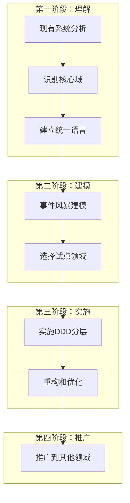
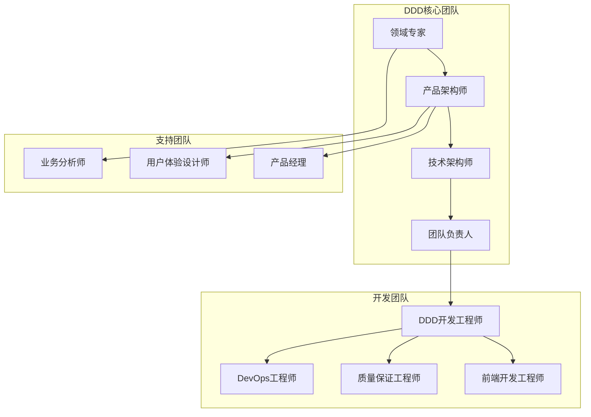
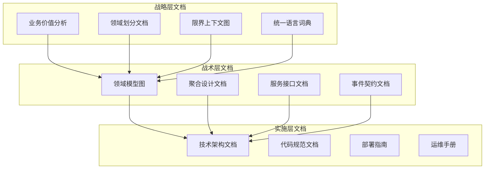
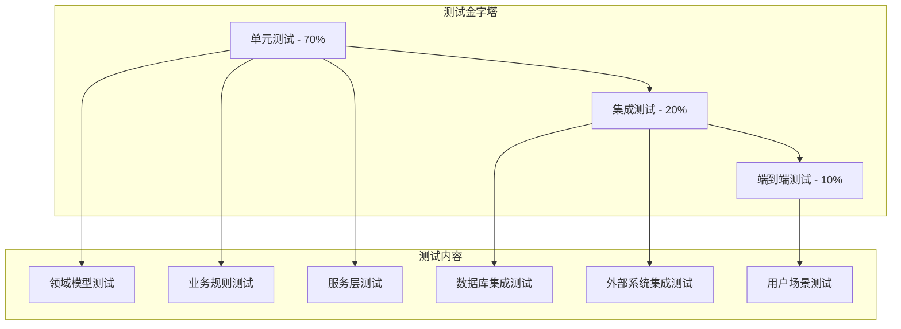

# DDD实践建议

## 概述

DDD的实践不仅仅是技术问题，更是一个**组织和流程问题**。本文提供DDD实施的全面建议，包括技术实践、团队协作、项目管理等多个维度。

## 一、技术实践建议

### 1. 从战略到战术的实施路径

#### 渐进式实施策略



#### 实施步骤详解

**步骤1：现有系统分析**
```java
// 分析现有代码，识别贫血模型
public class BadOrderService {
    public OrderDTO createOrder(CreateOrderDTO dto) {
        // 1. 参数校验
        if (dto.getUserId() == null) {
            throw new IllegalArgumentException("用户ID不能为空");
        }

        // 2. 查询数据
        User user = userRepository.findById(dto.getUserId());
        List<Product> products = productRepository.findByIds(dto.getProductIds());

        // 3. 业务逻辑（全部在服务中）
        OrderDTO orderDTO = new OrderDTO();
        orderDTO.setUserId(dto.getUserId());

        BigDecimal totalAmount = BigDecimal.ZERO;
        for (Product product : products) {
            totalAmount = totalAmount.add(product.getPrice());
            // ... 更多业务逻辑
        }

        orderDTO.setTotalAmount(totalAmount);

        // 4. 保存数据
        Order order = convertToEntity(orderDTO);
        orderRepository.save(order);

        return convertToDTO(order);
    }
}
```

**步骤2：识别重构机会**
```java
// 重构后的充血模型
public class Order {
    private OrderId id;
    private UserId userId;
    private List<OrderItem> items;
    private Money totalAmount;
    private OrderStatus status;

    // 工厂方法
    public static Order create(UserId userId, List<OrderItem> items) {
        if (userId == null) {
            throw new DomainException("用户ID不能为空");
        }
        if (items == null || items.isEmpty()) {
            throw new DomainException("订单项不能为空");
        }

        Order order = new Order();
        order.id = OrderId.generate();
        order.userId = userId;
        order.items = new ArrayList<>(items);
        order.calculateTotalAmount();
        order.status = OrderStatus.PENDING;

        return order;
    }

    // 业务方法
    public void addItem(Product product, int quantity) {
        if (product == null) {
            throw new DomainException("商品不能为空");
        }
        if (quantity <= 0) {
            throw new DomainException("商品数量必须大于0");
        }

        OrderItem item = new OrderItem(product, quantity);
        this.items.add(item);
        calculateTotalAmount();
    }

    public void applyDiscount(Money discount) {
        if (discount == null || discount.lessThanOrEqual(Money.ZERO)) {
            throw new DomainException("折扣金额必须大于0");
        }
        if (discount.greaterThan(totalAmount)) {
            throw new DomainException("折扣金额不能超过订单总价");
        }

        this.totalAmount = this.totalAmount.subtract(discount);
    }

    private void calculateTotalAmount() {
        this.totalAmount = items.stream()
            .map(OrderItem::getSubtotal)
            .reduce(Money.ZERO, Money::add);
    }

    // Getter方法
    public OrderId getId() { return id; }
    public Money getTotalAmount() { return totalAmount; }
    public OrderStatus getStatus() { return status; }
    public List<OrderItem> getItems() { return Collections.unmodifiableList(items); }
}
```

### 2. 聚合设计最佳实践

#### 聚合设计原则

**单一聚合原则**
```java
// 好的设计 - 单一聚合
public class Order {
    private OrderId id;
    private List<OrderItem> items;
    private Money totalAmount;

    // 订单相关的业务逻辑
    public void addItem(Product product, int quantity) { ... }
    public void calculateTotal() { ... }
    public void confirm() { ... }
    public void cancel() { ... }
}

public class Payment {
    private PaymentId id;
    private OrderId orderId;
    private Money amount;

    // 支付相关的业务逻辑
    public void process() { ... }
    public void refund() { ... }
}

// 避免 - 混合聚合
public class BadOrderAndPayment {
    private OrderId id;
    private List<OrderItem> items;      // 订单相关
    private Money totalAmount;          // 订单相关

    private String paymentMethod;        // 支付相关
    private PaymentStatus paymentStatus; // 支付相关

    // 订单和支付逻辑混合在一起，违反单一职责
}
```

**聚合大小控制**
```java
// 好的设计 - 小聚合
public class User {
    private UserId id;
    private String name;
    private Email email;
    private List<Address> addresses; // 合理的聚合大小

    // 聚合边界内的方法
    public void addAddress(Address address) { ... }
    public void removeAddress(AddressId id) { ... }
}

// 避免 - 大聚合
public class BadUser {
    private UserId id;
    private String name;
    private Email email;
    private List<Address> addresses;        // 合理
    private List<Order> orders;             // 太大，应该独立聚合
    private List<PaymentHistory> payments;  // 太大，应该独立聚合
    private List<LoginHistory> logins;       // 太大，应该独立聚合
    private List<Preferences> preferences;  // 合理

    // 聚合边界过大，性能和维护困难
}
```

#### 聚合间通信

**通过ID引用**
```java
// 好的设计 - 聚合间通过ID引用
public class Order {
    private OrderId id;
    private UserId userId;  // 通过ID引用用户
    private List<OrderItem> items;

    public void process() {
        // 需要用户信息时通过ID查询
        User user = userRepository.findById(userId);
        if (!user.isActive()) {
            throw new DomainException("用户不活跃");
        }
    }
}

// 避免 - 直接对象引用
public class BadOrder {
    private OrderId id;
    private User user;  // 直接引用用户对象，违反聚合边界
    private List<OrderItem> items;

    public void process() {
        if (!user.isActive()) {  // 依赖另一个聚合的内部状态
            throw new DomainException("用户不活跃");
        }
    }
}
```

### 3. 仓储设计实践

#### 仓储接口设计

**面向领域的接口**
```java
// 好的设计 - 面向领域的仓储接口
public interface OrderRepository {
    // 基于业务概念的查询方法
    Order findById(OrderId id);
    List<Order> findByUserIdAndStatus(UserId userId, OrderStatus status);
    List<Order> findPendingOrders();
    List<Order> findOverdueUnpaidOrders();

    // 业务统计方法
    Money totalAmountByUserId(UserId userId);
    int countByStatus(OrderStatus status);

    // 聚合级别的操作
    Order save(Order order);
    void delete(OrderId id);

    // 业务查询
    boolean existsByUserIdAndCreateTimeBetween(UserId userId, LocalDateTime start, LocalDateTime end);
}

// 避免 - 技术导向的接口
public interface BadOrderRepository {
    // 技术细节泄露
    List<Order> findByCreate_timeGreaterThan(LocalDateTime time);
    List<Order> findByUser_idAndStatusIn(Long userId, List<Integer> statuses);
    void insert(Order order);  // 使用SQL术语
}
```

#### 仓储实现最佳实践

**多数据源支持**
```java
@Repository
public class OrderRepositoryImpl implements OrderRepository {
    private final OrderJpaRepository orderJpaRepository;
    private final OrderItemJpaRepository orderItemJpaRepository;
    private final RedisTemplate<String, Object> redisTemplate;
    private final SearchService searchService;
    private final CacheManager cacheManager;

    // 复杂的查询实现 - 支持多种数据源
    @Override
    public List<Order> findOverdueUnpaidOrders() {
        // 1. 先从缓存查询
        String cacheKey = "overdue_unpaid_orders";
        List<Order> cachedOrders = cacheManager.get(cacheKey);
        if (cachedOrders != null && !cachedOrders.isEmpty()) {
            return cachedOrders;
        }

        // 2. 从数据库查询
        LocalDateTime cutoffTime = LocalDateTime.now().minusHours(24);
        List<OrderPO> orderPOs = orderJpaRepository.findOverdueUnpaidOrders(cutoffTime);

        // 3. 转换为领域对象
        List<Order> orders = new ArrayList<>();
        for (OrderPO orderPO : orderPOs) {
            List<OrderItemPO> itemPOs = orderItemJpaRepository.findByOrderId(orderPO.getId());
            Order order = OrderMapper.toDomain(orderPO, itemPOs);
            orders.add(order);
        }

        // 4. 缓存结果
        cacheManager.put(cacheKey, orders, Duration.ofMinutes(30));

        // 5. 异步更新搜索引擎
        CompletableFuture.runAsync(() -> {
            searchService.updateOverdueOrdersIndex(orders);
        });

        return orders;
    }

    // 支持复杂查询的实现
    @Override
    public List<Order> findByUserIdAndStatus(UserId userId, OrderStatus status) {
        // 1. 尝试从Elasticsearch查询（高性能）
        try {
            List<Order> searchResults = searchService.searchOrdersByUserAndStatus(userId, status);
            if (searchResults != null && !searchResults.isEmpty()) {
                // 验证搜索结果的准确性
                List<OrderId> orderIds = searchResults.stream()
                    .map(Order::getId)
                    .collect(Collectors.toList());

                List<Order> dbResults = findByIds(orderIds);

                // 同步搜索结果和数据库结果
                return synchronizeWithDatabase(searchResults, dbResults);
            }
        } catch (SearchException e) {
            log.warn("搜索服务不可用，降级到数据库查询", e);
        }

        // 2. 降级到数据库查询
        List<OrderPO> orderPOs = orderJpaRepository.findByUserIdAndStatus(
            userId.getValue(), status.name()
        );

        return orderPOs.stream()
            .map(orderPO -> {
                List<OrderItemPO> itemPOs = orderItemJpaRepository.findByOrderId(orderPO.getId());
                return OrderMapper.toDomain(orderPO, itemPOs);
            })
            .collect(Collectors.toList());
    }

    // 批量操作支持
    @Override
    @Transactional
    public List<Order> saveAll(List<Order> orders) {
        if (orders.isEmpty()) {
            return Collections.emptyList();
        }

        // 1. 批量保存订单主体
        List<OrderPO> orderPOs = orders.stream()
            .map(OrderMapper::toPO)
            .collect(Collectors.toList());
        List<OrderPO> savedOrderPOs = orderJpaRepository.saveAll(orderPOs);

        // 2. 批量保存订单项
        List<OrderItemPO> allItemPOs = new ArrayList<>();
        for (int i = 0; i < orders.size(); i++) {
            Order order = orders.get(i);
            OrderPO savedOrderPO = savedOrderPOs.get(i);

            List<OrderItemPO> itemPOs = order.getItems().stream()
                .map(item -> OrderMapper.toItemPO(item, savedOrderPO.getId()))
                .collect(Collectors.toList());
            allItemPOs.addAll(itemPOs);
        }

        List<OrderItemPO> savedItemPOs = orderItemJpaRepository.saveAll(allItemPOs);

        // 3. 转换回领域对象
        Map<Long, List<OrderItemPO>> itemPOsByOrderId = savedItemPOs.stream()
            .collect(Collectors.groupingBy(OrderItemPO::getOrderId));

        return savedOrderPOs.stream()
            .map(orderPO -> {
                List<OrderItemPO> itemPOs = itemPOsByOrderId.getOrDefault(orderPO.getId(), Collections.emptyList());
                return OrderMapper.toDomain(orderPO, itemPOs);
            })
            .collect(Collectors.toList());
    }

    // 查询结果同步方法
    private List<Order> synchronizeWithDatabase(List<Order> searchResults, List<Order> dbResults) {
        // 实现搜索结果和数据库结果的同步逻辑
        // 确保数据一致性和性能的平衡
        // ... 具体实现
    }
}
```

### 4. 领域服务设计

#### 领域服务边界

**职责明确的领域服务**
```java
@DomainService
public class OrderDomainService {
    private final ProductRepository productRepository;
    private final UserRepository userRepository;
    private final DiscountDomainService discountDomainService;

    // 跨聚合的业务逻辑
    public Order createOrder(CreateOrderRequest request) {
        // 1. 验证用户
        User user = userRepository.findById(request.getUserId())
            .orElseThrow(() -> new UserNotFoundException(request.getUserId()));

        // 2. 验证商品和库存
        List<OrderItem> items = new ArrayList<>();
        for (CreateOrderItemRequest itemRequest : request.getItems()) {
            Product product = productRepository.findById(itemRequest.getProductId())
                .orElseThrow(() -> new ProductNotFoundException(itemRequest.getProductId()));

            if (!product.isAvailable()) {
                throw new ProductNotAvailableException(product.getName());
            }

            if (!product.hasSufficientStock(itemRequest.getQuantity())) {
                throw new InsufficientStockException(product.getName(), itemRequest.getQuantity());
            }

            items.add(new OrderItem(product, itemRequest.getQuantity()));
        }

        // 3. 创建订单聚合
        Order order = Order.create(user.getId(), items);

        // 4. 应用折扣（调用其他领域服务）
        if (request.getCouponCode() != null) {
            DiscountResult discountResult = discountDomainService.applyDiscount(
                request.getCouponCode(), order.getTotalAmount(), user.getId()
            );
            order.applyDiscount(discountResult.getDiscountAmount());
        }

        // 5. 验证业务规则
        validateOrderRules(order, user);

        return order;
    }

    // 纯业务逻辑计算
    public Money calculateShippingCost(Order order, Address shippingAddress) {
        // 复杂的运费计算逻辑
        Money baseShipping = Money.of("10.00");
        Weight totalWeight = calculateTotalWeight(order);
        Distance distance = calculateDistance(shippingAddress);

        // 基于重量和距离的运费计算
        Money weightFee = calculateWeightFee(totalWeight);
        Money distanceFee = calculateDistanceFee(distance);
        Money regionFee = calculateRegionFee(shippingAddress);

        return baseShipping.add(weightFee).add(distanceFee).add(regionFee);
    }

    // 业务规则验证
    public void validateOrderRules(Order order, User user) {
        // 最大订单金额限制
        if (order.getTotalAmount().greaterThan(user.getMaxOrderAmount())) {
            throw new OrderAmountExceededException(
                order.getTotalAmount(), user.getMaxOrderAmount()
            );
        }

        // 商品购买限制
        validateProductPurchaseLimits(order, user);

        // 时间限制（如促销时段）
        validateOrderTimeRestrictions(order);

        // 数量限制
        validateOrderQuantityLimits(order);
    }

    // 私有业务逻辑方法
    private Weight calculateTotalWeight(Order order) {
        return order.getItems().stream()
            .map(item -> item.getProduct().getWeight().multiply(item.getQuantity()))
            .reduce(Weight.ZERO, Weight::add);
    }

    private Distance calculateDistance(Address address) {
        // 计算配送距离的复杂逻辑
        // 可能需要调用外部地图服务
        // ...
    }

    private Money calculateWeightFee(Weight weight) {
        // 基于重量的运费计算
        // ...
    }

    private Money calculateDistanceFee(Distance distance) {
        // 基于距离的运费计算
        // ...
    }

    private Money calculateRegionFee(Address address) {
        // 基于地区的运费计算
        // ...
    }

    private void validateProductPurchaseLimits(Order order, User user) {
        Map<ProductId, Integer> productQuantities = order.getItems().stream()
            .collect(Collectors.groupingBy(
                item -> item.getProduct().getId(),
                Collectors.summingInt(OrderItem::getQuantity)
            ));

        for (Map.Entry<ProductId, Integer> entry : productQuantities.entrySet()) {
            Product product = productRepository.findById(entry.getKey())
                .orElse(null);

            if (product != null && product.hasPurchaseLimit()) {
                if (entry.getValue() > product.getMaxPurchaseQuantity()) {
                    throw new PurchaseLimitExceededException(
                        product.getName(), product.getMaxPurchaseQuantity(), entry.getValue()
                    );
                }
            }
        }
    }

    private void validateOrderTimeRestrictions(Order order) {
        // 验证订单时间限制（如促销时段、营业时间等）
        // ...
    }

    private void validateOrderQuantityLimits(Order order) {
        int totalQuantity = order.getItems().stream()
            .mapToInt(OrderItem::getQuantity)
            .sum();

        if (totalQuantity > MAX_ORDER_QUANTITY) {
            throw new OrderQuantityExceededException(MAX_ORDER_QUANTITY, totalQuantity);
        }
    }

    private static final int MAX_ORDER_QUANTITY = 100;
}
```

### 5. 应用服务设计

#### 薄层应用服务

**好的应用服务设计**
```java
@Service
@Transactional
public class OrderApplicationService {
    private final OrderRepository orderRepository;
    private final OrderDomainService orderDomainService;
    private final PaymentAdapter paymentAdapter;
    private final NotificationAdapter notificationAdapter;
    private final InventoryAdapter inventoryAdapter;

    // 薄层设计 - 只负责流程编排
    public OrderCreationResult createOrder(CreateOrderCommand command) {
        try {
            // 1. 数据转换（非业务逻辑）
            CreateOrderRequest request = OrderMapper.toRequest(command);

            // 2. 调用领域服务进行业务逻辑处理
            Order order = orderDomainService.createOrder(request);

            // 3. 保存聚合（技术实现）
            Order savedOrder = orderRepository.save(order);

            // 4. 调用外部系统（基础设施）
            inventoryAdapter.reserveStock(savedOrder.getId(), savedOrder.getItems());

            // 5. 发送通知（基础设施）
            notificationAdapter.sendOrderCreatedNotification(savedOrder);

            // 6. 数据转换（技术关注）
            return OrderCreationResult.from(savedOrder);

        } catch (DomainException e) {
            log.error("订单创建失败，业务错误: {}", command.getUserId(), e);
            throw new BusinessException("订单创建失败: " + e.getMessage(), e);
        } catch (Exception e) {
            log.error("订单创建失败，系统错误: {}", command.getUserId(), e);
            throw new SystemException("系统繁忙，请稍后重试", e);
        }
    }

    // 复杂流程编排
    @Transactional
    public OrderPaymentResult processPayment(ProcessPaymentCommand command) {
        // 1. 获取订单聚合
        Order order = orderRepository.findById(command.getOrderId())
            .orElseThrow(() -> new OrderNotFoundException(command.getOrderId()));

        // 2. 预处理验证
        if (!order.canPay()) {
            throw new BusinessException("订单状态不允许支付");
        }

        // 3. 调用外部支付系统
        PaymentResult paymentResult;
        try {
            paymentResult = paymentAdapter.processPayment(
                command.getPaymentMethod(),
                order.getTotalAmount(),
                command.getPaymentInfo()
            );
        } catch (PaymentException e) {
            log.error("支付处理失败: {}", command.getOrderId(), e);
            throw new BusinessException("支付处理失败: " + e.getMessage(), e);
        }

        // 4. 根据支付结果处理订单
        if (paymentResult.isSuccess()) {
            // 调用领域对象方法更新状态
            order.markAsPaid(paymentResult.getTransactionId(), paymentResult.getPaymentTime());

            // 确认库存
            inventoryAdapter.confirmStock(order.getId(), order.getItems());

            // 发送支付成功通知
            notificationAdapter.sendPaymentSuccessNotification(order, paymentResult);

        } else {
            // 支付失败，释放库存
            inventoryAdapter.releaseStock(order.getId(), order.getItems());

            // 更新订单状态
            order.markAsPaymentFailed(paymentResult.getErrorMessage());

            // 发送支付失败通知
            notificationAdapter.sendPaymentFailedNotification(order, paymentResult);
        }

        // 5. 保存聚合
        Order updatedOrder = orderRepository.save(order);

        // 6. 发布领域事件
        if (paymentResult.isSuccess()) {
            domainEventPublisher.publish(new OrderPaidEvent(
                updatedOrder.getId(), updatedOrder.getTotalAmount(), paymentResult
            ));
        } else {
            domainEventPublisher.publish(new OrderPaymentFailedEvent(
                updatedOrder.getId(), paymentResult
            ));
        }

        // 7. 返回结果
        return OrderPaymentResult.from(updatedOrder, paymentResult);
    }

    // 批量操作处理
    @Transactional
    public BatchOperationResult batchUpdateOrderStatus(BatchUpdateStatusCommand command) {
        List<String> failedOrderIds = new ArrayList<>();
        int successCount = 0;
        List<DomainEvent> eventsToPublish = new ArrayList<>();

        for (String orderId : command.getOrderIds()) {
            try {
                // 获取订单
                Order order = orderRepository.findById(orderId)
                    .orElseThrow(() -> new OrderNotFoundException(orderId));

                // 调用领域对象方法
                order.updateStatus(command.getNewStatus(), command.getReason());

                // 保存
                orderRepository.save(order);
                successCount++;

                // 收集事件
                eventsToPublish.addAll(order.getDomainEvents());

            } catch (Exception e) {
                failedOrderIds.add(orderId + ": " + e.getMessage());
                log.error("批量更新订单状态失败: {}", orderId, e);
            }
        }

        // 发布所有收集的事件
        eventsToPublish.forEach(domainEventPublisher::publish);

        return BatchOperationResult.builder()
            .totalCount(command.getOrderIds().size())
            .successCount(successCount)
            .failureCount(failedOrderIds.size())
            .failedItems(failedOrderIds)
            .build();
    }

    // 异步处理支持
    @Async
    public CompletableFuture<Void> processOrderAsync(String orderId) {
        try {
            // 异步处理订单的后续操作
            Order order = orderRepository.findById(orderId)
                .orElseThrow(() -> new OrderNotFoundException(orderId));

            // 调用领域服务进行复杂处理
            orderDomainService.processOrderPostPayment(order);

            // 保存处理结果
            orderRepository.save(order);

            // 发送处理完成通知
            notificationAdapter.sendOrderProcessedNotification(order);

            return CompletableFuture.completedFuture(null);

        } catch (Exception e) {
            log.error("异步处理订单失败: {}", orderId, e);

            // 发送错误通知
            notificationAdapter.sendOrderProcessingErrorNotification(orderId, e.getMessage());

            throw new ProcessOrderException("异步处理订单失败", e);
        }
    }
}
```

## 二、团队协作建议

### 1. 组织结构建议

#### DDD团队角色



#### 角色职责定义

**领域专家（Domain Expert）**
- 提供业务知识和规则
- 参与事件风暴和建模讨论
- 验证领域模型的正确性
- 解答业务规则疑问

**产品架构师（Product Architect）**
- 负责整体产品架构设计
- 协调不同团队间的架构决策
- 确保架构与业务目标一致
- 监控架构演化方向

**技术架构师（Technical Architect）**
- 设计技术架构和基础设施
- 制定技术标准和规范
- 解决技术难题和瓶颈
- 确保系统性能和可扩展性

**DDD开发工程师**
- 实现领域模型和聚合设计
- 编写应用服务和基础设施代码
- 参与领域建模讨论
- 保证代码质量和测试覆盖率

### 2. 团队协作流程

#### 事件风暴工作坊

**准备工作**
- **参与人员**：领域专家、产品经理、架构师、开发工程师
- **时间安排**：2-4小时的专注时间
- **环境准备**：宽敞的空间、大白板、不同颜色的便利贴
- **材料准备**：马克笔、相机、投影仪

**实施步骤**

**第一阶段：领域故事讲解（30分钟）**
```
1. 领域专家讲解业务背景和核心业务流程
2. 产品经理介绍用户痛点和产品目标
3. 架构师介绍现有系统状况和技术约束
4. 开发工程师提出技术疑问和挑战
```

**第二阶段：识别领域事件（60分钟）**
```
1. 使用橙色便利贴记录所有领域事件
2. 按照时间线排序领域事件
3. 讨论事件的因果关系和时序关系
4. 验证事件的完整性和正确性
```

**第三阶段：识别聚合和实体（60分钟）**
```
1. 从事件中识别产生事件的聚合（黄色便利贴）
2. 识别聚合内的实体和值对象
3. 确定聚合根和聚合边界
4. 讨论聚合间的关系和依赖
```

**第四阶段：识别命令和查询（30分钟）**
```
1. 使用蓝色便利贴记录触发事件的命令
2. 识别查询操作和读模型需求
3. 讨论命令的参数和验证规则
4. 确定查询的性能要求
```

**第五阶段：识别外部系统和策略（30分钟）**
```
1. 使用粉色便利贴记录外部系统依赖
2. 识别业务策略和算法（绿色便利贴）
3. 讨论系统的边界和集成方式
4. 分析系统的技术约束和限制
```

**成果整理**
- **拍照记录**：拍摄白板内容作为文档
- **绘制模型图**：整理成标准的UML图
- **编写术语表**：记录统一的领域术语
- **确定限界上下文**：划分系统的业务边界

#### 代码审查标准

**领域模型审查清单**

```java
// 审查要点1：聚合设计是否正确
public class AggregateReview {
    public boolean isValidAggregate(Class<?> aggregateClass) {
        // 检查是否有明确的聚合根
        // 检查聚合大小是否合理
        // 检查是否有明确的聚合边界
        // 检查聚合是否保证一致性
    }

    public boolean hasValidAggregateRoot(Class<?> aggregateClass) {
        // 聚合根是否有唯一标识
        // 聚合根是否控制聚合的访问
        // 聚合根是否包含业务逻辑
        // 聚合根是否维护聚合的不变量
    }

    public boolean hasProperAggregateSize(Class<?> aggregateClass) {
        // 聚合包含的实体和值对象数量是否合理
        // 聚合的业务复杂度是否适中
        // 聚合是否容易理解和维护
    }
}

// 审查要点2：实体和值对象设计是否合理
public class EntityValueObjectReview {
    public boolean isValidEntity(Class<?> entityClass) {
        // 实体是否有唯一标识
        // 实体是否有业务行为
        // 实体是否封装内部状态
        // 实体是否维护不变量
    }

    public boolean isValidValueObject(Class<?> valueObjectClass) {
        // 值对象是否不可变
        // 值对象是否基于属性值判断相等性
        // 值对象是否有意义的行为
        // 值对象是否可以整体替换
    }
}

// 审查要点3：领域服务设计是否符合规范
public class DomainServiceReview {
    public boolean isValidDomainService(Class<?> serviceClass) {
        // 领域服务是否处理跨聚合的业务逻辑
        // 领域服务是否无状态
        // 领域服务是否面向领域概念
        // 领域服务是否有明确的职责边界
    }
}

// 审查要点4：应用服务设计是否合理
public class ApplicationServiceReview {
    public boolean isValidApplicationService(Class<?> serviceClass) {
        // 应用服务是否只负责流程编排
        // 应用服务是否不包含业务逻辑
        // 应用服务是否管理事务边界
        // 应用服务是否处理数据转换
    }
}
```

**代码审查模板**

```markdown
# DDD代码审查清单

## 领域模型审查
- [ ] 聚合设计是否正确？
- [ ] 聚合根是否明确？
- [ ] 聚合边界是否合理？
- [ ] 聚合是否保证一致性？

## 实体和值对象审查
- [ ] 实体是否有唯一标识？
- [ ] 实体是否包含业务逻辑？
- [ ] 值对象是否不可变？
- [ ] 值对象判断相等性是否正确？

## 服务审查
- [ ] 领域服务职责是否明确？
- [ ] 应用服务是否只是流程编排？
- [ ] 服务间的依赖是否合理？
- [ ] 事务边界是否正确？

## 仓储审查
- [ ] 仓储接口是否面向领域？
- [ ] 仓储是否正确实现聚合的持久化？
- [ ] 查询方法是否基于业务概念？
- [ ] 性能优化是否合理？

## 架构审查
- [ ] 分层架构是否清晰？
- [ ] 依赖关系是否正确？
- [ ] 模块划分是否合理？
- [ ] 测试覆盖是否充分？
```

### 3. 知识管理建议

#### 文档管理策略

**分层文档体系**



**文档模板示例**

**统一语言词典模板**

```markdown
# 统一语言词典

## 术语定义

### 订单（Order）
- **定义**：用户购买商品或服务的交易记录
- **属性**：订单ID、用户ID、商品列表、总价、状态
- **行为**：创建、确认、支付、取消、完成
- **业务规则**：
  - 订单创建后24小时内必须支付
  - 订单支付后不能修改商品信息
  - 订单完成后7天内可以申请退款

### 用户（User）
- **定义**：在系统中注册并使用服务的个人或组织
- **属性**：用户ID、姓名、邮箱、手机号、状态
- **行为**：注册、登录、修改资料、注销
- **业务规则**：
  - 用户注册需要邮箱验证
  - 用户登录失败5次后需要验证码
  - 用户注销后30天内可以恢复

### 商品（Product）
- **定义**：可供销售的商品或服务
- **属性**：商品ID、名称、价格、库存、分类
- **行为**：上架、下架、修改价格、更新库存
- **业务规则**：
  - 商品库存不能为负数
  - 商品价格修改需要审批
  - 商品下架后不能再销售

## 术语关系

```
用户 → 创建 → 订单 → 包含 → 商品
订单 → 应用 → 优惠券
商品 → 属于 → 分类
```

## 同义词对照

| 业务术语 | 技术术语 | 说明 |
|----------|----------|------|
| 顾客 | User | 指系统的最终用户 |
| 购买 | Purchase | 指用户购买商品的行为 |
| 购物车 | Cart | 指用户选择的商品列表 |
```

**聚合设计文档模板**

```markdown
# 订单聚合设计文档

## 聚合概述

**聚合根**：Order（订单）
**子实体**：OrderItem（订单项）
**值对象**：Money（金额）、Address（地址）

## 聚合边界

- **包含内容**：订单基本信息、订单项、配送信息、支付信息
- **不包含内容**：用户信息、商品信息、库存信息（通过ID引用）
- **一致性保证**：订单状态、订单项、总金额的强一致性

## 业务规则

### 订单创建规则
- 订单必须至少包含一个订单项
- 订单创建时状态为待处理（PENDING）
- 订单创建时需要预留商品库存

### 订单状态流转
```
PENDING → CONFIRMED → PAID → COMPLETED
    ↓           ↓
  CANCELLED   FAILED
```

### 业务不变量
- 订单总价 = 所有订单项小计之和 - 折扣金额
- 订单状态必须符合状态流转规则
- 已支付订单不能修改商品信息

## 聚合接口

### 公共方法
```java
public class Order {
    // 创建订单
    public static Order create(UserId userId, List<OrderItem> items);

    // 添加订单项
    public void addItem(Product product, int quantity);

    // 移除订单项
    public void removeItem(OrderItemId itemId);

    // 应用折扣
    public void applyDiscount(Money discount);

    // 确认订单
    public void confirm();

    // 支付订单
    public void pay(String paymentMethod, Money amount);

    // 取消订单
    public void cancel(String reason);

    // 完成订单
    public void complete();
}
```

### 查询方法
```java
public class Order {
    // 获取订单总价
    public Money getTotalAmount();

    // 获取订单状态
    public OrderStatus getStatus();

    // 检查是否可以支付
    public boolean canPay();

    // 检查是否可以取消
    public boolean canCancel();
}
```

## 仓储接口

```java
public interface OrderRepository {
    Order findById(OrderId id);
    Order save(Order order);
    List<Order> findByUserId(UserId userId);
    List<Order> findByStatus(OrderStatus status);
    void delete(OrderId id);
}
```

## 领域事件

- OrderCreatedEvent：订单创建事件
- OrderConfirmedEvent：订单确认事件
- OrderPaidEvent：订单支付事件
- OrderCancelledEvent：订单取消事件
- OrderCompletedEvent：订单完成事件
```

## 三、项目管理建议

### 1. 迭代规划

#### DDD实施的渐进式方法

**第一阶段：理解和建模（1-2周）**
- 业务价值分析和核心域识别
- 建立统一语言和术语词典
- 事件风暴和领域建模
- 界限上下文划分

**第二阶段：试点实施（3-4周）**
- 选择一个核心领域进行试点
- 实施完整的DDD分层架构
- 验证领域模型的正确性
- 收集团队反馈和经验

**第三阶段：推广应用（4-6周）**
- 将试点经验应用到其他领域
- 建立DDD标准和规范
- 培训团队成员
- 建立代码审查和知识分享机制

**第四阶段：优化完善（持续）**
- 持续重构和优化领域模型
- 完善基础设施和工具支持
- 建立DDD最佳实践库
- 定期回顾和改进实施策略

#### 迭代规划示例

```markdown
# DDD实施迭代规划

## Sprint 1（2周）：领域理解和建模

**目标**：
- 完成业务价值分析
- 建立统一语言
- 完成事件风暴
- 识别核心聚合

**产出物**：
- 业务价值分析报告
- 统一语言词典
- 领域模型图
- 界限上下文划分

**验收标准**：
- 团队对业务领域有统一理解
- 领域模型覆盖80%的核心业务流程
- 限界上下文划分得到专家认可

## Sprint 2（2周）：订单领域试点实施

**目标**：
- 实现订单聚合
- 实现订单应用服务
- 完成订单仓储实现
- 编写全面的单元测试

**产出物**：
- 订单聚合代码
- 订单应用服务代码
- 订单仓储实现
- 单元测试和集成测试

**验收标准**：
- 订单聚合通过所有业务规则验证
- 单元测试覆盖率达到90%
- 集成测试验证完整的业务流程

## Sprint 3（2周）：支付领域实施

**目标**：
- 实现支付聚合
- 集成外部支付系统
- 实现支付应用服务
- 完成支付-订单集成

**产出物**：
- 支付聚合代码
- 支付适配器实现
- 支付应用服务代码
- 集成测试用例

**验收标准**：
- 支付流程端到端测试通过
- 外部支付系统集成正常
- 支付状态同步及时准确

## Sprint 4（2周）：用户领域和API层

**目标**：
- 实现用户聚合
- 实现REST API接口
- 完成认证授权
- 集成前端应用

**产出物**：
- 用户聚合代码
- REST API控制器
- 认证授权实现
- 前端集成测试

**验收标准**：
- API接口设计符合REST规范
- 认证授权功能完整
- 前端集成测试通过
```

### 2. 质量保证策略

#### 测试策略

**测试金字塔**



**单元测试最佳实践**

```java
// 领域模型测试示例
@ExtendWith(MockitoExtension.class)
class OrderTest {

    @Test
    @DisplayName("创建订单时应该正确计算总价")
    void shouldCalculateCorrectTotalWhenCreateOrder() {
        // Given
        Product product1 = Product.of("产品1", Money.of("100.00"));
        Product product2 = Product.of("产品2", Money.of("200.00"));

        List<OrderItem> items = Arrays.asList(
            new OrderItem(product1, 2),
            new OrderItem(product2, 1)
        );

        // When
        Order order = Order.create(UserId.of("user1"), items);

        // Then
        assertThat(order.getTotalAmount()).isEqualTo(Money.of("400.00"));
        assertThat(order.getStatus()).isEqualTo(OrderStatus.PENDING);
        assertThat(order.getItems()).hasSize(2);
    }

    @Test
    @DisplayName("应用折扣时应该验证业务规则")
    void shouldValidateBusinessRulesWhenApplyDiscount() {
        // Given
        Product product = Product.of("产品", Money.of("100.00"));
        OrderItem item = new OrderItem(product, 1);
        Order order = Order.create(UserId.of("user1"), Collections.singletonList(item));

        // When & Then - 折扣超过总价
        assertThatThrownBy(() -> order.applyDiscount(Money.of("150.00")))
            .isInstanceOf(DomainException.class)
            .hasMessage("折扣金额不能超过订单总价");

        // When & Then - 负数折扣
        assertThatThrownBy(() -> order.applyDiscount(Money.of("-10.00")))
            .isInstanceOf(DomainException.class)
            .hasMessage("折扣金额必须大于0");
    }

    @Test
    @DisplayName("订单状态流转应该符合业务规则")
    void shouldFollowBusinessRulesWhenChangeStatus() {
        // Given
        Product product = Product.of("产品", Money.of("100.00"));
        OrderItem item = new OrderItem(product, 1);
        Order order = Order.create(UserId.of("user1"), Collections.singletonList(item));

        // When - 确认订单
        order.confirm();

        // Then
        assertThat(order.getStatus()).isEqualTo(OrderStatus.CONFIRMED);

        // When - 支付订单
        order.pay("credit_card", Money.of("100.00"));

        // Then
        assertThat(order.getStatus()).isEqualTo(OrderStatus.PAID);

        // When - 完成订单
        order.complete();

        // Then
        assertThat(order.getStatus()).isEqualTo(OrderStatus.COMPLETED);
    }

    @Test
    @DisplayName("已支付订单不能取消应该抛出异常")
    void shouldThrowExceptionWhenCancelPaidOrder() {
        // Given
        Product product = Product.of("产品", Money.of("100.00"));
        OrderItem item = new OrderItem(product, 1);
        Order order = Order.create(UserId.of("user1"), Collections.singletonList(item));
        order.confirm();
        order.pay("credit_card", Money.of("100.00"));

        // When & Then
        assertThatThrownBy(() -> order.cancel("用户取消"))
            .isInstanceOf(DomainException.class)
            .hasMessage("已支付订单不能取消");
    }
}

// 领域服务测试示例
@ExtendWith(MockitoExtension.class)
class OrderDomainServiceTest {

    @Mock
    private ProductRepository productRepository;

    @Mock
    private UserRepository userRepository;

    @InjectMocks
    private OrderDomainService orderDomainService;

    @Test
    @DisplayName("创建订单时应该验证商品存在性")
    void shouldValidateProductExistenceWhenCreateOrder() {
        // Given
        CreateOrderRequest request = CreateOrderRequest.builder()
            .userId(UserId.of("user1"))
            .items(Arrays.asList(
                CreateOrderItemRequest.builder()
                    .productId(ProductId.of("product1"))
                    .quantity(2)
                    .build()
            ))
            .build();

        when(productRepository.findById(ProductId.of("product1")))
            .thenReturn(Optional.empty());

        // When & Then
        assertThatThrownBy(() -> orderDomainService.createOrder(request))
            .isInstanceOf(ProductNotFoundException.class)
            .hasMessage("商品不存在: product1");
    }

    @Test
    @DisplayName("创建订单时应该验证库存充足性")
    void shouldValidateStockAvailabilityWhenCreateOrder() {
        // Given
        Product product = Product.builder()
            .id(ProductId.of("product1"))
            .name("产品")
            .price(Money.of("100.00"))
            .stock(5)
            .build();

        CreateOrderRequest request = CreateOrderRequest.builder()
            .userId(UserId.of("user1"))
            .items(Arrays.asList(
                CreateOrderItemRequest.builder()
                    .productId(ProductId.of("product1"))
                    .quantity(10) // 超过库存
                    .build()
            ))
            .build();

        when(productRepository.findById(ProductId.of("product1")))
            .thenReturn(Optional.of(product));

        // When & Then
        assertThatThrownBy(() -> orderDomainService.createOrder(request))
            .isInstanceOf(InsufficientStockException.class)
            .hasMessage("商品库存不足: 产品, 需要: 10, 可用: 5");
    }
}
```

### 3. 风险管理建议

#### 常见风险及应对策略

**技术风险**

| 风险 | 概率 | 影响 | 应对策略 |
|------|------|------|----------|
| 团队缺乏DDD经验 | 高 | 高 | 培训指导、外部咨询、渐进式实施 |
| 领域模型设计不当 | 中 | 高 | 专家评审、原型验证、持续重构 |
| 性能问题 | 中 | 中 | 性能测试、架构优化、缓存策略 |
| 技术债务累积 | 高 | 中 | 代码审查、重构计划、技术债务管理 |

**业务风险**

| 风险 | 概率 | 影响 | 应对策略 |
|------|------|------|----------|
| 业务理解偏差 | 高 | 高 | 领域专家参与、持续验证、用户反馈 |
| 需求变更频繁 | 中 | 中 | 敏捷开发、架构弹性、变更管理 |
| 价值交付延迟 | 中 | 高 | 迭代规划、MVP策略、价值优先 |
| 用户接受度低 | 中 | 高 | 用户参与、原型测试、反馈收集 |

**组织风险**

| 风险 | 概率 | 影响 | 应对策略 |
|------|------|------|----------|
| 团队协作困难 | 中 | 高 | 沟通机制、角色明确、团队建设 |
| 资源不足 | 中 | 中 | 资源规划、优先级管理、外部支持 |
| 管理层支持不够 | 中 | 高 | 价值证明、成功案例、定期汇报 |
| 知识传承困难 | 高 | 中 | 文档化、培训计划、知识分享 |

#### 风险监控和预警

**关键指标监控**

```java
@Component
public class DDDImplementationMonitor {

    private final MetricsCollector metricsCollector;
    private final AlertingService alertingService;

    // 代码质量指标监控
    @Scheduled(fixedRate = 60000) // 每分钟检查一次
    public void monitorCodeQualityMetrics() {
        CodeQualityMetrics metrics = metricsCollector.getCodeQualityMetrics();

        // 测试覆盖率监控
        if (metrics.getTestCoverage() < 80.0) {
            alertingService.sendAlert(
                "测试覆盖率过低: " + metrics.getTestCoverage() + "%",
                AlertSeverity.WARNING
            );
        }

        // 代码复杂度监控
        if (metrics.getAverageComplexity() > 10.0) {
            alertingService.sendAlert(
                "代码平均复杂度过高: " + metrics.getAverageComplexity(),
                AlertSeverity.WARNING
            );
        }

        // 技术债务监控
        if (metrics.getTechnicalDebtRatio() > 0.2) {
            alertingService.sendAlert(
                "技术债务比例过高: " + metrics.getTechnicalDebtRatio(),
                AlertSeverity.HIGH
            );
        }
    }

    // 业务指标监控
    @Scheduled(fixedRate = 300000) // 每5分钟检查一次
    public void monitorBusinessMetrics() {
        BusinessMetrics metrics = metricsCollector.getBusinessMetrics();

        // 系统可用性监控
        if (metrics.getAvailability() < 99.5) {
            alertingService.sendAlert(
                "系统可用性过低: " + metrics.getAvailability() + "%",
                AlertSeverity.CRITICAL
            );
        }

        // 响应时间监控
        if (metrics.getAverageResponseTime() > 1000) { // 1秒
            alertingService.sendAlert(
                "平均响应时间过长: " + metrics.getAverageResponseTime() + "ms",
                AlertSeverity.WARNING
            );
        }

        // 错误率监控
        if (metrics.getErrorRate() > 0.01) { // 1%
            alertingService.sendAlert(
                "系统错误率过高: " + metrics.getErrorRate() + "%",
                AlertSeverity.HIGH
            );
        }
    }

    // DDD实施健康度监控
    @Scheduled(cron = "0 0 9 * * MON") // 每周一早上9点
    public void monitorDDDImplementationHealth() {
        DDDHealthMetrics metrics = metricsCollector.getDDDHealthMetrics();

        // 聚合大小监控
        if (metrics.getAverageAggregateSize() > 20) {
            alertingService.sendAlert(
                "平均聚合过大: " + metrics.getAverageAggregateSize(),
                AlertSeverity.WARNING
            );
        }

        // 聚合数量监控
        if (metrics.getAggregateCount() > 50) {
            alertingService.sendAlert(
                "聚合数量过多: " + metrics.getAggregateCount(),
                AlertSeverity.WARNING
            );
        }

        // 领域服务复杂度监控
        if (metrics.getAverageDomainServiceComplexity() > 15) {
            alertingService.sendAlert(
                "领域服务平均复杂度过高: " + metrics.getAverageDomainServiceComplexity(),
                AlertSeverity.WARNING
            );
        }

        // 生成健康报告
        generateHealthReport(metrics);
    }

    private void generateHealthReport(DDDHealthMetrics metrics) {
        HealthReport report = HealthReport.builder()
            .aggregateSizeMetrics(metrics.getAggregateSizeMetrics())
            .serviceComplexityMetrics(metrics.getServiceComplexityMetrics())
            .codeQualityMetrics(metrics.getCodeQualityMetrics())
            .recommendations(generateRecommendations(metrics))
            .generatedAt(LocalDateTime.now())
            .build();

        // 发送健康报告给团队
        alertingService.sendHealthReport(report);
    }

    private List<String> generateRecommendations(DDDHealthMetrics metrics) {
        List<String> recommendations = new ArrayList<>();

        if (metrics.getAverageAggregateSize() > 20) {
            recommendations.add("考虑拆分过大的聚合，将相关功能提取到新的聚合中");
        }

        if (metrics.getAverageDomainServiceComplexity() > 15) {
            recommendations.add("重构复杂的领域服务，将部分逻辑迁移到聚合根中");
        }

        if (metrics.getTestCoverage() < 80.0) {
            recommendations.add("增加单元测试覆盖率，特别是领域模型的测试");
        }

        return recommendations;
    }
}
```

## 四、总结

DDD的成功实施需要：

### 1. 技术层面
- **渐进式实施**：从简单到复杂，逐步建立DDD能力
- **质量保证**：全面的测试策略和代码审查
- **架构设计**：合理的聚合设计和分层架构
- **持续重构**：随着业务理解深入不断优化模型

### 2. 团队层面
- **知识共享**：建立统一的语言和模型理解
- **协作机制**：有效的事件风暴和建模讨论
- **技能培训**：提升团队的DDD实践能力
- **文化建设**：建立重视业务价值和技术质量的团队文化

### 3. 管理层面
- **价值导向**：确保DDD实施与业务目标一致
- **风险管控**：识别和应对实施过程中的风险
- **资源保障**：提供足够的培训、工具和时间支持
- **持续改进**：建立反馈机制和改进流程

通过这些实践建议，团队可以更有效地实施DDD，构建出**高质量、可维护、业务驱动**的软件系统。