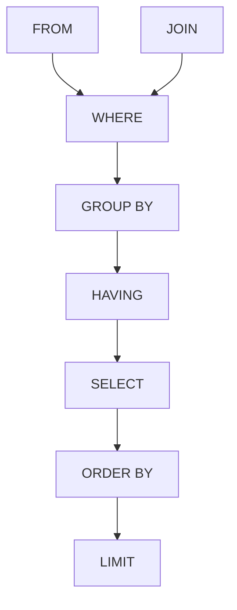

# PostgreSQL 指南

## 基础操作

### 建立连接

```bash
# 不指定库名默认打开 postgres
psql -h IP地址 -p 端口 -U 用户名 数据库名
psql -h 服务器 -U 用户名 -d 数据库 -p 端口地址
# 快速登录(全部使用默认设置)
psql -U postgres
```

### 字符集

- `\encoding utf-8` 设置客户端字符集为 utf-8
- `\encoding` 显示客户端的字元集
- `show client_encoding;` 显示客户端的字元集
- `show server_encoding;` 显示服务器的字元集

### 访问数据库

| 命令 | 说明 |
|------|------|
| `\l` | 列举数据库 |
| `\c 数据库名` | 选择/切换数据库 |
| `\d 表名` | 查看表结构 |
| `\dt` | 查看某个库中的所有表 |
| `\du` | 显示所有用户 |
| `\di` | 查看索引 |
| `\df` | 查看所有存储过程（函数） |
| `\df+ name` | 查看某一存储过程 |
| `\e` | 进入记事本 sql 脚本编辑状态 |
| `\i aaa.sql` | 将 aaa.sql 导入到当前数据库 |
| `\password <user>` | 重设用户密码 |
| `\conninfo` | 显示当前数据库和连接信息 |
| `\h select` | 精细显示 SQL 命令中 select 的用法 |
| `\q` | 退出 psql |

```sql
-- 获取版本信息
SELECT version();
-- 获取系统用户信息
SELECT usename FROM pg_user;
-- 列出所有表名（排除系统表）
SELECT tablename FROM pg_tables WHERE tablename NOT LIKE 'pg%' AND tablename NOT LIKE 'sql_%' ORDER BY tablename;
```

### 导出

```bash
pg_dump -h HOST -U USERNAME DBNAME > FILENAME
```

常用参数：`-h` 主机、`-U` 用户、`-p` 端口、`-Fp` 纯文本、`-Fc` 自定义格式、`-Ft` tar 格式、`-Z` 压缩、`-t` 表名（导出指定表）、`-v` 详细输出

```bash
pg_dump -U postgres -C -f db.sql database
```

### 导入

```bash
psql -U USERNAME DBNAME < FILENAME
```

---

## 用户管理

### 添加用户（角色）

**命令行方式：**
```bash
createuser username                           # 交互式创建
createuser -s -d -r -l username              # 创建超级用户
createuser --createdb --pwprompt username     # 允许创建数据库
```

**SQL 方式：**
```sql
CREATE USER username;                                              -- 无登录权限
CREATE USER username WITH PASSWORD 'password';                     -- 可登录
CREATE USER username WITH PASSWORD 'password' CREATEDB;            -- 可创建数据库
CREATE USER username WITH PASSWORD 'password' SUPERUSER;           -- 超级用户
```

**常用权限选项：**

| 选项 | 说明 |
|------|------|
| LOGIN / NOSUPERUSER | 允许/禁止登录 |
| CREATEDB / NOCREATEDB | 允许/禁止创建数据库 |
| CREATEROLE / NOCREATEROLE | 允许/禁止创建角色 |
| INHERIT / NOINHERIT | 继承组权限 |
| SUPERUSER / NOSUPERUSER | 超级用户权限 |

### 为用户添加登录权限

```sql
ALTER USER username WITH LOGIN;                          -- 仅添加登录权限
ALTER USER username WITH PASSWORD 'password';            -- 仅设置密码
ALTER USER username WITH LOGIN PASSWORD 'password';      -- 同时设置
```

### 查看当前用户

```sql
SELECT current_user;
SELECT user;
SELECT current_database(), current_user, current_schema();
\du    -- psql 中查看所有用户及权限
```

### 切换用户

| 方式 | 命令 | 说明 |
|------|------|------|
| psql 内切换 | `\c dbname username` | 切换数据库+用户，需密码 |
| 命令行切换 | `psql -U username -d dbname` | 重新连接 |
| 临时切换 | `SET ROLE username;` | 当前会话内切换 |
| 恢复角色 | `RESET ROLE;` | 切换回原用户 |
| 查看当前角色 | `SELECT current_role;` | 确认当前身份 |

### 使用指定用户创建数据库

```sql
CREATE DATABASE dbname OWNER username;       -- 指定所有者
ALTER USER username CREATEDB;                -- 先授权
CREATE DATABASE newdb;                       -- 再创建
```

命令行：`psql -U username -c "CREATE DATABASE dbname;"`

### 删除用户

```sql
DROP USER username;
```

---

## 数据库

```sql
-- 创建
CREATE DATABASE <数据库名>;
-- 删除
DROP DATABASE <数据库名>;
```

## 数据表

```sql
-- 创建
CREATE TABLE table_name (
    column1 datatype constraints,
    column2 datatype constraints,
    ...
);

-- 示例
CREATE TABLE employees (
    id INT PRIMARY KEY,
    name VARCHAR(100) NOT NULL,
    age INT,
    department VARCHAR(50)
);

-- 重命名
ALTER TABLE <表名A> RENAME TO <表名B>;

-- 删除
DROP TABLE <表名>;
```

## 字段

```sql
-- 添加
ALTER TABLE <表名> ADD COLUMN <字段名> <类型>;
ALTER TABLE <表名> ADD <字段> <类型> NOT NULL DEFAULT current_timestamp;

-- 删除
ALTER TABLE <表名> DROP COLUMN <字段名>;

-- 重命名
ALTER TABLE <表名> RENAME COLUMN <字段名A> TO <字段名B>;

-- 设置缺省值
ALTER TABLE <表名> ALTER COLUMN <字段名> SET DEFAULT <新的默认值>;

-- 去除缺省值
ALTER TABLE <表名> ALTER COLUMN <字段名> DROP DEFAULT;

-- 修改列的数据类型
ALTER TABLE table_name MODIFY column_name new_datatype;
```

## 约束

```sql
-- 主键约束
CREATE TABLE table_name (
    column1 datatype PRIMARY KEY
);

-- 外键约束
CREATE TABLE table_name (
    column1 datatype,
    column2 datatype,
    FOREIGN KEY (column2) REFERENCES other_table(column_name)
);

-- 唯一约束
CREATE TABLE table_name (
    column1 datatype UNIQUE
);

-- 非空约束
CREATE TABLE table_name (
    column1 datatype NOT NULL
);

-- 检查约束
CREATE TABLE table_name (
    column1 datatype,
    CHECK (condition)
);
```

---

## 数据操作

### 插入数据

```sql
INSERT INTO <表名> (field1,...,fieldn) VALUES (value1,...,valuen);
INSERT INTO <表名> (column1, column2) VALUES (value1, value2), (value3, value4);
```

### 查询数据

```sql
SELECT * FROM table_name;
SELECT column1, column2 FROM table_name;
SELECT column1, column2 FROM table_name WHERE condition;
```

### 更新数据

```sql
UPDATE <表名> SET <字段>=<值> WHERE <字段><条件><值>;
UPDATE table_name SET column1 = value1 WHERE condition;
```

### 删除数据

```sql
DELETE FROM <表名> WHERE <字段名> <条件>;
DELETE FROM table_name;  -- 删空整个表
```

### 删除行

```sql
UPDATE <表名> SET <目标字段名>=<目标值> WHERE <该行特征>;
DELETE FROM <表名> WHERE <该行特征>;
```

---

## 查询语法

### 条件过滤

- 比较：`>` `<` `>=` `<=` `=` `!=`
- 逻辑：`AND`, `OR`
- 集合：`IN`, `NOT IN`
- 范围：`BETWEEN val1 AND val2`
- 空值：`IS NULL`, `IS NOT NULL`
- 量化：`ALL`, `ANY`（必须配合关系运算符）
- 去重：`DISTINCT`

### 排序

```sql
SELECT <field> FROM <table_name> WHERE <condition> ORDER BY <field>;
SELECT <field> FROM <table_name> WHERE <condition> ORDER BY <field> ASC|DESC;
SELECT <field> FROM <table_name> WHERE <condition> ORDER BY <field1> ASC, <field2> DESC;
```

### 分页

```sql
-- OFFSET：开始位置 LIMIT：条目
SELECT <field> FROM <table_name> LIMIT <items> OFFSET <start>;
```

### 聚合函数

```sql
SELECT COUNT(column_name) FROM table_name;
SELECT SUM(column_name) FROM table_name;
SELECT AVG(column_name) FROM table_name;
SELECT MAX(column_name) FROM table_name;
SELECT MIN(column_name) FROM table_name;
```

### 分组

```sql
SELECT <field>, SUM(<field>) FROM <table_name> GROUP BY <field>;
-- HAVING：WHERE 无法与聚合函数一起使用
SELECT <field> FROM <table_name> WHERE <field><条件><值> GROUP BY <field> HAVING <聚合><条件><值>;
```

### 子查询

```sql
SELECT column1 FROM table_name WHERE column2 = (SELECT column2 FROM other_table WHERE condition);
```

---

## 连接查询

### 内连接（Inner Join）

返回两个表中满足连接条件的记录。

```sql
SELECT a.column1, b.column2
FROM table1 a INNER JOIN table2 b ON a.common_column = b.common_column;

-- 等价写法（效率较低）
SELECT * FROM table1, table2 WHERE table1.field = table2.field;
```

### 自然连接（Natural Join）

基于两个表中所有名称相同的列自动匹配的连接操作，属于内连接的一种特殊形式。

### 左连接（Left Join）

返回左表所有行，右表无匹配则为 NULL。

```sql
SELECT a.column1, b.column2
FROM table1 a LEFT JOIN table2 b ON a.common_column = b.common_column;
```

### 右连接（Right Join）

返回右表所有行，左表无匹配则为 NULL。

```sql
SELECT a.column1, b.column2
FROM table1 a RIGHT JOIN table2 b ON a.common_column = b.common_column;
```

### 全连接（Full Outer Join）

返回两个表中的所有记录，无匹配则为 NULL。

```sql
SELECT a.column1, b.column2
FROM table1 a FULL OUTER JOIN table2 b ON a.common_column = b.common_column;
```

### 交叉连接（Cross Join）

返回两个表的笛卡尔积。

```sql
SELECT a.column1, b.column2 FROM table1 a CROSS JOIN table2 b;
```

### 自连接（Self Join）

将一个表与其自身连接。

```sql
SELECT a.column1, b.column2
FROM table_name a INNER JOIN table_name b ON a.common_column = b.common_column;
```

### 索引

```sql
-- 创建单列索引
CREATE INDEX index_name ON table_name (column_name);
-- 创建多列索引
CREATE INDEX index_name ON table_name (column1, column2);
```

---

## SQL 执行顺序



FROM（确定数据来源）→ WHERE（筛选有效数据）→ GROUP BY（分组依据）→ HAVING（组数据过滤）→ SELECT（返回列）→ ORDER BY（排序）→ LIMIT（分页）

---

## 数据库优化

- **表结构设计要合理**：尽量避免不必要的字段，数据能拆分则拆分
- **索引要高效**：设计合理的索引结构，避免索引失效
- **SQL 要优化**：查询条件精准，尽量减少全表扫描
- **分库分表**：通过水平拆分、垂直拆分减少单表数据量
- **缓存和异步化**：减少对数据库的直接压力

### 表结构优化

1. 精简字段类型（字段类型决定存储大小和查询性能）
   - `INT` or `BIGINT`
   - `VARCHAR(200)` or `TEXT`
   - `TIMESTAMP/DATETIME` or `CHAR/VARCHAR`
2. 表拆分
   - 垂直拆分（字段不宜过多，拆分到多个表）
   - 水平拆分（大量数据拆分多个表）
   ```sql
   orders_0  -- 存 user_id % 2 = 0 的订单
   orders_1  -- 存 user_id % 2 = 1 的订单
   ```

### 索引优化

1. 为高频查询字段创建索引（复合索引）
2. 避免索引失效
   - 不要对索引字段使用函数或运算
   - 注意隐式类型转换

### SQL 优化

1. 减少查询字段（避免 `SELECT *`）
2. 分页优化
   ```sql
   -- 深分页（性能较差）
   SELECT * FROM orders ORDER BY order_time DESC LIMIT 9990, 10;
   -- 优化：使用游标
   SELECT * FROM orders WHERE order_time < '2023-01-01 12:00:00' ORDER BY order_time DESC LIMIT 10;
   ```

### 分库分表

- 水平分库分表：按用户 ID 取模、按时间分区

### 缓存与异步化

- Redis 缓存热点数据
- 消息队列异步处理写操作

---

## 数据库类型对比

| 特性 | 关系型数据库 (RDBMS) | 非关系型数据库 (NoSQL) | 向量数据库 |
|------|----------------------|------------------------|------------|
| **数据模型** | 表格（行列结构） | 键值、文档、列族、图等 | 高维向量（特征向量） |
| **存储方式** | 行存储、列存储 | 灵活多样 | 高维稠密或稀疏向量 |
| **查询方式** | SQL 查询 | API 或特定查询语言 | 相似性搜索（ANN） |
| **事务支持** | ACID 事务 | 最终一致性、部分支持事务 | 一般不支持事务 |
| **一致性模型** | 强一致性（ACID） | 弱一致性、最终一致性 | 弱一致性，注重查询效率 |
| **扩展性** | 垂直扩展 | 水平扩展 | 水平扩展，支持大规模数据 |
| **适用场景** | 传统业务应用（金融、电商等） | 大数据、实时分析、快速迭代 | 推荐系统、图像/文本检索、AI 应用 |
| **查询复杂度** | 精确查询：O(1) 或 O(log n) | 键值存储：O(1)；文档存储：O(n) | 精确搜索：O(n)，近似搜索：O(log n) |
| **索引结构** | B+树、哈希索引、复合索引、全文索引 | 哈希表、B树、跳表、二级索引、图索引 | HNSW、LSH、倒排索引、FAISS |
| **查询优化** | 依赖于索引和优化的 SQL 查询 | 通过 API 查询和索引类型选择优化 | 通过近似算法（ANN）优化查询 |
