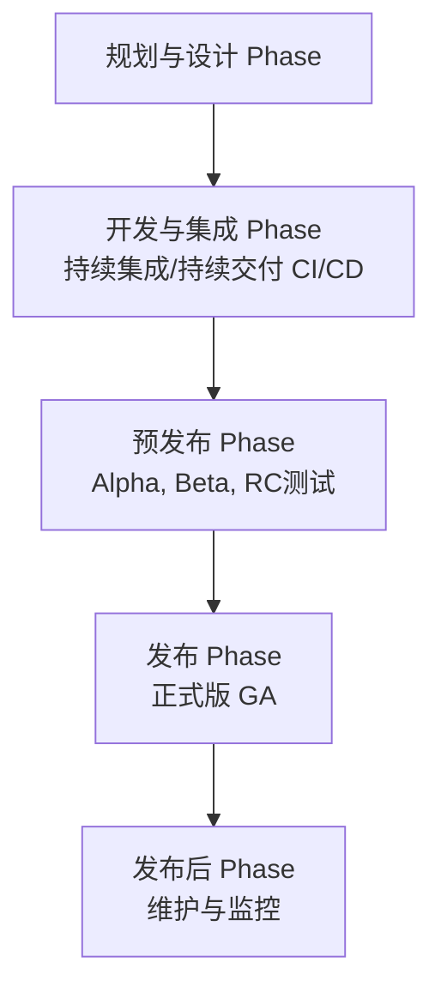

好的，这是一个非常经典的问题。一个完整的软件发布生命周期（Software Release Life Cycle, SRLC）包含多个阶段，从最初的构思到最终的维护和淘汰。

以下是**现代敏捷开发模式**下，一个完整且详细的软件发布阶段分解。它会和传统的“瀑布模型”阶段名称略有不同，但更符合当今的开发实践。

---

### 软件发布完整阶段分解图

为了更好地理解，整个流程可以可视化为以下几个核心阶段：

---

### 各个阶段详解

#### 阶段一：规划与设计 (Planning & Design) - “构思与蓝图”

这个阶段决定软件要做什么以及如何做。

*   **需求收集 (Requirements Gathering)**：从市场、客户、业务方收集软件需要满足的功能和需求。
*   **可行性分析 (Feasibility Analysis)**：评估技术、资金和时间上的可行性。
*   **设计 (Design)**：
    *   **UI/UX 设计**：制作原型图、交互设计，确定软件的外观和用户体验。
    *   **技术设计**：设计系统架构、数据库 schema、API 接口等。
*   **制定路线图 (Roadmap Planning)**：规划大版本的发布计划和长期目标。

#### 阶段二：开发与集成 (Development & Integration) - “动手建造”

这是编写代码和集成功能的阶段。现代开发中，这通常是一个持续循环的过程。

*   **编码 (Coding)**：开发者编写代码，实现功能。
*   **版本控制 (Version Control)**：使用 Git 等工具管理代码版本，基于特性分支进行协作。
*   **持续集成 (Continuous Integration, CI)**：开发者频繁地将代码合并到主干，并自动触发构建和单元测试，尽早发现集成错误。
*   **持续交付 (Continuous Delivery, CD)**：在 CI 的基础上，确保代码可以随时被自动化地部署到测试或生产环境。

#### 阶段三：预发布 (Pre-Release) - “测试与优化”

这是软件功能完成后，面向外部用户测试的阶段，也就是我们常听到的“希腊字母”阶段。

*   **Alpha (内测版)**
    *   **目的**：在**公司内部**进行测试。
    *   **特点**：功能基本完成，但存在大量 Bug。测试由开发者和测试工程师完成。
*   **Beta (公测版)**
    *   **目的**：在**外部小范围用户**中进行测试。
    *   **特点**：功能完整，主要 Bug 已修复。旨在通过更广泛的设备和使用场景发现更深层次的问题和收集用户体验反馈。
    *   **形式**：可分为封闭 Beta（限名额）和开放 Beta（任何人都可申请加入）。
*   **Release Candidate (RC，发布候选版)**
    *   **目的**：**确认这是否可以作为最终正式版**发布。
    *   **特点**：**功能绝对冻结**，不再添加新功能。理论上不应该存在任何严重 Bug。如果发现严重问题，修复后会发布 RC2，RC3... 直到稳定。

#### 阶段四：发布 (Release) - “正式上线”

这是软件向所有用户公开可用的阶段。

*   **GA (General Availability，通用可用性) / RTM (Release to Manufacturing，发布到制造)**
    *   **这就是正式版**。它通常基于最后一个没有发现严重问题的 RC 版本。
    *   软件被签署为最终版本，并部署到应用商店、官方网站等渠道，供所有用户下载和使用。
*   **发布策略**：
    *   **一次性发布 (Big Bang)**：所有用户同时更新。风险较高。
    *   **渐进式发布 (Progressive Rollout)**：先向一小部分用户（如 1%）发布新版本，监控崩溃率和反馈，再逐步扩大范围（如 10% -> 50% -> 100%）。
    *   **蓝绿部署 (Blue-Green Deployment)**：准备两套完全一样的环境（蓝和绿），一套运行当前版本，一套部署新版本。通过切换路由无缝将用户流量引到新版本，实现零停机发布和快速回滚。
    *   **金丝雀发布 (Canary Release)**：类似渐进式发布，但更精细。先让内部员工或一小部分忠实用户（金丝雀）使用新版本，确认无误后再全量发布。

#### 阶段五：发布后 (Post-Release) - “维护与支持”

软件发布并不是终点，而是下一个周期的开始。

*   **维护 (Maintenance)**：
    *   **Bug 修复**：修复用户报告的、在测试中未发现的 Bug。
    *   **安全更新**：修补新发现的安全漏洞。
*   **监控 (Monitoring)**：
    *   监控服务器的稳定性、性能、崩溃日志等，确保用户体验。
*   **运营与支持 (Operations & Support)**：
    *   处理用户反馈、客服问题等。
*   **生命周期结束 (End-of-Life, EOL)**：
    *   当软件或某个版本不再被支持时，官方会发布 EOL 公告，通知用户不再提供任何更新和支持，并建议用户升级到更新的版本。

---

### 版本号命名规范 (Version Numbering)

通常使用 `主版本号.次版本号.修订号`（`Major.Minor.Patch`）的格式，遵循**语义化版本控制 (SemVer)**：

*   **主版本号 (Major)**：做了**不兼容的 API 修改**（重大升级）。
*   **次版本号 (Minor)**：做了**向下兼容的功能性新增**（新功能）。
*   **修订号 (Patch)**：做了**向下兼容的问题修正**（Bug 修复）。

*   **示例**：`v3.2.1` 表示第 3 个主版本，第 2 次功能更新，第 1 次错误修复。
*   **特殊版本**：Alpha, Beta, RC 等通常会加后缀，如 `v2.0.0-beta.1`。

### 总结

一个完整的软件发布阶段是一个循环往复的旅程，而不仅仅是一次性事件。现代软件开发（尤其是采用 Agile/DevOps 模式的团队）通过**自动化（CI/CD）** 和**渐进式发布**策略，极大地加快了发布频率（从年/月到周/天），并降低了发布风险。理解这些阶段有助于更好地参与软件开发、测试或使用软件产品。