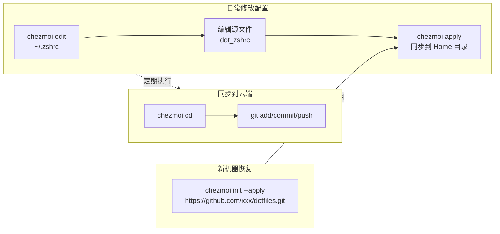

chezmoi 是一个用 Go 语言编写的跨平台 dotfiles 管理工具。与使用符号链接不同，chezmoi 通过**复制**和**模板**的方式，安全地在多台机器间同步配置文件。

你可以把 chezmoi 想象成一个"配置管家"：你把所有想管的文件交给它，它会替你保管在专属目录里，形成一个受 Git 控制的"配置仓库"。当你需要在新电脑上恢复环境时，一条命令就能帮你把所有配置放回正确的位置。

下图清晰地展示了 chezmoi 的核心工作流：

### 📝 核心概念与工作流

chezmoi 的核心围绕三个目录和一个关键动作：

- **源目录 (Source State)**：chezmoi 存放文件副本的地方，默认是 `~/.local/share/chezmoi/`。你所有的修改都发生在这里。
- **目标目录 (Target State)**：你实际工作的家目录（即 `~/`），这里的文件是通过 `chezmoi apply` 命令同步后的结果。
- **远程仓库 (Remote Repo)**：用于跨机器同步的 Git 仓库（如 GitHub）。
- **标准工作流**：
  1.  **添加**：用 `chezmoi add` 将文件纳入管理。
  2.  **编辑**：用 `chezmoi edit` 修改源目录中的副本。
  3.  **应用**：用 `chezmoi apply` 将改动生效到家目录。
  4.  **同步**：进入源目录，使用 `git` 命令推送到远程仓库。

### ⚙️ 核心命令清单

我把常用命令整理成了表格，方便你查阅：

| 类别            | 命令                                  | 说明                                                                     |
| :-------------- | :------------------------------------ | :----------------------------------------------------------------------- |
| **⚡ 快速开始** | `chezmoi init --apply <Git仓库URL>`   | **一键恢复**：在新电脑上初始化并直接应用所有配置。                       |
|                 | `chezmoi init`                        | 仅初始化，克隆仓库到源目录，但不应用，用于检查后再手动执行 `apply`。     |
|                 | `chezmoi update`                      | **一键更新**：从远程拉取最新配置并自动应用到系统。                       |
| **📂 文件管理** | `chezmoi add ~/.zshrc`                | 将家目录下的文件加入 chezmoi 管理，文件会被重命名为 `dot_zshrc`。        |
|                 | `chezmoi add --template ~/.gitconfig` | 将文件添加为**模板**，可以使用变量来根据不同机器生成不同配置。           |
|                 | `chezmoi add --encrypt ~/.ssh/id_rsa` | 添加并加密敏感文件，可安全提交到公开仓库。                               |
|                 | `chezmoi edit ~/.zshrc`               | 编辑源目录中的配置文件（即 `dot_zshrc`）。                               |
|                 | `chezmoi edit --apply ~/.zshrc`       | 编辑后**立即应用**变更，无需再执行 `apply`。                             |
|                 | `chezmoi forget ~/.vimrc`             | 从管理中移除文件，但**不删除**家目录中的原文件。                         |
|                 | `chezmoi destroy ~/.vimrc`            | **危险**：从管理中移除并同时删除家目录中的目标文件。                     |
| **👀 检查预览** | `chezmoi diff`                        | 查看源目录与当前家目录文件的详细差异。                                   |
|                 | `chezmoi status`                      | 类似 `git status`，概要显示哪些文件被修改、新增或将要被删除。            |
|                 | `chezmoi managed`                     | 列出所有被 chezmoi 管理的文件列表。                                      |
|                 | `chezmoi apply --dry-run --verbose`   | **干运行**：模拟执行，显示将会发生的所有变更，但不实际写入文件。         |
| **🛠️ 高级功能** | `chezmoi cd`                          | 快速切换到源目录（`~/.local/share/chezmoi/`），方便手动执行 `git` 命令。 |
|                 | `chezmoi data`                        | 查看当前可用的所有模板数据（如主机名、用户名、自定义变量等）。           |
|                 | `chezmoi cat ~/.gitconfig`            | 预览模板文件被解析渲染后的最终内容。                                     |

### 🚀 进阶用法亮点

- **模板 (Templates)**：如果你在 Mac 和 Linux 上的配置稍有不同（比如软件安装路径），可以利用 Go 模板语法。通过 `{{ .chezmoi.os }}` 判断系统类型，动态生成配置内容。
- **加密 (Encryption)**：对于 `.ssh/id_rsa` 这类密钥，使用 `chezmoi add --encrypt` 配合 `age` 或 `gpg` 加密。加密后的文件可以放心 Push 到公开的 GitHub 仓库。
- **脚本 (Scripts)**：在源目录创建以 `run_`、`run_once_` 等开头的脚本，chezmoi 会在 `apply` 时自动执行。这非常适用于自动安装软件包、克隆插件仓库等无法仅靠复制文件完成的操作。
- **外部文件 (Externals)**：在 `.chezmoiexternal.toml` 文件中配置 URL，chezmoi 可以自动下载并放置特定文件（如 Shell 补全脚本、字体压缩包等）到指定位置。

### 💎 针对 Linux 的小贴士

对于 Linux 用户，chezmoi 能很好地管理分散在各处的配置文件，包括但不限于：

- **常规点文件**：`.bashrc`、`.zshrc`、`.gitconfig`
- **桌面环境配置**：`~/.config/` 下的各种编辑器（Neovim, VSCode）和终端模拟器（Alacritty, Kitty）的配置。
- **本地脚本**：`~/bin/` 或 `~/.local/bin/` 下的自定义脚本。记得在 add 时使用 `--executable` 前缀来保留执行权限。

你是打算在新机器上一键恢复环境，还是想把手头这台电脑的配置备份起来？告诉我你的具体目标，我可以给你一条最精简的完整命令。
