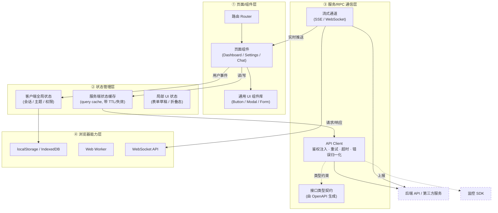
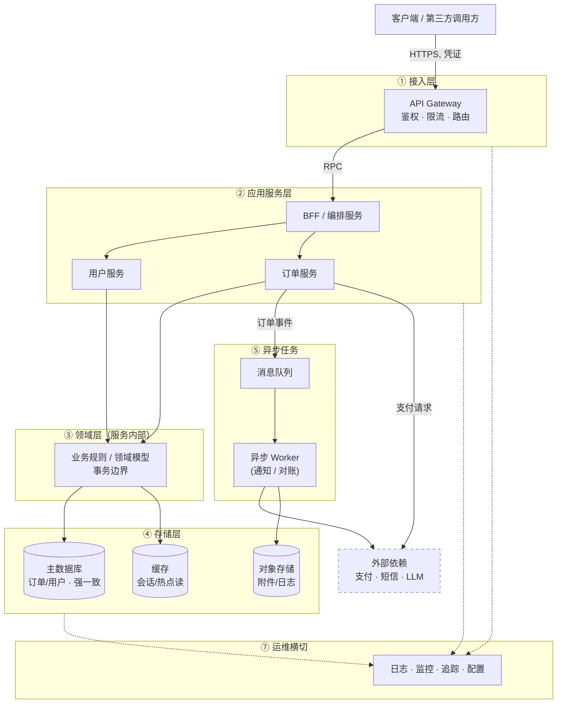

## 一、绘制目标、读者与表达重点

| 维度 | 说明 |
|---|---|
| **绘制目标** | 回答"系统由哪些部分组成、各部分如何协作、边界在哪里"。不是代码目录结构图，也不是部署拓扑图（除非明确画的就是部署图） |
| **适用读者** | 新成员（快速建立全局认知）、评审者（判断职责划分是否合理）、跨团队协作者（确认接口与依赖边界） |
| **表达重点** | ① **分层**：谁依赖谁，依赖方向单向清晰；② **职责**：每个模块一句话说清"它做什么、不做什么"；③ **数据流**：数据从哪来、经过谁、到哪去；④ **边界**：进程边界、团队边界、可替换边界用不同线型区分；⑤ **外部依赖**：凡是不归你维护的东西都显式画出来 |

通用原则：**一图一主题**（结构图、数据流图、时序图分开画）；模块命名用领域语言而非技术实现名；箭头上标注"传什么"，不要只画箭头。

---

## 二、前端架构图画法

推荐四层结构，自上而下表达"用户看到什么 → 状态如何组织 → 数据如何获取 → 依赖浏览器什么能力"：

### 1. 页面/组件层（View Layer）
- **画什么**：路由（页面入口）、页面组件、通用 UI 组件、布局组件
- **标注**：组件间的组合/嵌套关系；受控与非受控的界限；哪些组件直接消费状态、哪些只接收 props

### 2. 状态管理层（State Layer）
- **画什么**：全局状态（用户会话、权限、主题）、服务端缓存状态（如 React Query 的 query cache）、局部 UI 状态
- **标注**：状态的**所有权**（single source of truth 在哪）；状态变更的触发方式（action / mutation / reducer）；明确区分"服务端数据的缓存"与"客户端自有状态"——这是现代前端架构最容易画错的地方

### 3. 服务/RPC 通信层（Data Layer）
- **画什么**：API client 封装、请求拦截器（鉴权、重试、超时）、协议适配（REST / gRPC-Web / WebSocket / SSE）
- **标注**：请求/响应数据流向；错误如何向上传播；流式接口与请求-响应接口的区别（流式要单独画出通道）；鉴权凭证的注入点

### 4. 浏览器能力层（Platform Layer）
- **画什么**：用到的 Web API——Storage（localStorage/IndexedDB）、WebSocket、Worker、Service Worker、文件系统、剪贴板等
- **标注**：哪些能力做了降级/兜底；哪些能力是浏览器进程隔离的（如 Worker）

### 额外必须标注的
- **外部依赖**：UI 组件库、构建工具、监控 SDK——画在图的边缘，用虚线框
- **交互边界**：与后端的接口契约（OpenAPI / 生成的类型）、与第三方嵌入（iframe / SDK）的边界
- **数据流方向**：用户事件 → 状态变更 → 请求 → 响应 → 状态更新 → 重渲染，建议用一条端到端的箭头链贯穿全图

---

## 三、后端架构图画法

推荐按请求路径分带（band），从左到右或从上到下表达一次请求的完整旅程：

### 1. 接入层（Edge / Gateway）
- **画什么**：负载均衡、API Gateway、认证鉴权前置、限流熔断、协议转换（HTTP → RPC）
- **标注**：入口协议、鉴权方式、对外暴露的版本化 API

### 2. 应用服务层（Application Layer）
- **画什么**：各业务服务/微服务、BFF（Backend for Frontend）、编排层
- **标注**：服务间调用关系（同步 RPC vs 异步事件）、每个服务的核心用例（use case）而非功能清单；**同步调用链与异步事件链用不同线型区分**

### 3. 领域/业务逻辑层（Domain Layer）
- **画什么**：领域模型、核心业务规则、事务边界
- **标注**：聚合边界、哪些规则是跨服务共享的（共享内核）

### 4. 存储层（Persistence Layer）
- **画什么**：主数据库、缓存、对象存储、搜索引擎
- **标注**：每种存储**存什么数据**、读写比例、一致性要求（强一致 vs 最终一致）

### 5. 异步任务（Async）
- **画什么**：消息队列、定时任务、工作进程
- **标注**：生产者→队列→消费者的完整链路；失败重试与死信处理的位置

### 6. 外部依赖（External）
- **画什么**：第三方 API、支付、短信、LLM 提供商等不归你维护的服务
- **标注**：降级策略、超时与重试策略

### 7. 运维边界（横切）
- **画什么**：日志、监控、追踪、配置中心、密钥管理
- **标注**：通常画成贯穿所有层的侧边栏，而不是某一层的模块

### 必须标注的
- **部署边界**：用带颜色的框区分"同一进程 / 同一服务 / 同一集群"
- **数据流向**：箭头上写"传什么"（如 `用户凭证`、`订单事件`、`会话 token`）
- **信任边界**：公网 / 内网 / VPC 之间用粗线或防火墙符号标出

---

## 四、前端架构的核心职责

| 职责 | 要点 |
|---|---|
| **模块组织** | 按功能域（feature-based）而非技术类型（按 components/utils/services 平铺）组织代码；依赖方向单向，禁止跨功能域互相 import 内部实现 |
| **状态管理** | 明确每份状态的所有权与生命周期；服务端状态与客户端状态分离；避免"全局状态膨胀成垃圾桶" |
| **通信协议** | 统一 API 层作为唯一出口：鉴权注入、错误归一化、重试、超时、类型契约（接口类型自动生成而非手写）；流式通道单独管理 |
| **渲染与交互** | 首屏渲染策略（CSR/SSR/SSG/流式）、加载态与乐观更新的统一约定、无障碍与输入焦点管理 |
| **可维护性** | 组件与模块的单一职责、统一的命名与目录约定、可被 lint/类型检查强制执行的规则优先于文档约定 |
| **可扩展性** | 预留插件/扩展点（主题、国际化、可配置的 UI 插槽），新功能进入不破坏旧结构；路由与模块支持懒加载拆分 |
| **性能** | 包体积预算、代码分割策略、渲染性能（避免不必要重渲染）、缓存策略（HTTP 缓存 + 客户端数据缓存） |
| **稳定性** | 错误边界（error boundary）兜底、降级 UI、监控上报、关键路径的可回放测试 |
| **边界约束** | 前端不保存权威数据（server 是 source of truth）、敏感逻辑不下放到客户端、与后端的契约变更必须走生成/校验而非人工同步 |

---

## 五、可套用的示例

### 前端架构图（Mermaid）

**各层含义**：
- **① 页面/组件层**：用户可见的一切，只负责呈现与派发事件，不直接发请求
- **② 状态管理层**：数据的所有权中心——服务端数据走带缓存语义的 query 层，客户端自有状态走 store，二者不混用
- **③ 服务/RPC 通信层**：与后端交互的唯一出口，所有鉴权、重试、类型约束收敛于此；流式通道单独画出，因为它的生命周期和错误处理与请求-响应模型不同
- **④ 浏览器能力层**：对平台能力的薄封装，业务层不直接接触原生 API，便于降级与替换
- **虚线框**：外部依赖，不归前端团队维护

### 后端架构图（Mermaid）

**各层含义**：
- **① 接入层**：信任边界，所有外部流量必须经过；鉴权与限流前置，业务服务假定入口已清洗
- **② 应用服务层**：按业务能力拆分的服务，负责用例编排；BFF 专门为前端聚合裁剪数据
- **③ 领域层**：服务内部的业务规则核心，不感知框架与传输协议；事务边界在此标注
- **④ 存储层**：每种存储标注存什么、一致性级别；服务不共享数据库，只通过服务接口互相访问数据
- **⑤ 异步任务**：同步调用链（实线）与异步事件链（标注事件名）分离，Worker 承接重试、重试耗尽后进死信
- **⑦ 运维横切**：贯穿所有层的可观测性，不属于任何单一层
- **虚线框**：外部依赖，需单独标注超时与降级策略

---

**最后一个建议**：架构图的价值不在"画得全"，而在"每次变更后还准"。把图放进仓库（Mermaid 源码随代码版本化），并在架构变更的同一个 PR 里更新图，否则三个月后它就是误导。