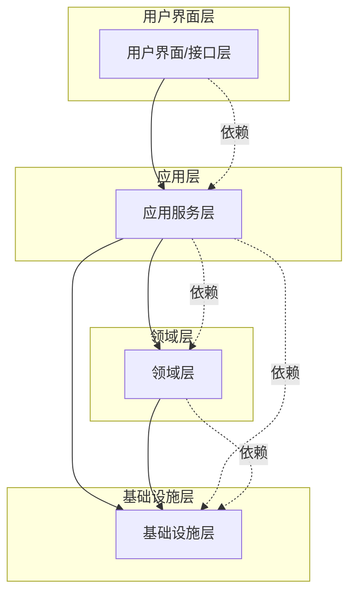
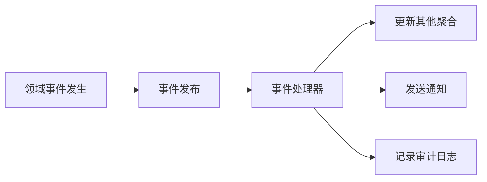

# 知识图谱

以下是整合后的知识图谱技术体系文档： 
### **知识图谱技术体系全解析** 
#### **一、知识图谱概述** 
1. **定义与核心** 
	- 知识图谱是由Google于2012年提出的语义网络，通过**三元组（实体-关系-实体）**和**属性-值对**描述现实世界中的实体及其关联。 
	- 核心目标：实现知识的结构化表示、语义理解与智能推理。 
2. **分类** 
	- **通用知识图谱**：覆盖广泛领域（如FreeBase、维基数据）。 
	- **领域知识图谱**：聚焦垂直场景（如医疗、金融风控）。 
3. **核心要素** 
	- **实体**：独立存在的事物（如“中国”）。 
	- **语义类**：实体的集合（如“国家”）。 
	- **属性值**：实体的特征（如“中国面积960万平方公里”）。 
	- **关系**：实体间的关联（如“北京是中国的首都”）。 
4. **应用领域** - 智能搜索、问答系统、个性化推荐、反欺诈风控、教育路径分析等。 
#### **二、核心技术体系** 
1. **信息抽取** 
	- **实体抽取**：基于规则、统计学习或开放域方法识别命名实体。 
	- **语义类抽取**：通过并列相似度、上下位关系生成实体与类的关联。 
	- **属性与关系抽取**：从文本中提取实体属性及关系（如监督学习模型）。 
2. **知识表示** 
	- **传统方法**：RDF三元组（Subject-Predicate-Object），直观但存在稀疏性问题。 
	- **深度学习方法**：表示学习技术（如TransE、ComplEx）将实体和关系嵌入低维向量空间，提升计算效率。 
3. **知识融合** 
	- **关键步骤**：数据整合、实体对齐、消歧、质量评估与更新。 
	- **验证依据**：权威度、冗余度、一致性等。 
4. **知识推理** 
	- **任务类型**： 
	- **可满足性**：验证逻辑一致性（如“男性”与“女性”无交集）。 
	- **分类**：推导层次关系（如“母亲”是“女性”的子集）。 
	- **实例化**：确定实体所属类别（如“玛丽”是“女性”的实例）。 
	- **方法**：规则推理、统计学习（如概率图模型）、深度学习（如神经符号推理）。 
#### **三、构建方法与流程** 
1. **构建方式** 
	- **自顶向下**：先定义本体，再填充实体（如FreeBase）。 
	- **自底向上**：从数据中提取实体，逐步构建本体（如Google Knowledge Vault）。 
2. **本体库构建** 
	- **核心构成**：类、关系、公理、实例等。 
	- **设计原则**：明确性、完全性、一致性、扩展性。 
	- **实施步骤**：确定领域范围→复用现有本体→提取术语→构建分类层次→定义复杂关系→验证优化。 
	- **常用方法**：七步法、Methontology、IDEF-5等。 
3. **数据存储**
	- **图数据库选择**： 
	- **Neo4j**：支持10亿节点以下规模。 
	- **OrientDB/JanusGraph**：分布式存储，适合大规模数据。

#### **四、应用场景与实践** 
1. **P2P网贷风控** 
	- **关键应用**：反欺诈（识别团伙欺诈、异常关系网络）。 
	- **技术路径**：规则推理（如黑名单关联）、社区挖掘、动态网络分析。 
2. **其他领域** 
	- **教育**：构建概念图谱，分析学习路径（如逻辑回归依赖线性回归）。 
	- **证券**：传导事件影响（如公司负面事件对供应链的冲击）。 
3. **典型案例** 
	- **CN-DBpedia**：大规模中文知识图谱，支持可视化搜索（如“周杰伦”实体关系图谱）。

#### **五、总结与挑战** 
1. **核心价值** - 实现知识的结构化与语义化，支撑认知智能应用。 
2. **技术挑战** - 非结构化数据处理、跨语言实体对齐、动态知识更新。 
3. **实践建议** 
	 - **必要性评估**：优先使用简单技术，知识图谱适用于复杂关系场景。 
	 - **数据治理**：重视数据质量与本体设计的业务导向性。 
**注**：本文整合了知识图谱的基础理论、核心技术、构建方法及行业应用，形成系统化的知识框架。实际应用中需结合具体场景选择技术路径，平衡效率与准确性。

# DDD 指南

# DDD核心思想

## 什么是DDD

领域驱动设计（Domain-Driven Design，DDD）是一种软件设计方法论，主要用于处理复杂业务场景。DDD可以分解为三个部分理解：

* **领域（Domain）**：特定业务范围或问题域，如医疗、电商、保险等。确定领域就能明确核心的业务问题
* **设计（Design）**：指的是领域模型的设计，领域模型是系统的核心，他反应业务概念和业务规则
* **驱动（Driven）**：
  1. 业务问题域驱动领域建模的过程
  2. 领域模型驱动技术实现或代码开发的过程

确保领域模型的准确性关键，它保证了代码实现能够真实反应并解决业务的核心问题

## 核心理念

### 1. 分离思想
DDD体现了**分离思想**，它分离了**业务复杂性**和**技术复杂性**，让开发团队能够专注于业务逻辑而不被技术细节干扰。

### 2. 分治思想
DDD体现了**分治思想**，它通过**领域模型**、**界限上下文**或**子域**进行分治，将复杂的大系统拆分为可管理的小模块。

### 3. 统一语言
**统一语言**贯穿领域驱动设计从战略设计到战术设计到最后代码实现的全过程，对需求分析、知识提炼和最后代码实现，都是非常重要的。

### 4. 以业务为中心
**以业务领域为中心**，通过领域建模把业务知识转化为软件模型，让代码能够真实反映业务需求。

## DDD的价值

### 解决的问题
- **软件难以理解**：传统架构随着业务发展会发生腐化现象
- **难以演化**：MVC架构在前期开发时很省事，但随着业务增长，代码逻辑变得混乱
- **维护成本高**：架构设计就是要解决系统在反复维护和迭代时如何降低成本

### 带来的好处
1. **可持续迭代**：通过合理的工程设计，支持系统的长期演化
2. **降低维护成本**：清晰的分层和边界控制，减少系统腐化
3. **提高代码质量**：充血模型和面向对象设计，让代码更加内聚
4. **团队协作效率**：统一语言消除沟通障碍

## DDD vs 传统架构

### 传统MVC架构的局限
```java
// 贫血模型 - 只有数据，没有业务逻辑
public class Order {
    private Long id;
    private Long userId;
    private BigDecimal amount;
    // 没有任何行为，所有逻辑都在OrderService
}
```

### DDD的充血模型
```java
// 充血模型 - 数据与业务逻辑结合
public class Order {
    private Long id;
    private Long userId;
    private BigDecimal amount;

    // 领域行为
    public void pay(Payment payment) {
        // 支付逻辑
    }

    public void cancel() {
        // 取消逻辑
    }
}
```

## 总结

**一句话总结：DDD是一种围绕业务核心概念进行建模和设计的方法，通过分层架构和统一语言，使代码能真实反映业务并可持续迭代。**

DDD的核心价值在于：
- 用**统一语言**建模业务
- 用**界限上下文**控制复杂性
- 用**分层架构**保持清晰职责
- 用**充血模型+聚合根**内聚业务逻辑
- 最终实现一个**可演化、可维护的复杂业务系统**

# DDD核心概念详解

## 概述

DDD的核心概念构成了领域建模的基础，理解这些概念对于成功实施DDD至关重要。这些概念包括实体、值对象、聚合、聚合根等，它们共同构成了领域模型的构建块。

## 一、实体（Entity）

### 定义
实体是指在业务中具有**唯一标识**的对象，实体的主要特征是**持续的身份**。即使属性发生变化，只要标识不变，它仍然是同一个实体。

### 核心特征
1. **唯一标识**：每个实体都有唯一的ID或标识符
2. **身份持续性**：标识在实体的整个生命周期中保持不变
3. **可变性**：实体的属性可以改变，但身份不变
4. **业务行为**：实体包含业务逻辑和行为

### 代码示例

```java
public class User {
    private Long id;        // 唯一标识
    private String name;
    private int age;
    private String email;

    // 业务行为
    public void updateProfile(String name, int age) {
        this.name = name;
        this.age = age;
    }

    public void changeEmail(String email) {
        // 验证邮箱格式的业务规则
        if (!isValidEmail(email)) {
            throw new IllegalArgumentException("Invalid email format");
        }
        this.email = email;
    }

    // 基于ID判断相等性，而不是属性
    @Override
    public boolean equals(Object obj) {
        if (this == obj) return true;
        if (obj == null || getClass() != obj.getClass()) return false;
        User user = (User) obj;
        return Objects.equals(id, user.id);
    }
}
```

### 实体的形态
- **业务形态**：业务现实中的对象，如用户、订单
- **代码形态**：包含属性和业务方法的类
- **运行形态**：内存中的对象实例
- **数据库形态**：持久化存储的数据记录

## 二、值对象（Value Object）

### 定义
值对象**没有唯一标识**，它是通过**属性值来判断相等性**的。值对象关注属性而非身份，属性是可替换的，不可变的！

### 核心特征
1. **无唯一标识**：通过属性值判断相等性
2. **不可变性**：创建后不能修改，只能整体替换
3. **可替换性**：属性相同的值对象可以相互替换
4. **业务概念整体**：将多个相关属性组合成一个概念整体

### 代码示例

```java
// 地址值对象 - 不需要id，创建后不能更改
public class Address {
    private final String province; // final修饰
    private final String city;     // final修饰
    private final String street;   // final修饰
    private final String zipCode;   // final修饰

    // 构造后不可修改
    public Address(String province, String city, String street, String zipCode) {
        this.province = Objects.requireNonNull(province);
        this.city = Objects.requireNonNull(city);
        this.street = Objects.requireNonNull(street);
        this.zipCode = Objects.requireNonNull(zipCode);
    }

    // 只有getter方法，没有setter方法
    public String getProvince() { return province; }
    public String getCity() { return city; }
    public String getStreet() { return street; }
    public String getZipCode() { return zipCode; }

    // 基于属性值判断相等性
    @Override
    public boolean equals(Object obj) {
        if (this == obj) return true;
        if (obj == null || getClass() != obj.getClass()) return false;
        Address address = (Address) obj;
        return Objects.equals(province, address.province) &&
               Objects.equals(city, address.city) &&
               Objects.equals(street, address.street) &&
               Objects.equals(zipCode, address.zipCode);
    }

    @Override
    public int hashCode() {
        return Objects.hash(province, city, street, zipCode);
    }
}
```

### 为什么值对象要不可变？

1. **避免副作用**：不可变对象不会被意外修改，减少系统复杂度
2. **线程安全**：不可变对象天然线程安全，无需同步
3. **简化理解**：状态固定，更容易理解和维护
4. **缓存友好**：不可变对象可以被安全地缓存和共享

### 实体 vs 值对象对比

| 特征 | 实体 | 值对象 | 
|------|------|--------|
| 标识 | 有唯一标识 | 无标识 | 
| 相等性判断 | 基于标识 | 基于属性值 | 
| 可变性 | 属性可变 | 不可变 | 
| 替换性 | 不可替换 | 可整体替换 | 
| 关注点 | 关注"是谁" | 关注"是什么" | 

## 三、聚合（Aggregate）

### 定义
聚合就是将紧密相关的实体和值对象组织在一起，形成一个有边界的业务模块。聚合是一个**数据修改的原子单元**，确保聚合内数据的一致性。

### 聚合的核心组成

**聚合 = 聚合根 + 其他实体/值对象**

### 聚合根（Aggregate Root）
聚合根是聚合的**唯一入口**和**唯一标识**，只有通过聚合根才能访问或修改聚合内容的其他对象。

### 聚合的设计原则

1. **单一职责**：一个聚合对应一个核心业务概念
2. **一致性边界**：聚合内部保持业务规则的一致性
3. **外部不感知**：聚合外部不需要知道内部结构
4. **最小化关联**：聚合间通过ID引用，而非对象引用

### 代码示例

```java
// 订单聚合 - 聚合根
public class Order {
    private Long orderId;           // 聚合根的唯一标识
    private Long userId;
    private OrderStatus status;
    private Money totalAmount;
    private List<OrderItem> items;  // 子实体
    private Address address;        // 值对象
    private LocalDateTime createTime;

    // 聚合内部行为 - 封装内部对象的访问
    public void addItem(Product product, int quantity) {
        OrderItem item = new OrderItem(product, quantity);
        this.items.add(item);
        recalculateTotal();
    }

    public void removeItem(Long productId) {
        this.items.removeIf(item -> item.getProductId().equals(productId));
        recalculateTotal();
    }

    public void changeAddress(Address newAddress) {
        this.address = Objects.requireNonNull(newAddress);
    }

    // 聚合的业务规则保护
    public void confirm() {
        if (items.isEmpty()) {
            throw new BusinessException("订单不能为空");
        }
        if (status != OrderStatus.PENDING) {
            throw new BusinessException("只有待支付状态的订单才能确认");
        }
        this.status = OrderStatus.CONFIRMED;
    }

    public void pay() {
        if (status != OrderStatus.CONFIRMED) {
            throw new BusinessException("只有已确认的订单才能支付");
        }
        this.status = OrderStatus.PAID;
    }

    // 私有方法 - 内部业务逻辑
    private void recalculateTotal() {
        this.totalAmount = items.stream()
            .map(OrderItem::getSubtotal)
            .reduce(Money.ZERO, Money::add);
    }

    // 不暴露内部集合的直接引用
    public List<OrderItem> getItems() {
        return Collections.unmodifiableList(items);
    }
}

// 订单项 - 实体，只能通过Order访问
public class OrderItem {
    private Long productId;
    private String productName;
    private Money unitPrice;
    private int quantity;

    OrderItem(Product product, int quantity) {
        this.productId = product.getId();
        this.productName = product.getName();
        this.unitPrice = product.getPrice();
        this.quantity = quantity;
    }

    public Money getSubtotal() {
        return unitPrice.multiply(quantity);
    }

    // 只有getter方法，没有setter方法
    // 修改必须通过Order聚合根
}
```

### 聚合的使用规范

1. **访问控制**：只能通过聚合根访问聚合内部对象
2. **事务边界**：一个事务只能修改一个聚合
3. **跨聚合引用**：通过聚合根ID引用，而不是对象引用
4. **一致性保证**：聚合根负责维护内部一致性

### 聚合的持久化

```java
// 聚合的仓储操作
public interface OrderRepository {
    Order findById(Long id);           // 通过聚合根ID查询整个聚合
    void save(Order order);            // 保存整个聚合
    void delete(Long id);              // 删除整个聚合

    // 查询方法返回聚合根，而不是内部实体
    List<Order> findByUserId(Long userId);
}
```

## 四、领域服务（Domain Service）

### 定义
领域服务是DDD领域层的组成部分，用于封装**不属于单个实体或值对象的领域逻辑**，这些逻辑涉及多个领域对象的协作或无状态的操作。

### 何时使用领域服务

1. **跨实体协作**：涉及多个实体或值对象的复杂业务逻辑
2. **无状态操作**：执行业务计算或规则验证
3. **领域规则封装**：实现领域内的通用算法或策略

### 代码示例

```java
// 银行转账领域服务
@Service
public class TransferDomainService {
    private final AccountRepository accountRepository;

    public TransferDomainService(AccountRepository accountRepository) {
        this.accountRepository = accountRepository;
    }

    // 跨实体的领域逻辑
    @Transactional
    public void transfer(Long fromAccountId, Long toAccountId, Money amount) {
        // 1. 账户存在性校验
        Account fromAccount = accountRepository.findById(fromAccountId)
            .orElseThrow(() -> new AccountNotFoundException(fromAccountId));
        Account toAccount = accountRepository.findById(toAccountId)
            .orElseThrow(() -> new AccountNotFoundException(toAccountId));

        // 2. 业务规则校验
        if (fromAccount.getBalance().lessThan(amount)) {
            throw new InsufficientBalanceException("账户余额不足");
        }

        // 3. 执行转账
        fromAccount.debit(amount);    // 账户扣款
        toAccount.credit(amount);      // 账户入账

        // 4. 保存聚合
        accountRepository.save(fromAccount);
        accountRepository.save(toAccount);
    }

    // 计算利息的纯业务逻辑
    public Money calculateInterest(Account account, LocalDate startDate, LocalDate endDate) {
        // 复杂的利息计算逻辑
        Money principal = account.getBalance();
        double rate = getInterestRate(account.getAccountType());
        int days = Days.between(startDate, endDate);

        return principal.multiply(rate).multiply(days / 365.0);
    }

    // 验证转账限额的领域规则
    public boolean validateTransferLimit(Account account, Money amount) {
        Money dailyLimit = account.getDailyTransferLimit();
        Money todayTransferred = calculateTodayTransferredAmount(account.getId());

        return todayTransferred.add(amount).lessThanOrEqual(dailyLimit);
    }
}
```

### 领域服务 vs 应用服务

| 特征 | 领域服务 | 应用服务 | 
|------|----------|----------|
| 位置 | 领域层 | 应用层 | 
| 职责 | 业务逻辑 | 流程编排 | 
| 状态 | 无状态 | 可能管理事务状态 | 
| 依赖 | 只依赖领域层 | 依赖领域层和基础设施层 | 
| 返回值 | 领域对象、值对象 | DTO、ID、状态 | 

## 五、总结

DDD的核心概念通过清晰的职责分离和边界控制，帮助我们构建出更加内聚和可维护的领域模型：

1. **实体**：有身份标识的对象，关注"是谁"
2. **值对象**：无标识的属性组合，关注"是什么"，不可变
3. **聚合**：数据修改的原子单元，维护内部一致性
4. **聚合根**：聚合的入口和标识，控制内部对象访问
5. **领域服务**：跨对象的业务逻辑封装

通过合理运用这些概念，我们可以：
- 建立清晰的业务边界
- 保证数据一致性
- 提高代码的内聚性
- 降低系统的复杂度

# DDD分层架构

## 概述

DDD的落地通常采用**分层架构**，通过清晰的职责分离来控制系统的复杂性。每一层都有明确的职责，并且依赖关系是单向的，从上层依赖下层。

## 一、DDD分层架构概览



### 各层职责概述

| 层次 | 职责 | 核心组件 | 
|------|------|----------|
| **用户界面层** | 接收外部输入，展示结果 | Controller、MQ Listener、定时任务 | 
| **应用层** | 编排业务流程，管理事务 | Application Service、DTO、领域编排 | 
| **领域层** | 封装核心业务逻辑 | 实体、值对象、聚合、领域服务 | 
| **基础设施层** | 提供技术支撑 | Repository实现、适配器、配置 | 

## 二、用户界面层（Interface Layer）

### 定义
也称为**触发器层**，作为外部系统入口：HTTP接口、MQ消息、定时任务、WebSocket等。

### 职责
1. **接收输入**：接收HTTP请求、消息、定时触发等
2. **参数校验**：基本的格式校验和权限检查
3. **调用应用服务**：**不写任何业务逻辑**，只做调用和结果转换
4. **返回结果**：格式化返回给调用方

### 代码示例

#### HTTP控制器
```java
@RestController
@RequestMapping("/user")
public class UserController {
    private final UserApplicationService userApplicationService;

    public UserController(UserApplicationService userApplicationService) {
        this.userApplicationService = userApplicationService;
    }

    @PostMapping("/register")
    public ResultVO<UserIdResponse> register(@RequestBody @Valid RegisterRequest req) {
        // 参数校验（可通过注解/AOP处理）
        UserId userId = userApplicationService.register(req);
        return ResultVO.success(new UserIdResponse(userId.getValue()));
    }

    @GetMapping("/{userId}")
    public ResultVO<UserResponse> getUser(@PathVariable Long userId) {
        UserDetailDTO user = userApplicationService.getUser(userId);
        return ResultVO.success(UserResponse.from(user));
    }

    @PostMapping("/reset-password")
    public ResultVO<Void> resetPassword(@RequestBody @Valid ResetPasswordRequest req) {
        userApplicationService.resetPassword(req.getUserId(), req.getNewPassword());
        return ResultVO.success();
    }
}
```

#### MQ监听器
```java
@Component
public class UserEventListener {
    private final UserApplicationService userApplicationService;

    @KafkaListener(topics = "user.registered")
    public void onUserRegistered(String message) {
        try {
            UserRegisteredEvent event = JsonUtils.fromJson(message, UserRegisteredEvent.class);
            userApplicationService.processUserRegistered(event.getUserId());
        } catch (Exception e) {
            log.error("处理用户注册事件失败: {}", message, e);
            // 可考虑重试或死信队列
        }
    }

    @KafkaListener(topics = "user.password.reset")
    public void onPasswordReset(String message) {
        PasswordResetEvent event = JsonUtils.fromJson(message, PasswordResetEvent.class);
        userApplicationService.sendPasswordResetNotification(event.getUserId());
    }
}
```

#### 定时任务
```java
@Component
public class UserMaintenanceScheduler {
    private final UserApplicationService userApplicationService;

    @Scheduled(cron = "0 0 2 * * ?") // 每天凌晨2点
    public void cleanupExpiredAccounts() {
        userApplicationService.cleanupExpiredAccounts();
    }

    @Scheduled(cron = "0 30 23 * * ?") // 每天23:30
    public void sendActivityReminders() {
        userApplicationService.sendActivityReminders();
    }
}
```

### 职责
1. **接收输入**：接收HTTP请求、消息、定时触发等
2. **参数校验**：基本的格式校验和权限检查
3. **调用应用服务**：**不写任何业务逻辑**，只做调用和结果转换
4. **返回结果**：格式化返回给调用方

### 设计原则
1. **薄层设计**：控制器逻辑应该尽量简单
2. **不包含业务逻辑**：所有业务逻辑都在应用层和领域层
3. **异常处理**：统一的异常处理机制
4. **DTO转换**：外部请求DTO与内部数据模型转换

## 三、应用层（Application Layer）

### 定义
应用层是**外部接口与领域层的桥梁**，负责协调领域层操作，处理非业务逻辑（如事务、权限、日志）。

### 职责
1. **流程编排**：接收外部请求，调用领域服务或仓储完成业务流程
2. **事务管理**：管理事务边界（开启/提交/回滚）
3. **数据转换**：将外部输入（DTO）转换为领域对象，或将领域对象转换为返回数据（VO）
4. **权限检查**：业务权限校验
5. **外部交互**：调用基础设施层（如发送邮件、操作缓存）

### 代码示例

#### 基础应用服务
```java
@Service
@Transactional
public class UserApplicationService {
    private final UserRepository userRepository;
    private final UserDomainService userDomainService;
    private final NotificationAdapter notificationAdapter;
    private final UserMapper userMapper;

    // 用户注册
    public UserId register(RegisterRequest request) {
        // 1. 数据转换
        User user = userMapper.toUser(request);

        // 2. 业务规则校验（调用领域服务）
        userDomainService.validateUserUniqueness(user.getEmail(), user.getPhone());

        // 3. 领域逻辑（调用实体方法）
        user.register();

        // 4. 保存聚合（调用仓储）
        User savedUser = userRepository.save(user);

        // 5. 发送通知（调用适配器）
        notificationAdapter.sendWelcomeEmail(savedUser.getEmail());

        return savedUser.getId();
    }

    // 获取用户详情
    @Transactional(readOnly = true)
    public UserDetailDTO getUser(Long userId) {
        User user = userRepository.findById(userId)
            .orElseThrow(() -> new UserNotFoundException(userId));

        return userMapper.toUserDetailDTO(user);
    }

    // 重置密码
    public void resetPassword(Long userId, String newPassword) {
        User user = userRepository.findById(userId)
            .orElseThrow(() -> new UserNotFoundException(userId));

        // 业务逻辑委托给实体
        user.resetPassword(newPassword);

        userRepository.save(user);

        // 发送通知
        notificationAdapter.sendPasswordResetNotification(user.getEmail());
    }

    // 清理过期账户
    @Scheduled
    public void cleanupExpiredAccounts() {
        List<User> expiredUsers = userRepository.findExpiredUsers();

        for (User user : expiredUsers) {
            user.deactivate();
            userRepository.save(user);
        }

        log.info("清理了 {} 个过期账户", expiredUsers.size());
    }
}
```

#### 复杂编排服务
```java
@Service
public class OrderApplicationService {
    private final OrderRepository orderRepository;
    private final UserRepository userRepository;
    private final ProductRepository productRepository;
    private final PaymentAdapter paymentAdapter;
    private final InventoryAdapter inventoryAdapter;
    private final NotificationAdapter notificationAdapter;

    // 复杂的订单处理流程
    @Transactional
    public OrderId createOrder(CreateOrderCommand command) {
        // 1. 验证用户
        User user = userRepository.findById(command.getUserId())
            .orElseThrow(() -> new UserNotFoundException(command.getUserId()));

        // 2. 验证商品和库存
        List<OrderItem> items = new ArrayList<>();
        for (OrderItemCommand itemCmd : command.getItems()) {
            Product product = productRepository.findById(itemCmd.getProductId())
                .orElseThrow(() -> new ProductNotFoundException(itemCmd.getProductId()));

            // 检查库存
            if (!inventoryAdapter.checkStock(product.getId(), itemCmd.getQuantity())) {
                throw new InsufficientStockException(product.getName());
            }

            OrderItem item = new OrderItem(product, itemCmd.getQuantity());
            items.add(item);
        }

        // 3. 创建订单聚合
        Order order = new Order(user.getId(), items);

        // 4. 应用优惠券（如果有的话）
        if (command.getCouponId() != null) {
            // 调用营销服务
            CouponDTO coupon = couponService.getCoupon(command.getCouponId());
            order.applyCoupon(coupon);
        }

        // 5. 计算价格（聚合内部逻辑）
        Money totalAmount = order.calculateTotal();

        // 6. 预扣库存
        inventoryAdapter.reserveStock(order.getOrderItems());

        // 7. 保存订单
        Order savedOrder = orderRepository.save(order);

        // 8. 发送订单创建通知
        notificationAdapter.sendOrderCreatedNotification(user.getEmail(), savedOrder);

        return savedOrder.getId();
    }

    // 支付处理
    @Transactional
    public PaymentResult processPayment(OrderId orderId, PaymentRequest paymentRequest) {
        Order order = orderRepository.findById(orderId)
            .orElseThrow(() -> new OrderNotFoundException(orderId));

        // 调用支付适配器
        PaymentResult paymentResult = paymentAdapter.processPayment(
            paymentRequest.getPaymentMethod(),
            order.getTotalAmount(),
            order.getId()
        );

        if (paymentResult.isSuccess()) {
            // 更新订单状态
            order.markAsPaid();
            orderRepository.save(order);

            // 确认库存
            inventoryAdapter.confirmStock(order.getOrderItems());

            // 发送支付成功通知
            notificationAdapter.sendPaymentSuccessNotification(order);
        } else {
            // 释放库存
            inventoryAdapter.releaseStock(order.getOrderItems());

            // 更新订单状态为支付失败
            order.markAsPaymentFailed(paymentResult.getErrorMessage());
            orderRepository.save(order);
        }

        return paymentResult;
    }
}
```

### 应用层的设计原则

1. **薄层设计**：应用服务不应该包含核心业务逻辑
2. **事务管理**：明确的事务边界管理
3. **编排职责**：专注于流程编排，不关注具体业务实现
4. **DTO转换**：处理外部和内部数据模型转换
5. **异常处理**：统一的异常处理和错误码

## 四、领域层（Domain Layer）

### 定义
领域层是DDD的**核心**，包含所有业务逻辑、业务规则和业务概念。这一层**不应该依赖任何基础设施**。

### 职责
1. **封装核心业务逻辑**：实体、值对象、聚合的业务方法
2. **实现业务规则**：通过领域服务和实体方法实现
3. **定义业务接口**：仓储接口、适配器接口
4. **领域事件**：定义和处理领域事件

### 代码结构示例

```java
// 用户聚合根
@Entity
public class User {
    private UserId id;
    private String email;
    private String phone;
    private String name;
    private UserStatus status;
    private LocalDateTime createTime;
    private LocalDateTime lastLoginTime;

    // 私有构造器，通过工厂方法创建
    private User(UserId id, String email, String phone, String name) {
        this.id = Objects.requireNonNull(id);
        this.email = Objects.requireNonNull(email);
        this.phone = Objects.requireNonNull(phone);
        this.name = Objects.requireNonNull(name);
        this.status = UserStatus.PENDING;
        this.createTime = LocalDateTime.now();

        validateEmail(email);
        validatePhone(phone);
    }

    // 工厂方法
    public static User create(String email, String phone, String name) {
        return new User(UserId.generate(), email, phone, name);
    }

    // 业务方法：注册激活
    public void activate() {
        if (status != UserStatus.PENDING) {
            throw new DomainException("只有待激活状态的用户才能激活");
        }
        this.status = UserStatus.ACTIVE;
    }

    // 业务方法：重置密码
    public void resetPassword(String newPassword) {
        if (!isActive()) {
            throw new DomainException("只有活跃用户才能重置密码");
        }
        validatePassword(newPassword);
        // 这里应该有密码加密逻辑，但委托给值对象
        this.password = new EncryptedPassword(newPassword);
    }

    // 业务方法：登录
    public void login(String password) {
        if (!isActive()) {
            throw new DomainException("用户状态不活跃，无法登录");
        }

        if (!this.password.matches(password)) {
            throw new AuthenticationException("密码错误");
        }

        this.lastLoginTime = LocalDateTime.now();
    }

    // 业务方法：修改个人信息
    public void updateProfile(String name, String phone) {
        if (!isActive()) {
            throw new DomainException("只有活跃用户才能修改个人信息");
        }

        if (StringUtils.isNotBlank(name)) {
            this.name = name;
        }

        if (StringUtils.isNotBlank(phone)) {
            validatePhone(phone);
            this.phone = phone;
        }
    }

    // 业务方法：停用用户
    public void deactivate() {
        if (status == UserStatus.DEACTIVATED) {
            throw new DomainException("用户已停用");
        }
        this.status = UserStatus.DEACTIVATED;
    }

    // 查询方法
    public boolean isActive() { return status == UserStatus.ACTIVE; }

    public boolean isExpired() {
        return Duration.between(lastLoginTime, LocalDateTime.now()).toDays() > 365;
    }

    // 私有校验方法
    private void validateEmail(String email) {
        if (!EmailValidator.isValid(email)) {
            throw new DomainException("邮箱格式不正确");
        }
    }

    private void validatePhone(String phone) {
        if (!PhoneValidator.isValid(phone)) {
            throw new DomainException("手机号格式不正确");
        }
    }

    private void validatePassword(String password) {
        if (password == null || password.length() < 6) {
            throw new DomainException("密码长度不能少于6位");
        }
    }

    // Getter方法
    public UserId getId() { return id; }
    public String getEmail() { return email; }
    public String getPhone() { return phone; }
    public String getName() { return name; }
    public UserStatus getStatus() { return status; }
    public LocalDateTime getCreateTime() { return createTime; }
    public LocalDateTime getLastLoginTime() { return lastLoginTime; }
}
```

### 仓储接口定义
```java
// 领域层定义仓储接口
public interface UserRepository {
    User findById(UserId id);
    User save(User user);
    void delete(UserId id);
    List<User> findByStatus(UserStatus status);
    List<User> findExpiredUsers();
    boolean existsByEmail(String email);
    boolean existsByPhone(String phone);
}
```

### 领域服务
```java
// 领域服务 - 处理跨实体的业务逻辑
@DomainService
public class UserDomainService {
    private final UserRepository userRepository;

    public UserDomainService(UserRepository userRepository) {
        this.userRepository = userRepository;
    }

    // 验证用户唯一性
    public void validateUserUniqueness(String email, String phone) {
        if (userRepository.existsByEmail(email)) {
            throw new DomainException("邮箱已被注册");
        }

        if (userRepository.existsByPhone(phone)) {
            throw new DomainException("手机号已被注册");
        }
    }

    // 计算用户等级
    public UserLevel calculateUserLevel(User user) {
        // 复杂的用户等级计算逻辑
        int loginDays = calculateLoginDays(user);
        int orderCount = orderRepository.countByUserId(user.getId());
        Money totalSpent = orderRepository.totalSpentByUserId(user.getId());

        if (loginDays > 365 && totalSpent.greaterThan(new Money("10000.00"))) {
            return UserLevel.VIP;
        } else if (loginDays > 90 && totalSpent.greaterThan(new Money("1000.00"))) {
            return UserLevel.PREMIUM;
        } else {
            return UserLevel.NORMAL;
        }
    }

    private int calculateLoginDays(User user) {
        // 计算登录天数逻辑
        // ...
    }
}
```

## 五、基础设施层（Infrastructure Layer）

### 定义
基础设施层负责**技术实现细节**，为领域层和应用层提供支撑。这一层**可以被上层依赖**，但**不应该依赖上层**。

### 职责
1. **实现仓储接口**：数据库访问、缓存实现
2. **适配器实现**：外部系统调用、第三方API集成
3. **配置管理**：数据库配置、消息队列配置等
4. **技术支撑**：工具类、基础组件

### 代码示例

#### 仓储实现
```java
// 基础设施层实现仓储接口
@Repository
public class UserRepositoryImpl implements UserRepository {
    private final UserJpaRepository userJpaRepository;
    private final CacheManager cacheManager;
    private final UserMapper userMapper;

    public UserRepositoryImpl(UserJpaRepository userJpaRepository,
                             CacheManager cacheManager,
                             UserMapper userMapper) {
        this.userJpaRepository = userJpaRepository;
        this.cacheManager = cacheManager;
        this.userMapper = userMapper;
    }

    @Override
    public User findById(UserId id) {
        // 1. 先查缓存
        User user = cacheManager.get("user:" + id.getValue());
        if (user != null) {
            return user;
        }

        // 2. 查数据库
        UserPO userPO = userJpaRepository.findById(id.getValue())
            .orElse(null);

        if (userPO == null) {
            return null;
        }

        // 3. 转换为领域对象
        user = userMapper.toDomain(userPO);

        // 4. 放入缓存
        cacheManager.put("user:" + id.getValue(), user, Duration.ofHours(1));

        return user;
    }

    @Override
    @Transactional
    public User save(User user) {
        UserPO userPO = userMapper.toPO(user);

        UserPO savedPO = userJpaRepository.save(userPO);

        User savedUser = userMapper.toDomain(savedPO);

        // 更新缓存
        cacheManager.put("user:" + savedUser.getId().getValue(), savedUser, Duration.ofHours(1));

        return savedUser;
    }

    @Override
    public void delete(UserId id) {
        userJpaRepository.deleteById(id.getValue());
        cacheManager.remove("user:" + id.getValue());
    }

    @Override
    public List<User> findByStatus(UserStatus status) {
        List<UserPO> userPOs = userJpaRepository.findByStatus(status.name());
        return userPOs.stream()
            .map(userMapper::toDomain)
            .collect(Collectors.toList());
    }

    @Override
    public List<User> findExpiredUsers() {
        LocalDateTime oneYearAgo = LocalDateTime.now().minusYears(1);
        List<UserPO> userPOs = userJpaRepository.findExpiredUsers(oneYearAgo);
        return userPOs.stream()
            .map(userMapper::toDomain)
            .collect(Collectors.toList());
    }

    @Override
    public boolean existsByEmail(String email) {
        return userJpaRepository.existsByEmail(email);
    }

    @Override
    public boolean existsByPhone(String phone) {
        return userJpaRepository.existsByPhone(phone);
    }
}
```

#### 适配器实现
```java
// 短信发送适配器
@Component
public class AliyunSmsSender implements SmsSender {
    private final AliyunSmsClient aliyunSmsClient;

    public AliyunSmsSender(AliyunSmsClient aliyunSmsClient) {
        this.aliyunSmsClient = aliyunSmsClient;
    }

    @Override
    public void sendVerificationCode(String phone, String code) {
        try {
            SendSmsRequest request = SendSmsRequest.builder()
                .phoneNumbers(phone)
                .signName("系统通知")
                .templateCode("SMS_123456789")
                .templateParam(String.format("{"code":"%s"}", code))
                .build();

            SendSmsResponse response = aliyunSmsClient.sendSms(request);

            if (!"OK".equals(response.getCode())) {
                throw new SmsException("短信发送失败: " + response.getMessage());
            }

            log.info("验证码短信发送成功: {}", phone);
        } catch (Exception e) {
            log.error("验证码短信发送失败: {}", phone, e);
            throw new SmsException("短信发送异常", e);
        }
    }

    @Override
    public void sendNotification(String phone, String templateCode, Map<String, Object> params) {
        // 实现通知短信发送逻辑
    }

    @Override
    public SmsSendResult batchSend(List<String> phones, String message) {
        // 实现批量短信发送逻辑
        return null;
    }
}

// 邮件发送适配器
@Component
public class EmailSmtpSender implements EmailSender {
    private final JavaMailSender mailSender;
    private final TemplateEngine templateEngine;

    public EmailSmtpSender(JavaMailSender mailSender, TemplateEngine templateEngine) {
        this.mailSender = mailSender;
        this.templateEngine = templateEngine;
    }

    @Override
    public void sendWelcomeEmail(String email, String userName) {
        Context context = new Context();
        context.setVariable("userName", userName);
        context.setVariable("email", email);

        String content = templateEngine.process("welcome-email", context);

        SimpleMailMessage message = new SimpleMailMessage();
        message.setTo(email);
        message.setSubject("欢迎注册");
        message.setText(content);

        mailSender.send(message);

        log.info("欢迎邮件发送成功: {}", email);
    }

    @Override
    public void sendPasswordResetEmail(String email, String resetToken) {
        Context context = new Context();
        context.setVariable("resetToken", resetToken);
        context.setVariable("email", email);

        String content = templateEngine.process("password-reset", context);

        MimeMessage message = mailSender.createMimeMessage();
        try {
            MimeMessageHelper helper = new MimeMessageHelper(message, true);
            helper.setTo(email);
            helper.setSubject("密码重置");
            helper.setText(content, true);

            mailSender.send(message);

            log.info("密码重置邮件发送成功: {}", email);
        } catch (MessagingException e) {
            throw new EmailException("邮件发送失败", e);
        }
    }
}
```

## 六、分层架构的优势

### 1. 职责清晰
每层都有明确的职责，便于理解和维护

### 2. 依赖方向单一
上层依赖下层，避免循环依赖

### 3. 可测试性强
每一层都可以独立进行单元测试

### 4. 可替换性
基础设施层可以替换技术实现而不影响业务逻辑

### 5. 团队协作
不同团队可以专注于不同的层

## 七、分层架构的最佳实践

### 1. 严格控制依赖
- 领域层不能依赖任何其他层
- 应用层不能被其他层依赖
- 基础设施层不能依赖业务层

### 2. 保持层次精简
避免过度分层，保持架构的简洁性

### 3. 明确接口边界
层与层之间通过清晰的接口进行交互

### 4. 异常处理
在合适的层次处理异常，避免异常穿透

### 5. 事务管理
在应用层管理事务边界，确保数据一致性

通过这样的分层架构，我们可以构建出**职责清晰、易于维护、可测试**的复杂业务系统。

# DDD支撑模式

## 概述

DDD提供了一系列支撑模式来帮助实现领域模型和架构设计。这些模式包括仓储（Repository）、工厂（Factory）、适配器（Adapter）、领域事件（Domain Event）等，它们在DDD实践中扮演着重要角色。

## 一、仓储（Repository）模式

### 定义
仓储是**领域模型和持久化技术之间的桥梁**，是"面向领域"的数据访问对象。仓储让我们在领域中只关心业务的实现，然后通过暴露的接口去查询和保存领域对象。

### 核心特点
1. **面向领域**：接口设计基于业务视角，而非技术实现
2. **隐藏技术细节**：不暴露底层数据库、缓存等实现
3. **聚合边界**：以聚合根为单位进行操作
4. **身份映射**：确保同一聚合根的多次查询返回同一个对象实例

### 仓储接口定义

```java
// 领域层定义仓储接口
public interface OrderRepository {
    // 基础CRUD操作 - 返回聚合根
    Order findById(OrderId id);
    List<Order> findByUserId(Long userId);
    Order save(Order order);
    void delete(OrderId id);

    // 业务查询方法 - 基于业务规则
    List<Order> findPendingOrders(Long userId);
    List<Order> findPaidOrdersInDateRange(LocalDate startDate, LocalDate endDate);
    List<Order> findOverdueUnpaidOrders();

    // 聚合级别的操作
    boolean existsByUserIdAndStatus(Long userId, OrderStatus status);
    int countByUserIdAndStatus(Long userId, OrderStatus status);
    Money totalAmountByUserId(Long userId);
}
```

### 仓储实现示例

```java
// 基础设施层实现仓储
@Repository
public class OrderRepositoryImpl implements OrderRepository {
    private final OrderJpaRepository orderJpaRepository;
    private final OrderItemJpaRepository orderItemJpaRepository;
    private final CacheManager cacheManager;
    private final RedisTemplate<String, Object> redisTemplate;
    private final SearchService searchService;

    // 复杂的查询实现 - 支持多数据源
    @Override
    public Order findById(OrderId id) {
        // 1. 先查缓存
        Order cachedOrder = cacheManager.get("order:" + id.getValue());
        if (cachedOrder != null) {
            return cachedOrder;
        }

        // 2. 查数据库
        OrderPO orderPO = orderJpaRepository.findById(id.getValue())
            .orElse(null);

        if (orderPO == null) {
            return null;
        }

        // 3. 查询订单项
        List<OrderItemPO> itemPOs = orderItemJpaRepository.findByOrderId(id.getValue());

        // 4. 转换为领域对象
        Order order = OrderMapper.toDomain(orderPO, itemPOs);

        // 5. 放入缓存
        cacheManager.put("order:" + id.getValue(), order, Duration.ofHours(1));

        return order;
    }

    @Override
    @Transactional
    public Order save(Order order) {
        // 1. 转换为PO对象
        OrderPO orderPO = OrderMapper.toPO(order);
        List<OrderItemPO> itemPOs = OrderMapper.toItemPOs(order.getItems());

        // 2. 保存订单主体
        OrderPO savedOrderPO = orderJpaRepository.save(orderPO);

        // 3. 删除旧的订单项（如果更新）
        orderItemJpaRepository.deleteByOrderId(savedOrderPO.getId());

        // 4. 保存订单项
        for (OrderItemPO itemPO : itemPOs) {
            itemPO.setOrderId(savedOrderPO.getId());
        }
        orderItemJpaRepository.saveAll(itemPOs);

        // 5. 更新缓存
        Order savedOrder = OrderMapper.toDomain(savedOrderPO, itemPOs);
        cacheManager.put("order:" + savedOrder.getId().getValue(), savedOrder, Duration.ofHours(1));

        // 6. 更新搜索引擎索引
        searchService.indexOrder(savedOrder);

        // 7. 发送领域事件
        DomainEventPublisher.publish(new OrderSavedEvent(savedOrder.getId()));

        return savedOrder;
    }

    @Override
    public List<Order> findByUserId(Long userId) {
        // 先查缓存
        String cacheKey = "user_orders:" + userId;
        List<Order> cachedOrders = cacheManager.get(cacheKey);
        if (cachedOrders != null) {
            return cachedOrders;
        }

        // 查数据库
        List<OrderPO> orderPOs = orderJpaRepository.findByUserIdOrderByCreateTimeDesc(userId);

        List<Order> orders = new ArrayList<>();
        for (OrderPO orderPO : orderPOs) {
            List<OrderItemPO> itemPOs = orderItemJpaRepository.findByOrderId(orderPO.getId());
            Order order = OrderMapper.toDomain(orderPO, itemPOs);
            orders.add(order);
        }

        // 放入缓存
        cacheManager.put(cacheKey, orders, Duration.ofMinutes(30));

        return orders;
    }

    @Override
    public List<Order> findPendingOrders(Long userId) {
        return orderJpaRepository.findByUserIdAndStatus(userId, OrderStatus.PENDING.name())
            .stream()
            .map(orderPO -> {
                List<OrderItemPO> itemPOs = orderItemJpaRepository.findByOrderId(orderPO.getId());
                return OrderMapper.toDomain(orderPO, itemPOs);
            })
            .collect(Collectors.toList());
    }

    // 基于Elasticsearch的复杂搜索
    @Override
    public List<Order> findPaidOrdersInDateRange(LocalDate startDate, LocalDate endDate) {
        SearchRequest searchRequest = SearchRequest.builder()
            .index("orders")
            .query(QueryBuilders.rangeQuery("paymentTime")
                .gte(startDate.toString())
                .lte(endDate.toString()))
            .filter(QueryBuilders.termQuery("status", "PAID"))
            .build();

        SearchResult searchResult = searchService.search(searchRequest);

        return searchResult.getHits().stream()
            .map(hit -> {
                String orderId = hit.getSource().get("id").toString();
                return findById(OrderId.of(orderId));
            })
            .filter(Objects::nonNull)
            .collect(Collectors.toList());
    }

    @Override
    public List<Order> findOverdueUnpaidOrders() {
        // 查找超过24小时未支付的订单
        LocalDateTime oneDayAgo = LocalDateTime.now().minusDays(1);
        return orderJpaRepository.findOverdueUnpaidOrders(oneDayAgo)
            .stream()
            .map(orderPO -> {
                List<OrderItemPO> itemPOs = orderItemJpaRepository.findByOrderId(orderPO.getId());
                return OrderMapper.toDomain(orderPO, itemPOs);
            })
            .collect(Collectors.toList());
    }

    @Override
    public void delete(OrderId id) {
        // 删除数据库记录
        orderJpaRepository.deleteById(id.getValue());
        orderItemJpaRepository.deleteByOrderId(id.getValue());

        // 清除缓存
        cacheManager.remove("order:" + id.getValue());

        // 从搜索引擎中删除
        searchService.deleteOrder(id.getValue());
    }
    // 统计查询
    @Override
    public int countByUserIdAndStatus(Long userId, OrderStatus status) {
        return orderJpaRepository.countByUserIdAndStatus(userId, status.name());
    }

    @Override
    @Transactional(readOnly = true)
    public Money totalAmountByUserId(Long userId) {
        return orderJpaRepository.sumAmountByUserId(userId);
    }
}
```

### 仓储的最佳实践

1. **聚合根为单位**：仓储操作以聚合根为最小单位
2. **接口分离**：领域层定义接口，基础设施层实现
3. **缓存策略**：合理使用缓存提高性能
4. **事务边界**：明确的事务边界管理
5. **异常处理**：统一的数据访问异常处理

## 二、工厂（Factory）模式

### 定义
工厂模式用于**封装复杂对象的创建逻辑**，特别是聚合根或复杂实体的创建。工厂确保创建的对象符合业务规则和不变量约束。

### 使用场景
1. **复杂创建逻辑**：需要多步骤才能创建完整对象
2. **业务规则校验**：创建时需要验证业务规则
3. **参数组合**：多种创建参数的变体
4. **内部复杂性**：不希望暴露对象的内部结构

### 工厂实现示例

```java
// 领域服务作为工厂
@Service
public class OrderDomainService {
    private final ProductRepository productRepository;
    private final CouponRepository couponRepository;
    private final UserRepository userRepository;

    // 创建订单的工厂方法
    public Order createOrder(CreateOrderCommand command) {
        // 1. 验证用户
        User user = userRepository.findById(command.getUserId())
            .orElseThrow(() -> new UserNotFoundException(command.getUserId()));

        // 2. 验证商品
        List<OrderItem> items = new ArrayList<>();
        Money totalAmount = Money.ZERO;

        for (OrderItemCommand itemCmd : command.getItems()) {
            Product product = productRepository.findById(itemCmd.getProductId())
                .orElseThrow(() -> new ProductNotFoundException(itemCmd.getProductId()));

            // 验证商品状态和库存
            if (!product.isAvailable()) {
                throw new ProductNotAvailableException(product.getName());
            }

            if (!product.hasSufficientStock(itemCmd.getQuantity())) {
                throw new InsufficientStockException(product.getName(), itemCmd.getQuantity());
            }

            OrderItem item = new OrderItem(product, itemCmd.getQuantity());
            items.add(item);
            totalAmount = totalAmount.add(item.getSubtotal());
        }

        // 3. 应用优惠券（如果有）
        Money discount = Money.ZERO;
        if (command.getCouponId() != null) {
            Coupon coupon = couponRepository.findById(command.getCouponId())
                .orElseThrow(() -> new CouponNotFoundException(command.getCouponId()));

            if (!coupon.isApplicable(user, totalAmount)) {
                throw new CouponNotApplicableException(command.getCouponId());
            }

            discount = coupon.calculateDiscount(totalAmount);
        }

        // 4. 创建订单聚合根
        Order order = Order.create(user.getId(), items, discount);

        // 5. 应用业务规则
        if (order.getTotalAmount().greaterThan(user.getMaxOrderAmount())) {
            throw new OrderAmountExceededException(order.getTotalAmount(), user.getMaxOrderAmount());
        }

        return order;
    }

    // 从购物车创建订单
    public Order createOrderFromCart(ShoppingCart cart) {
        User user = cart.getUser();

        List<OrderItem> items = cart.getItems().stream()
            .map(cartItem -> {
                Product product = cartItem.getProduct();
                return new OrderItem(product, cartItem.getQuantity());
            })
            .collect(Collectors.toList());

        return Order.create(user.getId(), items, cart.getAppliedDiscount());
    }

    // 创建快速订单（一键下单）
    public Order createQuickOrder(Long userId, Long productId, int quantity) {
        User user = userRepository.findById(userId)
            .orElseThrow(() -> new UserNotFoundException(userId));

        Product product = productRepository.findById(productId)
            .orElseThrow(() -> new ProductNotFoundException(productId));

        if (!product.isAvailable()) {
            throw new ProductNotAvailableException(product.getName());
        }

        OrderItem item = new OrderItem(product, quantity);
        List<OrderItem> items = Collections.singletonList(item);

        return Order.create(userId, items, Money.ZERO);
    }
}

// 值对象工厂
public class AddressFactory {
    public static Address createFromDTO(AddressDTO dto) {
        return new Address(
            dto.getProvince(),
            dto.getCity(),
            dto.getDistrict(),
            dto.getStreet(),
            dto.getZipCode()
        );
    }

    public static Address createFromString(String addressString) {
        // 解析地址字符串的逻辑
        String[] parts = addressString.split("\|");
        if (parts.length < 5) {
            throw new InvalidAddressFormatException(addressString);
        }

        return new Address(parts[0], parts[1], parts[2], parts[3], parts[4]);
    }

    public static Address fromShippingInfo(ShippingInfo shippingInfo) {
        return new Address(
            shippingInfo.getProvince(),
            shippingInfo.getCity(),
            shippingInfo.getDistrict(),
            shippingInfo.getDetailAddress(),
            shippingInfo.getPostalCode()
        );
    }
}
```

### 工厂模式的优势

1. **封装复杂性**：隐藏复杂的创建逻辑
2. **保证一致性**：确保创建的对象符合业务规则
3. **减少重复**：避免重复的创建代码
4. **提高可测试性**：可以独立测试工厂逻辑

## 三、适配器（Adapter）模式

### 定义
适配器是**外部系统的桥梁**，适配器也是像领域暴露接口，而具体的实现是基础设施层实现的。所有和"外部世界"打交道的场景，都可以做成"领域接口 + 适配器实现"模式。

### 核心特点
1. **接口分离**：领域层定义接口，基础设施层实现
2. **技术解耦**：领域层不依赖具体的技术实现
3. **可替换性**：可以轻松替换外部系统实现
4. **异常转换**：将技术异常转换为业务异常

### 适配器实现示例

```java
// 领域层定义支付接口
public interface PaymentAdapter {
    PaymentResult processPayment(PaymentRequest request);
    RefundResult processRefund(RefundRequest request);
    PaymentStatus queryPaymentStatus(String transactionId);
}

// 阿里云支付适配器实现
@Component
public class AliyunPaymentAdapter implements PaymentAdapter {
    private final AlipayClient alipayClient;
    private final PaymentMapper paymentMapper;

    public AliyunPaymentAdapter(AlipayClient alipayClient, PaymentMapper paymentMapper) {
        this.alipayClient = alipayClient;
        this.paymentMapper = paymentMapper;
    }

    @Override
    @Retryable(value = {Exception.class}, maxAttempts = 3, backoff = @Backoff(delay = 1000))
    public PaymentResult processPayment(PaymentRequest request) {
        try {
            // 转换为阿里云支付请求
            AlipayTradeCreateRequest alipayRequest = paymentMapper.toAlipayRequest(request);

            // 调用阿里云支付接口
            AlipayTradeCreateResponse response = alipayClient.execute(alipayRequest);

            // 处理响应
            if (response.isSuccess()) {
                return PaymentResult.success(response.getTradeNo(), response.getQrCode());
            }

            return PaymentResult.failure(response.getSubMsg(), response.getSubCode());

        } catch (AlipayApiException e) {
            log.error("阿里云支付失败", e);
            throw new PaymentException("支付处理失败: " + e.getMessage(), e);
        }
    }

    @Override
    public RefundResult processRefund(RefundRequest request) {
        try {
            AlipayTradeRefundRequest alipayRequest = paymentMapper.toAlipayRefundRequest(request);
            AlipayTradeRefundResponse response = alipayClient.execute(alipayRequest);

            if (response.isSuccess()) {
                return RefundResult.success(response.getTradeNo(), response.getRefundFee());
            }

            return RefundResult.failure(response.getSubMsg(), response.getSubCode());

        } catch (AlipayApiException e) {
            log.error("阿里云退款失败", e);
            throw new PaymentException("退款处理失败: " + e.getMessage(), e);
        }
    }

    @Override
    public PaymentStatus queryPaymentStatus(String transactionId) {
        try {
            AlipayTradeQueryRequest request = new AlipayTradeQueryRequest();
            request.setBizContent(String.format("{"out_trade_no":"%s"}", transactionId));

            AlipayTradeQueryResponse response = alipayClient.execute(request);

            if (response.isSuccess()) {
                return paymentMapper.toPaymentStatus(response.getTradeStatus());
            }

            throw new PaymentException("查询支付状态失败: " + response.getSubMsg());

        } catch (AlipayApiException e) {
            log.error("查询支付状态失败", e);
            throw new PaymentException("查询支付状态异常", e);
        }
    }
}

// 微信支付适配器实现
@Component
public class WechatPaymentAdapter implements PaymentAdapter {
    private final WechatPayClient wechatPayClient;
    private final PaymentMapper paymentMapper;

    public WechatPaymentAdapter(WechatPayClient wechatPayClient, PaymentMapper paymentMapper) {
        this.wechatPayClient = wechatPayClient;
        this.paymentMapper = paymentMapper;
    }

    @Override
    public PaymentResult processPayment(PaymentRequest request) {
        try {
            // 转换为微信支付请求
            WechatPayCreateOrderRequest wechatRequest = paymentMapper.toWechatRequest(request);

            // 调用微信支付接口
            WechatPayCreateOrderResponse response = wechatPayClient.createOrder(wechatRequest);

            // 处理响应
            if (response.isSuccess()) {
                return PaymentResult.success(response.getPrepayId(), response.getCodeUrl());
            }

            return PaymentResult.failure(response.getErrorMessage(), response.getErrorCode());

        } catch (WechatPayException e) {
            log.error("微信支付失败", e);
            throw new PaymentException("支付处理失败: " + e.getMessage(), e);
        }
    }

    // 实现其他接口方法...
}

// 短信发送适配器
public interface SmsSender {
    void sendVerificationCode(String phone, String code);
    void sendNotification(String phone, String templateCode, Map<String, Object> params);
    SmsSendResult batchSend(List<String> phones, String message);
}

@Component
public class TencentSmsSender implements SmsSender {
    private final TencentSmsClient tencentSmsClient;

    public TencentSmsSender(TencentSmsClient tencentSmsClient) {
        this.tencentSmsClient = tencentSmsClient;
    }

    @Override
    public void sendVerificationCode(String phone, String code) {
        try {
            SendSmsRequest request = SendSmsRequest.builder()
                .phoneNumberSet(Collections.singletonList(phone))
                .templateId("123456")
                .templateParamSet(Arrays.asList(code, "5"))
                .build();

            SendSmsResponse response = tencentSmsClient.sendSms(request);

            if (!response.getSendStatusSet().get(0).getCode().equals("Ok")) {
                throw new SmsException("短信发送失败: " + response.getSendStatusSet().get(0).getMessage());
            }

            log.info("验证码短信发送成功: {}", phone);

        } catch (TencentCloudSdkException e) {
            log.error("腾讯云短信发送失败", e);
            throw new SmsException("短信发送异常", e);
        }
    }

    @Override
    public void sendNotification(String phone, String templateCode, Map<String, Object> params) {
        // 实现通知短信发送逻辑
    }

    @Override
    public SmsSendResult batchSend(List<String> phones, String message) {
        // 实现批量短信发送逻辑
        return null;
    }
}
```

### 适配器的优势

1. **技术解耦**：领域层不依赖具体的技术实现
2. **可替换性**：可以轻松替换不同的外部系统
3. **异常处理**：统一的技术异常转换
4. **可测试性**：可以轻松模拟外部系统

## 四、领域事件（Domain Event）

### 定义
领域事件是在领域中发生的重要业务事件，它可以用于**解耦聚合之间的协作**，支持最终一致性，以及实现事件溯源等模式。

### 事件的生命周期



### 领域事件实现示例

```java
// 基础领域事件接口
public interface DomainEvent {
    String getEventId();
    LocalDateTime getOccurredOn();
    String getEventType();
    Object getAggregateId();
    Map<String, Object> getEventData();
}

// 具体领域事件
public class OrderPaidEvent implements DomainEvent {
    private final String eventId;
    private final LocalDateTime occurredOn;
    private final OrderId orderId;
    private final Money paidAmount;
    private final String paymentMethod;
    private final LocalDateTime paymentTime;

    public OrderPaidEvent(OrderId orderId, Money paidAmount, String paymentMethod) {
        this.eventId = UUID.randomUUID().toString();
        this.occurredOn = LocalDateTime.now();
        this.orderId = orderId;
        this.paidAmount = paidAmount;
        this.paymentMethod = paymentMethod;
        this.paymentTime = LocalDateTime.now();
    }

    @Override
    public String getEventId() { return eventId; }

    @Override
    public LocalDateTime getOccurredOn() { return occurredOn; }

    @Override
    public String getEventType() { return "OrderPaid"; }

    @Override
    public OrderId getAggregateId() { return orderId; }

    @Override
    public Map<String, Object> getEventData() {
        Map<String, Object> data = new HashMap<>();
        data.put("orderId", orderId.getValue());
        data.put("paidAmount", paidAmount.getValue());
        data.put("paymentMethod", paymentMethod);
        data.put("paymentTime", paymentTime);
        return data;
    }

    // Getter方法
    public OrderId getOrderId() { return orderId; }
    public Money getPaidAmount() { return paidAmount; }
    public String getPaymentMethod() { return paymentMethod; }
    public LocalDateTime getPaymentTime() { return paymentTime; }
}

// 事件发布器
@Component
public class DomainEventPublisher {
    private final ApplicationEventPublisher eventPublisher;
    private final EventStore eventStore;

    public DomainEventPublisher(ApplicationEventPublisher eventPublisher, EventStore eventStore) {
        this.eventPublisher = eventPublisher;
        this.eventStore = eventStore;
    }

    public void publish(DomainEvent event) {
        // 1. 存储事件
        eventStore.saveEvent(event);

        // 2. 发布Spring事件
        eventPublisher.publishEvent(event);

        // 3. 发送到消息队列（如果需要）
        sendToMessageQueue(event);
    }

    public void publishAll(List<DomainEvent> events) {
        for (DomainEvent event : events) {
            publish(event);
        }
    }

    private void sendToMessageQueue(DomainEvent event) {
        // 将事件发送到消息队列，供其他微服务消费
    }
}

// 在聚合根中记录事件
public class Order {
    private OrderId id;
    private List<OrderItem> items;
    private OrderStatus status;
    private List<DomainEvent> domainEvents = new ArrayList<>();

    public void pay(String paymentMethod, Money paidAmount) {
        if (status != OrderStatus.CONFIRMED) {
            throw new DomainException("只有已确认的订单才能支付");
        }

        if (!paidAmount.equals(getTotalAmount())) {
            throw new DomainException("支付金额与订单金额不符");
        }

        this.status = OrderStatus.PAID;

        // 记录领域事件
        domainEvents.add(new OrderPaidEvent(id, paidAmount, paymentMethod));
    }

    public void confirm() {
        if (status != OrderStatus.PENDING) {
            throw new DomainException("只有待处理的订单才能确认");
        }

        this.status = OrderStatus.CONFIRMED;

        // 记录领域事件
        domainEvents.add(new OrderConfirmedEvent(id, getTotalAmount(), getItems()));
    }

    public void cancel(String reason) {
        if (status == OrderStatus.COMPLETED || status == OrderStatus.CANCELLED) {
            throw new DomainException("已完成或已取消的订单不能再次取消");
        }

        this.status = OrderStatus.CANCELLED;

        // 记录领域事件
        domainEvents.add(new OrderCancelledEvent(id, reason, getTotalAmount()));
    }

    // 获取并清除事件
    public List<DomainEvent> getDomainEvents() {
        List<DomainEvent> events = new ArrayList<>(domainEvents);
        domainEvents.clear();
        return events;
    }
}

// 事件处理器
@Component
public class OrderEventHandler {
    private final InventoryService inventoryService;
    private final NotificationService notificationService;
    private final OrderRepository orderRepository;
    private final UserRepository userRepository;

    @EventListener
    @Async
    public void handleOrderPaid(OrderPaidEvent event) {
        // 1. 确认库存
        inventoryService.confirmStock(event.getOrderId());

        // 2. 发送支付成功通知
        Order order = orderRepository.findById(event.getOrderId());
        User user = userRepository.findById(order.getUserId());

        notificationService.sendPaymentSuccessNotification(
            user.getEmail(),
            event.getOrderId(),
            event.getPaidAmount()
        );

        // 3. 更新用户统计信息
        userRepository.updateOrderStatistics(user.getId(), event.getPaidAmount());

        log.info("处理订单支付事件完成: {}", event.getOrderId());
    }

    @EventListener
    @Async
    public void handleOrderConfirmed(OrderConfirmedEvent event) {
        // 预扣库存
        inventoryService.reserveStock(event.getOrderId(), event.getItems());

        log.info("处理订单确认事件完成: {}", event.getOrderId());
    }

    @EventListener
    @Async
    public void handleOrderCancelled(OrderCancelledEvent event) {
        // 释放库存
        inventoryService.releaseStock(event.getOrderId());

        // 发送取消通知
        Order order = orderRepository.findById(event.getOrderId());
        User user = userRepository.findById(order.getUserId());

        notificationService.sendOrderCancelledNotification(
            user.getEmail(),
            event.getOrderId(),
            event.getReason()
        );

        log.info("处理订单取消事件完成: {}", event.getOrderId());
    }
}
```

### 领域事件的优势

1. **松耦合**：聚合之间通过事件解耦
2. **可扩展性**：可以轻松添加新的事件处理器
3. **最终一致性**：支持分布式系统的一致性
4. **可审计性**：事件记录了系统的状态变化

## 五、策略（Strategy）模式

### 定义
策略模式用于**封装算法或业务规则**，使得它们可以在运行时相互替换。在DDD中，策略模式常用于实现可变的业务规则。

### 策略实现示例

```java
// 定价策略接口
public interface PricingStrategy {
    Money calculatePrice(Order order);
    String getStrategyName();
    boolean isApplicable(Order order);
}

// 会员定价策略
@Component
public class MemberPricingStrategy implements PricingStrategy {
    private final UserRepository userRepository;

    public MemberPricingStrategy(UserRepository userRepository) {
        this.userRepository = userRepository;
    }

    @Override
    public Money calculatePrice(Order order) {
        User user = userRepository.findById(order.getUserId()).orElse(null);
        if (user == null) {
            return order.getTotalAmount();
        }

        Money discount = Money.ZERO;
        double discountRate = getDiscountRate(user.getMemberLevel());

        if (discountRate > 0) {
            discount = order.getTotalAmount().multiply(discountRate);
        }

        return order.getTotalAmount().subtract(discount);
    }

    @Override
    public String getStrategyName() {
        return "会员折扣";
    }

    @Override
    public boolean isApplicable(Order order) {
        User user = userRepository.findById(order.getUserId()).orElse(null);
        return user != null && user.getMemberLevel() != MemberLevel.NORMAL;
    }

    private double getDiscountRate(MemberLevel level) {
        switch (level) {
            case VIP: return 0.1; // 10%折扣
            case PREMIUM: return 0.15; // 15%折扣
            case DIAMOND: return 0.2; // 20%折扣
            default: return 0;
        }
    }
}

// 促销定价策略
@Component
public class PromotionPricingStrategy implements PricingStrategy {
    private final PromotionRepository promotionRepository;

    public PromotionPricingStrategy(PromotionRepository promotionRepository) {
        this.promotionRepository = promotionRepository;
    }

    @Override
    public Money calculatePrice(Order order) {
        List<Promotion> applicablePromotions = promotionRepository
            .findApplicablePromotions(order.getItems(), order.getUserId());

        Money totalDiscount = Money.ZERO;
        for (Promotion promotion : applicablePromotions) {
            Money discount = promotion.calculateDiscount(order);
            totalDiscount = totalDiscount.add(discount);
        }

        return order.getTotalAmount().subtract(totalDiscount);
    }

    @Override
    public String getStrategyName() {
        return "促销活动";
    }

    @Override
    public boolean isApplicable(Order order) {
        return !promotionRepository.findApplicablePromotions(
            order.getItems(),
            order.getUserId()
        ).isEmpty();
    }
}

// 定价策略选择器
@Service
public class PricingStrategySelector {
    private final List<PricingStrategy> strategies;

    public PricingStrategySelector(List<PricingStrategy> strategies) {
        this.strategies = strategies;
    }

    public Money calculateFinalPrice(Order order) {
        Money finalPrice = order.getTotalAmount();

        for (PricingStrategy strategy : strategies) {
            if (strategy.isApplicable(order)) {
                Money strategyPrice = strategy.calculatePrice(order);
                finalPrice = strategyPrice.lessThan(finalPrice) ? strategyPrice : finalPrice;

                log.info("应用定价策略: {}, 价格: {}",
                    strategy.getStrategyName(), strategyPrice);
            }
        }

        return finalPrice;
    }

    public List<String> getApplicableStrategies(Order order) {
        return strategies.stream()
            .filter(strategy -> strategy.isApplicable(order))
            .map(PricingStrategy::getStrategyName)
            .collect(Collectors.toList());
    }
}
```

## 六、支撑模式的最佳实践

### 1. 接口设计原则

- **面向领域**：接口设计基于业务概念，而非技术实现
- **职责单一**：每个接口只负责一个明确的职责
- **稳定性**：接口应该保持稳定，避免频繁变更

### 2. 实现原则

- **技术解耦**：实现细节不应该泄露到领域层
- **异常处理**：统一的技术异常转换
- **性能优化**：合理使用缓存、批量操作等优化手段

### 3. 测试策略

- **接口测试**：测试接口的正确性
- **实现测试**：测试具体实现的正确性
- **集成测试**：测试与其他系统的集成

### 4. 演进策略

- **版本管理**：接口变更时的版本管理策略
- **兼容性**：保持向后兼容性
- **迁移策略**：平滑的迁移和升级

通过合理使用这些支撑模式，我们可以构建出**结构清晰、易于维护、可扩展**的DDD架构系统。

# DDD服务类型详解

## 概述

在DDD中，服务类型的理解至关重要。不同类型的服务有不同的职责和定位，正确的使用能够构建出清晰、可维护的系统架构。本文详细对比分析领域服务、应用服务等核心概念。

## 一、领域服务（Domain Service）

### 定义
领域服务是DDD领域层的组成部分，用于封装**不属于单个实体或值对象的领域逻辑**，这些逻辑涉及多个领域对象的协作或无状态的操作。

### 职责
1. **跨领域对象协作**：处理需要多个实体/值对象共同完成的复杂逻辑（如转账、订单结算）
2. **无状态操作**：不持有业务状态，仅协调领域对象完成任务
3. **领域规则封装**：实现领域内的通用规则或算法（如折扣计算、库存分配策略）

### 特点
- 位于领域层，与业务规则紧密相关，不依赖外部资源（如数据库、HTTP）
- 接口设计基于领域概念（如 `TransferService.transfer()`），返回领域对象或值对象
- 避免将逻辑泄露到实体中，保持实体职责单一

### 代码示例

```java
// 银行转账领域服务
@DomainService
public class TransferDomainService {
    private final AccountRepository accountRepository;
    private final ExchangeRateService exchangeRateService;

    public TransferDomainService(AccountRepository accountRepository,
                                ExchangeRateService exchangeRateService) {
        this.accountRepository = accountRepository;
        this.exchangeRateService = exchangeRateService;
    }

    // 跨实体的领域逻辑
    @Transactional
    public void transfer(Long fromAccountId, Long toAccountId, Money amount, String currency) {
        // 1. 账户存在性校验
        Account fromAccount = accountRepository.findById(fromAccountId)
            .orElseThrow(() -> new AccountNotFoundException(fromAccountId));
        Account toAccount = accountRepository.findById(toAccountId)
            .orElseThrow(() -> new AccountNotFoundException(toAccountId));

        // 2. 业务规则校验
        if (fromAccount.getBalance().lessThan(amount)) {
            throw new InsufficientBalanceException("账户余额不足");
        }

        // 3. 货币转换（如果需要）
        Money transferAmount = amount;
        if (!fromAccount.getCurrency().equals(toAccount.getCurrency())) {
            Money convertedAmount = exchangeRateService.convert(
                amount, fromAccount.getCurrency(), toAccount.getCurrency()
            );
            transferAmount = convertedAmount;
        }

        // 4. 执行转账业务逻辑
        fromAccount.debit(transferAmount, toAccountId, "转账到账户" + toAccountId);
        toAccount.credit(transferAmount, fromAccountId, "从账户" + fromAccountId + "转入");

        // 5. 记录转账记录
        TransferRecord record = new TransferRecord(
            fromAccountId, toAccountId, amount, transferAmount,
            fromAccount.getCurrency(), toAccount.getCurrency()
        );

        // 6. 保存聚合
        accountRepository.save(fromAccount);
        accountRepository.save(toAccount);
        transferRecordRepository.save(record);
    }

    // 计算利息的纯业务逻辑
    public Money calculateInterest(Account account, LocalDate startDate, LocalDate endDate) {
        // 复杂的利息计算逻辑
        Money principal = account.getBalance();
        double rate = getInterestRate(account.getAccountType(), account.getCustomerLevel());
        int days = (int) ChronoUnit.DAYS.between(startDate, endDate);

        // 复利计算
        Money interest = principal;
        for (int i = 0; i < days; i++) {
            interest = interest.multiply(rate / 365.0 / 100.0);
        }

        return interest;
    }

    // 验证转账限额的领域规则
    public boolean validateTransferLimit(Account account, Money amount) {
        Money dailyLimit = account.getDailyTransferLimit();
        Money todayTransferred = calculateTodayTransferredAmount(account.getId());

        return todayTransferred.add(amount).lessThanOrEqual(dailyLimit);
    }

    // 跨境转账校验
    public TransferValidationResult validateInternationalTransfer(Account fromAccount, Account toAccount, Money amount) {
        // 1. 跨境转账限制
        if (isInternationalTransfer(fromAccount, toAccount)) {
            Money internationalLimit = fromAccount.getInternationalTransferLimit();
            if (amount.greaterThan(internationalLimit)) {
                return TransferValidationResult.failure(" 跨境转账金额超过限额: " + internationalLimit);
            }

            // 2. 反洗钱校验
            if (isSuspiciousAmount(amount)) {
                return TransferValidationResult.failure("转账金额触发反洗钱规则，需要人工审核");
            }
        }

        // 3. 实时汇率校验
        if (!fromAccount.getCurrency().equals(toAccount.getCurrency())) {
            ExchangeRate rate = exchangeRateService.getCurrentRate(
                fromAccount.getCurrency(), toAccount.getCurrency()
            );
            if (rate == null || rate.isExpired()) {
                return TransferValidationResult.failure("当前汇率不可用，请稍后重试");
            }
        }

        return TransferValidationResult.success();
    }

    // 私有方法
    private double getInterestRate(AccountType accountType, CustomerLevel customerLevel) {
        // 根据账户类型和客户等级计算利率
        // 复杂的业务逻辑
    }

    private Money calculateTodayTransferredAmount(Long accountId) {
        return transferRecordRepository.sumAmountByAccountIdAndDate(
            accountId, LocalDate.now()
        );
    }

    private boolean isInternationalTransfer(Account fromAccount, Account toAccount) {
        return !fromAccount.getCountry().equals(toAccount.getCountry());
    }

    private boolean isSuspiciousAmount(Money amount) {
        return amount.greaterThan(new Money("100000.00"));
    }
}

// 另一个领域服务示例：定价服务
@DomainService
public class PricingDomainService {
    private final DiscountRuleRepository discountRuleRepository;
    private final PricingStrategyRepository pricingStrategyRepository;

    // 订单定价领域服务
    public PricingResult calculateOrderPrice(Order order) {
        Money basePrice = order.getBasePrice();
        Money totalDiscount = Money.ZERO;
        List<DiscountApplied> appliedDiscounts = new ArrayList<>();

        // 1. 应用会员折扣
        MemberDiscount memberDiscount = calculateMemberDiscount(order.getUserId(), basePrice);
        if (memberDiscount.isApplicable()) {
            totalDiscount = totalDiscount.add(memberDiscount.getAmount());
            appliedDiscounts.add(new DiscountApplied("会员折扣", memberDiscount.getAmount()));
        }

        // 2. 应用促销折扣
        PromotionDiscount promotionDiscount = calculatePromotionDiscount(order);
        if (promotionDiscount.isApplicable()) {
            totalDiscount = totalDiscount.add(promotionDiscount.getAmount());
            appliedDiscounts.add(new DiscountApplied("促销折扣", promotionDiscount.getAmount()));
        }

        // 3. 应用批量折扣
        BulkDiscount bulkDiscount = calculateBulkDiscount(order);
        if (bulkDiscount.isApplicable()) {
            totalDiscount = totalDiscount.add(bulkDiscount.getAmount());
            appliedDiscounts.add(new DiscountApplied("批量折扣", bulkDiscount.getAmount()));
        }

        // 4. 应用优惠券
        if (order.getCouponId() != null) {
            CouponDiscount couponDiscount = calculateCouponDiscount(order.getCouponId(), basePrice);
            if (couponDiscount.isApplicable()) {
                totalDiscount = totalDiscount.add(couponDiscount.getAmount());
                appliedDiscounts.add(new DiscountApplied("优惠券", couponDiscount.getAmount()));
            }
        }

        // 5. 计算最终价格
        Money finalPrice = basePrice.subtract(totalDiscount);

        // 6. 应用业务规则
        if (finalPrice.lessThan(Money.ZERO)) {
            throw new DomainException("订单价格不能为负数");
        }

        if (totalDiscount.greaterThan(basePrice.multiply(0.8))) {
            throw new DomainException("折扣金额不能超过订单价格的80%");
        }

        return new PricingResult(basePrice, totalDiscount, finalPrice, appliedDiscounts);
    }

    private MemberDiscount calculateMemberDiscount(Long userId, Money basePrice) {
        // 会员折扣逻辑
    }

    private PromotionDiscount calculatePromotionDiscount(Order order) {
        // 促销折扣逻辑
    }

    private BulkDiscount calculateBulkDiscount(Order order) {
        // 批量折扣逻辑
    }

    private CouponDiscount calculateCouponDiscount(String couponId, Money basePrice) {
        // 优惠券折扣逻辑
    }
}
```

### 二、应用服务（Application Service）

### 定义
应用层是**外部接口与领域层的桥梁**，负责协调领域层操作，处理非业务逻辑（如事务、权限、日志）。

### 职责
1. **流程编排**：接收外部请求，调用领域服务或仓储完成业务流程
2. **事务管理**：管理事务边界（开启/提交/回滚）
3. **数据转换**：将外部输入（DTO）转换为领域对象，或将领域对象转换为返回数据（VO）
4. **权限检查**：业务权限校验
5. **外部交互**：调用基础设施层（如发送邮件、操作缓存）

### 代码示例

#### 基础应用服务
```java
@Service
@Transactional
public class UserApplicationService {
    private final UserRepository userRepository;
    private final UserDomainService userDomainService;
    private final NotificationAdapter notificationAdapter;
    private final UserMapper userMapper;

    // 用户注册
    public UserId register(RegisterRequest request) {
        // 1. 数据转换
        User user = userMapper.toUser(request);

        // 2. 业务规则校验（调用领域服务）
        userDomainService.validateUserUniqueness(user.getEmail(), user.getPhone());

        // 3. 领域逻辑（调用实体方法）
        user.register();

        // 4. 保存聚合（调用仓储）
        User savedUser = userRepository.save(user);

        // 5. 发送通知（调用适配器）
        notificationAdapter.sendWelcomeEmail(savedUser.getEmail());

        return savedUser.getId();
    }

    // 获取用户详情
    @Transactional(readOnly = true)
    public UserDetailDTO getUser(Long userId) {
        User user = userRepository.findById(userId)
            .orElseThrow(() -> new UserNotFoundException(userId));

        return userMapper.toUserDetailDTO(user);
    }

    // 重置密码
    public void resetPassword(Long userId, String newPassword) {
        User user = userRepository.findById(userId)
            .orElseThrow(() -> new UserNotFoundException(userId));

        // 业务逻辑委托给实体
        user.resetPassword(newPassword);

        userRepository.save(user);

        // 发送通知
        notificationAdapter.sendPasswordResetNotification(user.getEmail());
    }

    // 清理过期账户
    @Scheduled
    public void cleanupExpiredAccounts() {
        List<User> expiredUsers = userRepository.findExpiredUsers();

        for (User user : expiredUsers) {
            user.deactivate();
            userRepository.save(user);
        }

        log.info("清理了 {} 个过期账户", expiredUsers.size());
    }
}
```

#### 复杂编排服务
```java
@Service
public class OrderApplicationService {
    private final OrderRepository orderRepository;
    private final UserRepository userRepository;
    private final ProductRepository productRepository;
    private final PaymentAdapter paymentAdapter;
    private final InventoryAdapter inventoryAdapter;
    private final NotificationAdapter notificationAdapter;

    // 复杂的订单处理流程
    @Transactional
    public OrderId createOrder(CreateOrderCommand command) {
        // 1. 验证用户
        User user = userRepository.findById(command.getUserId())
            .orElseThrow(() -> new UserNotFoundException(command.getUserId()));

        // 2. 验证商品和库存
        List<OrderItem> items = new ArrayList<>();
        for (OrderItemCommand itemCmd : command.getItems()) {
            Product product = productRepository.findById(itemCmd.getProductId())
                .orElseThrow(() -> new ProductNotFoundException(itemCmd.getProductId()));

            // 检查库存
            if (!inventoryAdapter.checkStock(product.getId(), itemCmd.getQuantity())) {
                throw new InsufficientStockException(product.getName());
            }

            OrderItem item = new OrderItem(product, itemCmd.getQuantity());
            items.add(item);
        }

        // 3. 创建订单聚合
        Order order = new Order(user.getId(), items);

        // 4. 应用优惠券（如果有的话）
        if (command.getCouponId() != null) {
            // 调用营销服务
            CouponDTO coupon = couponService.getCoupon(command.getCouponId());
            order.applyCoupon(coupon);
        }

        // 5. 计算价格（聚合内部逻辑）
        Money totalAmount = order.calculateTotal();

        // 6. 预扣库存
        inventoryAdapter.reserveStock(order.getOrderItems());

        // 7. 保存订单
        Order savedOrder = orderRepository.save(order);

        // 8. 发送订单创建通知
        notificationAdapter.sendOrderCreatedNotification(user.getEmail(), savedOrder);

        return savedOrder.getId();
    }

    // 支付处理
    @Transactional
    public PaymentResult processPayment(OrderId orderId, PaymentRequest paymentRequest) {
        Order order = orderRepository.findById(orderId)
            .orElseThrow(() -> new OrderNotFoundException(orderId));

        // 调用支付适配器
        PaymentResult paymentResult = paymentAdapter.processPayment(
            paymentRequest.getPaymentMethod(),
            order.getTotalAmount(),
            order.getId()
        );

        if (paymentResult.isSuccess()) {
            // 更新订单状态
            order.markAsPaid();
            orderRepository.save(order);

            // 确认库存
            inventoryAdapter.confirmStock(order.getOrderItems());

            // 发送支付成功通知
            notificationAdapter.sendPaymentSuccessNotification(order);
        } else {
            // 释放库存
            inventoryAdapter.releaseStock(order.getOrderItems());

            // 更新订单状态为支付失败
            order.markAsPaymentFailed(paymentResult.getErrorMessage());
            orderRepository.save(order);
        }

        return paymentResult;
    }
}
```

### 应用层的设计原则

1. **薄层设计**：应用服务不应该包含核心业务逻辑
2. **事务管理**：明确的事务边界管理
3. **编排职责**：专注于流程编排，不关注具体业务实现
4. **DTO转换**：处理外部和内部数据模型转换
5. **异常处理**：统一的异常处理和错误码

## 四、领域层（Domain Layer）

### 定义
领域层是DDD的**核心**，包含所有业务逻辑、业务规则和业务概念。这一层**不应该依赖任何基础设施**。

### 职责
1. **封装核心业务逻辑**：实体、值对象、聚合的业务方法
2. **实现业务规则**：通过领域服务和实体方法实现
3. **定义业务接口**：仓储接口、适配器接口
4. **领域事件**：定义和处理领域事件

### 代码结构示例

```java
// 用户聚合根
@Entity
public class User {
    private UserId id;
    private String email;
    private String phone;
    private String name;
    private UserStatus status;
    private LocalDateTime createTime;
    private LocalDateTime lastLoginTime;

    // 私有构造器，通过工厂方法创建
    private User(UserId id, String email, String phone, String name) {
        this.id = Objects.requireNonNull(id);
        this.email = Objects.requireNonNull(email);
        this.phone = Objects.requireNonNull(phone);
        this.name = Objects.requireNonNull(name);
        this.status = UserStatus.PENDING;
        this.createTime = LocalDateTime.now();

        validateEmail(email);
        validatePhone(phone);
    }

    // 工厂方法
    public static User create(String email, String phone, String name) {
        return new User(UserId.generate(), email, phone, name);
    }

    // 业务方法：注册激活
    public void activate() {
        if (status != UserStatus.PENDING) {
            throw new DomainException("只有待激活状态的用户才能激活");
        }
        this.status = UserStatus.ACTIVE;
    }

    // 业务方法：重置密码
    public void resetPassword(String newPassword) {
        if (!isActive()) {
            throw new DomainException("只有活跃用户才能重置密码");
        }
        validatePassword(newPassword);
        // 这里应该有密码加密逻辑，但委托给值对象
        this.password = new EncryptedPassword(newPassword);
    }

    // 业务方法：登录
    public void login(String password) {
        if (!isActive()) {
            throw new DomainException("用户状态不活跃，无法登录");
        }

        if (!this.password.matches(password)) {
            throw new AuthenticationException("密码错误");
        }

        this.lastLoginTime = LocalDateTime.now();
    }

    // 业务方法：修改个人信息
    public void updateProfile(String name, String phone) {
        if (!isActive()) {
            throw new DomainException("只有活跃用户才能修改个人信息");
        }

        if (StringUtils.isNotBlank(name)) {
            this.name = name;
        }

        if (StringUtils.isNotBlank(phone)) {
            validatePhone(phone);
            this.phone = phone;
        }
    }

    // 业务方法：停用用户
    public void deactivate() {
        if (status == UserStatus.DEACTIVATED) {
            throw new DomainException("用户已停用");
        }
        this.status = UserStatus.DEACTIVATED;
    }

    // 查询方法
    public boolean isActive() { return status == UserStatus.ACTIVE; }

    public boolean isExpired() {
        return Duration.between(lastLoginTime, LocalDateTime.now()).toDays() > 365;
    }

    // 私有校验方法
    private void validateEmail(String email) {
        if (!EmailValidator.isValid(email)) {
            throw new DomainException("邮箱格式不正确");
        }
    }

    private void validatePhone(String phone) {
        if (!PhoneValidator.isValid(phone)) {
            throw new DomainException("手机号格式不正确");
        }
    }

    private void validatePassword(String password) {
        if (password == null || password.length() < 6) {
            throw new DomainException("密码长度不能少于6位");
        }
    }

    // Getter方法
    public UserId getId() { return id; }
    public String getEmail() { return email; }
    public String getPhone() { return phone; }
    public String getName() { return name; }
    public UserStatus getStatus() { return status; }
    public LocalDateTime getCreateTime() { return createTime; }
    public LocalDateTime getLastLoginTime() { return lastLoginTime; }
}
```

### 仓储接口定义
```java
// 领域层定义仓储接口
public interface UserRepository {
    User findById(UserId id);
    User save(User user);
    void delete(UserId id);
    List<User> findByStatus(UserStatus status);
    List<User> findExpiredUsers();
    boolean existsByEmail(String email);
    boolean existsByPhone(String phone);
}
```

### 领域服务
```java
// 领域服务 - 处理跨实体的业务逻辑
@DomainService
public class UserDomainService {
    private final UserRepository userRepository;

    public UserDomainService(UserRepository userRepository) {
        this.userRepository = userRepository;
    }

    // 验证用户唯一性
    public void validateUserUniqueness(String email, String phone) {
        if (userRepository.existsByEmail(email)) {
            throw new DomainException("邮箱已被注册");
        }

        if (userRepository.existsByPhone(phone)) {
            throw new DomainException("手机号已被注册");
        }
    }

    // 计算用户等级
    public UserLevel calculateUserLevel(User user) {
        // 复杂的用户等级计算逻辑
        int loginDays = calculateLoginDays(user);
        int orderCount = orderRepository.countByUserId(user.getId());
        Money totalSpent = orderRepository.totalSpentByUserId(user.getId());

        if (loginDays > 365 && totalSpent.greaterThan(new Money("10000.00"))) {
            return UserLevel.VIP;
        } else if (loginDays > 90 && totalSpent.greaterThan(new Money("1000.00"))) {
            return UserLevel.PREMIUM;
        } else {
            return UserLevel.NORMAL;
        }
    }

    private int calculateLoginDays(User user) {
        // 计算登录天数逻辑
        // ...
    }
}
```

## 五、基础设施层（Infrastructure Layer）

### 定义
基础设施层负责**技术实现细节**，为领域层和应用层提供支撑。这一层**可以被上层依赖**，但**不应该依赖上层**。

### 职责
1. **实现仓储接口**：数据库访问、缓存实现
2. **适配器实现**：外部系统调用、第三方API集成
3. **配置管理**：数据库配置、消息队列配置等
4. **技术支撑**：工具类、基础组件

### 代码示例

#### 仓储实现
```java
// 基础设施层实现仓储接口
@Repository
public class UserRepositoryImpl implements UserRepository {
    private final UserJpaRepository userJpaRepository;
    private final CacheManager cacheManager;
    private final UserMapper userMapper;

    public UserRepositoryImpl(UserJpaRepository userJpaRepository,
                             CacheManager cacheManager,
                             UserMapper userMapper) {
        this.userJpaRepository = userJpaRepository;
        this.cacheManager = cacheManager;
        this.userMapper = userMapper;
    }

    @Override
    public User findById(UserId id) {
        // 1. 先查缓存
        User user = cacheManager.get("user:" + id.getValue());
        if (user != null) {
            return user;
        }

        // 2. 查数据库
        UserPO userPO = userJpaRepository.findById(id.getValue())
            .orElse(null);

        if (userPO == null) {
            return null;
        }

        // 3. 转换为领域对象
        user = userMapper.toDomain(userPO);

        // 4. 放入缓存
        cacheManager.put("user:" + id.getValue(), user, Duration.ofHours(1));

        return user;
    }

    @Override
    @Transactional
    public User save(User user) {
        UserPO userPO = userMapper.toPO(user);

        UserPO savedPO = userJpaRepository.save(userPO);

        User savedUser = userMapper.toDomain(savedPO);

        // 更新缓存
        cacheManager.put("user:" + savedUser.getId().getValue(), savedUser, Duration.ofHours(1));

        return savedUser;
    }

    @Override
    public void delete(UserId id) {
        userJpaRepository.deleteById(id.getValue());
        cacheManager.remove("user:" + id.getValue());
    }

    @Override
    public List<User> findByStatus(UserStatus status) {
        List<UserPO> userPOs = userJpaRepository.findByStatus(status.name());
        return userPOs.stream()
            .map(userMapper::toDomain)
            .collect(Collectors.toList());
    }

    @Override
    public List<User> findExpiredUsers() {
        LocalDateTime oneYearAgo = LocalDateTime.now().minusYears(1);
        List<UserPO> userPOs = userJpaRepository.findExpiredUsers(oneYearAgo);
        return userPOs.stream()
            .map(userMapper::toDomain)
            .collect(Collectors.toList());
    }

    @Override
    public boolean existsByEmail(String email) {
        return userJpaRepository.existsByEmail(email);
    }

    @Override
    public boolean existsByPhone(String phone) {
        return userJpaRepository.existsByPhone(phone);
    }
}
```

#### 适配器实现
```java
// 短信发送适配器
@Component
public class AliyunSmsSender implements SmsSender {
    private final AliyunSmsClient aliyunSmsClient;

    public AliyunSmsSender(AliyunSmsClient aliyunSmsClient) {
        this.aliyunSmsClient = aliyunSmsClient;
    }

    @Override
    public void sendVerificationCode(String phone, String code) {
        try {
            SendSmsRequest request = SendSmsRequest.builder()
                .phoneNumbers(phone)
                .signName("系统通知")
                .templateCode("SMS_123456789")
                .templateParam(String.format("{"code":"%s"}", code))
                .build();

            SendSmsResponse response = aliyunSmsClient.sendSms(request);

            if (!"OK".equals(response.getCode())) {
                throw new SmsException("短信发送失败: " + response.getMessage());
            }

            log.info("验证码短信发送成功: {}", phone);
        } catch (Exception e) {
            log.error("验证码短信发送失败: {}", phone, e);
            throw new SmsException("短信发送异常", e);
        }
    }

    @Override
    public void sendNotification(String phone, String templateCode, Map<String, Object> params) {
        // 实现通知短信发送逻辑
    }

    @Override
    public SmsSendResult batchSend(List<String> phones, String message) {
        // 实现批量短信发送逻辑
        return null;
    }
}

// 邮件发送适配器
@Component
public class EmailSmtpSender implements EmailSender {
    private final JavaMailSender mailSender;
    private final TemplateEngine templateEngine;

    public EmailSmtpSender(JavaMailSender mailSender, TemplateEngine templateEngine) {
        this.mailSender = mailSender;
        this.templateEngine = templateEngine;
    }

    @Override
    public void sendWelcomeEmail(String email, String userName) {
        Context context = new Context();
        context.setVariable("userName", userName);
        context.setVariable("email", email);

        String content = templateEngine.process("welcome-email", context);

        SimpleMailMessage message = new SimpleMailMessage();
        message.setTo(email);
        message.setSubject("欢迎注册");
        message.setText(content);

        mailSender.send(message);

        log.info("欢迎邮件发送成功: {}", email);
    }

    @Override
    public void sendPasswordResetEmail(String email, String resetToken) {
        Context context = new Context();
        context.setVariable("resetToken", resetToken);
        context.setVariable("email", email);

        String content = templateEngine.process("password-reset", context);

        MimeMessage message = mailSender.createMimeMessage();
        try {
            MimeMessageHelper helper = new MimeMessageHelper(message, true);
            helper.setTo(email);
            helper.setSubject("密码重置");
            helper.setText(content, true);

            mailSender.send(message);

            log.info("密码重置邮件发送成功: {}", email);
        } catch (MessagingException e) {
            throw new EmailException("邮件发送失败", e);
        }
    }
}
```

## 六、分层架构的优势

### 1. 职责清晰
每层都有明确的职责，便于理解和维护

### 2. 依赖方向单一
上层依赖下层，避免循环依赖

### 3. 可测试性强
每一层都可以独立进行单元测试

### 4. 可替换性
基础设施层可以替换技术实现而不影响业务逻辑

### 5. 团队协作
不同团队可以专注于不同的层

## 七、分层架构的最佳实践

### 1. 严格控制依赖
- 领域层不能依赖任何其他层
- 应用层不能被其他层依赖
- 基础设施层不能依赖业务层

### 2. 保持层次精简
避免过度分层，保持架构的简洁性

### 3. 明确接口边界
层与层之间通过清晰的接口进行交互

### 4. 异常处理
在合适的层次处理异常，避免异常穿透

### 5. 事务管理
在应用层管理事务边界，确保数据一致性

通过这样的分层架构，我们可以构建出**职责清晰、易于维护、可测试**的复杂业务系统。

# DDD支撑模式

## 概述

DDD提供了一系列支撑模式来帮助实现领域模型和架构设计。这些模式包括仓储（Repository）、工厂（Factory）、适配器（Adapter）、领域事件（Domain Event）等，它们在DDD实践中扮演着重要角色。

## 一、仓储（Repository）模式

### 定义
仓储是**领域模型和持久化技术之间的桥梁**，是"面向领域"的数据访问对象。仓储让我们在领域中只关心业务的实现，然后通过暴露的接口去查询和保存领域对象。

### 核心特点
1. **面向领域**：接口设计基于业务视角，而非技术实现
2. **隐藏技术细节**：不暴露底层数据库、缓存等实现
3. **聚合边界**：以聚合根为单位进行操作
4. **身份映射**：确保同一聚合根的多次查询返回同一个对象实例

### 仓储接口定义

```java
// 领域层定义仓储接口
public interface OrderRepository {
    // 基础CRUD操作 - 返回聚合根
    Order findById(OrderId id);
    List<Order> findByUserId(Long userId);
    Order save(Order order);
    void delete(OrderId id);

    // 业务查询方法 - 基于业务规则
    List<Order> findPendingOrders(Long userId);
    List<Order> findPaidOrdersInDateRange(LocalDate startDate, LocalDate endDate);
    List<Order> findOverdueUnpaidOrders();

    // 聚合级别的操作
    boolean existsByUserIdAndStatus(Long userId, OrderStatus status);
    int countByUserIdAndStatus(Long userId, OrderStatus status);
    Money totalAmountByUserId(Long userId);
}
```

### 仓储实现示例

```java
// 基础设施层实现仓储
@Repository
public class OrderRepositoryImpl implements OrderRepository {
    private final OrderJpaRepository orderJpaRepository;
    private final OrderItemJpaRepository orderItemJpaRepository;
    private final CacheManager cacheManager;
    private final RedisTemplate<String, Object> redisTemplate;
    private final SearchService searchService;

    // 复杂的查询实现 - 支持多数据源
    @Override
    public Order findById(OrderId id) {
        // 1. 先查缓存
        Order cachedOrder = cacheManager.get("order:" + id.getValue());
        if (cachedOrder != null) {
            return cachedOrder;
        }

        // 2. 查数据库
        OrderPO orderPO = orderJpaRepository.findById(id.getValue())
            .orElse(null);

        if (orderPO == null) {
            return null;
        }

        // 3. 查询订单项
        List<OrderItemPO> itemPOs = orderItemJpaRepository.findByOrderId(id.getValue());

        // 4. 转换为领域对象
        Order order = OrderMapper.toDomain(orderPO, itemPOs);

        // 5. 放入缓存
        cacheManager.put("order:" + id.getValue(), order, Duration.ofHours(1));

        return order;
    }

    @Override
    @Transactional
    public Order save(Order order) {
        // 1. 转换为PO对象
        OrderPO orderPO = OrderMapper.toPO(order);
        List<OrderItemPO> itemPOs = OrderMapper.toItemPOs(order.getItems());

        // 2. 保存订单主体
        OrderPO savedOrderPO = orderJpaRepository.save(orderPO);

        // 3. 删除旧的订单项（如果更新）
        orderItemJpaRepository.deleteByOrderId(savedOrderPO.getId());

        // 4. 保存订单项
        for (OrderItemPO itemPO : itemPOs) {
            itemPO.setOrderId(savedOrderPO.getId());
        }
        orderItemJpaRepository.saveAll(itemPOs);

        // 5. 更新缓存
        Order savedOrder = OrderMapper.toDomain(savedOrderPO, itemPOs);
        cacheManager.put("order:" + savedOrder.getId().getValue(), savedOrder, Duration.ofHours(1));

        // 6. 更新搜索引擎索引
        searchService.indexOrder(savedOrder);

        // 7. 发送领域事件
        DomainEventPublisher.publish(new OrderSavedEvent(savedOrder.getId()));

        return savedOrder;
    }

    @Override
    public List<Order> findByUserId(Long userId) {
        // 先查缓存
        String cacheKey = "user_orders:" + userId;
        List<Order> cachedOrders = cacheManager.get(cacheKey);
        if (cachedOrders != null) {
            return cachedOrders;
        }

        // 查数据库
        List<OrderPO> orderPOs = orderJpaRepository.findByUserIdOrderByCreateTimeDesc(userId);

        List<Order> orders = new ArrayList<>();
        for (OrderPO orderPO : orderPOs) {
            List<OrderItemPO> itemPOs = orderItemJpaRepository.findByOrderId(orderPO.getId());
            Order order = OrderMapper.toDomain(orderPO, itemPOs);
            orders.add(order);
        }

        // 放入缓存
        cacheManager.put(cacheKey, orders, Duration.ofMinutes(30));

        return orders;
    }

    @Override
    public List<Order> findPendingOrders(Long userId) {
        return orderJpaRepository.findByUserIdAndStatus(userId, OrderStatus.PENDING.name())
            .stream()
            .map(orderPO -> {
                List<OrderItemPO> itemPOs = orderItemJpaRepository.findByOrderId(orderPO.getId());
                return OrderMapper.toDomain(orderPO, itemPOs);
            })
            .collect(Collectors.toList());
    }

    // 基于Elasticsearch的复杂搜索
    @Override
    public List<Order> findPaidOrdersInDateRange(LocalDate startDate, LocalDate endDate) {
        SearchRequest searchRequest = SearchRequest.builder()
            .index("orders")
            .query(QueryBuilders.rangeQuery("paymentTime")
                .gte(startDate.toString())
                .lte(endDate.toString()))
            .filter(QueryBuilders.termQuery("status", "PAID"))
            .build();

        SearchResult searchResult = searchService.search(searchRequest);

        return searchResult.getHits().stream()
            .map(hit -> {
                String orderId = hit.getSource().get("id").toString();
                return findById(OrderId.of(orderId));
            })
            .filter(Objects::nonNull)
            .collect(Collectors.toList());
    }

    @Override
    public List<Order> findOverdueUnpaidOrders() {
        // 查找超过24小时未支付的订单
        LocalDateTime oneDayAgo = LocalDateTime.now().minusDays(1);
        return orderJpaRepository.findOverdueUnpaidOrders(oneDayAgo)
            .stream()
            .map(orderPO -> {
                List<OrderItemPO> itemPOs = orderItemJpaRepository.findByOrderId(orderPO.getId());
                return OrderMapper.toDomain(orderPO, itemPOs);
            })
            .collect(Collectors.toList());
    }

    @Override
    public void delete(OrderId id) {
        // 删除数据库记录
        orderJpaRepository.deleteById(id.getValue());
        orderItemJpaRepository.deleteByOrderId(id.getValue());

        // 清除缓存
        cacheManager.remove("order:" + id.getValue());

        // 从搜索引擎中删除
        searchService.deleteOrder(id.getValue());
    }
    // 统计查询
    @Override
    public int countByUserIdAndStatus(Long userId, OrderStatus status) {
        return orderJpaRepository.countByUserIdAndStatus(userId, status.name());
    }

    @Override
    @Transactional(readOnly = true)
    public Money totalAmountByUserId(Long userId) {
        return orderJpaRepository.sumAmountByUserId(userId);
    }
}
```

### 仓储的最佳实践

1. **聚合根为单位**：仓储操作以聚合根为最小单位
2. **接口分离**：领域层定义接口，基础设施层实现
3. **缓存策略**：合理使用缓存提高性能
4. **事务边界**：明确的事务边界管理
5. **异常处理**：统一的数据访问异常处理

## 二、工厂（Factory）模式

### 定义
工厂模式用于**封装复杂对象的创建逻辑**，特别是聚合根或复杂实体的创建。工厂确保创建的对象符合业务规则和不变量约束。

### 使用场景
1. **复杂创建逻辑**：需要多步骤才能创建完整对象
2. **业务规则校验**：创建时需要验证业务规则
3. **参数组合**：多种创建参数的变体
4. **内部复杂性**：不希望暴露对象的内部结构

### 工厂实现示例

```java
// 领域服务作为工厂
@Service
public class OrderDomainService {
    private final ProductRepository productRepository;
    private final CouponRepository couponRepository;
    private final UserRepository userRepository;

    // 创建订单的工厂方法
    public Order createOrder(CreateOrderCommand command) {
        // 1. 验证用户
        User user = userRepository.findById(command.getUserId())
            .orElseThrow(() -> new UserNotFoundException(command.getUserId()));

        // 2. 验证商品
        List<OrderItem> items = new ArrayList<>();
        Money totalAmount = Money.ZERO;

        for (OrderItemCommand itemCmd : command.getItems()) {
            Product product = productRepository.findById(itemCmd.getProductId())
                .orElseThrow(() -> new ProductNotFoundException(itemCmd.getProductId()));

            // 验证商品状态和库存
            if (!product.isAvailable()) {
                throw new ProductNotAvailableException(product.getName());
            }

            if (!product.hasSufficientStock(itemCmd.getQuantity())) {
                throw new InsufficientStockException(product.getName(), itemCmd.getQuantity());
            }

            OrderItem item = new OrderItem(product, itemCmd.getQuantity());
            items.add(item);
            totalAmount = totalAmount.add(item.getSubtotal());
        }

        // 3. 应用优惠券（如果有）
        Money discount = Money.ZERO;
        if (command.getCouponId() != null) {
            Coupon coupon = couponRepository.findById(command.getCouponId())
                .orElseThrow(() -> new CouponNotFoundException(command.getCouponId()));

            if (!coupon.isApplicable(user, totalAmount)) {
                throw new CouponNotApplicableException(command.getCouponId());
            }

            discount = coupon.calculateDiscount(totalAmount);
        }

        // 4. 创建订单聚合根
        Order order = Order.create(user.getId(), items, discount);

        // 5. 应用业务规则
        if (order.getTotalAmount().greaterThan(user.getMaxOrderAmount())) {
            throw new OrderAmountExceededException(order.getTotalAmount(), user.getMaxOrderAmount());
        }

        return order;
    }

    // 从购物车创建订单
    public Order createOrderFromCart(ShoppingCart cart) {
        User user = cart.getUser();

        List<OrderItem> items = cart.getItems().stream()
            .map(cartItem -> {
                Product product = cartItem.getProduct();
                return new OrderItem(product, cartItem.getQuantity());
            })
            .collect(Collectors.toList());

        return Order.create(user.getId(), items, cart.getAppliedDiscount());
    }

    // 创建快速订单（一键下单）
    public Order createQuickOrder(Long userId, Long productId, int quantity) {
        User user = userRepository.findById(userId)
            .orElseThrow(() -> new UserNotFoundException(userId));

        Product product = productRepository.findById(productId)
            .orElseThrow(() -> new ProductNotFoundException(productId));

        if (!product.isAvailable()) {
            throw new ProductNotAvailableException(product.getName());
        }

        OrderItem item = new OrderItem(product, quantity);
        List<OrderItem> items = Collections.singletonList(item);

        return Order.create(userId, items, Money.ZERO);
    }
}

// 值对象工厂
public class AddressFactory {
    public static Address createFromDTO(AddressDTO dto) {
        return new Address(
            dto.getProvince(),
            dto.getCity(),
            dto.getDistrict(),
            dto.getStreet(),
            dto.getZipCode()
        );
    }

    public static Address createFromString(String addressString) {
        // 解析地址字符串的逻辑
        String[] parts = addressString.split("\|");
        if (parts.length < 5) {
            throw new InvalidAddressFormatException(addressString);
        }

        return new Address(parts[0], parts[1], parts[2], parts[3], parts[4]);
    }

    public static Address fromShippingInfo(ShippingInfo shippingInfo) {
        return new Address(
            shippingInfo.getProvince(),
            shippingInfo.getCity(),
            shippingInfo.getDistrict(),
            shippingInfo.getDetailAddress(),
            shippingInfo.getPostalCode()
        );
    }
}
```

### 工厂模式的优势

1. **封装复杂性**：隐藏复杂的创建逻辑
2. **保证一致性**：确保创建的对象符合业务规则
3. **减少重复**：避免重复的创建代码
4. **提高可测试性**：可以独立测试工厂逻辑

## 三、适配器（Adapter）模式

### 定义
适配器是**外部系统的桥梁**，适配器也是像领域暴露接口，而具体的实现是基础设施层实现的。所有和"外部世界"打交道的场景，都可以做成"领域接口 + 适配器实现"模式。

### 核心特点
1. **接口分离**：领域层定义接口，基础设施层实现
2. **技术解耦**：领域层不依赖具体的技术实现
3. **可替换性**：可以轻松替换外部系统实现
4. **异常转换**：将技术异常转换为业务异常

### 适配器实现示例

```java
// 领域层定义支付接口
public interface PaymentAdapter {
    PaymentResult processPayment(PaymentRequest request);
    RefundResult processRefund(RefundRequest request);
    PaymentStatus queryPaymentStatus(String transactionId);
}

// 阿里云支付适配器实现
@Component
public class AliyunPaymentAdapter implements PaymentAdapter {
    private final AlipayClient alipayClient;
    private final PaymentMapper paymentMapper;

    public AliyunPaymentAdapter(AlipayClient alipayClient, PaymentMapper paymentMapper) {
        this.alipayClient = alipayClient;
        this.paymentMapper = paymentMapper;
    }

    @Override
    @Retryable(value = {Exception.class}, maxAttempts = 3, backoff = @Backoff(delay = 1000))
    public PaymentResult processPayment(PaymentRequest request) {
        try {
            // 转换为阿里云支付请求
            AlipayTradeCreateRequest alipayRequest = paymentMapper.toAlipayRequest(request);

            // 调用阿里云支付接口
            AlipayTradeCreateResponse response = alipayClient.execute(alipayRequest);

            // 处理响应
            if (response.isSuccess()) {
                return PaymentResult.success(response.getTradeNo(), response.getQrCode());
            }

            return PaymentResult.failure(response.getSubMsg(), response.getSubCode());

        } catch (AlipayApiException e) {
            log.error("阿里云支付失败", e);
            throw new PaymentException("支付处理失败: " + e.getMessage(), e);
        }
    }

    @Override
    public RefundResult processRefund(RefundRequest request) {
        try {
            AlipayTradeRefundRequest alipayRequest = paymentMapper.toAlipayRefundRequest(request);
            AlipayTradeRefundResponse response = alipayClient.execute(alipayRequest);

            if (response.isSuccess()) {
                return RefundResult.success(response.getTradeNo(), response.getRefundFee());
            }

            return RefundResult.failure(response.getSubMsg(), response.getSubCode());

        } catch (AlipayApiException e) {
            log.error("阿里云退款失败", e);
            throw new PaymentException("退款处理失败: " + e.getMessage(), e);
        }
    }

    @Override
    public PaymentStatus queryPaymentStatus(String transactionId) {
        try {
            AlipayTradeQueryRequest request = new AlipayTradeQueryRequest();
            request.setBizContent(String.format("{"out_trade_no":"%s"}", transactionId));

            AlipayTradeQueryResponse response = alipayClient.execute(request);

            if (response.isSuccess()) {
                return paymentMapper.toPaymentStatus(response.getTradeStatus());
            }

            throw new PaymentException("查询支付状态失败: " + response.getSubMsg());

        } catch (AlipayApiException e) {
            log.error("查询支付状态失败", e);
            throw new PaymentException("查询支付状态异常", e);
        }
    }
}

// 微信支付适配器实现
@Component
public class WechatPaymentAdapter implements PaymentAdapter {
    private final WechatPayClient wechatPayClient;
    private final PaymentMapper paymentMapper;

    public WechatPaymentAdapter(WechatPayClient wechatPayClient, PaymentMapper paymentMapper) {
        this.wechatPayClient = wechatPayClient;
        this.paymentMapper = paymentMapper;
    }

    @Override
    public PaymentResult processPayment(PaymentRequest request) {
        try {
            // 转换为微信支付请求
            WechatPayCreateOrderRequest wechatRequest = paymentMapper.toWechatRequest(request);

            // 调用微信支付接口
            WechatPayCreateOrderResponse response = wechatPayClient.createOrder(wechatRequest);

            // 处理响应
            if (response.isSuccess()) {
                return PaymentResult.success(response.getPrepayId(), response.getCodeUrl());
            }

            return PaymentResult.failure(response.getErrorMessage(), response.getErrorCode());

        } catch (WechatPayException e) {
            log.error("微信支付失败", e);
            throw new PaymentException("支付处理失败: " + e.getMessage(), e);
        }
    }

    // 实现其他接口方法...
}

// 短信发送适配器
public interface SmsSender {
    void sendVerificationCode(String phone, String code);
    void sendNotification(String phone, String templateCode, Map<String, Object> params);
    SmsSendResult batchSend(List<String> phones, String message);
}

@Component
public class TencentSmsSender implements SmsSender {
    private final TencentSmsClient tencentSmsClient;

    public TencentSmsSender(TencentSmsClient tencentSmsClient) {
        this.tencentSmsClient = tencentSmsClient;
    }

    @Override
    public void sendVerificationCode(String phone, String code) {
        try {
            SendSmsRequest request = SendSmsRequest.builder()
                .phoneNumberSet(Collections.singletonList(phone))
                .templateId("123456")
                .templateParamSet(Arrays.asList(code, "5"))
                .build();

            SendSmsResponse response = tencentSmsClient.sendSms(request);

            if (!response.getSendStatusSet().get(0).getCode().equals("Ok")) {
                throw new SmsException("短信发送失败: " + response.getSendStatusSet().get(0).getMessage());
            }

            log.info("验证码短信发送成功: {}", phone);

        } catch (TencentCloudSdkException e) {
            log.error("腾讯云短信发送失败", e);
            throw new SmsException("短信发送异常", e);
        }
    }

    @Override
    public void sendNotification(String phone, String templateCode, Map<String, Object> params) {
        // 实现通知短信发送逻辑
    }

    @Override
    public SmsSendResult batchSend(List<String> phones, String message) {
        // 实现批量短信发送逻辑
        return null;
    }
}
```

### 适配器的优势

1. **技术解耦**：领域层不依赖具体的技术实现
2. **可替换性**：可以轻松替换不同的外部系统
3. **异常处理**：统一的技术异常转换
4. **可测试性**：可以轻松模拟外部系统

## 四、领域事件（Domain Event）

### 定义
领域事件是在领域中发生的重要业务事件，它可以用于**解耦聚合之间的协作**，支持最终一致性，以及实现事件溯源等模式。

### 事件的生命周期


### 领域事件实现示例

```java
// 基础领域事件接口
public interface DomainEvent {
    String getEventId();
    LocalDateTime getOccurredOn();
    String getEventType();
    Object getAggregateId();
    Map<String, Object> getEventData();
}

// 具体领域事件
public class OrderPaidEvent implements DomainEvent {
    private final String eventId;
    private final LocalDateTime occurredOn;
    private final OrderId orderId;
    private final Money paidAmount;
    private final String paymentMethod;
    private final LocalDateTime paymentTime;

    public OrderPaidEvent(OrderId orderId, Money paidAmount, String paymentMethod) {
        this.eventId = UUID.randomUUID().toString();
        this.occurredOn = LocalDateTime.now();
        this.orderId = orderId;
        this.paidAmount = paidAmount;
        this.paymentMethod = paymentMethod;
        this.paymentTime = LocalDateTime.now();
    }

    @Override
    public String getEventId() { return eventId; }

    @Override
    public LocalDateTime getOccurredOn() { return occurredOn; }

    @Override
    public String getEventType() { return "OrderPaid"; }

    @Override
    public OrderId getAggregateId() { return orderId; }

    @Override
    public Map<String, Object> getEventData() {
        Map<String, Object> data = new HashMap<>();
        data.put("orderId", orderId.getValue());
        data.put("paidAmount", paidAmount.getValue());
        data.put("paymentMethod", paymentMethod);
        data.put("paymentTime", paymentTime);
        return data;
    }

    // Getter方法
    public OrderId getOrderId() { return orderId; }
    public Money getPaidAmount() { return paidAmount; }
    public String getPaymentMethod() { return paymentMethod; }
    public LocalDateTime getPaymentTime() { return paymentTime; }
}

// 事件发布器
@Component
public class DomainEventPublisher {
    private final ApplicationEventPublisher eventPublisher;
    private final EventStore eventStore;

    public DomainEventPublisher(ApplicationEventPublisher eventPublisher, EventStore eventStore) {
        this.eventPublisher = eventPublisher;
        this.eventStore = eventStore;
    }

    public void publish(DomainEvent event) {
        // 1. 存储事件
        eventStore.saveEvent(event);

        // 2. 发布Spring事件
        eventPublisher.publishEvent(event);

        // 3. 发送到消息队列（如果需要）
        sendToMessageQueue(event);
    }

    public void publishAll(List<DomainEvent> events) {
        for (DomainEvent event : events) {
            publish(event);
        }
    }

    private void sendToMessageQueue(DomainEvent event) {
        // 将事件发送到消息队列，供其他微服务消费
    }
}

// 在聚合根中记录事件
public class Order {
    private OrderId id;
    private List<OrderItem> items;
    private OrderStatus status;
    private List<DomainEvent> domainEvents = new ArrayList<>();

    public void pay(String paymentMethod, Money paidAmount) {
        if (status != OrderStatus.CONFIRMED) {
            throw new DomainException("只有已确认的订单才能支付");
        }

        if (!paidAmount.equals(getTotalAmount())) {
            throw new DomainException("支付金额与订单金额不符");
        }

        this.status = OrderStatus.PAID;

        // 记录领域事件
        domainEvents.add(new OrderPaidEvent(id, paidAmount, paymentMethod));
    }

    public void confirm() {
        if (status != OrderStatus.PENDING) {
            throw new DomainException("只有待处理的订单才能确认");
        }

        this.status = OrderStatus.CONFIRMED;

        // 记录领域事件
        domainEvents.add(new OrderConfirmedEvent(id, getTotalAmount(), getItems()));
    }

    public void cancel(String reason) {
        if (status == OrderStatus.COMPLETED || status == OrderStatus.CANCELLED) {
            throw new DomainException("已完成或已取消的订单不能再次取消");
        }

        this.status = OrderStatus.CANCELLED;

        // 记录领域事件
        domainEvents.add(new OrderCancelledEvent(id, reason, getTotalAmount()));
    }

    // 获取并清除事件
    public List<DomainEvent> getDomainEvents() {
        List<DomainEvent> events = new ArrayList<>(domainEvents);
        domainEvents.clear();
        return events;
    }
}

// 事件处理器
@Component
public class OrderEventHandler {
    private final InventoryService inventoryService;
    private final NotificationService notificationService;
    private final OrderRepository orderRepository;
    private final UserRepository userRepository;

    @EventListener
    @Async
    public void handleOrderPaid(OrderPaidEvent event) {
        // 1. 确认库存
        inventoryService.confirmStock(event.getOrderId());

        // 2. 发送支付成功通知
        Order order = orderRepository.findById(event.getOrderId());
        User user = userRepository.findById(order.getUserId());

        notificationService.sendPaymentSuccessNotification(
            user.getEmail(),
            event.getOrderId(),
            event.getPaidAmount()
        );

        // 3. 更新用户统计信息
        userRepository.updateOrderStatistics(user.getId(), event.getPaidAmount());

        log.info("处理订单支付事件完成: {}", event.getOrderId());
    }

    @EventListener
    @Async
    public void handleOrderConfirmed(OrderConfirmedEvent event) {
        // 预扣库存
        inventoryService.reserveStock(event.getOrderId(), event.getItems());

        log.info("处理订单确认事件完成: {}", event.getOrderId());
    }

    @EventListener
    @Async
    public void handleOrderCancelled(OrderCancelledEvent event) {
        // 释放库存
        inventoryService.releaseStock(event.getOrderId());

        // 发送取消通知
        Order order = orderRepository.findById(event.getOrderId());
        User user = userRepository.findById(order.getUserId());

        notificationService.sendOrderCancelledNotification(
            user.getEmail(),
            event.getOrderId(),
            event.getReason()
        );

        log.info("处理订单取消事件完成: {}", event.getOrderId());
    }
}
```

### 领域事件的优势

1. **松耦合**：聚合之间通过事件解耦
2. **可扩展性**：可以轻松添加新的事件处理器
3. **最终一致性**：支持分布式系统的一致性
4. **可审计性**：事件记录了系统的状态变化

## 五、策略（Strategy）模式

### 定义
策略模式用于**封装算法或业务规则**，使得它们可以在运行时相互替换。在DDD中，策略模式常用于实现可变的业务规则。

### 策略实现示例

```java
// 定价策略接口
public interface PricingStrategy {
    Money calculatePrice(Order order);
    String getStrategyName();
    boolean isApplicable(Order order);
}

// 会员定价策略
@Component
public class MemberPricingStrategy implements PricingStrategy {
    private final UserRepository userRepository;

    public MemberPricingStrategy(UserRepository userRepository) {
        this.userRepository = userRepository;
    }

    @Override
    public Money calculatePrice(Order order) {
        User user = userRepository.findById(order.getUserId()).orElse(null);
        if (user == null) {
            return order.getTotalAmount();
        }

        Money discount = Money.ZERO;
        double discountRate = getDiscountRate(user.getMemberLevel());

        if (discountRate > 0) {
            discount = order.getTotalAmount().multiply(discountRate);
        }

        return order.getTotalAmount().subtract(discount);
    }

    @Override
    public String getStrategyName() {
        return "会员折扣";
    }

    @Override
    public boolean isApplicable(Order order) {
        User user = userRepository.findById(order.getUserId()).orElse(null);
        return user != null && user.getMemberLevel() != MemberLevel.NORMAL;
    }

    private double getDiscountRate(MemberLevel level) {
        switch (level) {
            case VIP: return 0.1; // 10%折扣
            case PREMIUM: return 0.15; // 15%折扣
            case DIAMOND: return 0.2; // 20%折扣
            default: return 0;
        }
    }
}

// 促销定价策略
@Component
public class PromotionPricingStrategy implements PricingStrategy {
    private final PromotionRepository promotionRepository;

    public PromotionPricingStrategy(PromotionRepository promotionRepository) {
        this.promotionRepository = promotionRepository;
    }

    @Override
    public Money calculatePrice(Order order) {
        List<Promotion> applicablePromotions = promotionRepository
            .findApplicablePromotions(order.getItems(), order.getUserId());

        Money totalDiscount = Money.ZERO;
        for (Promotion promotion : applicablePromotions) {
            Money discount = promotion.calculateDiscount(order);
            totalDiscount = totalDiscount.add(discount);
        }

        return order.getTotalAmount().subtract(totalDiscount);
    }

    @Override
    public String getStrategyName() {
        return "促销活动";
    }

    @Override
    public boolean isApplicable(Order order) {
        return !promotionRepository.findApplicablePromotions(
            order.getItems(),
            order.getUserId()
        ).isEmpty();
    }
}

// 定价策略选择器
@Service
public class PricingStrategySelector {
    private final List<PricingStrategy> strategies;

    public PricingStrategySelector(List<PricingStrategy> strategies) {
        this.strategies = strategies;
    }

    public Money calculateFinalPrice(Order order) {
        Money finalPrice = order.getTotalAmount();

        for (PricingStrategy strategy : strategies) {
            if (strategy.isApplicable(order)) {
                Money strategyPrice = strategy.calculatePrice(order);
                finalPrice = strategyPrice.lessThan(finalPrice) ? strategyPrice : finalPrice;

                log.info("应用定价策略: {}, 价格: {}",
                    strategy.getStrategyName(), strategyPrice);
            }
        }

        return finalPrice;
    }

    public List<String> getApplicableStrategies(Order order) {
        return strategies.stream()
            .filter(strategy -> strategy.isApplicable(order))
            .map(PricingStrategy::getStrategyName)
            .collect(Collectors.toList());
    }
}
```

## 六、支撑模式的最佳实践

### 1. 接口设计原则

- **面向领域**：接口设计基于业务概念，而非技术实现
- **职责单一**：每个接口只负责一个明确的职责
- **稳定性**：接口应该保持稳定，避免频繁变更

### 2. 实现原则

- **技术解耦**：实现细节不应该泄露到领域层
- **异常处理**：统一的技术异常转换
- **性能优化**：合理使用缓存、批量操作等优化手段

### 3. 测试策略

- **接口测试**：测试接口的正确性
- **实现测试**：测试具体实现的正确性
- **集成测试**：测试与其他系统的集成

### 4. 演进策略

- **版本管理**：接口变更时的版本管理策略
- **兼容性**：保持向后兼容性
- **迁移策略**：平滑的迁移和升级

通过合理使用这些支撑模式，我们可以构建出**结构清晰、易于维护、可扩展**的DDD架构系统。

# DDD服务类型详解

## 概述

在DDD中，服务类型的理解至关重要。不同类型的服务有不同的职责和定位，正确的使用能够构建出清晰、可维护的系统架构。本文详细对比分析领域服务、应用服务等核心概念。

## 一、领域服务（Domain Service）

### 定义
领域服务是DDD领域层的组成部分，用于封装**不属于单个实体或值对象的领域逻辑**，这些逻辑涉及多个领域对象的协作或无状态的操作。

### 职责
1. **跨领域对象协作**：处理需要多个实体/值对象共同完成的复杂逻辑（如转账、订单结算）
2. **无状态操作**：不持有业务状态，仅协调领域对象完成任务
3. **领域规则封装**：实现领域内的通用规则或算法（如折扣计算、库存分配策略）

### 特点
- 位于领域层，与业务规则紧密相关，不依赖外部资源（如数据库、HTTP）
- 接口设计基于领域概念（如 `TransferService.transfer()`），返回领域对象或值对象
- 避免将逻辑泄露到实体中，保持实体职责单一

### 代码示例

```java
// 银行转账领域服务
@DomainService
public class TransferDomainService {
    private final AccountRepository accountRepository;
    private final ExchangeRateService exchangeRateService;

    public TransferDomainService(AccountRepository accountRepository,
                                ExchangeRateService exchangeRateService) {
        this.accountRepository = accountRepository;
        this.exchangeRateService = exchangeRateService;
    }

    // 跨实体的领域逻辑
    @Transactional
    public void transfer(Long fromAccountId, Long toAccountId, Money amount, String currency) {
        // 1. 账户存在性校验
        Account fromAccount = accountRepository.findById(fromAccountId)
            .orElseThrow(() -> new AccountNotFoundException(fromAccountId));
        Account toAccount = accountRepository.findById(toAccountId)
            .orElseThrow(() -> new AccountNotFoundException(toAccountId));

        // 2. 业务规则校验
        if (fromAccount.getBalance().lessThan(amount)) {
            throw new InsufficientBalanceException("账户余额不足");
        }

        // 3. 货币转换（如果需要）
        Money transferAmount = amount;
        if (!fromAccount.getCurrency().equals(toAccount.getCurrency())) {
            Money convertedAmount = exchangeRateService.convert(
                amount, fromAccount.getCurrency(), toAccount.getCurrency()
            );
            transferAmount = convertedAmount;
        }

        // 4. 执行转账业务逻辑
        fromAccount.debit(transferAmount, toAccountId, "转账到账户" + toAccountId);
        toAccount.credit(transferAmount, fromAccountId, "从账户" + fromAccountId + "转入");

        // 5. 记录转账记录
        TransferRecord record = new TransferRecord(
            fromAccountId, toAccountId, amount, transferAmount,
            fromAccount.getCurrency(), toAccount.getCurrency()
        );

        // 6. 保存聚合
        accountRepository.save(fromAccount);
        accountRepository.save(toAccount);
        transferRecordRepository.save(record);
    }

    // 计算利息的纯业务逻辑
    public Money calculateInterest(Account account, LocalDate startDate, LocalDate endDate) {
        // 复杂的利息计算逻辑
        Money principal = account.getBalance();
        double rate = getInterestRate(account.getAccountType(), account.getCustomerLevel());
        int days = (int) ChronoUnit.DAYS.between(startDate, endDate);

        // 复利计算
        Money interest = principal;
        for (int i = 0; i < days; i++) {
            interest = interest.multiply(rate / 365.0 / 100.0);
        }

        return interest;
    }

    // 验证转账限额的领域规则
    public boolean validateTransferLimit(Account account, Money amount) {
        Money dailyLimit = account.getDailyTransferLimit();
        Money todayTransferred = calculateTodayTransferredAmount(account.getId());

        return todayTransferred.add(amount).lessThanOrEqual(dailyLimit);
    }

    // 跨境转账校验
    public TransferValidationResult validateInternationalTransfer(Account fromAccount, Account toAccount, Money amount) {
        // 1. 跨境转账限制
        if (isInternationalTransfer(fromAccount, toAccount)) {
            Money internationalLimit = fromAccount.getInternationalTransferLimit();
            if (amount.greaterThan(internationalLimit)) {
                return TransferValidationResult.failure(" 跨境转账金额超过限额: " + internationalLimit);
            }

            // 2. 反洗钱校验
            if (isSuspiciousAmount(amount)) {
                return TransferValidationResult.failure("转账金额触发反洗钱规则，需要人工审核");
            }
        }

        // 3. 实时汇率校验
        if (!fromAccount.getCurrency().equals(toAccount.getCurrency())) {
            ExchangeRate rate = exchangeRateService.getCurrentRate(
                fromAccount.getCurrency(), toAccount.getCurrency()
            );
            if (rate == null || rate.isExpired()) {
                return TransferValidationResult.failure("当前汇率不可用，请稍后重试");
            }
        }

        return TransferValidationResult.success();
    }

    // 私有方法
    private double getInterestRate(AccountType accountType, CustomerLevel customerLevel) {
        // 根据账户类型和客户等级计算利率
        // 复杂的业务逻辑
    }

    private Money calculateTodayTransferredAmount(Long accountId) {
        return transferRecordRepository.sumAmountByAccountIdAndDate(
            accountId, LocalDate.now()
        );
    }

    private boolean isInternationalTransfer(Account fromAccount, Account toAccount) {
        return !fromAccount.getCountry().equals(toAccount.getCountry());
    }

    private boolean isSuspiciousAmount(Money amount) {
        return amount.greaterThan(new Money("100000.00"));
    }
}

// 另一个领域服务示例：定价服务
@DomainService
public class PricingDomainService {
    private final DiscountRuleRepository discountRuleRepository;
    private final PricingStrategyRepository pricingStrategyRepository;

    // 订单定价领域服务
    public PricingResult calculateOrderPrice(Order order) {
        Money basePrice = order.getBasePrice();
        Money totalDiscount = Money.ZERO;
        List<DiscountApplied> appliedDiscounts = new ArrayList<>();

        // 1. 应用会员折扣
        MemberDiscount memberDiscount = calculateMemberDiscount(order.getUserId(), basePrice);
        if (memberDiscount.isApplicable()) {
            totalDiscount = totalDiscount.add(memberDiscount.getAmount());
            appliedDiscounts.add(new DiscountApplied("会员折扣", memberDiscount.getAmount()));
        }

        // 2. 应用促销折扣
        PromotionDiscount promotionDiscount = calculatePromotionDiscount(order);
        if (promotionDiscount.isApplicable()) {
            totalDiscount = totalDiscount.add(promotionDiscount.getAmount());
            appliedDiscounts.add(new DiscountApplied("促销折扣", promotionDiscount.getAmount()));
        }

        // 3. 应用批量折扣
        BulkDiscount bulkDiscount = calculateBulkDiscount(order);
        if (bulkDiscount.isApplicable()) {
            totalDiscount = totalDiscount.add(bulkDiscount.getAmount());
            appliedDiscounts.add(new DiscountApplied("批量折扣", bulkDiscount.getAmount()));
        }

        // 4. 应用优惠券
        if (order.getCouponId() != null) {
            CouponDiscount couponDiscount = calculateCouponDiscount(order.getCouponId(), basePrice);
            if (couponDiscount.isApplicable()) {
                totalDiscount = totalDiscount.add(couponDiscount.getAmount());
                appliedDiscounts.add(new DiscountApplied("优惠券", couponDiscount.getAmount()));
            }
        }

        // 5. 计算最终价格
        Money finalPrice = basePrice.subtract(totalDiscount);

        // 6. 应用业务规则
        if (finalPrice.lessThan(Money.ZERO)) {
            throw new DomainException("订单价格不能为负数");
        }

        if (totalDiscount.greaterThan(basePrice.multiply(0.8))) {
            throw new DomainException("折扣金额不能超过订单价格的80%");
        }

        return new PricingResult(basePrice, totalDiscount, finalPrice, appliedDiscounts);
    }

    private MemberDiscount calculateMemberDiscount(Long userId, Money basePrice) {
        // 会员折扣逻辑
    }

    private PromotionDiscount calculatePromotionDiscount(Order order) {
        // 促销折扣逻辑
    }

    private BulkDiscount calculateBulkDiscount(Order order) {
        // 批量折扣逻辑
    }

    private CouponDiscount calculateCouponDiscount(String couponId, Money basePrice) {
        // 优惠券折扣逻辑
    }
}
```

### 领域服务 vs 应用服务对比

### 详细对比表

| 特征 | 领域服务 | 应用服务 | 
|------|----------|----------|
| **所在层次** | 领域层 | 应用层 | 
| **核心职责** | 封装跨对象的业务逻辑 | 协调业务流程、管理事务 | 
| **业务逻辑** | 包含核心业务规则 | 不包含业务逻辑，仅编排 | 
| **状态管理** | 无状态 | 可能管理事务状态、临时数据 | 
| **依赖关系** | 只依赖领域层 | 依赖领域层和基础设施层 | 
| **接口设计** | 基于领域概念，返回领域对象 | 基于用例场景，返回DTO/ID | 
| **事务管理** | 不管理事务 | 管理事务边界 | 
| **外部调用** | 不调用外部系统 | 调用适配器、消息队列等 | 
| **异常处理** | 抛出领域异常 | 转换为业务异常、系统异常 | 
| **测试策略** | 业务逻辑单元测试 | 集成测试、流程测试 | 
| **并发处理** | 通常不考虑并发 | 可能需要处理并发问题 | 
| **缓存使用** | 不使用缓存 | 可能使用缓存优化 | 
| **日志记录** | 很少记录日志 | 记录操作日志、审计日志 | 
| **权限校验** | 不处理权限 | 处理业务权限、数据权限 | 
| **数据验证** | 业务规则校验 | 输入格式校验、基础校验 | 

### 典型使用场景对比

#### 领域服务适用场景
```java
// 场景1：跨聚合的业务逻辑
public class TransferDomainService {
    public void transfer(Account fromAccount, Account toAccount, Money amount) {
        // 涉及多个Account聚合的复杂业务逻辑
    }
}

// 场景2：复杂算法
public class PricingDomainService {
    public Money calculatePrice(Order order, List<Discount> discounts) {
        // 复杂的定价算法和折扣计算
    }
}

// 场景3：领域规则校验
public class ValidationDomainService {
    public boolean validateOrderRules(Order order) {
        // 复杂的订单业务规则校验
    }
}
```

#### 应用服务适用场景
```java
// 场景1：完整业务流程编排
public class OrderApplicationService {
    @Transactional
    public OrderId createOrder(CreateOrderCommand command) {
        // 1. 验证用户
        // 2. 调用领域服务创建订单
        // 3. 调用外部系统（库存、支付）
        // 4. 发送通知
        // 5. 返回结果
    }
}

// 场景2：事务管理
public class TransferApplicationService {
    @Transactional
    public void transfer(TransferCommand command) {
        // 管理整个转账流程的事务边界
    }
}

// 场景3：外部系统协调
public class PaymentApplicationService {
    public PaymentResult processPayment(PaymentCommand command) {
        // 协调支付网关、订单系统、通知系统
    }
}
```

## 四、服务设计的最佳实践

### 1. 领域服务设计原则

#### 单一职责原则
```java
// 好的设计 - 职责单一
public class TransferDomainService {
    public void transfer(Account from, Account to, Money amount) { ... }
}

public class InterestCalculationService {
    public Money calculateInterest(Account account, Period period) { ... }
}

// 避免 - 职责混乱
public class AccountService {
    public void transfer(Account from, Account to, Money amount) { ... }
    public Money calculateInterest(Account account, Period period) { ... }
    public void sendStatement(Account account) { ... } // 应该在应用层
}
```

#### 无状态设计
```java
// 好的设计 - 无状态
@DomainService
public class PricingDomainService {
    public Money calculatePrice(Order order) {
        // 基于输入参数计算，不保存状态
    }
}

// 避免 - 有状态
@DomainService
public class BadPricingService {
    private Order currentOrder; // 不应该保存状态
    private Money runningTotal;

    public void startOrder(Order order) {
        this.currentOrder = order;
        this.runningTotal = Money.ZERO;
    }
}
```

### 2. 应用服务设计原则

#### 薄层设计
```java
// 好的设计 - 薄层，只做编排
@Service
public class OrderApplicationService {
    public OrderId createOrder(CreateOrderCommand command) {
        // 1. 数据转换
        Order order = orderMapper.toOrder(command);

        // 2. 调用领域服务
        orderDomainService.validateOrder(order);

        // 3. 调用仓储
        Order savedOrder = orderRepository.save(order);

        // 4. 调用外部系统
        notificationAdapter.sendOrderCreated(savedOrder);

        return savedOrder.getId();
    }
}

// 避免 - 包含业务逻辑
@Service
public class BadOrderApplicationService {
    public OrderId createOrder(CreateOrderCommand command) {
        // 不应该在这里包含业务逻辑
        if (command.getDiscountAmount().greaterThan(command.getTotalAmount().multiply(0.5))) {
            throw new BusinessException("折扣不能超过50%");
        }

        // 其他业务逻辑...
    }
}
```

#### 明确的事务边界
```java
// 好的设计 - 明确的事务边界
@Service
public class TransferApplicationService {
    @Transactional
    public void transfer(TransferCommand command) {
        // 整个转账流程在一个事务中
        transferDomainService.transfer(command.getFromAccount(), command.getToAccount(), command.getAmount());
    }
}

// 避免 - 事务边界不明确
@Service
public class BadTransferService {
    public void transfer(TransferCommand command) {
        // 在多个方法中分别管理事务，容易出问题
        transferRepository.saveTransferRecord(...);
        accountRepository.updateAccount(...);
    }
}
```

### 3. 服务协作模式

#### 命令查询职责分离（CQRS）
```java
// 命令服务 - 负责写操作
@Service
public class OrderCommandService {
    @Transactional
    public OrderId createOrder(CreateOrderCommand command) {
        // 创建订单逻辑
    }

    @Transactional
    public void updateOrder(UpdateOrderCommand command) {
        // 更新订单逻辑
    }
}

// 查询服务 - 负责读操作
@Service
public class OrderQueryService {
    @Transactional(readOnly = true)
    public OrderDetail getOrderDetail(Long orderId) {
        // 查询订单详情
    }

    @Transactional(readOnly = true)
    public List<OrderSummary> getUserOrders(Long userId) {
        // 查询用户订单列表
    }
}
```

#### 异步处理模式
```java
@Service
public class OrderApplicationService {
    // 同步处理关键操作
    @Transactional
    public OrderId createOrder(CreateOrderCommand command) {
        Order order = orderDomainService.createOrder(command);
        Order savedOrder = orderRepository.save(order);

        // 异步处理非关键操作
        asyncOrderProcessor.processAfterOrderCreated(savedOrder);

        return savedOrder.getId();
    }
}

@Service
public class AsyncOrderProcessor {
    @Async
    public void processAfterOrderCreated(Order order) {
        // 异步发送通知、更新统计等
        notificationService.sendOrderNotification(order);
        statisticsService.updateOrderStatistics(order);
    }
}
```

## 五、总结

### 1. 技术层面
- **渐进式实施**：从简单到复杂，逐步建立DDD能力
- **质量保证**：全面的测试策略和代码审查
- **架构设计**：合理的聚合设计和分层架构
- **持续重构**：随着业务理解深入不断优化模型

### 2. 团队层面
- **知识共享**：建立统一的语言和模型理解
- **协作机制**：有效的事件风暴和建模讨论
- **技能培训**：提升团队的DDD实践能力
- **文化建设**：建立重视业务价值和技术质量的团队文化

### 3. 管理层面
- **价值导向**：确保DDD实施与业务目标一致
- **风险管控**：识别和应对实施过程中的风险
- **资源保障**：提供足够的培训、工具和时间支持
- **持续改进**：建立反馈机制和改进流程

通过这些实践建议，团队可以更有效地实施DDD，构建出**高质量、可维护、业务驱动**的软件系统。