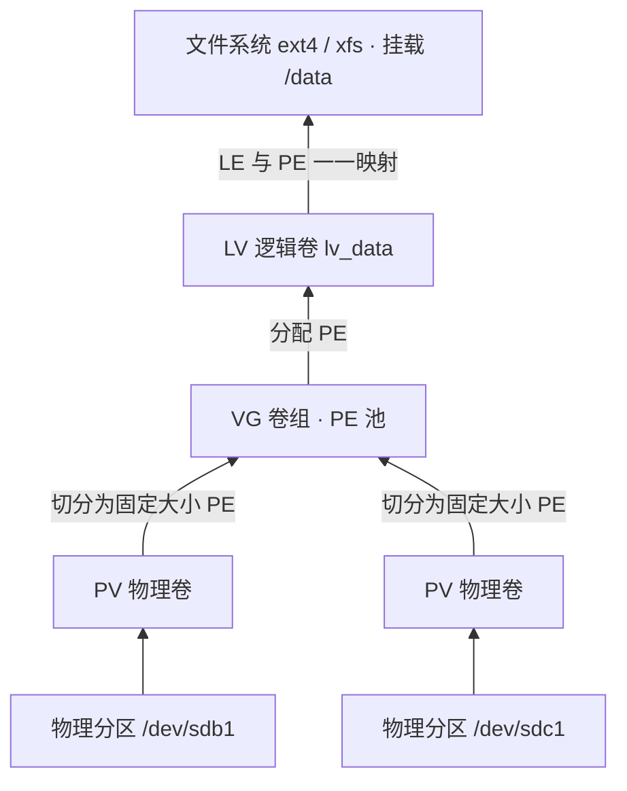
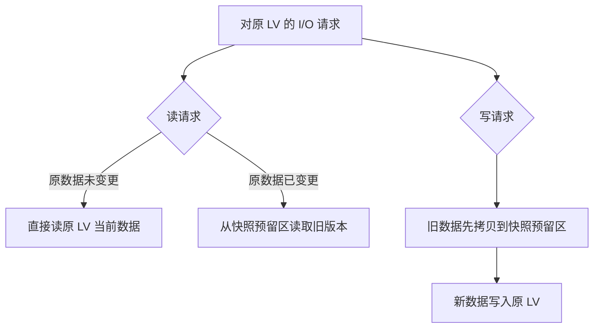

> 从三层架构、PE/LE 映射原理，到创建、扩展、缩减、迁移与快照的全流程实操指南，覆盖日常存储运维的绝大多数场景。
>
> 本手册由两篇 LVM 使用文档合并整理而成。

**目录**

1. [认识 LVM](#1-认识-lvm)
2. [核心概念与架构](#2-核心概念与架构)
3. [工作原理](#3-工作原理)
4. [从物理磁盘到逻辑卷](#4-从物理磁盘到逻辑卷)
5. [扩展操作](#5-扩展操作)
6. [缩减操作](#6-缩减操作)
7. [迁移操作](#7-迁移操作)
8. [快照操作](#8-快照操作)
9. [常用命令速查](#9-常用命令速查)
10. [最佳实践与风险提醒](#10-最佳实践与风险提醒)

---

## 1. 认识 LVM

**LVM（Logical Volume Manager，逻辑卷管理）**是 Linux 下最核心的存储虚拟化技术。它把底层的物理磁盘/分区抽象成统一的存储池，让容量管理像"乐高拼装"一样灵活：空间可以按需拼装、在线伸缩，而不受物理磁盘边界的束缚。

LVM 的强大之处在于在线操作的广覆盖——扩 VG、扩 LV、PV 间迁移均可不停机完成，这也是它在服务器领域不可替代的原因。掌握本手册的流程后，日常 90% 的存储运维场景都能从容应对。

## 2. 核心概念与架构

LVM 采用三层抽象架构，自上而下分别是 LV → VG → PV，底层承载于物理磁盘或分区之上。

### PV（Physical Volume，物理卷）

- LVM 管理的最小物理单元，通常由物理磁盘或分区初始化而来（如 `/dev/sdb1`）
- 初始化时会在设备头部写入 LVM 元数据（标签、UUID、VG 归属等）
- 内部被切分为固定大小的物理区块 **PE（Physical Extent）**，PE 是 LVM 分配空间的基本单位，默认大小 4MB，可在创建 VG 时指定

### VG（Volume Group，卷组）

- 一个或多个 PV 的组合，构成统一的存储池
- VG 把池中所有的 PE 收集起来，供上层的 LV 分配使用
- 一个系统可以有多个 VG，VG 可以动态地扩缩容（增减 PV）

### LV（Logical Volume，逻辑卷）

- 从 VG 的 PE 池中分配出来的逻辑块设备，对上层表现为一块"硬盘"
- 内部使用 **LE（Logical Extent）**与 PE 做一一映射
- LV 可被格式化（ext4/xfs 等）并挂载使用，是用户真正读写数据的对象

### 关键映射关系

```
物理磁盘 → PV → (切分为 PE) → 加入 VG → VG 分配 PE 给 LV → LV 内部映射为 LE → 格式化挂载
```

PE 与 LE 的大小一致。LVM 通过元数据中的映射表记录"哪个 LV 的哪个 LE 对应哪个 PV 的哪个 PE"，这就是 LVM 灵活性的根本。



*图 1：LVM 三层抽象架构与 PE/LE 映射关系*

## 3. 工作原理

### 存储空间映射机制

LVM 在 VG 层面维护一张 **PE-LE 映射表**。当 LV 读写数据时：

1. 文件系统发起 I/O 请求，定位到某个 LE
2. LVM 驱动查映射表，找到对应的 PE
3. 通过 PV 标签定位到具体的物理设备和扇区
4. 完成实际磁盘读写

由于映射是逻辑层做的，LV 的容量可以跨多个 PV，对上层完全透明。

### 快照（Snapshot）机制

LVM 快照的核心是 **COW（Copy-On-Write，写时复制）**：

- 创建快照时，LV 进入"监控"状态，快照区域记录原始数据的位置
- 读：若原数据未变，直接从原 LV 读；若已变，从快照区读旧版本
- 写：原 LV 有写入时，LVM 先把旧数据拷贝到快照预留区，再执行新写入
- 快照本质是原 LV 在某个时间点的只读视图，挂载后可做备份



*图 2：快照 COW（写时复制）的读写路径*

> **快照区有容量上限。**原 LV 修改的数据量一旦超过快照预留空间，快照会自动失效（invalid）。因此快照通常用于短时间备份窗口，而非长期留存。

## 4. 从物理磁盘到逻辑卷

以下以新增磁盘 `/dev/sdb`（假设 100G）为例，演示完整流程。

### Step 1：物理磁盘初始化为 PV

```bash
# 可选：先分区（也可直接用整块盘）
fdisk /dev/sdb          # 创建 Linux LVM 类型分区，标识为 8e

# 初始化为 PV
pvcreate /dev/sdb1
```

验证：`pvs` 或 `pvdisplay`

### Step 2：创建 VG

```bash
vgcreate vg_data /dev/sdb1
# 若要指定 PE 大小（影响最大 LV 容量），用 -s 参数
vgcreate -s 16M vg_data /dev/sdb1
```

验证：`vgs` 或 `vgdisplay`

### Step 3：创建 LV

```bash
lvcreate -L 50G -n lv_data vg_data
# 或使用百分比：-l 100%FREE 表示用尽所有剩余空间
```

验证：`lvs` 或 `lvdisplay`

### Step 4：格式化并挂载

```bash
mkfs.ext4 /dev/vg_data/lv_data     # 或 mkfs.xfs
mkdir /data
mount /dev/vg_data/lv_data /data
```

写入 `/etc/fstab` 实现开机自动挂载：

```
/dev/vg_data/lv_data  /data  ext4  defaults  0  0
```

## 5. 扩展操作

### LV 在线拉伸（不影响业务）

前提：VG 中有足够空闲 PE。ext4 与 xfs 均支持在线拉伸（grow）。

```bash
# 1. 扩展 LV 本身
lvextend -L +20G /dev/vg_data/lv_data    # 增加 20G
# 或扩展到绝对大小
lvextend -L 80G /dev/vg_data/lv_data

# 2. 扩展文件系统以识别新空间（LV 扩展后 FS 不会自动感知）
resize2fs /dev/vg_data/lv_data           # ext2/3/4
xfs_growfs /data                         # xfs（参数是挂载点）
```

### VG 扩容（当 VG 空间不足）

```bash
pvcreate /dev/sdc1       # 新磁盘初始化为 PV
vgextend vg_data /dev/sdc1
```

之后再执行上面的 `lvextend` 即可。

## 6. 缩减操作

> **缩减比扩展风险高得多**：必须先缩小文件系统，再缩小 LV，顺序颠倒会导致数据丢失。**xfs 文件系统不支持缩减**，仅 ext4 等支持。

### 安全缩减步骤（ext4 示例）

```bash
# 1. 卸载（ext4 缩减通常需要离线进行）
umount /data

# 2. 强制检查文件系统
e2fsck -f /dev/vg_data/lv_data

# 3. 先缩减文件系统到目标大小（如 30G）
resize2fs /dev/vg_data/lv_data 30G

# 4. 再缩减 LV（必须 ≤ 文件系统大小）
lvreduce -L 30G /dev/vg_data/lv_data

# 5. 重新挂载
mount /data
```

**关键原则**：resize2fs 的目标值必须 ≥ lvreduce 的目标值，否则 LV 截断会丢失文件系统的尾部数据。

### VG 缩容（移除 PV）

```bash
# 1. 将数据从目标 PV 迁出
pvmove /dev/sdb1

# 2. 从 VG 中移除 PV
vgreduce vg_data /dev/sdb1

# 3. 删除 PV 标签
pvremove /dev/sdb1
```

## 7. 迁移操作

### 7.1 PV 间数据迁移（磁盘更换场景）

```bash
pvcreate /dev/sdc1
vgextend vg_data /dev/sdc1
pvmove /dev/sdb1 /dev/sdc1     # 把 sdb1 上的数据搬到 sdc1
vgreduce vg_data /dev/sdb1
pvremove /dev/sdb1
```

`pvmove` 是在线迁移，业务无需停。

### 7.2 LV 迁移到其他 VG

```bash
# 方法：在源 VG 上做 pvmove 把所有 PV 清空，再 vgreduce
# 或者使用 lvconvert --merge（合并场景）
```

### 7.3 整机 VG 迁移（拆盘移到另一台机器）

```bash
# 源机：取消激活 VG
vgchange -an vg_data

# 目标机：
pvscan                      # 扫描新磁盘
vgimport vg_data            # 导入 VG
vgchange -ay vg_data        # 激活
mount ...                   # 挂载 LV
```

## 8. 快照操作

### 创建快照

```bash
lvcreate -L 10G -s -n lv_data_snap /dev/vg_data/lv_data
# -s 表示创建快照，-L 10G 是快照预留空间
```

### 使用快照

```bash
# 挂载快照（只读）
mount -o ro /dev/vg_data/lv_data_snap /mnt/snapshot
# 此时 /mnt/snapshot 是原 LV 在创建时刻的一致性视图
# 可在此目录做备份：tar / rsync / dd
```

### 删除快照

```bash
umount /mnt/snapshot
lvremove /dev/vg_data/lv_data_snap
```

### 快照典型应用场景

- **在线备份**：对正在运行的数据库 LV 做快照，挂载快照后用常规工具备份，避免锁表
- **系统升级回滚**：升级前对根 LV 做快照，失败后可快速恢复

## 9. 常用命令速查

| 操作类别 | PV 命令 | VG 命令 | LV 命令 |
| -------- | ------- | ------- | ------- |
| 创建 | `pvcreate` | `vgcreate` | `lvcreate` |
| 查看 | `pvs` / `pvdisplay` | `vgs` / `vgdisplay` | `lvs` / `lvdisplay` |
| 扩展 | — | `vgextend` | `lvextend` |
| 缩减 | `pvreduce`（间接） | `vgreduce` | `lvreduce` |
| 删除 | `pvremove` | `vgremove` | `lvremove` |
| 迁移 | `pvmove` | `vgchange` | `lvconvert` |
| 扫描 | `pvscan` | `vgscan` | `lvscan` |

## 10. 最佳实践与风险提醒

1. **PE 大小规划**：默认 4MB 的 PE 会限制单个 LV 的最大容量（PE 数量存在上限）。若预期 LV 很大（大于 1T），建议在 vgcreate 时用 `-s 16M` 或 `-s 32M` 指定更大的 PE，减少元数据开销。
2. **快照空间预留**：快照大小应预估为"快照生命周期内原 LV 的变更量"，一般以原 LV 大小的 10%–20% 为起点。
3. **缩减必离线**：xfs 不支持缩减，ext4 缩减也必须 umount。生产环境建议通过"备份 + 重建"方式规避缩减风险。
4. **元数据备份**：`vgcfgbackup` / `vgcfgrestore` 可备份和恢复 LVM 元数据，灾难恢复时极其关键。
5. **LVM 嵌套 RAID**：LVM 本身不提供冗余，生产环境建议底层用 mdraid 或硬件 RAID，再在其上构建 LVM。
6. **精简配置（Thin Provisioning）**：LVM 支持 thin pool，允许 LV 总分配量超过 VG 实际容量，适合虚拟化场景，但需严密监控实际使用量避免耗尽。
