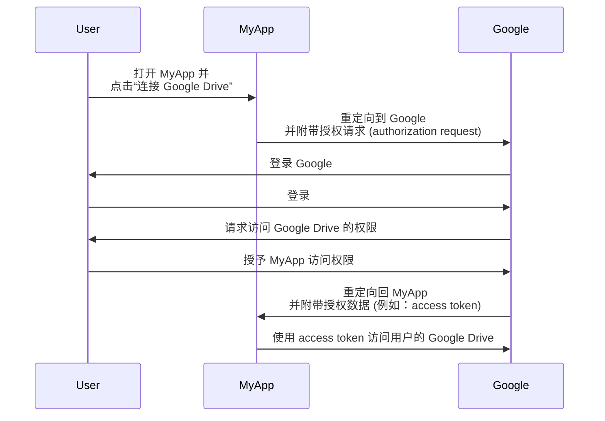
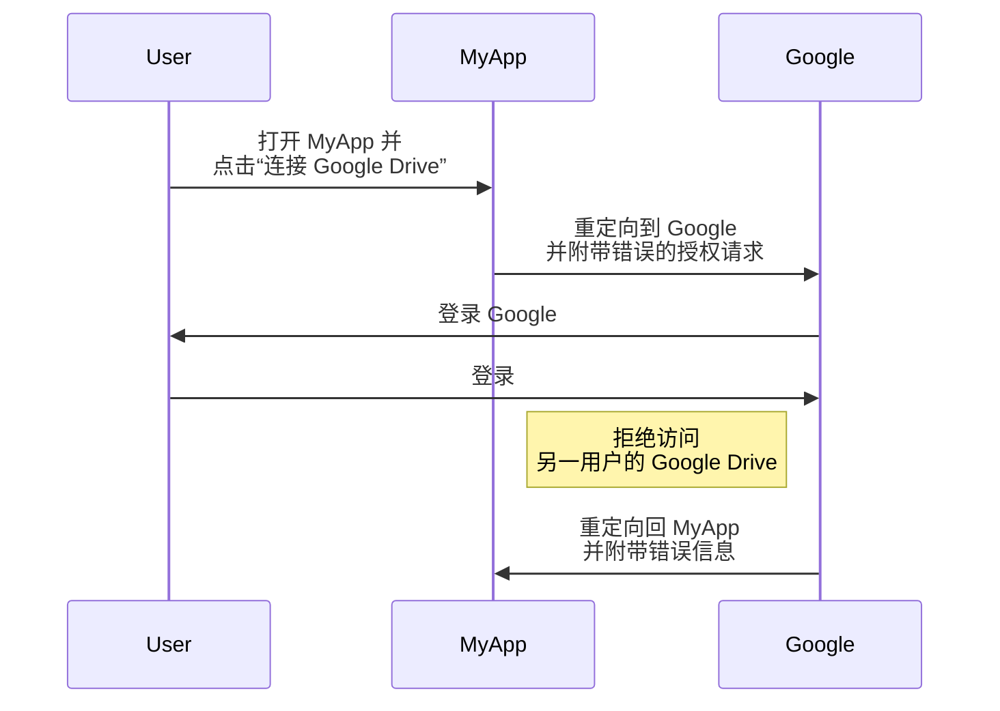
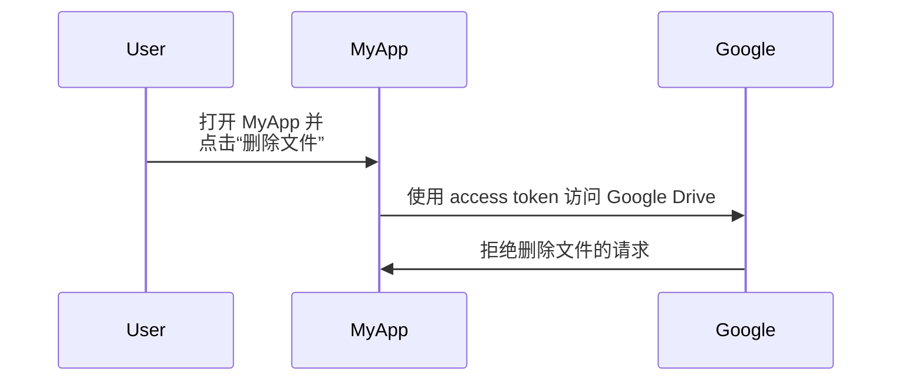
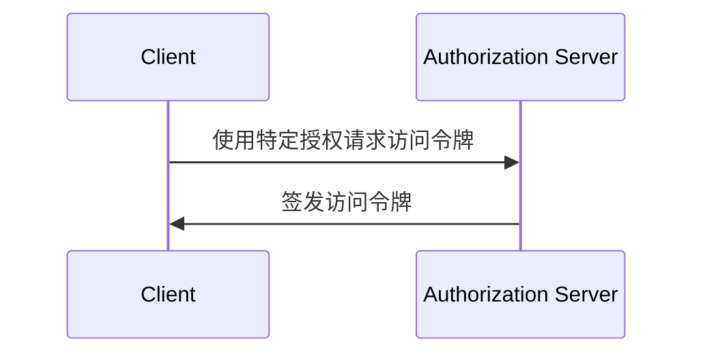
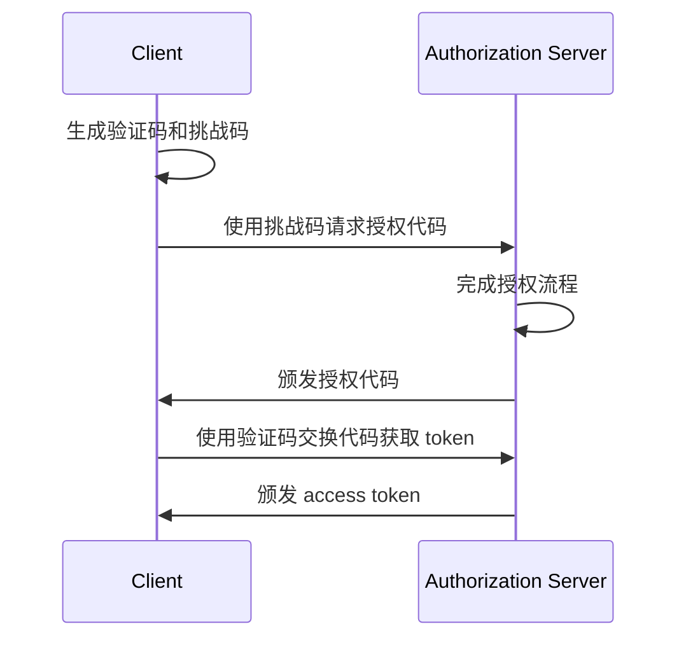

## 什么是 OAuth 2.0？

OAuth 2.0 是授权的事实标准，被广泛应用于网络中。它允许一个应用程序安全地获得对另一个应用程序的受保护资源的有限访问权限，例如用户的个人资料或数据，而无需暴露诸如密码等凭据。

让我们来看一个实际的例子来更好地理解。你有一个名为 MyApp 的 Web 应用程序，它想要访问用户的 Google Drive。 MyApp 可以使用 OAuth 2.0 代表用户请求访问 Google Drive，而无需要求用户分享他们的 Google Drive 凭据。以下是一个简化的流程：

在这个流程中，MyApp 从未看到用户的 Google Drive 凭据。相反，它从 Google 收到了一个 <Ref slug="access-token" />，可以用来代表用户访问 Google Drive。

### OAuth 2.0 的关键组件

对于上述例子，MyApp 是 <Ref slug="client" />，Google 即是 <Ref slug="authorization-server" /> 又是 <Ref slug="resource-server" />，用户是 <Ref slug="resource-owner" />。该流程涉及了 OAuth 2.0 的所有关键组件：

- **Client**: 想要访问受保护资源的应用程序。“Client”和“应用程序”经常可以互换使用。
- **Resource owner**: 拥有受保护资源的用户。资源所有者可以授予 (authorize) 或拒绝 client 的访问。
- **Authorization server**: 进行授权（通常与身份验证 (authentication) 一起）并向 client 发放 access token 的服务器。
- **Resource server**: 托管受保护资源的服务器。它验证 access token 并向 client 提供受保护的资源。

## OAuth 2.0 授权 (Grants)（流程）

<Ref slug="oauth-2.0-grant">授权 (Grant)</Ref> 是 OAuth 2.0 的基础，定义了 client 如何从授权服务器获取 access token。基本的 OAuth 2.0 规范定义了四种授权：

- <Ref slug="authorization-code-flow">授权码授权 (authorization code grant)</Ref>
- <Ref slug="implicit-flow">隐式授权 (implicit grant)</Ref>
- [资源所有者密码凭证 (ROPC) 授权](https://datatracker.ietf.org/doc/html/rfc6749#section-4.3)
- <Ref slug="client-credentials-flow">客户端凭证授权 (client credentials grant)</Ref>

不深入每种授权的细节，我们可以将这些授权分为两类：

- **授权授权 (authorization grants)**: 当 client 需要代表用户访问资源时使用，即需要用户的授权。
- **客户端凭证授权 (client credentials grant)**: 当 client 需要以自身名义访问资源时使用。此授权适合 <Ref slug="machine-to-machine" /> 通信。

### 授权授权

无论授权类型如何，授权授权都具有以下共同步骤：

1. client 向授权服务器发起 <Ref slug="authorization-request" />。
2. 授权服务器验证用户（资源所有者）并请求访问资源的权限。
3. 用户授予 client 权限。
4. 授权服务器向 client 颁发 access token。
5. client 使用 access token 访问 <Ref slug="resource-server" /> 上的受保护资源。

注意，根据授权类型，不同的步骤和参数可能有所不同。例如，<Ref slug="authorization-code-flow">授权码授权</Ref> 涉及更多步骤，如代码生成和交换。

### 客户端凭证授权

<Ref slug="client-credentials-flow">客户端凭证授权</Ref> 更加简单，不涉及用户授权。以下是一个简化的流程：

1. client 向授权服务器发送 <Ref slug="token-request" />。
2. 授权服务器认证 client 并发放 access token。
3. client 使用 access token 访问 <Ref slug="resource-server" /> 上的受保护资源。

---

关于 OAuth 2.0 授权的深入讨论，请参阅 <Ref slug="oauth-2.0-grant" /> 和特定的授权文章。

## OAuth 2.0 的访问控制 (access control)

OAuth 2.0 定义了 <Ref slug="scope" /> 参数用于指定 client 所请求的权限。授权服务器可能会完全或部分忽略请求的范围 (scopes)，并根据自身的访问控制 (access control) 策略授予访问权限。

然而，OAuth 2.0 让授权服务器自行决定如何实施 <Ref slug="access-control" />。这意味着授权服务器可以决定 subject（用户或 client）可以访问哪些资源，以及他们可以对这些资源执行哪些操作。

仍然以 Google Drive 为例。MyApp 可能错误地发起了访问另一用户 Google Drive 的授权请求。在这种情况下，Google 的授权服务器应拒绝该请求，因为用户没有访问另一用户 Google Drive 的必要权限。

另一个案例是当 MyApp 从 Google 收到了允许其读取用户 Google Drive 文件的 access token。然而，MyApp 尝试删除文件而不是读取文件。资源服务器（Google）应该拒绝该请求。

这两个案例演示了为什么在实施 OAuth 2.0 时需要 <Ref slug="access-control" />。<Ref slug="authorization-server" /> 和 <Ref slug="resource-server" /> 应该协同工作以执行访问控制策略并保护资源。

### 访问控制模型

为正确处理访问控制，建议使用标准的访问控制模型，如 <Ref slug="rbac" /> 和 <Ref slug="abac" />。这些模型已被业界证明有效，并提供未来需求的可扩展性。

## OAuth 2.1

<Ref slug="oauth-2.1" /> 是对 OAuth 2.0 规范的建议更新，旨在根据多年来的行业经验提高安全性和可用性。虽然 OAuth 2.1 尚未最终定稿，但我们仍然可以了解提议的更改，并理解它们可能如何影响当前的 OAuth 2.0 实现。OAuth 2.1 可以被视为业界广泛采用的最佳实践和安全建议的形式化。

## OAuth 2.0 和 OpenID Connect (OIDC)

OAuth 2.0 只定义了授权过程，并不涵盖用户身份验证 (authentication) 或身份识别。为此，<Ref slug="openid-connect" /> 作为身份层引入，构建于 OAuth 2.0 之上。OIDC 扩展了 OAuth 2.0，以 <Ref slug="id-token" /> 的形式提供用户身份验证和身份信息。

OpenID Connect 扩展了两种 OAuth 2.0 授权（授权码和隐式）以包含 ID tokens，并引入了一种称为 <Ref slug="hybrid-flow">混合流程 (hybrid flow)</Ref> 的新授权，结合了两者。

也就是说，你的所有 OAuth 2.0 知识和实践可以直接应用于 OIDC；所有 OAuth 2.0 扩展，如 <Ref slug="pkce" /> 和 <Ref slug="resource-indicator" />，也可以在 OIDC 中使用。

<SeeAlso slugs={["oauth-2.0-grant", "oauth-2.1", "openid-connect"]} />

<Resources
  urls={[
    "https://blog.logto.io/secure-cloud-apps-with-oauth-and-openid-connect",
    "https://blog.logto.io/oauth-2-1",
    "https://datatracker.ietf.org/doc/html/rfc6749",
    "https://datatracker.ietf.org/doc/draft-ietf-oauth-v2-1/",
  ]}
/>

## 什么是 OAuth 2.0 授权 (Grant)？

OAuth 2.0 授权 (Grant) 是一种授权 (authorization) 过程，允许 <Ref slug="client" /> 向 <Ref slug="authorization-server" /> 请求 <Ref slug="access-token" />。你可能听到与此概念相关的其他术语，因此在深入探讨之前，我们先澄清一下这些术语：

- **OAuth 2.0 授权 (Grant)**：也称为 "OAuth 2.0 grant type"、"OAuth 2.0 flow" 或 "OAuth 2.0 authorization grant"。在大多数情况下，这些术语指的是相同的概念。
- <Ref slug="authorization-server" />：向客户端签发访问令牌 (access token) 的服务器。在 OpenID Connect (OIDC) 中，授权服务器与 <Ref slug="openid-connect" headingId="openid-provider-op" /> 相同。
- <Ref slug="authorization-request" />：客户端向授权服务器 (authorization server) 发出的请求，以获取访问令牌 (access token)。在 OpenID Connect (OIDC) 中，也称为 <Ref slug="authentication-request" />。

为了清晰起见，我们将在本文中一致使用上述初始术语。

OAuth 2.0 授权 (Grant) 的高层次流程相当简单：

客户端接收到访问令牌 (access token) 后，可以使用它代表用户或自身访问受保护的资源（例如，API）。

请注意，根据具体的授权，客户端和授权服务器 (authorization server) 可能会交换更多信息，并涉及更多处理步骤。例如，<Ref slug="authorization-code-flow">授权代码授权 (authorization code grant)</Ref> 涉及用户认证 (authentication) 和授权 (authorization)、代码生成和令牌 (token) 交换。

## 不同的 OAuth 2.0 授权 (Grants)

基本的 OAuth 2.0 规范定义了四种授权 (Grant)，客户端可以使用它们来获取访问令牌 (access token)：

1. <Ref slug="authorization-code-flow">授权代码授权 (authorization code grant)</Ref>：对大多数应用程序来说最安全且推荐的授权。<Ref slug="oauth-2.1" /> 中强制要求所有客户端使用 <Ref slug="pkce" />。
2. <Ref slug="implicit-flow">隐式授权 (implicit grant)</Ref>：由于安全问题在 OAuth 2.1 中被弃用的简化授权。
3. [资源所有者密码凭证 (ROPC) 授权](https://datatracker.ietf.org/doc/html/rfc6749#section-4.3)：用户的凭证被直接交换获取访问令牌 (access token) 的授权。由于安全风险，不推荐大多数应用程序使用。
4. <Ref slug="client-credentials-flow">客户端凭证授权 (client credentials grant)</Ref>：<Ref slug="client" headingId="confidential-clients" /> 用于在无用户参与的情况下获取访问令牌的授权。

随着行业的发展，隐式授权和 ROPC 授权正在被更安全和标准化的流程取代。对于新应用程序，选择非常简单：

- 对于用户认证 (authentication) 和授权 (authorization)，使用带 PKCE 的授权代码授权。
- 对于 <Ref slug="machine-to-machine" /> 通信，使用客户端凭证授权。

### 其他 OAuth 2.0 授权 (Grants)

除四种基本授权外，还有其他扩展定义了针对特定用例的新授权。例如：

- <Ref slug="device-flow">设备授权 (device authorization grant)</Ref> 是为具有有限输入能力的设备（例如智能电视和物联网设备）设计的授权。
- <Ref slug="hybrid-flow">混合流 (hybrid flow)</Ref> 是一种 OpenID Connect 授权，将授权代码授权与隐式授权结合在一起。

## OpenID Connect (OIDC) 中的授权 (Grants)

在 <Ref slug="openid-connect" /> 中，授权 (Grant) 的概念被扩展为包括不仅代表用户身份信息的 ID 令牌 (ID tokens)，还包括访问令牌 (access tokens)。OIDC 扩展了两种 OAuth 2.0 授权（授权代码和隐式授权）以包括 ID 令牌，并引入了一种称为 <Ref slug="hybrid-flow">混合流 (hybrid flow)</Ref> 的新授权，将两者结合在一起。

> 如同 OAuth 2.0，OIDC 中只推荐使用带 PKCE 的授权代码授权进行用户认证 (authentication) 和授权 (authorization)。

同时，由于 OIDC 是建立在 OAuth 2.0 之上的，其他授权 (Grant) 如客户端凭证授权仍然可以在同一授权服务器 (authorization server) 上使用，只要服务器支持它们。

<SeeAlso slugs={["pkce", "oauth-2.1", "authorization-code-flow", "implicit-flow", "client-credentials-flow", "device-flow"]} />

<Resources
  urls={[
    "https://blog.logto.io/implicit-flow-is-dead",
    "https://datatracker.ietf.org/doc/html/rfc6749",
    "https://openid.net/specs/openid-connect-core-1_0.html"
  ]}
/>

## 什么是 OAuth 2.1？

OAuth 2.1 是对 <Ref slug="oauth-2.0" /> 授权框架的拟议更新。它涉及对现有 OAuth 2.0 规范的一系列更改和建议，这些更改和建议汇总了多年来在业内广泛采用的最佳实践和安全性改进。

OAuth 2.1 的主要更新包括：

1. 由于安全问题，废弃 <Ref slug="implicit-flow">隐式授权</Ref> 和 [资源所有者密码凭据 (ROPC) 授权](https://datatracker.ietf.org/doc/html/rfc6749#section-4.3)。
2. 强制所有客户端使用 <Ref slug="pkce" />，包括 <Ref slug="client" headingId="confidential-clients">保密（私有）客户端</Ref>。
3. 精确匹配 <Ref slug="redirect-uri">重定向 URI</Ref>。
4. 明确定义 <Ref slug="client">客户端</Ref> 类型（公共和保密客户端）。
5. 针对 <Ref slug="refresh-token">刷新令牌</Ref> 的安全要求。

## 废弃隐式授权

隐式授权是为无法安全存储客户端密钥的单页应用程序 (SPAs) 和基于浏览器的应用程序设计的。然而，其安全风险导致了它的废弃：授权通过前端渠道（URL 片段）返回 access token，可能通过浏览器历史记录和引用头暴露给攻击者。

OAuth 2.1 推荐浏览器应用程序使用 <Ref slug="authorization-code-flow">授权代码授权</Ref>配合 <Ref slug="pkce" />。

## 废弃 ROPC 授权

ROPC 授权允许客户端直接交换用户凭据以获得 access token。它是为不支持授权代码流的旧应用程序设计的。但是，此授权在以下方面存在安全风险：

- 将用户凭据暴露给客户端。
- 绕过授权服务器的同意屏幕。
- 限制授权服务器执行其他安全措施的能力，例如 <Ref slug="mfa" />。

OAuth 2.1 推荐使用 <Ref slug="authorization-code-flow">授权代码授权</Ref>配合 <Ref slug="pkce" />进行用户认证 (Authentication) 和授权。

## 强制所有客户端使用 PKCE

<Ref slug="pkce" /> 是授权代码流的安全扩展，旨在减轻授权代码拦截攻击的风险。它涉及客户端生成验证码和挑战码，授权服务器在 token 交换期间验证挑战码。

以下是使用 PKCE 的授权代码流程的简化序列图：

最初建议 <Ref slug="client" headingId="public-clients">公共客户端</Ref>使用 PKCE，但 OAuth 2.1 将这一建议扩展为对包括 <Ref slug="client" headingId="confidential-clients">保密（私有）客户端</Ref>在内的所有客户端的强制要求。

## 精确匹配重定向 URI

<Ref slug="redirect-uri">重定向 URI</Ref> 由客户端用于接收来自授权服务器的授权响应。OAuth 2.1 引入了一项新要求，即授权请求中使用的重定向 URI 必须与客户端在 <Ref slug="authorization-server" />注册的重定向 URI 完全匹配，包括方案、主机和路径。

在某些 OAuth 2.0 实现中，重定向 URI 匹配较宽松，允许部分匹配或使用通配符。然而，这种灵活性可能导致安全风险，如开放重定向漏洞。

## 明确定义客户类型

OAuth 2.0 没有明确定义客户端类型。你可能会在业界看到各种分类，按访问级别（公共与保密）或应用类型（Web 应用与移动应用）。对于 OAuth 框架来说，客户端如何实现并不重要（因为它们更多的是关于客户端的业务属性），但访问级别在安全要求中有所不同。

因此，OAuth 2.1 引入了客户端类型的明确定义：

- <Ref slug="client" headingId="public-clients" />：无法维护其凭据机密性的客户端（例如，SPAs、移动应用）。
- <Ref slug="client" headingId="confidential-clients" />：可以维护其凭据机密性的客户端（例如，服务器端 Web 应用、本机桌面应用）。

## 针对刷新令牌的安全要求

<Ref slug="refresh-token">刷新令牌</Ref> 是客户端用于在无用户交互情况下获取新的 access token 的长期有效令牌。同时，它们也是攻击者的高价值目标。由于公共客户端无法安全地存储凭据，OAuth 2.1 指定 <Ref slug="authorization-server" /> 应该使用以下方法之一来保护刷新令牌：

- 发布<Ref slug="refresh-token" headingId="sender-constrained-refresh-tokens">发送者限制的刷新令牌</Ref>。
- 使用<Ref slug="refresh-token" headingId="refresh-token-rotation">刷新令牌轮换</Ref>来限制刷新令牌的可用性和生命周期。

## OAuth 2.1 和 OpenID Connect (OIDC)

由于 <Ref slug="openid-connect" /> 是基于 OAuth 2.0 构建的，OAuth 2.1 引入的更改也适用于 OIDC。例如，所有 OIDC 客户端都应使用带有 PKCE 的授权代码流进行用户认证 (Authentication) 和授权。

<SeeAlso slugs={["oauth-2.0", "authorization-code-flow", "pkce", "implicit-flow", "openid-connect"]} />

<Resources
  urls={[
    "https://datatracker.ietf.org/doc/draft-ietf-oauth-v2-1/",
    "https://blog.logto.io/oauth-2-1",
  ]}
/>